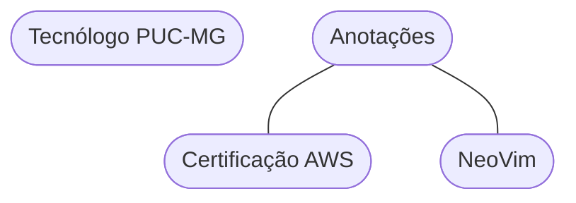

# Bem Vindo(a)!

## Materiais

## Quem sou eu

Eu me chamo Bruno de Melo Ruas. 

Sou formado em Análise e Desenvolvimento de Sistemas pela Pontifícia Universidade Católica de Minas Gerais (PUC-MG). Bacharel em Economia pela Universidade do Estado do Amazonas (UEA). Especialista em Gestão Financeira pela Fundação Getúlio Vargas (FGV).

Eu comecei a programar em meados de 2017. Na época aprendendo Econometria usando uma linguagem de programação chamada R. Ao longo do tempo, fui aprendendo novas técnicas como Robot Process Automation (RPA), Web Scraping e fui tomando cada vez mais gosto pela área de tecnologia. Em julho de 2023 eu migrei definitivamente a carreira de Economista para Desenvolvedor de Software. A timeline completa está logo abaixo.

Atualmente sou desenvolvedor com foco em Backend na [GFT Technologies](https://www.gft.com/br/pt) onde estou alocado em um dos maiores bancos da América Latina. Esse material me serviu para chegar até aqui. Espero que também ajude você!

Se quiser, pode me seguir nas minhas redes: [Linkedin](https://www.linkedin.com/in/brunoruas2/), [Twitter](https://twitter.com/bruno_ruas2), [Github](https://github.com/brunoruas2)

## Fontes e Avisos

Meu objetivo com esse projeto é construir um tipo de **segundo cérebro** para consultas pontuais sempre que eu precisar revisar um conteúdo já estudado e também ajudar as outras pessoas (principalmente os iniciantes na área). Ao longo do projeto eu coleto conteúdos sobre Programação e Desenvolvimento de Software seguindo fontes como:

 - Tecnólogo em Análise e Desenvolvimento de Sistemas pela **[PUC Minas Gerais](https://www.pucminas.br/PucVirtual/Graduacao/Paginas/Analise-e-Desenvolvimento-de-Sistemas-Tecnologo.aspx?moda=1&curso=492&local=7c032ce9-43f6-4571-b72e-674be76a5b62)**.
 - Bacharelado Aberto em Ciência da Computação pela **[Open Source Society University - OSSU](https://github.com/ossu/computer-science)**.
 - Cursos Livres como os do [**Balta.io**](https://balta.io/cursos) ou [**Curso.dev**](https://curso.dev/) e outros.
 - Aprendizados no dia a dia.

Sempre que possível, eu vou indicar a fonte das informações mas **sempre** desconfie e busque por sua própria conta.

Se você está começando do zero. Recomendo seguir a grade do tecnólogo antes de focar nas partes mais práticas. Assim você terá uma base mais sólida.

:::note[Comentário]
Mesmo gostando de escrever, eu percebi que todo programador maduro é capaz de ler diretamente da **documentação oficial** e **pesquisar por conta própria** sempre que necessário. Por causa disso, em matérias mais práticas, vamos tocar um mini projeto onde eu vou mostrar os commits feitos e fazer uma breve explicação em cada commit[^1].

[^1]: Você **tem** que ser capaz de ler as alterações em cada commit. Pare, leia e se esforce para entender cada passo dos projetos.
:::

## Minha Carreira

import { VerticalTimeline, VerticalTimelineElement }  from 'react-vertical-timeline-component';
import 'react-vertical-timeline-component/style.min.css';
import { DiCode } from "react-icons/di";
import { SiRstudioide, SiPython } from "react-icons/si";
import { PiCurrencyDollarSimpleFill } from "react-icons/pi";
import { AiFillBank, AiFillThunderbolt, AiFillHdd } from "react-icons/ai";
import { FaAws } from "react-icons/fa";

<VerticalTimeline 
  layout={ "1-column-left" }
  lineColor="#e6e8e6">

<VerticalTimelineElement
  className="vertical-timeline-element--work"
  contentStyle={{ 
    background: "#e6e8e6", 
    color: "#000", 
    borderTop: "4px solid #007bff"
  }}
  contentArrowStyle={{ borderRight: "7px solid #e6e8e6" }}
  date="2023 - Atualmente"
  iconStyle={{ background: "#007bff", color: "#e6e8e6" }}
  shadowSize={"large"}
  icon={<AiFillHdd/>}
  >
    <h2> Desenvolvedor Backend </h2>
    <h3> GFT Tech </h3>
    <h4> São Paulo </h4>

    Atividades:
    - Alocado em um banco de investimento internacional
    - Sustentação
    - Projetos
    - Evolução Tecnológica
    - Regulatório

    Stack:
  

    <ul>
      <li>C# / .NET</li>
      <li>Python</li>
      <li>Go</li>
      <li>Javascript / Typescript</li>
      <li>SQL / NoSQL</li>
    </ul>
    <ul>
      <li>CI/CD</li>
      <li>Git</li>
      <li>AWS</li>
      <li>Angular</li>
      <li>React</li>
    </ul>
    <ul>
      <li>RabbitMq</li>
      <li>Redis</li>
      <li>Kubernetes</li>
      <li>NodeJs</li>
      <li>Testes Unitários</li>
    </ul>
  

</VerticalTimelineElement>

<VerticalTimelineElement
  className="vertical-timeline-element--work"
  contentStyle={{ 
    background: "#e6e8e6", 
    color: "#000", 
    borderTop: "4px solid #007bff"
  }}
  contentArrowStyle={{ borderRight: "7px solid #e6e8e6" }}
  date="2024"
  iconStyle={{ background: "#007bff", color: "#e6e8e6" }}
  shadowSize={"large"}
  icon={<FaAws />}
  >
  <h2> Certificação Cloud Pratictioner </h2>
  <h3> AWS </h3>
</VerticalTimelineElement>

<VerticalTimelineElement
  className="vertical-timeline-element--work"
  contentStyle={{ 
    background: "#e6e8e6", 
    color: "#000", 
    borderTop: "4px solid #007bff"
  }}
  contentArrowStyle={{ borderRight: "7px solid #e6e8e6" }}
  date="2022 - 2024"
  iconStyle={{ background: "#007bff", color: "#e6e8e6" }}
  shadowSize={"large"}
  icon={<AiFillBank />}
  >
  <h2> Tecnólogo em Análise e Desenvolvimento de Sistemas </h2>
  <h3> Pontifícia Universidade Católica - PUC/MG </h3>

  Competências:
  - Boas práticas (SOLID / Clean Code)
  - Desenvolvimento Fullstack .NET/React
  - Desenvolvimento Mobile React Native
  - Sistemas distribuídos
  - Engenharia de Software
</VerticalTimelineElement>

<VerticalTimelineElement
  className="vertical-timeline-element--work"
  contentStyle={{ 
    background: "#e6e8e6", 
    color: "#000", 
    borderTop: "4px solid #007bff"
  }}
  contentArrowStyle={{ borderRight: "7px solid #e6e8e6" }}
  date="2022 - 2023"
  iconStyle={{ background: "#007bff", color: "#e6e8e6" }}
  shadowSize={"large"}
  icon={<AiFillThunderbolt/>}
  >
    <h2> Desenvolvedor Freelancer </h2>
    <h3> Ruas Data Analysis </h3>
    <h4> Amazonas </h4>

    Atividades:
    - Auxílio à gestão de clínicas com KPIs
    - Webapp com indicadores de gestão
    - Construção de Rotinas RPA
    - ETL com diferente sistemas

    Stack:
  

    <ul>
      <li>Python</li>
      <li>Django</li>
      <li>Selenium</li>
      <li>HTML</li>
      <li>CSS</li>
    </ul>
    <ul>
      <li>Javascript</li>
      <li>Git/Github</li>
      <li>Firebird</li>
      <li>SQL</li>
      <li>Tkinter</li>
    </ul>
  

</VerticalTimelineElement>

<VerticalTimelineElement
  className="vertical-timeline-element--work"
  contentStyle={{ 
    background: "#e6e8e6", 
    color: "#000", 
    borderTop: "4px solid #007bff"
  }}
  contentArrowStyle={{ borderRight: "7px solid #e6e8e6" }}
  date="2020 - 2022"
  iconStyle={{ background: "#007bff", color: "#e6e8e6" }}
  shadowSize={"large"}
  icon={<SiPython/>}
  >
    <h2> Desenvolvedor Python / Sysadmin </h2>
    <h3> One Clinic </h3>
    <h4> Amazonas </h4>

    Atividades:
    - Integrações SOAP/REST com o ERP Totvs RM
    - Webapp com indicadores de gestão
    - Construção de Rotinas RPA
    - Webapp para download de laudos

    Stack:
  

    <ul>
      <li>Python</li>
      <li>Django</li>
      <li>Selenium</li>
      <li>HTML</li>
      <li>CSS</li>
    </ul>
    <ul>
      <li>Javascript</li>
      <li>Git/Github</li>
      <li>Firebird</li>
      <li>SQL</li>
    </ul>
  

</VerticalTimelineElement>

<VerticalTimelineElement
  className="vertical-timeline-element--work"
  contentStyle={{ 
    background: "#e6e8e6", 
    color: "#000", 
    borderTop: "4px solid #007bff"
  }}
  contentArrowStyle={{ borderRight: "7px solid #e6e8e6" }}
  date="2019-2020"
  iconStyle={{ background: "#007bff", color: "#e6e8e6" }}
  shadowSize={"large"}
  icon={<AiFillBank />}
  >
  <h2> Especialista em Gestão Financeira </h2>
  <h3> Fundação Getúlio Vargas - FGV </h3>

  Competências:
  - Análise de Demonstrações Contábeis
  - Controladoria
  - Projetos Econômicos e Financeiros
</VerticalTimelineElement>

<VerticalTimelineElement
  className="vertical-timeline-element--work"
  contentStyle={{ 
    background: "#e6e8e6", 
    color: "#000", 
    borderTop: "4px solid #007bff"
  }}
  contentArrowStyle={{ borderRight: "7px solid #e6e8e6" }}
  date="2017 - 2020"
  iconStyle={{ background: "#007bff", color: "#e6e8e6" }}
  shadowSize={"large"}
  icon={<SiRstudioide/>}
  >
    <h2> Gerente de Orçamento </h2>
    <h3> Secretaria Municipal de Saúde - SEMSA </h3>
    <h4> Amazonas </h4>

    Atividades:
    - Criação de Webapp de acompanhamento de pagamentos
    - Criação de Webapp georeferenciado de indicadores de produção
    - Construção de Rotinas RPA

    Stack:
    - Python
    - R
    - Selenium
    - Shiny
</VerticalTimelineElement>

<VerticalTimelineElement
  className="vertical-timeline-element--work"
  contentStyle={{ 
    background: "#e6e8e6", 
    color: "#000", 
    borderTop: "4px solid #007bff"
  }}
  contentArrowStyle={{ borderRight: "7px solid #e6e8e6" }}
  date="2014 - 2017"
  iconStyle={{ background: "#007bff", color: "#e6e8e6" }}
  shadowSize={"large"}
  icon={<AiFillBank />}
  >
  <h2> Bacharel em Economia </h2>
  <h3> Universidade do Estado do Amazonas - UEA </h3>
  <h4> Manaus/Amazonas/Brasil </h4>

    Atividades:
    - Pesquisador Discente
    - Monitorias
      - Introdução à Economia
      - Macroeconomia I
      - Econometria
    - 3º colocado nacional na Gincana de Economia - COFECON

    Stack:
    - Stata
    - Eviews
    - R/Rstudio
</VerticalTimelineElement>

</VerticalTimeline>
