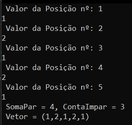

# Algoritmo e Abstração de Dados

## Introdução

Durante o processo de construção de software, a manipulação de informação em memória é tarefa fundamental para que a solução de software seja útil e satisfatória. As linguagens de programação possuem especificações sobre as características que cada grupo de variáveis pode ter, esse controle de propriedade das variáveis e das limitações relacionadas a cada tipo é chamado de **Tipo de Dado**.

Dizemos que um **Tipo Abstrato de Dado (TAD)** é a definição por parte do programador de uma nova classe de dado otimizada para a resolução do problema a ser trabalhado com o software em desenvolvimento. Contém tanto a estrutura da informação a ser trabalhada quanto as operações, procedimentos e funções que podem ser aplicadas a esse tipo de dado novo.

A construção de TADs passa pela identificação das entidades de um problema computacional e a definição e desenvolvimento do modelo de dados adequado para a solução proposta.

Primeiramente, vamos aprender sobre os tipos de dados normalmente existente nas linguagens de programação mais comuns do mercado. Podemos dividir os tipos de dados em dois grandes grupos: Homogêneos e Heterogêneos.

:::note[Comentário]
Esse microfundamento deve ser estudado somente após o microfundamento de **Algoritmo e Lógica de Programação**. Como esse material é de referência, ele não deve ser lido, necessariamente, como se fosse um livro.
:::

## Estrutura de Dados Homogêneas e Heterogêneas

### Estrutura de Dados Homogêneas

Os dois tipos de TAs Homogêneos mais comuns são os vetores (também chamados de arrays), que são formados por uma lista de $n$ elementos de mesmo tipo e as matrizes, que podem ser entendidas como um empilhamento de vetores ou um tipo de vetor de duas dimensões.

#### Vetores

É uma variável composta, homogênea e unidimensional. Podemos pensar em um vetor como uma lista com $n$ elementos do mesmo tipo.

Como todos os valores de um vetor possuem o mesmo nome (o nome da variável), para acessarmos algum valor específico de um elemento, precisaremos de um **índice** que faça referência ao local na lista onde o valor desejado se encontra.

Para criarmos um vetor em c\#, usamos a declaração da variável com um par de colchetes vazio e a definição da quantidade de posições (ou lugares) que o nosso vetor terá. Abaixo podemos ver um exemplo disso.

```cs
int[] Idades = new int[100]; // Vetor de int com 100 places
double[] Alt = new double[20]; // Vetor de double com 20
string[] Nomes = new string[10]; // Vetor de string com 10
```

No exemplo acima, podemos ver que criamos um vetor denominado Idades que receberá apenas valores do tipo inteiro. Um vetor de doubles (que é um float com mais casas de precisão) chamado salario. E, por fim, um vetor de strings chamado Nomes.

:::note[Comentário] 
Existe uma classe que permite a criação de um tipo de vetor genérico sem tamanho definido em c\# chamado Lista. O curso não entrou nesse assunto mas eu vou deixar esse exemplo de lista aqui.
:::

```cs
using System.Collections.Generic;

List<int> lista = new List<int>();
List.add(1);
List.add(2);
List.remove(2);
```

Agora que sabemos como criar um vetor. O próximo passo é aprendermos como inserir informação nele. Para a nossa sorte, é bem simples. Basta colocarmos o nome do vetor seguido da posição a ser preenchida entre colchetes.

```cs
Idades[20] =  10; // Valor 10 na posição 19
Alt[0] = 1.2; // Valor 1.2 na posição 1
```

Só temos que ter cuidado com uma coisa. Existem linguagens (como C\#, Java, Python e outras) que colocam o index da primeira posição de um vetor como sendo o valor 0. Outras linguagens (como R) usam o numero 1 para essa primeira posição.

Com base no que aprendemos em **Algoritmos e Lógica da Programação**, somos capazes de entender o código abaixo a respeito do uso de um laço de repetição para preenchimento de um vetor de 5 posições.

```cs
int i;

int[] Valores = new int[5];

// Input dos dados
for (i = 0; i < 5; i++)
{
  Console.WriteLine($"Digite o valor {i + 1}: ");
  Valores[i] = int.Parse(Console.ReadLine());
};
```

##### Desafio

O professor propõe o seguinte desafio para fixação do conceito de vetor: "Criaremos um vetor de números inteiros com 5 posições e ler cada um de seus valores. Criaremos duas funções que, tomando esse vetor como parâmetro, irão retornar a soma dos números pares contidos no vetor e a quantidade de números ímpares que ele possui."

Minha resolução desse problema segue abaixo.

```cs
int[] vetor = new int[5];
int somaPar = 0;
int contaImpar = 0;
int input;

// Soma de dois valores
int soma(int valor1, int valor2)
{
    return valor1 + valor2;
};

// Iteração para lançamento dos valores e somas
for (int i = 0; i < 5; i++)
{
    Console.WriteLine($" Valor da Posição nº: {i + 1}");
    input = int.Parse(Console.ReadLine());

    vetor[i] = input;
    if (input % 2 == 0)
    {
        somaPar = soma(somaPar, input);
    }
    else
    {
        contaImpar += 1;
    }
};

Console.WriteLine($" SomaPar = {somaPar}, ContaImpar = {contaImpar}");

Console.WriteLine($"({vetor[0]},{vetor[1]},{vetor[2]},{ vetor[3]},{vetor[4]})");
```

Que produz o seguinte resultado para o input ``(1,2,1,2,1)``.



#### Matrizes

Como dito no início dessa seção. Podemos pensar que matrizes são vetores de duas dimensões. Por causa disso, a declaração da variável é um pouco diferente.

```cs
double[,] Notas = new double[4,5]; // 4 linhas e 5 colunas 
```
Por ser uma variável de duas dimensões, a maneira como atribuímos valores à cada posição é um pouco diferente do caso com vetor. Para cada atribuição de valor, temos que indicar a **linha e coluna** que nosso dado será salvo.

```cs
Notas[0,0] = 1; // Linha 1 coluna 1
Notas[0,1] = 1; // Linha 1 coluna 2
Notas[2,3] = 1; // Linha 3 coluna 4
Notas[3,4] = 1; // Linha 4 coluna 5
```

Devemos sempre lembrar que c\# usa a posição de numeral 0 para o index inicial de vetores e matrizes.

Agora vamos ver um programa simples que exemplifica o que acabamos de aprender. A leitura dele não deve ser difícil. Se está tendo dificuldade, volte no microfundamento de lógica da programação.

```cs
int i, j;

int[,] Valor = new int[10,3];

// Loop para entrada de valores na matriz
for (i = 0; i < 10; i++) // Loop para linhas
{
  for (j = 0; j < 3; j++) // Loop para colunas
  {
    Console.WriteLine($"Valor Linha:{i+1} Coluna{j+1}");
    Valor[i,j] = int.Parse(Console.ReadLine());
  }
}
```

##### Desafio

Para a fixação do conceito de matrizes, o professor faz o seguinte desafio: "Vamos fazer um programa que irá ler os dados de uma matriz de inteiros de ordem 5, ou seja, de dimensões 5x5. Matematicamente ela é chama de matriz quadrada, porque o número de “linhas” é igual ao número de “colunas”. Depois de darmos entrada nos valores da matriz chamaremos uma função que, tomando essa matriz como parâmetro, retornará um vetor composto pelos elementos da diagonal principal dessa matriz quando, então, os listaremos."

```cs
// c#
// Aqui vai ficar o cogido da solução do desafio
// quando eu tiver vontade de fazer
```

Vetores e Matrizes são os principais tipos homogêneos de dados. A partir de agora, estudaremos estruturas que nos permitem alocar valores de tipos diferentes em uma mesma variável. A compreensão correta dos tipos de dados é a pedra fundamental do paradigma de desenvolvimento chamado  de **Programação Orientada à Objetos**.

### Estrutura de Dados Heterogêneas

#### Registros

Na definição de um tipo de dado, nós definimos precisamente a faixa de valores que podem ser atribuídos e os métodos nativos do tipo de dado.

Chamamos de **tipo simples de dados** os grupos de valores do mesmo tipo (inteiros, reais, string ou booleanos). Por outro lado, chamamos de **tipo estruturado de dados** os modelos que comportam valores de tipagem diferentes na mesma variável.

Um **registro** é um tipo de dado estruturado.

Nós já estamos familiarizados com as definições de variáveis em c\# para os tipos nativos de dados.


```cs
int x;

double Result;

string Name;
```

A essa altura do aprendizado, as linhas acima são simples de serem compreendidas. São apenas declarações do tipos de 3 variáveis simples. Mas vejam só o que podemos fazer abaixo.

```cs
Aluno xAlu;
```

Estranho, né?! Estamos declarando a variável xAlu como sendo do tipo..."Aluno"?

Sim, é isso mesmo!

Nós podemos usar um token dedicado na linguagem para a criação de tipos novos de dados que sirvam melhor para solução dos problemas que queremos resolver como nosso código.

O token dedicado para construção de tipos de dados em c\# é o `struct`. Mas para usa-lo bem, temos que aprender os conceitos de tipos de dados heterogêneos e, no futuro, avançaremos para o conceito de classes.

O comando `struct` é pensado para o encapsulamento de pequenos conjuntos de variáveis relacionadas. No exemplo do tipo Aluno, podemos pensar que todos os alunos devem ter um nome, um cpf e uma data de nascimento, por exemplo. Como essas características se repetem para todos, podemos definir um tipo de dado específico para lidarmos com as informações dos alunos.

##### Implementação de um Registro

A criação de um tipo de dado é simples. Basta definirmos o nome do tipo de dado e declararmos o conjunto de variáveis que farão parte dele. No exemplo abaixo, nós criamos o tipo "Funcionário" com as informações que serão usadas.

```cs
struct Funcionario
{
  public string CPF;
  public string Name;
  public double Salary;
  public string dataNasc;
}
```

Podemos ver que a declaração das variáveis dentro do bloco de código estão com o token `public` antes da declaração do tipo de dado. Isso ocorre porque precisamos dizer ao compilador da linguagem que essas variáveis serão acessíveis fora do bloco de código em que elas são criadas. Isso tem relação direta com o conceito de método e procedimento que aprendemos no curso de Algoritmo e Lógica Computacional.

Agora que temos o nosso novo tipo de dado criado, podemos usar esse recurso para a definição de novas variáveis.

```cs
static void Main(string[]) args)
{
  Funcionario xFunc;

  xFunc.CPF = "1234";
  xFunc.Name = "Bruce Wanne";
  xFunc.Salary = 1234,33;
  xFunc.dataNasc = "31/08/1993";
}
```

Não precisamos nos preocupar com a primeira linha agora. Basta saber que todo programa em c\# é um procedimento em algum nível. Podemos focar apenas no que está dentro dos colchetes.

Com o tipo de dado criado. Podemos criar a variável `xFunc` e acessar seus parâmetros usando um ponto após o seu nome. A atribuição é feita como antes mas agora não precisamos declarar os tipos porque eles estão definidos dentro do tipo de dado.

Já aprendemos no começo desse microfundamento que a criação de vetores (que são listas de elementos do mesmo tipo) são feitas em c\# pela adição de colchetes vazios na declaração das variáveis. Por exemplo, um vetor de inteiros é definido por `int[]`.

Pois bem, podemos usar a mesma lógica e criar um vetor do tipo que acabamos de criar[^1]. Analogamente, como nosso tipo de dado é `Funcionario`, seu vetor que conterá vários funcionários diferentes será criado por `Funcionario[]`.

[^1]: Isso é muito legal!

```cs
Funcionario[] xFunc = new Funcionario[5];

for (int i = 0; i < 5; i++)
{
  Console.WriteLine("CPF do funcionário: ");
  xFunc[i].CPF = Console.readLine();

  Console.WriteLine("Nome do funcionário: ");
  xFunc[i].Name = Console.readLine(); 	

  Console.WriteLine("Salário: ");
  xFunc[i].Salary = Console.readLine();

  Console.WriteLine("Data de Nascimento: ");
  xFunc[i].dataNasc = Console.readLine();

}
```

Acima, temos a criação de um vetor de 5 posições onde cada elemento é do tipo Funcionario. Logo abaixo, temos um loop para facilitar o preenchimento das informações de cada elemento do vetor.

Estamos começando a nos aproximar do conceito de banco de dados. Mas não veremos isso agora.

##### Tipos de Dados Aninhados

Não precisamos parar por aqui, é plenamente possível criarmos um tipo de dados que use outro tipo de dados criado fora dele. Por exemplo, ao invés de salvarmos a data de nascimento como uma string, podemos criar um tipo de dados chamado `Data` que recebe 3 informações: dia, mês e ano.

```cs
struct Funcionario
{
  public string CPF;
  public string Name;
  public double Salary;
  public Data dataNasc;
}

struct Data
{
  public string day;
  public string month;
  public string year;
}
```

Dentro do tipo funcionário, temos a declaração de um variável do tipo data.

Para aproveitarmos o código de criação de um vetor Funcionario. Podemos fazer apenas uma pequena alteração.

```cs
Funcionario[] xFunc = new Funcionario[5];

for (int i = 0; i < 5; i++)
{
  Console.WriteLine("CPF do funcionário: ");
  xFunc[i].CPF = Console.readLine();

  Console.WriteLine("Nome do funcionário: ");
  xFunc[i].Name = Console.readLine(); 	

  // Parte que foi substituída
  // Console.WriteLine("Salário: ");
  // xFunc[i].Salary = Console.readLine();

  Console.WriteLine("Data de Nascimento - Dia: ");
  xFunc[i].dataNasc.day = Console.readLine();

  Console.WriteLine("Data de Nascimento - Mês: ");
  xFunc[i].dataNasc.month = Console.readLine();

  Console.WriteLine("Data de Nascimento - Ano: ");
  xFunc[i].dataNasc.year = Console.readLine();
}
```

A criação de tipos eficientes de dados é uma ferramenta muito eficiente para padronização e manutenção de soluções de software. É sempre bom entendermos bem o problema proposto e quais tipos de dados podem ser criados para a criação de uma resposta adequada a ele.


## TAD, Classes e Implementação

### Definição de um TAD - Classes e Objetos

Um **tipo abstrato de dado** ou TAD é um "padrão" ou "modelo" que rege as características que determinada estrutura de dado criada bem como suas funções (que chamamos de métodos) internas. Ou seja, um TAD é a definição das informações contidas e as operações executáveis por uma variável de um determinado modelo.

Nós estamos usando isso o tempo todo sem perceber. Por exemplo, quando usamos a função `Math.Pow(a,b)` nós estamos, na verdade, executando um método chamamo `Pow` dentro do objeto `Math`. Exatamente o mesmo pensamento é aplicado ao `Console.Write()` ou `Console.ReadLine()`.

Agora que estamos avançando mais no nosso conhecimento sobre desenvolvimento de software, começamos a entender mais sobre as estruturas que nos permitem realizar os nossos trabalhos, ou no jargão, estamos começando a ver "de baixo do capô". 

Até agora, nós temos definido os nossos TADs através da definição de sua **estrutura** (pelo token `struct`), mas as linguagens que utilizam o paradigma orientado à objeto atuais usam o conceito de **classes** para definição dos seus TADs.

#### Implementando TADs usando Classes

Já aprendemos a implementar um TAD por estrutura.

```cs
// Definindo o TAD
struct Produto
{
  public string Nome;
  public double PrecoUnd;
}

// Criando uma variável com TAD
Produto xProd;

// Usando o TAD
xProd.Nome = "PS5";
xProd.PrecoUnd = 8000.99;
```

Podemos construir uma solução análoga a essa pelo token de criação de classes.

```cs
// Definindo o TAD
class Produto
{
  public string Nome;
  public double PrecoUnd;
}

// Criando a classe
Produto xProd = new Produto();

// Usando o TAD
xProd.Nome = "Xbox One";
xProd.PrecoUnd = 9999.99;
```

Em uma primeira vista, parecem ser abordagens equivalentes. Mas existem algumas diferenças importantes que merecem a nossa atenção.

Para entender bem a diferença entre essas construções, vamos ter que aprender um pouco mais sobre como o computador guarda informações. O layout de memória de programas em C são separados em [5 níveis](https://www.geeksforgeeks.org/memory-layout-of-c-program/):


- Text segment (instructions) 
- Initializes data segment
- Uninitialized data segment (bss)
- Heap
- Stack (Inline)

Nós não vamos nos atentar muito aos detalhes agora. Mas agora que sabemos um pouco das diferentes alocações possíveis na memória durante a execução de um programa. Podemos focar no que for necessário para diferenciarmos o `struct` do `class`.

Os valores do tipo struct são alocados na memória stack. Essa parte de memória grava temporariamente as variáveis criadas por uma função. No stack, as variáveis são declaras, guardadas e inicializadas durante a execução do programa e apagadas na sua conclusão. A memória é alocada em um bloco contíguos. É  mais limitada e de rápido acesso.

Os valores do tipo class são alocados no heap. Essa é a parte da memória usada pelas linguagens de programação para suas variáveis de escopo global. A memória é alocada de maneira aleatória e é mais abundante se comparada com a stack. Sempre que criamos uma nova instância como fizemos em `Produto xProd = new Produto()` nós estamos apontando um novo endereço de memória para ser usado.

##### Desafio

Cadastrar objetos em um vetor usando uma classe.

```cs
using System;

namespace WorkSpace
{
    // Criando o TAD do tipo class
    class carro
    {
        public string name;
        public string marca;
        public string anoFab;
        public string placa;
        public double precoFip;
    };

    class Program
    {
        static void Main(string[] args)
        {
            // Criando um vetor do tipo carro
            carro[] cadCarro = new carro[3];

            // Loop para inserir o input no vetor
            for (int i = 0; i < 2; i++)
            {
                carro x = new carro();

                Console.Write($"\n Qual o nome? ");
                x.name = Console.ReadLine();

                Console.Write($" Qual a marca? ");
                x.marca = Console.ReadLine();

                Console.Write($" Qual o ano de fabricação? ");
                x.anoFab = Console.ReadLine();

                Console.Write($" Qual a placa? ");
                x.placa = Console.ReadLine();

                Console.Write($" Qual o preço da tabela FIP? ");
                x.precoFip = double.Parse(Console.ReadLine());

                // Salvando o x no vetor cadCarro
                cadCarro[i] = x;
            };

            Console.Clear();

            // Mostrando o resultado
            foreach (carro C in cadCarro)
            {
                Console.WriteLine($"\n Carro: {C.name},Marca:{C.marca}");
                Console.WriteLine($" Placa: {C.placa}, Ano:{C.anoFab}");
                Console.WriteLine($" Preço da Tabela Fip: {C.precoFip}");
            };

            Console.ReadKey();

        }
    }
}
```

É muito mais comum se achar situações de construção de TADs por uso de classes ao invés de estruturas. Vale a pena estudar mais para sabermos exatamente quando cada uma dessas opções é a adequada. Mas no começo, as classes nos servirão muito bem.

Aqui é importante frisarmos uma coisa. Quando instanciamos um objeto (ou seja, quando usamos o token `new`) o nome que passamos a esse objeto é apenas uma **referência**. Isso quer dizer que, no exemplo acima, `cadCarro` não é o nosso objeto em si e sim uma referência a ele.

Alguns de vocês podem estar questionando o motivo desse aviso. Sabendo que cadCarro não é o objeto em si e sim apenas uma referência que aponta para o endereço na memória em que o objeto está salvo, ao criarmos uma nova linha no nosso código do tipo `cadCarro2 = cadCarro` estamos criando uma **nova referência para o mesmo objeto** alocado na memória. Ou seja, qualquer manipulação feita usando a referência `cadCarro` também será refletida em `cadCarro2`.

Abaixo temos um programa simples que usa essa relação de referência.

```cs
using System;

class Program
{
  class carro
  {
    public string name;
    public string marca;
    public string anoFab;
    public string placa;
    public double precoFip;
  };

  public static void Main(string[] args)
  {
    // Criando um vetor do tipo carro
    carro cadCarro = new carro();
    carro cadCarro2 = null;

    cadCarro.name = "carro Nome";
    cadCarro.marca = "marca";
    cadCarro.anoFab = "2022";
    cadCarro.placa = "placa";
    cadCarro.precoFip = 22.22;

    Console.WriteLine($"{cadCarro.name}");

    cadCarro2 = cadCarro;

    Console.WriteLine($"{cadCarro2.name}");

    cadCarro2.name = "carro nome 2";

    Console.WriteLine($"{cadCarro.name}");
  }
}
```

### Atributos, Propriedades e Métodos de Classe

Vamos analisar com calma essas duas citações do texto:

- "Uma classe especifica uma **estrutura de dados** e os **seus métodos** operacionais permissíveis que se aplicam a cada um dos seus objetos" (MARTIN e ODELL, 1995).
- "Um objeto é qualquer coisa, real ou abstrata, a respeito da qual armazenamos os **dados** e os **métodos** que os manipulam" (MARTIN e ODELL, 1995).

Em ambas as citações temos as figuras dos dados e dos métodos. A estrutura dos dados nós já vimos na seção passada quando lidamos com definição de TADs declarando os tipos das variáveis tanto na declaração via estrutura quanto por classe.

Agora, vamos expandir um pouco mais o poder dos TADs nos permitindo definir, além das regras de quais dados serão armazenados, quais operações e funções serão executadas internamente por nossos objetos.

Ao construir um tipo abstrato de dados, nos perguntamos quais informações serão necessárias e, além disso, quais operações serão usadas para resolução do nosso problema.

#### Indo um pouco mais fundo

Vejamos o seguinte TAD criado apenas com a definição da estrutura de dados:

```cs
class pessoa
{
  public string name;
  public double salary;
}
```

Dizemos que as informações sobre nome e salário são **atributos** do nosso objeto `pessoa`. Eles definem a estrutura do tipo abstrato de dados que definimos. Também podemos chama-los de **variáveis da classe pessoa**.

Mesmo que o exemplo acima funcione. Uma maneira mais apropriada de reconstruir essa solução pode ser vista abaixo.

```cs
class pessoa
{
  private string _name;
  public string name
  {
    get {return _name;}
    set {_name = value;}
  }

  private double _salary;
  public double salary
  {
    get {return _salary;}
    set {_salary = value;}
  }
}
```

Os campos `_name` e `_salary` são definidos com o escopo privado e podem ser acessados somente internamente ao objeto. Para podermos acessar fora do escopo do objeto, usamos as funções nativas `get` e `set`.

Os nomes das funções deixam claro o que cada uma faz. `set` é usado para atribuição de um valor passado (que chamamos de value) e `get` é usado para retorno de valor salvo no objeto.

Vamos ver um programa simples que utiliza esses conceitos.

```cs
namespace WorkSpace
{
  class pessoa
  {
    private string _name;
    public string name
    {
      get {return _name;}
      set {_name = value;}
    }

    private double _salary;
    public double salary
    {
      get {return _salary;}
      set {_salary = value;}
    }
  };

  class Program
  {
    static void Main(string[] args)
    {
      pessoa xpes = new pessoa();
      xpes.name = "Clark Kent";
      xpes.salary = 1234.56;

      Console.WriteLine($"Nome: {xpes.name}");
      Console.WriteLine($"Salário: R$ {xpes.salary}");
    }
  }
}
```

Na linha `xpes.name = "Clark Kent"` vemos como a função interna `set` funciona. Ela recebe o valor e atribui à variável provada `_name`.

Quando definimos um atributo privado e funções (`get` e `set`) que manipulam esse atributo dentro da classe, podemos dizer que criamos uma **propriedade** do objeto.

Já temos os conceitos de objeto, atributo e propriedade bem definidos. Agora vamos aprender sobre as funções dentro de um objeto. A essas funções, damos o nome de **métodos ou serviços do objeto**.

```cs
class circulo
{
  private double _raio;

  public double raio
  {
    get { return _raio; }
    set { _raio = value; }
  }

  public double calcArea()
  {
    return Math.PI * Math.Pow(_raio, 2);
  }
}
```

Aqui temos um atributo chamado `_raio`. Uma propriedade chamada `raio`. E, por fim, temos também um método chamado `calcArea`. Abaixo temos um exemplo de como usar esses conceitos na prática.

```cs
namespace WorkSpace
{
  class circulo
  {
    private double _raio;
    public double raio
    {
      get { return _raio; }
      set { _raio = value; }
    }

    public double calcArea()
    {
      return Math.PI * Math.Pow(_raio, 2);
    }
  }

  class Program
  {
    static void Main(string[] args)
    {
      double area;
      circulo xcirculo = new circulo();
      xcirculo.raio = 2.5;
      area = xcirculo.calcArea();

      Console.WriteLine($"A área é igual a {area:F2}");
      Console.ReadKey();
    }
  }
}
```

:::note[Comentário] 
Eu não sei você, mas eu fiquei com dúvidas sobre essa parte do `area:F2`. Isso é muito simples. Como o valor `area` é do tipo double, ele possui várias casas após a vírgula. Esse parâmetro é a definição da quantidade de casas após a vírgula. Nesse caso, o resultado terá 2 casas após a vírgula.
:::

Quando encapsulamos as propriedades e os métodos dentro de um objeto, estamos omitindo os detalhes de como objeto faz as transformações e armazena os dados. A essa técnica damos o nome de **ocultação da informação**. Isso é útil para garantir a integridade da manipulação dos dados por parte dos usuários e aumenta a segurança quanto a lógica implementada no código.

Podemos definir a lógica também dentro das funções de `set` e `get`.

```cs
namespace WorkSpace
{
  class circulo
  {
    private double _raio;
    public double raio
    {
      get { return _raio; }
      set
      {
        if (value < 0)
          _raio = 0;
        else
          _raio = value;
      }
    }
    public double calcArea()
    {
      return Math.PI* Math.Pow(_raio, 2);
    }
  }

  class Program
    {
    static void Main(string[] args)
        {
      double area;
      circulo xcir = new circulo();
      xcir.raio = -2.5;
      area = xcir.calcArea();

      Console.WriteLine($"Area: {area:F2}");
        }
    }
}
```

Desse modo, podemos ver que caso o valor inputado no raio for negativo, o resultado da área será 0. Caso for positivo, o valor da área será calculado normalmente. Se importássemos esse objeto sem saber o que acontece por dentro dele, não entenderíamos o que acontece exatamente dentro do objeto `circulo`.

### Mecanismos de Visibilidade/Acessibilidade

Os **modificadores de acesso** ou **mecanismos de visibilidade** são os métodos de acesso às classes e seus, atributos, propriedades e métodos. Existem vários tipos de modificadores de acesso (`protected`, `internal`, `protected internal` e etc), mas por agora, vamos estudar somente o `public` e o `private`.

Observemos novamente o código da última seção com algumas anotações adicionais.

```cs
// Bloco contendo todo o programa
namespace WorkSpace
{
  // Definição do TAD circulo
  class circulo
  {
    private double _raio;
    public double raio
    {
      get { return _raio; }
      set
      {
        if (value < 0)
          _raio = 0;
        else
          _raio = value;
      }
    }
    public double calcArea()
    {
      return Math.PI* Math.Pow(_raio, 2);
    }
  }
  
  // Bloco contendo o programa
  class Program
    {
    // Procedimento do programa
    static void Main(string[] args)
        {
          double area;
          circulo xcir = new circulo();
          xcir.raio = -2.5;
          area = xcir.calcArea();

          Console.WriteLine($"Area: {area:F2}");
        }
    }
}
```

Podemos ver que a classe `circulo` é criada antes do bloco que contém o programa propriamente dito. Ou seja, estão em escopos diferentes. Desse modo, um comando contido no procedimento `Main` não tem acesso a nenhuma propriedade ou atributos com o parâmetro `private` nele somente os de parâmetro `public` ou através das funções `set` e `get`.

**Atenção:** Na criação da classe circulo não foi dito se ela seria acessível fora do seu escopo original, ou seja, não usamos o comando `public class circulo` e sim o comando `class circulo`. Em c\#, quando se cria uma classe sem a definição explícita da sua visibilidade, o padrão da linguagem é deixar a classe como `public`.

#### Qualidade e Robustez de Software

Esses conceitos de controle de acesso são importantes porque nosso código precisa fazer o que foi planejado, da maneira planejada. Quando não limitamos a capacidade do usuário inserir dados, podemos cair em situações não previstas que podem comprometer a execução do nosso programa.

Um conceito que nos ajuda a entender melhor essa situação é o **robustez do software**. Esse conceito é usado pelos profissionais de qualidade de software e que é referente a capacidade do programa em funcionar da maneira correta em diferentes cenários e condições adversas.

Outro conceito útil dessa área é o **correção de software** que é a qualidade referente a capacidade do nosso programa funcionar da maneira prevista e especificada.

A técnica da omissão da informação nos ajuda a garantir o cumprimento desses requisitos.

### Construtores e Destrutores de Classe

Um construtor de classe é usado para criação de um objeto e pela inicialização dos seus atributos. Sempre que instanciamos um objeto, o seu construtor entra em ação.

:::note[Comentário] 
Não entraremos a fundo no conceito de Common Language Runtime (CLR) agora. Talvez mais pra frente a gente veja isso.
:::

Se um construtor não for declarado explicitamente, o c\# cria a classe usando algumas convenções de modo a colocar o objeto disponível para uso. Esses padrões de construtores são definidos de acordo com o tipo primitivo das variáveis contidas no nosso objeto (que sabemos que se chamam atributos). Por padrão, o CLR atribui os seguintes valores para os atributos dos objetos:

- 0 para variáveis do tipo int, double e float
- false para variáveis booleanas
- '\0' para variáveis do tipo string

#### Definindo Construtores

Para não usarmos as convenções padrão do CLR. Podemos, nós mesmo, atribuir os construtores dos atributos dos nossos objetos. Para isso, usamos um método (ou seja, uma função interna do objeto) com **o mesmo nome do objeto**. Esse método não possui retorno e são declarados como `public`.

```cs
[...] // Código com o namespasce

class circulo
{
  private double _raio;
  public double raio
  {
    get {return _raio;}
    set {_raio = value;}
  }

  public circulo() // construtor
  {
    _raio = 0;
  }

  public double calcArea()
  {
    return Math.PI * Math.Pow(_raio,2);
  }
}
```

A partir de agora, sempre que executarmos um instanciamento através do comando

```cs
circulo xcir = new circulo(); 
```

O construtor será chamado e executará as instruções contidas no construtor. No caso de exemplo, o valor default para o atributo `_raio` será 0.

Não é difícil pensar em situações onde precisaríamos usar diferentes métodos de construção em um objeto. Para isso, podemos ter mais de um construtor no mesmo objeto, chamamos isso de **sobrecarregamento**. A condição é que esses construtores sejam diferentes em termos de parâmetros ou ordem dos parâmetros.

```cs
[...] // Código com o namespasce

class circulo
{
  private double _raio;
  public double raio
  {
    get {return _raio;}
    set {_raio = value;}
  }

  public circulo() // construtor
  {
    _raio = 0;
  }

  public circulo(int R)
  {
    _raio = R;
  }

  public double calcArea()
  {
    return Math.PI * Math.Pow(_raio,2);
  }
}
```

Para executar o segundo construtor, basta passarmos um parâmetro no momento do instanciamento do nosso novo objeto.

```cs
circulo xcirc = new circulo(2.3); 
```

Como fizemos um instanciamento com valor, o c\# saberá que queremos usar o segundo construtor ao invés do primeiro.

#### Destrutores

Ao contrário do que podemos pensar pelo nome, os **destrutores** não são usados para "destruir" os objetos. Eles são usados definir um comportamento específico no momento da destruição de um objeto. Ou seja, eles são acionados na destruição e não são os destruidores.

Não precisam ser chamados ou referenciados pois são invocados automaticamente. O normal é não se usar destrutores no dia a dia visto que o CLR já faz o trabalho de padronização para eliminação de um objeto.

Diferente dos construtores, uma classe pode ter **apenas um destrutor**. E a sua criação é parecida com a do construtor, uma vez que são métodos sem retorno. A única diferença é que sua notação começa com o til.

```cs
[...] // Código com o namespasce

class circulo
{
  private double _raio;

  public double raio
  {
    get {return _raio;}
    set {_raio = value;}
  }

  public circulo() // construtor 1
  {
    _raio = 0;
  }

  public circulo(int R) // construtor 2
  {
    _raio = R;
  }

  ~circulo
  {
    Console.WriteLine("Adeus, mundo cruel!");
  }

  public double calcArea()
  {
    return Math.PI * Math.Pow(_raio,2);
  }
}
```

Os detalhes de como um computador funciona são estudados em **Estrutura de Computadores** mas, para adiantar, algumas linguagens tem um programa chamado **garbage colector** que é responsável pela reutilização de slots de memória que estão sendo usados por objetos que não tem mais utilização no código.

Em c\# nós não precisamos explicitamente eliminar um objeto porque o próprio garbage colector faz esse trabalho.

## Bibliografia

- ASCENCIO, Ana Fernanda Gomes; CAMPOS, Edilene Aparecida Veneruchi de. **Fundamentos da programação de computadores**. São Paulo: Pearson, 2012. ISBN 9788564574168
- SOUZA, Marco A. Furlan de; GOMES, Marcelo Marques; SOARES, Marcio Vieira; CONCÍLIO, Ricardo. **Algoritmos e lógica de programação: um texto introdutório para a engenharia**. São Paulo: Cengage Learning, 2019. ISBN: 9788522128150
- AGUILAR, Luis Joyanes. **Fundamentos de programação algoritmos, estruturas de dados e objetos**. 3. ed. Porto Alegre: AMGH, 2008. ISBN: 9788580550146
- DEITEL, Harvey M; DEITEL, Paul J. **Java - como programar**. 8. ed. São Paulo: Pearson, 2010. ISBN 9788576055631
- GRIFFITHS, Ian. **Programming C# 8.0**. O'Reilly Media, Inc. 2019. ISBN 9781492056812
- MANZANO, José Augusto N. G; OLIVEIRA, Jayr Figueiredo de. **Algoritmos: lógica para desenvolvimento de programação de computadores**. 28. ed. rev. e atual. São Paulo, SP: Érica, 2016. E-book. ISBN 9788536518657
- PRICE, Mark J. **C# 8.0 and T Core 3.0 - Modern Cross - Platform Development**. O'Reilly Media; 2019. ISBN 9781788478120
- PUGA, Sandra; RISSETTI, Gerson. **Lógica de programação e estruturas de dados com aplicações em Java**. 2. ed. São Paulo: Prentice Hall, 2009. ISBN 9788576052074