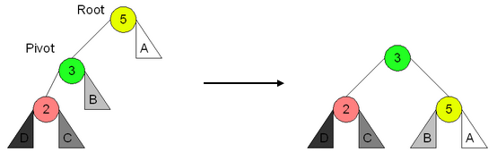

# Algoritmo e Estrutura de Dados

:::warning[Atenção]
Essa disciplina costuma ser muito mais difícil em um contexto de bacharel de análise e desenvolvimento de sistemas, engenharia de computação e ciência da computação. Não sei precisar o porquê mas nessa formação nós vamos ver apenas o básico de algumas estruturas e como podemos implementar algumas dessas estruturas em c\#.

Como sempre, **não podemos nunca** parar de estudar mais a fundo os assuntos introduzidos nos tópicos mais a frente. A bibliografia recomendada pode ser de grande valia.
:::

:::tip[Dica]
Como material adicional, podemos usar esse [material espetacular](https://joaoarthurbm.github.io/eda/) publicado pelo professor João Arthur Brunet. Vale muito a pena estudar por lá também (só cuidado porque o foco é para turma de bacharelado então a pegada é bem mais profunda do que essa primeira parte do nosso material).
:::

## Coleções Nativas das Linguagens de Programação
Vamos relembrar alguns assuntos que aprendemos no período passado na matéria de Algoritmos e Abstração de Dados.

**Arrays**

São um tipo de tipo abstrato de dados homogêneos. É um conjunto de variáveis apresentadas em uma lista onde cada elemento recebe um índice de 0 a n-1.

A notação de um array depende do tipo nativo da variável com um par de colchetes.
```cs
int[] array; // array de inteiros
double[] nota; // array de ponto flutuante

```
Para criarmos um vetor em c\# usamos o token `new`.
```cs
ind = new int[10];
nota = new double[12];

```
No exemplo acima, criamos dois arrays. O primeiro é um array de inteiros de 10 posições e o segundo é um array de double de 12 posições.

Para popularmos o array com valores, usamos o índice da posição como nos exemplos abaixo.
```cs
int vet = new int[3];
vet[0] = 1; // valor 1 na primeira posição
vet[1] = 10; // valor 10 na segunda posição
// valor 1 como a soma dos valores
// da posição 2 e 12
vet[0] = vet[1] + vet[11];

```
Podemos nos valer dos operadores de repetição para sistematicamente fazer uso dos valores de um array.
```cs
// operador de posição do array
int pos = 0;
// Loop para inserir manualmente os
// valores no nosso vetor de 3 posicoes
for (int i = 0; i < 3; i++)
{
    vet[i] = int.Parse(Console.ReadLine());
}
// Loop para sabermos quais valores foram
// salvos pelo user
for (int i = 0; i < 3; i++)
{
    Console.WriteLine(vet[i]);
}

```
Se tentarmos acessar um valor fora do index de um array com uma posição não aceita, vamos receber um erro chamado **Index out of Range Exception**.

:::note[Comentário] 
Aqui o professor propõe um exercício onde fazemos o input de um nome de aluno e a nota dele. A partir disso, o sistema calcula a média da turma e mostra a lista dos alunos que estão acima de média da turma. Fica ai o desafio para o leitor.
:::

**Listas, Pilhas e Filas**

A partir do array, podemos entender tipos abstratos de dados que nos darão a base para o estudo desse microfundamento.

O primeiro TAD que vamos aprender é a **Lista**. Uma lista é um objeto que contém um array que recebe elementos em qualquer posição, um contador de elementos no array e métodos de inserção e remoção.

Uma lista possui alguns métodos úteis para manipulação dos dados:


  - Construtores
  - Inserção de Elementos
  - Remoção de Elementos
  - Mostrar Elemento
  - Pesquisar index
  - Ordenar


Como estamos falando de um objeto, o comportamento de cada método deve ser analisado na classe que será instanciada nele.

### Principais Coleções
Aprendemos na disciplina de programação modular que existem várias coleções nativas no ambiente .NET que são otimizadas e devem compor o nosso repertório de soluções.

Vale lembrar que para ter acesso às coleções precisaremos acessar o namespace **System.Collections**.

Agora vamos aprender algumas classes interessantes para o nosso estudo.

#### ArrayList
O **ArrayList** é um objeto similar ao array com a vantagem de podermos redimensionar dinamicamente o seu tamanho (o array simples tem tamanho fixo). A documentação oficial pode ser encontrada nesse [link](https://learn.microsoft.com/pt-br/dotnet/api/system.collections.arraylist?view=net-5.0).

Possui um método chamado `Capacity` que permite a manipulação da capacidade do nosso ArrayList. Por default, o seu valor é zero e, ao inserirmos um elemento, ele muda para quatro. A capacidade do ArrayList dobra automaticamente sempre que temos a necessidade de inserir novos elementos além da capacidade anterior.

Além do método de capacidade, temos o `Count` que nos dá o número de elementos no ArrayList.

O uso dele é feito através da instanciação do objeto por meio de dois comandos possívels.
```cs
// criação sem informar a capacidade
ArrayList al1 = new ArrayList();
// criação informando a capacidade inicial
ArrayList al2 = new ArrayList(10);

```
Aqui temos um exemplo simples da utilização desse objeto[^1].

[^1]:Eu não vou mais explicar nos detalhes o que os códigos vão fazer porque você já deve ser capaz de analisar e entender sozinho.

```cs
using System;
using System.Collections;
class MainClass{
    public static void Main (string[] args){
        ArrayList al = new ArrayList();
        Console.Write("al.Capacity({0}) | al.Count({1})",al.Capacity, al.Count);
        al.Add(1);
        al.Add("string qualquer");
        al.Add(3.1415);
        Console.Write("al.Capacity({0}) | al.Count({1})",al.Capacity, al.Count);
    }
}

```
Outra manipulação comum de se utilizar é a de operações em **todos** os elementos de um ArrayList. Para isso, podemos usar os operadores de repetição como o `for` e, além desse, um operador cujo token é `foreach`.

```cs
    [...]
    ArrayList al = new ArrayList();
    [...]
    // forma 1
    for(int i = 0; i < al.Count(); i++)
    {
        Console.WriteLine(al[i]);
    }
    // forma 2
    foreach(object o in al)
    {
        Console.WriteLine(al[o]);
    }
    // forma 3
    foreach(int num in al)
    {
        soma = soma + num;
    }
```
Além dos métodos de capacidade e contagem, temos métodos que nos permitem interagir com o nosso arraylist:


  - `Add` - Insert de um valor com retorno da posição
  - `Insert` - Insert de um valor na posição indicada
  - `Remove` - Remove um valor
  - `RemoveAt` - Remove um valor em um determinado index
  - `RemoveRange` - Remove uma quantidade de elementos a partir de um index
  - `Clear` - Remove todos os elementos
  - `Contains` - Teste lógico se um valor existe no arraylist
  - `IndexOf` - Retorna o index da primeira ocorrência de um valor
  - `LastIndexOf` - Retorna o index da última ocorrência de um valor
  - `Reverse` - Inverte a ordem
  - `Sort` - Ordena os elementos
  - `ToArray` - Copia os valores em um array
  - `TrimToSize` - Altera o `capacity`
  - `BinarySearch` - Realiza uma **busca binaria**[^2]

[^2]:Ainda não vimos esse assunto mas aqui tem um [link de um vídeo do youtube](https://www.youtube.com/watch?v=MFhxShGxHWc) que explica muito bem o conceito (em inglês).

Podemos aprender um pouco melhor o uso de alguns desses métodos a partir de um exemplo. Vamos construir um programa que lê 5 inteiros, somar todos em um arraylist e calcular a média deles. Depois disso, vamos mostrar os valores que são maiores que a média. Para isso, vamos usar dois métodos de laços de repetição, um `for` e um `foreach`.

```cs
using System.Collections;
ArrayList list = new ArrayList();
double media = 0;
for (int i = 0; i < 5; i++d)
{
    int valor = int.Parse(Console.ReadLine());
    list.Add(valor);
    media += valor;
}
media /= 5;
foreach(object o in lista)
{
    if((int)o > media)
    {
        Console.WriteLine(o);
    }
}

```
:::note[Comentário] 
O comando dentro da condicional `(int)o` é uma das várias maneiras de se converter um item de uma lista em um inteiro. Chamamos essa maneira de `TypeCasting`[^3] Além dela poderíamos usar `int.Parse()` ou `Convert.ToInt32()`. Aqui tem um [texto falando mais sobre isso](https://www.delftstack.com/howto/csharp/convert-to-int-in-csharp/) e a [aqui](https://learn.microsoft.com/en-us/dotnet/csharp/programming-guide/types/casting-and-type-conversions) temos a própria documentação da Microsoft.
:::

[^3]:Vamos usar esse tipo de sintaxe mais a frente nesse microfundamento. Preste atenção nele!.

#### Queue, Stack e Hashtable
Além da lista vamos aprender outros conceitos de estrutura de dados muito usados no desenvolvimento de aplicações: Pilhas e Filas.

Uma **Pilha** ou **Stack** é um TAD que possui a característica que o **primeiro elemento que entra é o último elemento que sai**. A essa característica damos o nome de First In, Last Out (FILO).

:::note[Comentário] 
Pense em uma pilha de pratos sujos na pia. O prato que foi colocado primeiro é o último prato que será limpo pois está na base da pilha de louça suja.
:::

Uma **Fila** ou **Queue** é um TAD em que o **primeiro elemento que entra é o primeiro a sair**. O nome dessa característica é Fist In, First Out (FIFO).

As duas classes possuem métodos parecidos (dadas as diferenças já comentadas acima):


  - `enqueue`/`push` - Inserção de objetos
  - `dequeue`/`pop` - Remoção de objetos
  - `clear` - Remoção de todos os objetos
  - `contains` - Retorno se um objeto está contido
  - `peek` - Retorna o próximo objeto na ordem de remoção
  - `count` - Quantidade de elementos na estrutura


Aqui o professor propõe um desafio bem legal. Vamos ver um código c\# com um programa de fila e transcrever para idioma o que o programa faz.
```cs
Queue f = new Queue();
f.Enqueue(1);
f.Enqueue(2);
f.Enqueue(3);
Console.Write("Fila: ({0}) / ({1}) / ({2})",f.Contains(1), f.Count, f.Peek());
Console.WriteLine(f.Dequeue());
Console.Write("Fila: ({0}) / ({1}) / ({2})",f.Contains(1), f.Count, f.Peek());

```
Agora um outro programa para uma pilha.
```cs
Stack p = new Stack();
p.Push(1);
p.Push(2);
p.Push(3);
Console.Write("Pilha: ({0}) / ({1}) / ({2})",p.Contains(1), p.Count, p.Peek());
Console.WriteLine(p.Pop());
Console.Write("Pilha: ({0}) / ({1}) / ({2})",p.Contains(1), p.Count, p.Peek());

```

A terceira estrutura de dados que vamos aprender é chamada **Hashtable**. Essa estrutura é do tipo dicionário, ou seja, para cada entrada de dados, temos uma par chave-valor. Podemos dividir o nome desse TAD em duas palavras: **hash** e **table**.

Table é simplesmente uma alusão à tabela. O que temos de novidade aqui é o termo **hash**.

:::note[Comentário] 
Esse material é, em tese, um resumo dos conteúdos dados na graduação da PUC-MG, entretanto, quando eu sinto que o tópico está demasiadamente superficial, eu simplesmente não consigo evitar de expandir o conteúdo originalmente dado. Essa parte eu tirei do livro "Data Structures and Algorithms with Python".
:::

A primeira coisa que precisamos para entender o que é esse conceito de hash é compreender que programas acessam a memória e que o tempo necessário para realizar esse trabalho pode variar de acordo com a maneira que os programas são construídos. Para lidar com essa preocupação os cientistas da computação criaram o conceito de notação Omnicron ou Big-Oh.

Formalmente, dada uma lista qualquer de tamanho $n$, cujo tempo de acesso médio para coleta de um elemento dessa lista é dado pode $f(n)$. Podemos definir que:

$\mathcal{O}(g(n)) = \{ f | \exists d > 0, n_0 \in \mathbb{Z}^+ i 0 \leq f(n) \leq d g(n),\forall n \geq n_0 \}$

Calma, respira. Não é nada difícil. Essa notação matemática toda ai quer dizer que podemos definir um grupo funções $\mathcal{O}(g(n))$ que são formadas por todas as funções $f$[^4] em que temos algum $d$ maior que zero e um $n_0$ que é inteiro e positivo, de modo que, $f(n)$ é maior igual a zero e menor igual a $d$ vezes $g(n)$ para todo $n$ maior igual a $n_0$.

[^4]:Que a gente definiu logo acima como funções que medem o tempo médio de acesso de leitura para qualquer elemento em uma lista de tamanho $n$.

Quando dizemos que um determinado programa tem $\mathcal{O}(1)$, estamos dizendo que $g(n) = 1$, ou seja, que nosso programa pertence ao conjunto de funções $f$ que, dado um valor qualquer de $d$, tem o tempo de leitura de um elemento entre a faixa de tempo $0 \leq f(n) \leq d$ para qualquer $n$ da nossa lista.

Tudo isso é pra dizer que essa notação é usada para designar a relação entre o tempo de completude de uma tarefa e o tamanho dos dados necessários para a sua realização (que começa em $n_0$ e vai até $n$). Quando esse acesso à informação de um elemento qualquer não é afetado pelo volume de dados da lista, dizemos que ele possui um **tempo de execução constante** denotado por $\mathcal{O}(1)$.

Várias operações básicas possuem essa característica como somar, multiplicar ou comparar valores, levam apenas o tempo de um ciclo de computação para ser realizadas.

Agora que entendemos (bem por cima). o conceito de complexidade, podemos entender o conceito de hash. A primeira coisa que precisamos saber é que hashing é uma técnica muito eficiente de pesquisar por um valor.

Imaginem que temos um conjunto de vários elementos e queremos testar se um valor qualquer faz parte ou não desse conjunto. Não é difícil perceber que, caso o tamanho do conjunto aumente muito, o tempo necessário para essa verificação será cada vez maior porque teríamos de verificar se todos os ítens do nosso conjunto são iguais ao elemento que queremos verificar. Entretanto, é ai que podemos aplicar a técnica de hashing para reduzir a complexidade dessa tarefa para $\mathcal{O}(1)$.

Para isso, precisamos compreender que, pelo [princípio do acesso randômico](https://en.wikipedia.org/wiki/Random_access), o acesso a qualquer elemento em uma lista é $\mathcal{O}(1)$. Tudo que precisamos fazer é usar uma função que "traduza" os elementos do nosso conjunto para uma lista de referência (ou index). A partir disso, podemos verificar a pertinência de um elemento qualquer simplesmente usando a mesma função para ver se esse novo index já existe na nossa lista de index do conjunto.

Essa função especial é chamada de **função de hash**.

Tal qual as outras classes, também temos métodos muito úteis que vale a pena conhecer:


  - `add` - Insere um objeto com o index na tabela
  - `remove` - Remove um objeto
  - `clear` - Remove todos os objetos
  - `contains` - Teste se a tabela contém um objeto com uma dada chave
  - `containsKey` - idem contains
  - `containsValue` - Teste se a tabela contém um determinado valor
  - `count` - Quantos objetos temos


Só temos que ter alguns cuidados ao usarmos uma estrutura de hashtable porque podemos ter problemas de **colisões primárias** que acontecem quando a posição no array de index já está ocupada por um elemento.
### Coleções Genéricas
Começamos a ver esse assunto em programação modular e agora vamos adentrar um pouco mais nele.

Uma grande diferença entre as coleções anteriores e às genéricas é que nas últimas temos que declarar os tipos no momento da criação **sem possibilidade de misturar tipos** dentro do objeto. Enquanto as classes padrões permitiam qualquer tipo de dados misturados.

:::note[Comentário] 
O `<T>` na escrita dessas classes é justamente para indicar que somos obrigados a indicar o **tipo** do dado no momento da criação do objeto.
:::

Cada collection apresentada nas seções anteriores desse capítulo possui uma versão genérica de modo que seus métodos e propriedade são, em algum grau, análogos. Todas elas são acessíveis pelo namespace `System.Collections.Generic`.

Em termos de analogias, podemos fazer os seguintes paralelos.


| **Padrão**  |         **Generic**          |
| :---------: | :--------------------------: |
| `ArrayList` | `List<T>` ou `LinkedList<T>` |
|   `Queue`   |          `Queue<T>`          |
|   `Stack`   |          `Stack<T>`          |
| `Hashtable` |  `Dictionary<TKey,TValue>`   |


##### `List<T>`

A documentação oficial pode ser encontrada nesse [link](https://learn.microsoft.com/en-us/dotnet/api/system.collections.generic.list-1?view=net-7.0).

A declaração é feita por:


`List<T> variavel = new List<T>()`;


As propriedades de contagem e capacidade são iguais às da arraylist. Os métodos de busca, inserção, remoção, conversão para array e outros são iguais também.

Uma mudança que vale a pena destacar é no método `TrimToSize()` que na lista genérica vira o método `TrimExcess()`.

Para aprendermos melhor a diferença entre o `ArrayList` e a lista genérica, vamos definir uma classe `Aluno` que vamos usar na construção de dois programas que farão a mesma atividade.

```cs
class Aluno {
    public int matricula;
    public string nome;
    public string email;
    // construtor vazio
    public Aluno() {
        this.nome = "";
        this.email = "";
        this.matricula = 0;
    }
    // construtor
    public Aluno(string nome, int matricula, string email) {
        this.nome = nome;
        this.email = email;
        this.matricula = matricula;
    }
    // procedimento
    public void Mostrar() {
        Console.WriteLine("nome: " + nome +
        "mat: " + matricula + " email: " + email);
    }
}
```

Podemos ver que essa classe possui dois construtores e um método chamado `Mostrar` que imprime na tela os dados do objeto.

Agora vamos comparar dois programas que realizam a mesma tarefa onde, em um usamos ArrayList e, no outro, usamos Lista genérica.

```cs
// PROGRAMA USANDO ARRAYLIST //
using System;
using System.Collections;
class Aluno { [...] }
// Procedimento de impressão dos elementos da ArrayList
public static void Mostrar(ArrayList al) {
        foreach(object o in al) {
            ((Aluno)o).Mostrar();
        }
    }

// programa usando o ArrayList
public static void Main (string[] args) {
    ArrayList al = new ArrayList();
    // Inserindo 5 alunos usando números aleatórios
        for(int i = 0; i <5; i++) {
        int num = Math.Abs((new Random()).Next()) % 100;
        al.Add(new Aluno("Aluno " + num, num,
        "aluno" + num + "@a.com.br"));
    }
    // Inserindo um aluno manualmente
    Aluno a = new Aluno("Bruno", 101, "bruno@gmail.com");
    al.Insert(2,a);
    // Mostrando o primeiro elemento
    ((Aluno)al[0]).Mostrar();
    // Removendo o aluno inserido manualmente
    al.Remove(a);
    // Teste de Contains
    if (al.Contains(a) == true) {
        Console.WriteLine("Elemento encontrado!");
    } else {
        Console.WriteLine("Elemento não encontrado!");
    }
    // Reduzindo a capacidade para o número de elementos
    al.TrimToSize();
    // Removendo todos os elementos
    al.Clear();
}

```

```cs
// PROGRAMA USANDO LISTA GENÉRICA //
using System;
using System.Collections.Generic;
class Aluno { [...] }
// Procedimento de impressão dos elementos da ArrayList
public static void Mostrar(List<Aluno> l) {
    foreach(Aluno a in l) {
    a.Mostrar();
    }
}
public static void Main (string[] args) {
    List<Aluno> l = new List<Aluno>();
    // Inserindo 5 alunos usando números aleatórios
    for(int i = 0; i <5; i++) {
        int num = Math.Abs((new Random()).Next()) % 100;
        l.Add(new Aluno("Aluno " + num, num,
        "aluno" + num + "@a.com.br"));
    }
    // Inserindo um aluno manualmente
    Aluno a = new Aluno("Bruno", 101, "bruno@gmail.com");
    al.Insert(2,a);
    // Mostrando o primeiro elemento
    l[0].Mostrar();
    // Removendo o aluno inserido manualmente
    l.Remove(a);
    // Teste de Contains
    if (l.Contains(a) == true) {
        Console.WriteLine("Elemento encontrado!");
    } else {
        Console.WriteLine("Elemento não encontrado!");
    }
    // Reduzindo a capacidade para o número de elementos
    l.TrimExcess();
    // Removendo todos os elementos
    l.Clear();
}

```
Comparando os dois programas, podemos ver que existem diferenças no modo como usamos elementos contidos nas duas estruturas de dados. Quando usamos um elemento de um ArrayList, o c\# precisa converter o elemento de `object` para algum tipo primitivo. Chamamos esse processo de **boxing**. Esse é o motivo de termos que usar o TypeCasting.

Essa necessidade não existe na lista genérica porque ela nos obriga a declarar o tipo dos elementos no momento da criação do objeto. Por isso a recuperação dos elementos é mais simples de ser feita apenas com a passagem do index.

##### `LinkedList<T>`

A documentação oficial está disponível nesse [link](https://docs.microsoft.com/pt-br/dotnet/api/system.collections.generic.linkedlist-1?view=net-5.0).

A linkedlist é a aplicação em c\# de uma lista flexível. Isso quer dizer que a memória é alocada somente quando existe a necessidade, uma célula por vez e não em "blocos" de 4 unidades como na lista genérica.

Outa diferença é que, do lado do hardware, a lista genérica salva os seus valores continuamente ao longo da memória. Por sua vez, a LinkedList salva em cada célula duas informações: o valor do item na posição e a referência para a próxima célula alocada na memória.

Ou seja, o nome linkedlist ou lista ligada é porque os nossos valores são "ligados" entre si por meio dessa fila de valores e referências de posições na memória[^5].

[^5]:Pelo princípio do acesso aleatório, o fato de termos alocações ``espalhadas'' não deve ser um problema na hora de recuperar os valores da lista.

O final da fila sempre apontará para um endereço nulo. Essa é a indicação que ele é o último elemento da linkedlist. 

Agora vamos ver alguns métodos úteis dessa classe:


  - `AddAfter` - Adiciona um valor novo como referência de um célula anterior ao novo valor
  - `AddBefore` - Adiciona um valor novo como referência de um célula posterior ao novo valor
  - `AddFirst` - Muda o item de posição 0
  - `AddLast` - Muda item de posição n-1
  - `Remove` - Libera o espaço na memória para uma nova alocação da primeira aparição do valor
  - `RemoveFirst`
  - `RemoveLast`
  - `Clear`
  - `Contains`
  - `Find` - Retorna a primeira ocorrência
  - `FindLast` - Retorna a última ocorrência


Agora vamos ver um programa que utilize alguns desses métodos.
```cs
using System;
using System.Collections.Generic;

static void Main (string[] args) {
    LinkedList<string> meses = new LinkedList<string>();
    meses.AddFirst("janeiro");
    meses.AddLast("Fevereiro");
    meses.AddLast("Março");
    meses.RemoveFirst();
    LinkedListNode<int> i = meses.Find("Fevereiro");
    meses.AddBefore(i,"Janeiro");
    foreach (string mes in meses) {
        Console.WriteLine(mes);
    }
}

```
**`Queue<T>`** e **`Stack<T>`**

As documentações oficiais podem ser encontradas [aqui](https://learn.microsoft.com/pt-br/dotnet/api/system.collections.generic.queue-1?view=net-5.0) e [aqui](https://learn.microsoft.com/pt-br/dotnet/api/system.collections.generic.stack-1?view=net-5.0).

Essas duas classes são muito parecidas com as versões padrões. A novidade aqui é que temos que definir os tipos nas coleções genéricas. De resto, são praticamente a mesma coisa.

Vamos ver um exemplo dessas classes.
```cs
using System;
using System.Collections.Generic;

static void Main (string[] args) {
    Queue<int> f = new Queue<int>();
    f.Enqueue(1);
    f.Enqueue(2);
    f.Enqueue(3);
    // remove o primeiro
    f.Dequeue();
    Stack<int> p = new Stack<int>();
    p.Push(1);
    p.Push(2);
    p.Push(3);
    // remove o último
    p.Pop();
}

```
**`Dictionary<TKey, TValue>`**

A documentação oficial pode ser lida [aqui](https://learn.microsoft.com/pt-br/dotnet/api/system.collections.generic.dictionary-2?view=net-5.0).

Os métodos são bem parecidos com os da hashtable. Com a novidade do método `TryGetValue(TKey,out TValue)` onde, ao passarmos o valor da chave, caso ela exista no dicionário genérico, teremos como resposta um `true` junto do valor relacionado ao da chave pesquisada.

Dentre as propriedades podemos destacar as que retornam os valores do dicionário:


  - `Item` - Retorna a coleção do tipo `KeyValuePair<TKey,TValue>`
  - `Keys` - Retorna uma coleção do tipo `KeyCollection`
  - `Values` - Retorna uma coleção do tipo `ValueCollection`


Agora vamos ver um programa usando alguns métodos dessa classe.
```cs
using System;
using System.Collections.Generic;

static void Main (string[] args) {
    Dictionary<string, Dictionary<string, int>> nota = new
    Dictionary<string, Dictionary<string, int>>();
    nota.Add("AED", new Dictionary<string, int>() {
        {"Maria", 60},
        {"Pedro", 10},
        {"João", 25}
    });

    nota.Add("Calculo", new Dictionary<string, int>() {
        {"Tatiano", 29},
        {"Ana Paula", 16},
        {"Kleber", 22}
    });

    nota["AED"].Add("Astrolabio",99);
    foreach (KeyValuePair<string, Dictionary<string,int>> disciplina in nota) {
        Console.WriteLine(disciplina.Key);
        Console.WriteLine("	Alunos:");
        double media = 0;
        foreach (KeyValuePair<string, int> Aluno in disciplina.Value) {
            Console.WriteLine(Aluno.Key + "Nota: " + Aluno.Value);
            media += Aluno.Value;
        }
        media /= disciplina.Value.Count;
        Console.WriteLine("Média da Turma: " + media);
    }
}
```
:::note[Comentário] 
Aqui o professor não teve pena. E eu também não vou ter. **Não siga adiante** se você não for capaz de entender o que esse programa faz. Analise o código até fazer sentido.
:::

## Tipos Abstratos de Dados
A partir de agora, vamos estudar o funcionamento básico de algumas estruturas muito comuns na resolução de problemas computáveis: listas, árvores binárias e tabelas hash.

Na seção anterior, nós aprendemos como usar algumas implementações desses conceitos em c\#. Agora, vamos estudar um pouco da teoria por trás dessas classes.

:::note[Comentário] 
A partir de agora, vamos ver muito código. Sério. Se prepare, pegue uma boa dose de café e vamos embarcar nessa tonelada de código c\#.
:::

### Listas

As listas podem ser divididas em 2 tipos: lineares e não lineares. Das collections que vimos, podemos dizer que `ArrayList` e `List<T>` são exemplos de listas lineares e que a `LinkedList<T>` é um exemplo de lista não linear.

#### Lista linear
Uma lista linear, também chamada de sequencial, possui estruturas formadas por um array e um contador. Possuem método de inserção e remoção de elementos e, por ter tamanho definido, precisa ter alguma resolução para o caso onde uma inserção é solicitada mas o tamanho da lista já foi alcançado.

A primeira forma de se pensar na solução para o problema acima é simplesmente proibir que uma inserção ocorra quando o contador indicar que a lista alcançou o tamanho delimitado. Essa abordagem é mais simples e faremos uso dela logo mais a frente.

A segunda, é simplesmente permitir que esse limite seja expandido. Essa é justamente a abordagem usada nas collections `ArrayList` e `List<T>`. Ao se chegar no limite inicial, o processador cria um novo array de tamanho maior copiando todos os itens anteriores.

Nesta seção vamos construir uma lista linear "na unha". Assim vamos aprender melhor como esses métodos são implementados nas classes que usaremos ao longo da nossa jornada como desenvolvedores .NET.
```cs
// Criação de uma lista linear
class ListaLinear {
    private int[] array;
    private int n;

    // construtor vazio
    ListaLinear() {
        array = new int[6];
        n = 6;
    }
    // construtor com definição do tamanho
    ListaLinear(int tamanho) {
        array = new int[tamanho];
        n = 0;
    }
    // relação de procedimentos e métodos
    void InserirInicio() {...}
    void InserirFinal() {...}
    void Inserir() {...}
    int RemoverInicio() {...}
    int RemoverFinal() {...}
    int Remover() {...}
    void Mostrar() {...}
}

```
Agora vamos passar para a criação dos métodos indicados na parte final do nosso código.

```cs
// InserirInicio
void InserirInicio(int x) {
    // código encerra se tivermos mais ítens do que
    // a lista pode comportar
    if (n >= array.Length)
        Environment.Exit(0);
    for(int i = n; i > 0; i--) {
        array[i] = array[i-1];
    }
    array[0] = x;
    n++;
}

// InserirFinal
void InserirFinal(int x) {
    if (n >= array.Length)
        Environment.Exit(0);
    array[n] = x;
    n++;
};

// Inserir em qualquer posição
void Inserir(int x, int pos) {
if(n >= array.Length || pos < 0 || os > n) {
    Environment.Exit(0);

    // leva os elementos para o final do array
    for (int i = n; i > pos; i--){
        array[i] = array[i-1];
    }
    array[pos] = x;
    n++;
    }
};

```
Esses 3 métodos de inserção são tranquilos de entendermos. No caso do primeiro, ele move todo mundo pra direita e acrescenta o valor novo no index 0. No caso do inserir no final, ele simplesmente olha o contador e insere um elemento no index dele. Por fim, no caso do inserir genérico, ele primeiro move todos os elementos para a direita do index da posição indicada para depois inserir o elemento nela.

:::note[Comentário] 
Bem legal vermos como um simples método de adição pode dar uma dor de cabeça para se pensar em como implementar a melhor maneira. Nas próximas vezes que usar um simples insert em uma lista, podemos pensar o que tá acontecendo por trás das bibliotecas que usamos.
:::

Agora vamos para os métodos de remoção. São análogos aos métodos de inserção só que no caminho reverso.

```cs
// Remover primeiro elemento
int RemoverInicio() {
    if (n == 0)
        Environment.Exit(0);

    int resp = array[0];
    n--;
    for (int i = 0; i < n; i++) {
        array[i] = array[i+1];
    }
    return resp;
}

// Remover o último elemento
int RemoverFim() {
    if (n == 0)
        Environment.Exit(0);
    
    return array[--n];
}

// Remove um elemento da posição
// movendo o resto para a esquerda
int Remover(int pos) {
    if (n == 0 || pos < 0 || pos >= n)
        Environment.Exit(0);
    
    int resp = array[pos];
    n--;
    
    for (int i = pos; i < n; n++) {
        array[i] = array[i+1];
    }

    return resp;
}

```
:::note[Comentário] 
Novamente, se você está com dificuldade em entender esse código. **Pare agora e revise o conteúdo**. Não basta pegar o código e rodar no seu computador. Você é que deve ser capaz de ler e entender o código.
:::

Agora só precisamos de um último método de mostrar os elementos da nossa lista linear.

```cs
// Mostra todos os elementos da lista
void Mostrar() {
    Console.Write("[");

    for (int i = 0; i < n; i++) {
        Console.Write(array[i] + " ");
    }

    Console.Write("]");
}

```
:::note[Comentário] 
Aqui vai um pequeno teste. Imagine que eu crie uma lista com essa classe instanciada. Qual será o output obtido caso a gente use o método `Mostrar()`?
:::

O código integral desse programa pode ser encontrado no meu [github gist](https://gist.github.com/brunoruas2/da13f73beddbc996d6a4663dc7575c67).

#### Classe Autorreferencial

Uma classe autorreferencial possui a peculiaridade de fazer referência para objetos do seu próprio tipo. A `LinkedListNode<T>` é um exemplo dessa classe.

Abaixo temos um exemplo de código que implementa essa característica.

```cs
class Celula {
    public int elemento;

    // referencia para a próxima célula
    public Celula prox;

    // construtor vazio
    public Celula() {
        this.elemento = 0;
        this.prox = null;
    }
    // construtor com a passagem do parâmetro
        public Celula(int x) {
        this.elemento = x;
        this.prox = null;
    }
}

```
A vantagem dessa abordagem é que podemos criar elementos em cadeia. No exemplo acima, cada instanciação da classe pode ser relacionada a outra de maneira recursiva.

:::note[Comentário] 
A gente viu um pouco sobre recursão lá no microfundamento de programação modular mas no contexto de uma função.
:::

#### Lista flexível
Uma lista flexível é justamente a construção feita pelas classes autorreferenciais que acabamos de ver. Cada elemento instanciado é salvo na memória de modo a ocupar uma sequência aleatória de armazenamento no hardware da memória.

O `LinkedList<T>` é a implementação em c\# desse conceito.

Existem duas maneiras de se criar uma lista flexível. A primeira, contém um primeiro elemento cujo valor `elemento` é null (chamamos esse elemento de "cabeça"). A segunda maneira, é colocarmos o valor do primeiro elemento diretamente no primeiro nó da cadeia de elementos.

A vantagem da primeira abordagem (com cabeça) é que tratamos o método de inserir em uma lista vazia exatamente do mesmo modo de inserir em uma lista de elementos. A razão disso é que só precisaremos mudar o atributo `prox` da cabeça. No caso da abordagem sem cabeça, teríamos que primeiro verificar se existem elementos para, em caso negativo, alterarmos o atributo `prox` para null desse primeiro elemento.

Abaixo temos a implementação de uma lista flexível que usa a classe autorreferencial da seção anterior.

```cs
class ListaFlex {
    // instanciação das posições obrigatórias
    // de primeiro e último como objetos autorreferenciados
    private Celula primeiro, ultimo;

    // construtor vazio
    public ListaFlex() {
        ultimo = primeiro = new Celula();
    }
    
    // obtendo o tamanho da lista
    public int Tamanho() {
        int tamamho = 0;

        for (Celula i = primeiro; i != ultimo; i = i.prox)
            tamanho++;
        
        return tamanho;
        }

    // lista dos métodos
    public void InserirFim(int x) {
        ultimo.prox = new Celula(x);
        ultimo = ultimo.prox;
    }

    public void InserirInicio(int x) {
        Celula tmp = new Celula(x);
        tmp.prox = primeiro.prox;
        primeiro.prox = tmp;
        if (primeiro == ultimo) {
            ultimo = tmp;
        }
        tmp = null;
    }
    
    public int RemoverFim() {
        if (primeiro == ultimo)
            Environment.Exit(0);
    
        // loop para se chegar no penúltimo elemento
        for (Celula i = primeiro; i.prox != ultimo; i = i.prox)
            int elemento = ultimo.elemento;
            ultimo = i;
            i = ultimo.prox = null;
            return elemento;
    }

    public int RemoverInicio() {
        // esse método mantém a cabeça da lista
        if (primeiro == ultimo)
            Environment.Exit(0);
    
        Celula tmp = primeiro.prox;
    
        // a cabeça agora vai apontar para
        // o segundo elemento "pulando" o primeiro
        primeiro.prox = primeiro.prox.prox;
        int elemento = tmp.elemento;
        tmp.prox = null;
        tmp = null;
        return elemento;
    }

    // atenção aqui: a posição 0 não é a da cabeça e sim
    // do primeiro elemento após ela, ou seja, primeiro.prox
    public void Inserir(int x, int pos) {
        int tamanho = Tamanho();

        if (pos < 0 || pos > tamanho) {
            Environment.Exit(0);
        } else if (pos == 0) {
            InserirInicio(x);
        } else if (pos == tamanho) {
            InserirFim(x);
        } else {
            Celula i = primeiro;

            for (int j = 0; j < pos; j++)
                i = i.prox;
            
            Celula tmp = new Celula(x);
            tmp.prox = i.prox;
            i.prox = tmp;
            tmp = i = null;
        }
    }
    public int Remover(int pos) {
        int tamanho = Tamanho();

        if (primeiro == ultimo || pos < 0) {
            Environment.Exit(0);
        } else if (pos == 0) {
            elemento = RemoverInicio();
        } else if (pos == tamanho - 1) {
            elemento = RemoverFim();
        } else {
            Celula i = primeiro;
            for (int j = 0; j < pos; j++)
                i = i.prox;

            Celula tmp = i.prox;
            elemento = tmp.elemento;
            i.prox = tmp.prox;
            tmp.prox = null;
            i = tmp = null;
        }
        return elemento;
    }

    public void Mostrar() {
        Console.Write("[");

        for (Celula i = primeiro.prox; i != null; i = i.prox) {
            Console.Write(i.elemento + " ");
        }
    
        Console.Write("]");
    }
}

```
O código dessa classe está disponível nesse [github gist](https://gist.github.com/brunoruas2/9846e0c842209d25c8b32bd4d0808488).

### Árvore Binária e Tabela Hash

#### Árvore Binária

Nas listas, o custo das atividades de inserção, remoção e pesquisa costuma ser de $\mathcal{O}(n)$ enquanto, nas árvores, o custo tende a ser de $\mathcal{O}(log(n))$. O motivo disso nós veremos mais a frente.

Para entendermos melhor sobre essa estrutura de dados, é muito útil ter uma representação visual dessa estrutura.


Podemos ver que usamos dois elementos para representar essa estrutura. As bolas são chamados de nós (ou vértices) e as linhas (ou setas) são chamadas de arestas.

:::note[Comentário] 
Se você ficou com algum feeling que a relação entre esses pontos lembrou um pouco a `LinkedList<T>`, você tá no caminho certo.
:::

Agora nós vamos aprender alguns conceitos importantes sobre essa estrutura que são termos usados para comunicar ideias a respeito desse objeto:

- Cada bola numerada é chamada de **nó**
- O nó mais alto é chamado de **raiz**
- Cada camada da árvore é chamada de **nível**[^6]
- Os nós que vêm após outro nó são chamados de **filhos**
- Todo nó que tem filho é chamado de **nó interno**
- Os nós sem filhos são chamados de **folhas** ou **nós externos**
- Podemos subdividir uma árvore em **sub-árvores** onde a raiz é um nó filho da árvore original
- Chamamos de **distância** a contagem dos níveis entre 2 nós
- Chamamos de **altura** da árvore a contagem dos níveis entre a raiz e a folha mais alta

[^6]: A raiz está **sempre** no nível 0.

Todos esses conceitos acima são relacionados a qualquer estrutura de árvore. Entretanto, uma **Árvore Binária** é uma árvore em que cada nó possui, no máximo, 2 filhos.

Um tipo especial de árvore binária é a **Árvore Binária de Pesquisa (ABP)** ou **Árvore Binária de Busca (ABB)**. Ela é uma árvore binária com uma condição adicional: Os valores dos nós filhos à esquerda são sempre **menores** que o valor do nó pai e, ao contrário, os valores dos filhos à direta são sempre **maiores**. Compare a árvore que mostramos logo no começo com essa aqui abaixo.


Uma árvore é classificada como **Árvore Balanceada** se, para **todos** os nós, a diferença entre os níveis à esquerda e à direita seja $\leq 1$. Outra maneira de afirmar a mesma coisa é dizer que a altura da sub-árvore esquerda menos a altura da sub-árvore direita pertence ao conjunto $\{ -1, 0, 1 \}$

Agora que definimos a nossa estrutura de dados, temos que criar alguns métodos que serão usados para a manipulação das informações gravadas nela. Para efeitos didáticos, a partir de agora vamos considerar que todas as árvores binárias serão de pesquisa.

Podemos criar uma árvore em c# com o seguinte código:

```cs
// c sharp
class No {
    public int elemento;
    public No esq, dir;

    // construtor do nó raiz
    public No(int elemento) {
        this.elemento = elemento;
        this.esq = null;
        this.dir = null;
    }

    // construtor do nó filho
    public No(int elemento, No esq, No dir) {
        this.elemento = elemento;
        this.esq = esq;
        this.dir = dir;
    }
}
```

Mas não precisamos parar por aqui. Para ser uma estrutura de dados útil, precisamos maneiras de interagir com nossa árvore para realizar as operações de **pesquisa**, **caminhamento**, **inserção** e **remoção**.

```cs
// c sharp
// função de busca de um nó a partir do valor do seu elemento
public No Busca(int valor, No no) {
    if (no == null || no.elemento == valor) {
        return no;
    }

    if (valor < no.elemento) {
        return Busca(valor, no.esq);
    } else {
        return Busca(valor, no.dir);
    }
}

// função que mostra os valores caminhando nos nós
// da esquerda para a direita
public void Caminhamento(No no) {
    if (no != null) {
        Caminhamento(no.esq);
        Console.Write(no.elemento + " ");
        Caminhamento(no.dir);
    }
}

// função de inserção de nós em uma árvore
public No Insercao(int valor, No no) {
    // Nós raiz
    if (no == null) {
        return new No(valor);
    }

    // Essa iteração é muito inteligente porque
    // ela aplica a mesma lógica do caminhamento
    if (valor < no.elemento) {
        no.esq = Insercao(valor, no.esq);
    } else {
        no.dir = Insercao(valor, no.dir);
    }

    return no;
}
```

A operação mais complexa de ser implantada em uma ABP é a de remoção. A principal dificuldade vem do problema da existência de filhos. Como sabemos, um nó pode ter:

- 0 Filhos (nó folha)
- 1 Filho
- 2 Filhos

```cs
// Primeiro definimos uma função que vamos usar
private No FindMin(No node) {
    while (node.left != null) {
        node = node.left;
    }
    
    return node;
}

public No Remove(int valor, No no) {
    // Se a árvore estiver vazia, retorne null.
    if (no == null) {
        return null;
    }
    
    // Se o valor a ser removido for menor que o valor do nó atual, vá para a subárvore esquerda.
    if (valor < no.valor) {
        no.left = Remove(no.left, valor);
    }
    // Se o valor a ser removido for maior que o valor do nó atual, vá para a subárvore direita.
    else if (valor > no.valor) {
        no.right = Remove(no.right, valor);
    }
    // Se o valor a ser removido for igual ao valor do nó atual, remova o nó.
    // Aqui vamos ter que levar olhar o problema dos nós filhos.
    else {
        // Se o nó não tiver filhos, basta removê-lo.
        if (no.left == null && no.right == null) {
            no = null;
        }
        // Se o nó tiver apenas um filho, substitua o nó pelo seu filho.
        else if (no.left == null) {
            no = no.right;
        }
        else if (no.right == null) {
            no = no.left;
        }
        // Se o nó tiver dois filhos, encontre o sucessor do nó (o menor valor na subárvore direita) e substitua o nó pelo seu sucessor.
        else {
            No successor = FindMin(no.right);
            no.valor = successor.valor;
            no.right = Remove(no.right, successor.valor);
        }
    }
    
    return no;
}
```

Na parte final, nós optamos por usar a substituição pelo sucessor. Entretanto, poderíamos fazer a escolha pelo predecessor.

##### Balanceamento de Árvores Binárias

A vantagem da estrutura de árvore binária é que, como existe uma ordem de criação dos nós, podemos realizar pesquisas e, por consequência, remoções e inserções a um custo menor como vimos no começo dessa seção. Contudo, cabe destacar que essa vantagem só é verificada em casos onde a árvore está **balanceada**.

Para situações em que essa condição não é encontrada, podemos realizar o processo de balanceamento que verifica a árvore em busca de nós desbalanceado.

O processo de balanceamento usa uma técnica chamada **rotacionamento** dos nós. A ideia é que o nó desbalanceado "gira" em torno do seu nó filho em sentido horário ou anti-horário de modo a virar filho do seu filho. Calma, olhando a imagem fica mais fácil de entender.



Na imagem acima, podemos ver que o nó 5 está desbalanceado à esquerda porque possui uma altura 2 à esquerda e 0 à direita. Então é realizado um giro que transforma o nó 5 em filho do nó 3. Dando a essa árvore o balanceamento que desejamos.

Agora que temos uma ideia do que é o rotacionamento, podemos aprofundar um pouco mais nos seus tipos. Ao todo, existem 4 tipos de rotações que podemos usar:

- Simples
    - À esquerda
    - À direita
- Dupla
    - Direita-Esquerda
    - Esquerda-Direita

:::note[Comentário] 
Isso mesmo, a imagem anterior é uma rotação simples à direita.
:::

A rotação dupla é, como o nome auto-explicativo indica, apenas a composição de rotações simples mas em sentidos contrários. Abaixo temos uma imagem explicativa para uma **rotação dupla esquerda-direita**.


Outro conceito importante é a da **Árvore Binária Adelson-Velsky e Landis (AVL)** que foi proposta lá em 1962. Esses dois soviéticos foram quem primeiro definiram as condições necessárias para a construção de uma árvore balanceada a partir da medida chamada **fator de balanceamento** que pode ser calculada pela equação:

$fator(i) = altura\_{}direira(i) - altura\_{}esquerda(i)$
 
Ao calcularmos o fator para todos os nós de uma árvore podemos verificar as rotações necessárias para o seu balanceamento. Abaixo temos um quadro com o resumo das regras.

| Fator do nó | Fator do filho direito | Fator do filho esquerdo |     Rotação      |
| :---------: | :--------------------: | :---------------------: | :--------------: |
|      2      |        1 / 0        |                         | Simples esquerda |
|      2      |           -1           |                         |  Dupla dir-esq   |
|     -2      |                        |        -1 / 0        | Simples direita  |
|     -2      |                        |            1            |  Dupla esq-dir   |


#### Tabela Hash
Para finalizarmos nossa disciplina de Algoritmos e Estrutura de Dados, vamos ver as `tabelas hash`. Sim, o termo que vimos lá na primeira parte chamado `hashtable` é a aplicação em c# dessa estrutura.

A principal vantagem da tabela hash é que, como ela ordena o arquivo no momento da sua inserção usando a sua função de hash, o custo do acesso a essa informação é constante, ou seja $\mathcal{O}(1)$.

A desvantagem é que temos um custo elevado se quisermos recuperar os registros em ordem. Podendo chegar a $\mathcal{O}(n)$

Quando queremos inserir elementos iguais na mesma tabela. Como a função de hash faz um mapeamento para algum subconjunto, se tentarmos inserir um elemento repetido (ou mesmo um outro elemento que gere um mesmo valor no mapeamento), teríamos uma **colisão primária**. Evitar esses problemas é o cerne de uma boa implementação dessa estrutura de dados.

Normalmente, temos 3 abordagens para evitar essas colisões:

1. Hash direto com área de reserva (overflow): Aqui, teremos uma área reservada em um array para tratar as colisões.
2. Hash direto com rehash: Nessa abordagem temos duas funções de hash. Caso a primeira aponte para uma colisão, usaremos a segunda.
3. Hash indireto com lista flexível simples: Assumimos que cada posição é uma lista flexível que pode apontar para outros elementos. Nesse caso, uma colisão entra como uma nova ligação na lista flexível.

As classes `Hashtable` e `Dictionary<TKey,TValue>` implementam a tabela hash em c#. Contudo, fica aqui um aviso. A teoria clássica assume que a as chaves são **obrigatoriamente** números inteiros[^7].

Eu pedi ao chatGPT que mostrasse um exemplo da implementação dessa estrutura em c#. Ele optou por usar a Collection de hashtable (o que tá valendo).

```cs
using System;
using System.Collections;

class Program
{
    static void Main(string[] args)
    {
        // Criando uma nova tabela hash
        Hashtable hashtable = new Hashtable();

        // Adicionando elementos à tabela hash
        hashtable.Add("chave1", "valor1");
        hashtable.Add("chave2", "valor2");
        hashtable.Add("chave3", "valor3");

        // Acessando um elemento da tabela hash
        string valorChave2 = (string)hashtable["chave2"];
        Console.WriteLine("O valor da chave2 é: " + valorChave2);

        // Alterando um elemento da tabela hash
        hashtable["chave1"] = "novoValor1";

        // Removendo um elemento da tabela hash
        hashtable.Remove("chave3");

        // Iterando sobre os elementos da tabela hash
        foreach (DictionaryEntry entry in hashtable)
        {
            Console.WriteLine("A chave é: " + entry.Key + " e o valor é: " + entry.Value);
        }

        // Verificando se a tabela hash contém uma chave específica
        if (hashtable.ContainsKey("chave1"))
        {
            Console.WriteLine("A tabela hash contém a chave1.");
        }

        // Verificando se a tabela hash contém um valor específico
        if (hashtable.ContainsValue("valor2"))
        {
            Console.WriteLine("A tabela hash contém o valor2.");
        }
    }
}
```

Mas aqui tá uma coisa interessante. Como será que essa collection lida com colisão primária? Bom, nenhum lugar é melhor que o próprio código da classe.

Podemos "navegar" pelo código de tudo que importamos no nosso programa simplesmente apertando ctrl e clicando no método. Por exemplo, podemos clicar no método `Add` do objeto hashtable para irmos exatamente no código que constrói esse método na classe `Hashtable`.

```cs
// Adds an entry with the given key and value to this hashtable. An
// ArgumentException is thrown if the key is null or if the key is already
// present in the hashtable.
//
public virtual void Add(object key, object? value)
{
    Insert(key, value, true);
}
```

Podemos ver que estamos usando a função `Insert` dentro desse método. Pois bem, vamos ver o que essa função faz?

```cs
// Inserts an entry into this hashtable. This method is called from the Set
// and Add methods. If the add parameter is true and the given key already
// exists in the hashtable, an exception is thrown.
private void Insert(object key, object? nvalue, bool add)
{
    if (key == null)
    {
        throw new ArgumentNullException(nameof(key), SR.ArgumentNull_Key);
    }

    if (_count >= _loadsize)
    {
        expand();
    }
    else if (_occupancy > _loadsize && _count > 100)
    {
        rehash();
    }

    // Assume we only have one thread writing concurrently.  Modify
    // buckets to contain new data, as long as we insert in the right order.
    uint hashcode = InitHash(key, _buckets.Length, out uint seed, out uint incr);
    int ntry = 0;
    int emptySlotNumber = -1; // We use the empty slot number to cache the first empty slot. We chose to reuse slots
    // create by remove that have the collision bit set over using up new slots.
    int bucketNumber = (int)(seed % (uint)_buckets.Length);
    do
    {
        // Set emptySlot number to current bucket if it is the first available bucket that we have seen
        // that once contained an entry and also has had a collision.
        // We need to search this entire collision chain because we have to ensure that there are no
        // duplicate entries in the table.
        if (emptySlotNumber == -1 && (_buckets[bucketNumber].key == _buckets) && (_buckets[bucketNumber].hash_coll < 0))// (((buckets[bucketNumber].hash_coll & unchecked(0x80000000))!=0)))
            emptySlotNumber = bucketNumber;

        // Insert the key/value pair into this bucket if this bucket is empty and has never contained an entry
        // OR
        // This bucket once contained an entry but there has never been a collision
        if ((_buckets[bucketNumber].key == null) ||
            (_buckets[bucketNumber].key == _buckets && ((_buckets[bucketNumber].hash_coll & unchecked(0x80000000)) == 0)))
        {
            // If we have found an available bucket that has never had a collision, but we've seen an available
            // bucket in the past that has the collision bit set, use the previous bucket instead
            if (emptySlotNumber != -1) // Reuse slot
                bucketNumber = emptySlotNumber;

            // We pretty much have to insert in this order.  Don't set hash
            // code until the value & key are set appropriately.
            _isWriterInProgress = true;
            _buckets[bucketNumber].val = nvalue;
            _buckets[bucketNumber].key = key;
            _buckets[bucketNumber].hash_coll |= (int)hashcode;
            _count++;
            UpdateVersion();
            _isWriterInProgress = false;

            return;
        }

        // The current bucket is in use
        // OR
        // it is available, but has had the collision bit set and we have already found an available bucket
        if (((_buckets[bucketNumber].hash_coll & 0x7FFFFFFF) == hashcode) &&
            KeyEquals(_buckets[bucketNumber].key, key))
        {
            if (add)
            {
                throw new ArgumentException(SR.Format(SR.Argument_AddingDuplicate__, _buckets[bucketNumber].key, key));
            }
            _isWriterInProgress = true;
            _buckets[bucketNumber].val = nvalue;
            UpdateVersion();
            _isWriterInProgress = false;

            return;
        }

        // The current bucket is full, and we have therefore collided.  We need to set the collision bit
        // unless we have remembered an available slot previously.
        if (emptySlotNumber == -1)
        {// We don't need to set the collision bit here since we already have an empty slot
            if (_buckets[bucketNumber].hash_coll >= 0)
            {
                _buckets[bucketNumber].hash_coll |= unchecked((int)0x80000000);
                _occupancy++;
            }
        }

        bucketNumber = (int)(((long)bucketNumber + incr) % (uint)_buckets.Length);
    } while (++ntry < _buckets.Length);

    // This code is here if and only if there were no buckets without a collision bit set in the entire table
    if (emptySlotNumber != -1)
    {
        // We pretty much have to insert in this order.  Don't set hash
        // code until the value & key are set appropriately.
        _isWriterInProgress = true;
        _buckets[emptySlotNumber].val = nvalue;
        _buckets[emptySlotNumber].key = key;
        _buckets[emptySlotNumber].hash_coll |= (int)hashcode;
        _count++;
        UpdateVersion();
        _isWriterInProgress = false;

        return;
    }

    // If you see this assert, make sure load factor & count are reasonable.
    // Then verify that our double hash function (h2, described at top of file)
    // meets the requirements described above. You should never see this assert.
    Debug.Fail("hash table insert failed!  Load factor too high, or our double hashing function is incorrect.");
    throw new InvalidOperationException(SR.InvalidOperation_HashInsertFailed);
}
```

Pois é. O negócio ficou sério. Isso ai é coisa de Senior. Entretanto, podemos focar em uma parte especial.

```cs
// The current bucket is full, and we have therefore collided.  We need to set the collision bit
// unless we have remembered an available slot previously.
if (emptySlotNumber == -1)
{// We don't need to set the collision bit here since we already have an empty slot
    if (_buckets[bucketNumber].hash_coll >= 0)
    {
        _buckets[bucketNumber].hash_coll |= unchecked((int)0x80000000);
        _occupancy++;
    }
}
```

Eu sei, ainda tá punk. Mas olha só. Nós conhecemos um condicional. E aqui em cima temos um dentro do outro.

Ignorando o primeiro, vamos prestar atenção no de dentro. Ele parece fazer um teste se o hash do nosso elemento que foi inserido possui alguma colisão `.hash_coll >= 0`. Se isso é verdade, ele está usando o token composto `|=` do operador de atribuição `=` com o lógico `||`. A gente viu algo parecido [aqui](../02-primeiro-periodo/02-algoritmo-logica.md) e [aqui](../02-primeiro-periodo/02-algoritmo-logica.md).

:::note[Comentário] 
`a |= b` é a mesma coisa que `a = a | b`. Ou seja, temos uma operação lógica entre `_buckets[bucketNumber].hash_coll | unchecked((int)0x80000000)`. Sendo que esse treco `0x80000000` é o número hexadecimal para o número negativo mais baixo em um inteiro de 32 bits. Eu **acho** que ele usa esse fundo como indicativo de uso do slot no array de index.
:::

Tudo bem se você não entender tudo que vimos até aqui. Principalmente nessa última parte. Com o tempo esse código vai ficar menos enigmático. O segredo é continuar estudando.


[^7]: Já essas implementações aceitam qualquer tipo como index.

## Bibliografia
- DEITEL, Harvey M. 	**C\#: como programar**. Editora Pearson.
- SHARP, John. 	**Microsoft Visual C\# 2008**. Porto Alegre Bookman 2014.
- ZIVIANI, N. 	**Projeto de Algoritmos com implementação em Java e C++**.
- CORMEN, T. H., 	**Algoritmos: Teoria e Prática**. São Paulo GEN LTC 2012.
- SZWARCFITER, J. L.. 	**Estruturas de dados e seus algoritmos** LTC 2010.
- GOODRICH, M. T., 	**Estruturas de dados e Algoritmos em Java**. Porto Alegre: Bookman, 2013.
- DROZDEZ, A. 	**Estrutura de dados e algoritmos em C++**. São Paulo, Cengage Learning, 2018.

