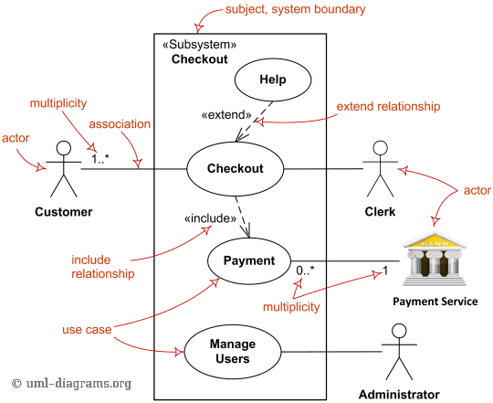
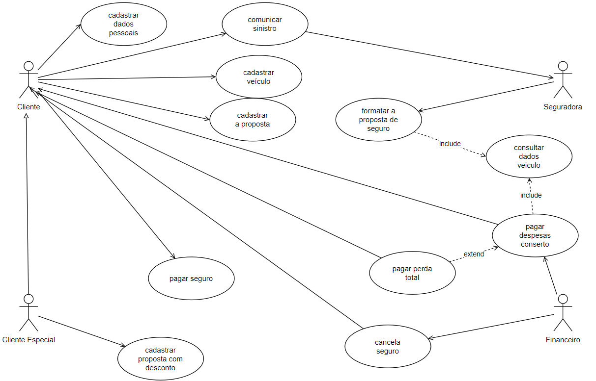
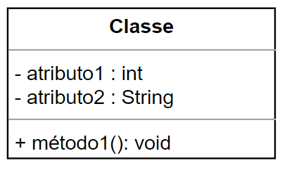
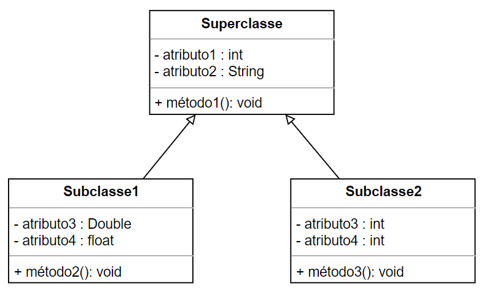
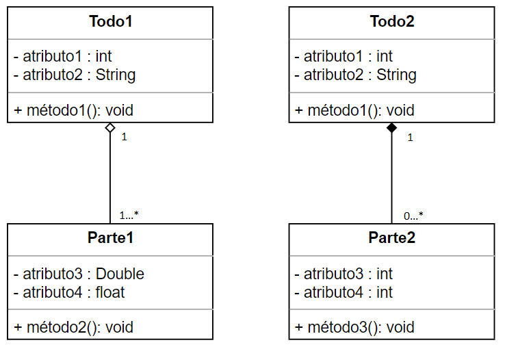

# Engenharia de Requisitos

## Aviso

Essa matéria irá aprofundar o conteúdo que aprendemos na disciplina de [Fundamentos de Engenharia de Software](../02-primeiro-periodo/06-fundamentos-engenharia-software.md).

## Tipos e Elicitação de Requisitos de Software

### Características e Tipos de Requisitos

#### Conceitos e Características de Requisitos

Os **conceitos** são palavras dotadas de significados objetivos. Ao longo de todos os nossos estudos, nós, basicamente, estamos aumentando nosso repertório de conceitos e ligando conceitos novos aos que já aprendemos previamente. Desse modo, não é nenhuma novidade começar nosso estudo por meio da definição dos conceitos que vamos usar ao longo do microfundamento.

Chamamos de **Requisito** toda Característica que um produto deve possui para ser aceito. Dessa feita, podemos definir como **Engenharia de Requisitos**, o conjunto das técnicas usadas para levantamento, detalhamento e validação desses requisitos de um produto.

Ao tomarmos notas a respeito dos requisitos, precisaremos garantir que os mesmos tenham as seguintes Características:

  - **Completude** - Descrição integral da necessidade a ser atendida.
  - **Correção** - Descrição exata e associada ao software que será desenvolvido.
  - **Exequidade** - Um requisito de ser passível de execução.
  - **Prioridade** - Descrição do nível: Obrigatório, Desejável ou Opcional.
  - **Modificação** - Capacidade de alteração do requisito ao longo do processo.
  - **Verificabilidade** - Capacidade de se realizar testes que verifiquem se o requisito fora alcançado.
  - **Rastreabilidade** - Relação entre código e requisito de maneira clara e recíproca.

#### Tipos de Requisitos
Podemos separar os requisitos segundo a sua relação com a funcionalidade do software:

  - **Requisito Funcional** - É diretamente relacionado ao funcionamento do programa. Descreve uma função a ser desempenhada pelo produto com maior foco no negócio e não na tecnologia.
  - **Requisito Não Funcional** - É relacionado a tecnologia de desenvolvimento. Ele especifica/restringem o comportamento desejado do software.
    

      - Requisito de Desempenho - Especifica atributos como velocidade ou consumo de memória que o sistema deve ter.
      - Requisito de Confiabilidade - Especifica a taxa aceitável de falhas do sistema.
      - Requisito de Proteção - Relacionado a segurança do software.
      - Requisito de Usabilidade - Características desejadas de usabilidade.
    

### Elicitação de Requisitos de Software
#### Processos da Engenharia de Requisitos e Técnicas de Elicitação
**Elicitar** é o processo de extrair ou obter o máximo de informação possível para o conhecimento de um objeto desejado. Logo, **Elicitação de Requisitos** é o processo de extrair dos clientes as reais necessidades da demanda dele, ou seja, os requisitos da demanda. Além disso, a classificação desses requisitos nas categorias que aprendemos na seção passada.

Para se extrair essas informações podemos usar uma miríade de técnicas:

  - Entrevista - Com roteiro para as principais questões. Prioritariamente algo rápido e não cansativo. Pode ser individual ou em grupo.
  - Brainstorming - Reunião sem roteiro definido. A criatividade é o foco na construção de propostas de resolução de um determinado problema.
  - Questionário - Com perguntas fechadas ou abertas. Tem como vantagem a praticidade.
  - Protótipo - É indicado para situações onde o user não tem facilidade em se expressar. A elicitação é feita pela interação entre user e protótipo.
  - Etnografia - É a observação da realidade do cliente por um período.

Após as coletas de todas as informações, passamos para fase de **Estudo de Documentos** em que os dados serão convertidos em requisitos funcionais e não funcionais do projeto.
## Modelagem, Validação e Verificação de Requisitos
### Modelagem de Requisitos
#### Modelagem de Requisitos e Introdução à UML
A [**Unified Modeling Language (UML)**](https://www.uml.org) é uma linguagem de modelagem unificada. Surgida em 1997 como resultado de um esforço de várias empresas para a construção de um padrão para a modelagem de engenharia de software. Vale ressaltar que a UML não é uma metodologia e apenas uma maneira de expor processos de software.

A **Modelagem de Requisitos ou Análise de Requisitos** é a produção da lista de requisitos funcionais e não-funcionais para um projeto. Para padronização desses produtos, usamos a UML como linguagem de representação.

A UML possui 3 tipos de diagramas:

  - Diagrama de Estrutura - Foco na visão estática.
    

      - Diagrama de Classes
      - Diagrama de Pacotes
    

  - Diagrama de Comportamento - Foco na visão dinâmica.
    

      - Diagrama de Caso de Uso
    

  - Diagrama de Interação - Representação da comunicação entre objetos.

#### Modelagem de Casos de Uso UML
Como acabamos de ver, o diagrama de casos de uso é um tipo de diagrama de comportamento e, logicamente, tem foco no comportamento dinâmico entre as partes envolvidas no funcionamento do sistema.

O diagrama de casos de uso é geralmente o primeiro diagrama UML usado na fase de requisitos pois permite o detalhe dos requisitos funcionais na fase de elicitação. É importante notar que, por ter foco na interação entre as partes, esse tipo de diagrama **não** é usado para elicitação dos requisitos não-funcionais.

As partes integrantes do diagrama de casos de uso são:

  - **Atores** - São as representações da entidades que interagem com o sistema. Sejam elas seres humanos, sensores ou outros sistemas.
  - **Casos de Uso** - São as transações entre as partes.
  - **Relacionamentos** - Podem ser divididos em quatro tipos:
    

      - Associação - É o relacionamento mais comum. Representado por uma seta aberta (ou uma linha reta) que liga os atores aos casos de uso. Não pode ligar atores a atores ou casos de uso a casos de uso.
      - Generalização - Acontece quando há uma relação de herança entre elementos. Pode acontecer entre atores e atores e casos de uso e casos de uso.
      - Inclusão (Include) - São usados para representar rotinas comuns entre transações do sistema por meio do uso de uma seta pontilhada com a lable de include. Só ocorre entre casos de uso.
      - Exclusão (Extend) - É usada para indicar exceções. Tem a notação parecida com o include mas no lable está escrito exclude.
    

Abaixo temos um exemplo desse diagrama.

#### Práticas de Diagrama de Casos de Uso
Essa seção é um exercício proposto de construção de um diagrama de casos de uso. O problema proposto é:

O cliente cadastra os dados pessoais, depois do veículo e finalmente a proposta da seguradora.

Alguns clientes são da categoria "especial" do programa de fidelidade da seguradora e cadastram as propostas de seguros com desconto.

A seguradora formata a proposta baseada nos dados dos veículos cadastrados. Depois, os clientes pagam as prestações do seguro.

Caso haja inadimplência, a seguradora cancela o seguro. Comunicando o cliente.

Em caso de acidente, o cliente comunica o sinistro à seguradora. Ela paga as despesas do conserto. Em casos raros, a seguradora paga ao cliente o valor integral do veículo.

:::tip[Comentário] 
Antes de olhar como ficou. Tente fazer o diagrama sozinho. Uma boa ferramenta para isso é o [Lucidchart](https://www.lucidchart.com/pages/pt/landing?utm_source=google&utm_medium=cpc&utm_campaign=_chart_pt_allcountries_mixed_search_brand_exact_&km_CPC_CampaignId=1500131167&km_CPC_AdGroupID=59412156898&km_CPC_Keyword=lucid%20chart&km_CPC_MatchType=e&km_CPC_ExtensionID=&km_CPC_Network=g&km_CPC_AdPosition=&km_CPC_Creative=294337318271&km_CPC_TargetID=kwd-55720648523&km_CPC_Country=1001511&km_CPC_Device=c&km_CPC_placement=&km_CPC_target=&gclid=EAIaIQobChMIvub9rbam-gIVKClMCh0xyAyZEAAYASAAEgISVvD_BwE) ou o [Draw.io](https://app.diagrams.net/).
:::

Abaixo temos uma representação de caso de uso possível para o caso exemplo.

#### Modelagem de Classes UML
Começaremos a ver os diagramas de estrutura pelo Diagrama de Classes de UML. Seu objetivo é definir a estrutura estática de relacionamento entre classes.

Lá em programação modular nós aprendemos que uma classe é um conjunto de objetos com propriedades similares. Toda classe tem um nome e atributos que descrevem as suas propriedades. Além disso, possuem métodos que são as funções internas da classe.

:::tip[Comentário] 
Esse último parágrafo faz muito sentido para todos que já passaram pela matéria de programação modular. Se não for o seu caso, corre lá depois que terminar esse microfundamento.
:::

Também sabemos que classes podem ser relacionadas entre si pela relação de **herança** que é um dos pilares da programação orientada à objetos. No contexto da UML, podemos chamar essa relação de herança de **Generalização-Especialização**. A representação entre a superclasse e as classes filhas é feita com o uso de uma seta de ponta fechada onde a seta **sempre** sai da subclasse e aponta para a superclasse.

O outro modelo de relacionamento é a **agregação ou Estrutura Todo-Parte**. Nesse relacionamento não há herança, entretanto, existe alguma relação de pertinência de modo que cada parte é um elemento do todo. Possui a representação da **multiplicidade (1...*)** para indicar a quantidade de itens que o relacionamento suporta.

A agregação pode ser representada de dois modos. Na **Agregação Simples** usamos um losango em branco e indica que a parte possui vida além do todo[^1]. Por outro lado, na **Agregação por Composição**, usamos o losango preenchido para indicar que a parte não tem vida além do todo.

[^1]:Isso é um jeito estranho de dizer que a parte não está inteiramente contida no todo.

:::tip[Comentário] 
A ideia nessa dotação da multiplicidade é simples. Imagine que temos uma classe "Estoque" e uma classe "Produto". Uma vez que um estoque é justamente o todo dos produtos armazenados, é plenamente possível termos a relação entre essas classes. Podemos usar a relação de agregação para indicar esse caso. Quando ligamos as classes, nós indicamos quantos objetos são aceitos na relação. No nosso exemplo é possível termos um estoque de zero itens[^2] de cada produto, logo, a multiplicidade indicada será de `0...*` que deve ser lida como ``Podemos ter entre zero e n produtos no nos" estoque". 
:::

[^2]:Ou seja, é o caso onde não temos o produto estocado.

Para terminar essa seção, temos apenas mais uma relação a ser aprendida. Na **Associação**, também não temos relação de herança e também temos multiplicidade. A diferença está no fato que **não** existe relação de todo e parte, ou seja, o vínculo entre as classes é mais fraco.

Normalmente, a associação é indicada por uma linha reta entre as classes com as multiplicidades com asteriscos nos dois lados. Além disso, podemos ter uma classe `"endurada" entre a associação para indicar o modo.

#### Modelagem de Pacotes UML
Uma vez que tenhamos feito nossos diagrama de classes, temos um diagrama que é capaz de "empacotar" classes relacionadas. Esse diagrama recebe o nome de **Diagrama de Pacotes**. Tal qual o diagrama de classes, o diagrama de pacotes é um digrama estrutural da UML.

Não existe muita exatidão no processo de construção de pacotes. A ideia é que a associação entre classes faça sentido e, nessas horas, o bom senso é a nossa melhor ferramenta.

No geral, podemos elencar algumas regras para nos ajudar na criação de pacotes:

  - Deve ter duas ou mais classes
  - Nome genérico ou da classe mais importante
  - Representação na UML pelo ícone da uma pasta
  - Uma classe pode pertencer a mais de um pacote
  - Nenhuma classe deve ficar fora do diagrama de pacotes
  - Um pacote pode depender de outros pacotes
  - A dependência de pacotes é dada no UML pelo uso de uma seta pontilhada

### Validação e Verificação de Requisitos
#### Validação e Verificação de Requisitos
Uma vez que temos nosso sistema modelado, podemos nos perguntar se ``estamos construindo o pro"to certo". Chamamos de **validação** o trabalho de verificação da resposta a essa pergunta. Ou seja, estamos verificando a eficácia da nossa solução.

Do outro lado, dizemos que a **verificação** tem relação com a eficiência. Isso quer dizer que queremos saber se além de cumprir o objetivo, nossa solução o faz com a otilização dos recursos de maneira certa.

Para realizarmos essas duas verificações podemos fazer uso da **Revisão Técnica** que avalia esses aspectos por meio um time das partes envolvidas no processo para a busca das seguintes falhas:

  - erros no conteúdo\interpretação
  - informações faltantes
  - inconsistências
  - requisitos conflitantes\irreais

Para realizar essas verificações, podemos usar várias abordagens:

  - Inspeções de Código
  - Comandos de Banco de Dados
  - Análise dos Requisitos
  - Testes de Software

## Bibliografia
  - SOMMERVILLE, Ian. **Engenharia de Software**. São Paulo: Pearson, 2019.
  - BEZERRA, Eduardo. **Princípios de Análise e Projeto de Sistemas com UML**. São Paulo: Elsevier, 2006.
  -  PRESSMAN, Roger; MAXIM, Bruce. **Engenharia de Software**. São Paulo: Bookman, 2016.
  - LARMAN, Craig. **Utilizando UML e padrões: uma introdução á análise e ao projeto orientados a objetos e desenvolvimento iterativo**. 3. ed. Porto Alegre: Bookman, 2007. E-book (695 páginas) ISBN 9788577800476.
  - PAULA FILHO, Wilson de Pádua. **Engenharia de software**, v. 2 projetos e processos. 4. Rio de Janeiro LTC 2019 1 recurso online ISBN 9788521636748.
  - WAZLAWICK, Raul Sidnei. **Engenharia de software conceitos e práticas**. Rio de Janeiro GEN LTC 2013 1 recurso online ISBN 9788595156173.
  - GUEDES, Gilleanes. **UML 2 - Uma Abordagem Prática**. São Paulo: Novatec, 2018.
