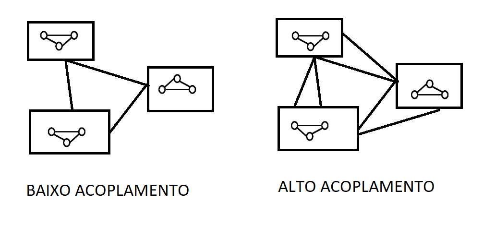

# Programação Modular

## Programação Orientada à Objetos
A essa altura já estamos cientes que podemos pensar em um algoritmo como uma sucessão de passos que finda na execução de um objetivo em tempo de processamento útil para um usuário. Antigamente, acreditava-se que todos os problemas poderiam ser expressos com o uso de apenas 3 estruturas de controle: comandos sequências, comandos de seleção (condicionais) e comandos de repetição (iterativos).

Nessa era, o foco estava apenas da completude do desafio proposto. A missão era resolver o problema por meio de um software.

Mas não demorou muito para as organizações perceberem que várias tarefas estavam presentes em diferentes problemas com apenas algumas alterações. Além disso, o custo e a complexidade dos problemas evolui e coisas como eficiência e padronização começaram a ficar mais relevantes no meio empresarial que já passava a se cristalizar em grandes corporações.

Para sanar essas necessidades, as linguagens de programação evoluíram e passaram a suportar abstrações como **funções** e **procedimentos**.

Podemos entender uma **função** como uma abstração de expressão que representam o mapeamento[^1] de entradas em um conjunto de resultado. O professor usa o exemplo da função fatorial:
$n! = n * (n-1)!$

[^1]:Esse conceito é visto no estudo das funções matemáticas.

Que pode ser escrito como uma função em c\#
```cs
using System;

class Calculo {
    public int fatorial(int n) {
        int res = 1;

        if (n == 0 || n == 1)
        {
            return res;
        } else if (n > 0)
        {
            return n * fatorial(n - 1);
        } else
        {
            return -1;
        }
    }
    static void Main(string[] args) {
        int valor = 4;
        int resultado;
        Calculo calc = new Calculo();
        resultado = calc.fatorial(valor);
        Console.WriteLine("{0}! = {1}", valor, resultado);
    }
}

```
:::tip[Comentário] 
Tudo que usamos nesse programa acima foi aprendido na parte 1 desse material com apenas 1 exceção. Pode ser que para algumas pessoas seja estranho que na definição da função fatorial se faça uso da própria função que está sendo criada. Chamamos esse recurso de **recursão** e é usado bastante como ferramenta de solução de problemas matemáticos formais. Aqui tem um [link](https://panda.ime.usp.br/pensepy/static/pensepy/12-Recursao/recursionsimple-ptbr.html) sobre essa técnica em linguagem de programação.
:::

Além do conceito de função, as linguagens também evoluíram para o uso de **procedimentos** que podem ser entendidos como a abstração de comandos. É a representação de um conjunto de passos que resolve um tarefa. Diferente das funções que possuem um retorno, um procedimento pode ou não ter um resultado visível.

```cs
using System;

class MainClass {
    private static void Tarefa1() {
        Console.Clear();
        Console.WriteLine("Executando tarefa 1");
        Console.ReadLine();
    }

    private static void Tarefa2() {
        Console.Clear();
        Console.WriteLine("Executando tarefa 2");
        Console.ReadLine();
    }

    private static bool MenuPrincipal() {
        Console.Clear();
        Console.WriteLine("Escolha uma opção:");
        Console.WriteLine("1. Tarefa 1\n2. Tarefa 2\n3. Sair");
        Console.Write("Opção: ");
        switch (Console.ReadLine()) {
            case "1":
                Tarefa1();
            case "2":
                Tarefa2();
            case "3":
                return false;
            default:
                return true;
        }
    }

    public static void Main (string[] args) {
        while (MenuPrincipal()) ;
    }
}

```
Nós aprendemos na parte 1 do material que um tipo abstrato de dado é a construção de uma classe que possui dentro de si a lógica de estruturas e métodos necessários para a construção de uma solução otimizada de software.

Desse modo, podemos pensar em um **Módulo**[^2] como um tipo abstrato de dados que consegue internalizar a lógica de implementação dos seus elementos de modo a permitir que apenas alguns dos seus elementos sejam manipulados.

[^2]:Usaremos muitas vezes esse conceito ao longo dessa matéria.

A vantagem de se encapsular a lógica é permitir que os arquivos de código se tornem mais legíveis porque toda a lógica das funções usadas está guardada nos arquivos de referência de cada módulo que foi carregado no começo do script, além disso, podemos desejar que certas partes do nosso código não estejam disponíveis para manipulação por parte do usuário. 

:::tip[Comentário] 
Já vimos um pouco sobre escopo quando trabalhos tipos abstratos de dados.
:::

```cs
using System;
using System.Collections.Generic;

public class Conta {
    private DateTime _criacao;
    private double _saldo = 0;

    public Conta(double saldoInicial, DateTime criacao) {
        _saldo = saldoInicial;
        _criacao = criacao;
    }

    public DateTime DataCriacao {
        get { return _criacao; }
    }

    public double Sacar(double quantia) {
        if (_saldo < quantia)
            throw new ArgumentException("Saque maior que saldo.","quantia");
        _saldo -= quantia;
        return quantia;
    }

    public void Depositar(double quantia) {
        if (quantia <= 0)
            throw new ArgumentException("Depósito deve ser positivo.","quantia");
        _saldo += quantia;
    }

    public double GetSaldo()
    {
        return _saldo;
    }
}

public class MainClass {
    public static void Main (string[] args) {
        Conta contaDoZe = new Conta(1200, Datetime.Now);
        Console.WriteLine("Saldo da Conta: {0:C2}", contaDoZe.GetSaldo());
        double quantia = 212;
        Console.WriteLine("Sacar {0:C2} da conta.",quantia);
        contaDoZe.Sacar(quantia);
        Console.WriteLine("Saldo na conta: {0:C2}",contaDoZe.GetSaldo());
    }
}

```

:::tip[Comentário] 
Se alguns de vocês tiveram dúvidas na linha onde o objeto `ContaDoZe` é criado pela passagem de dois parâmetros `Conta(1200,DateTime.Now)` é porque vocês se esqueceram do que aprendemos sobre **construtores**.
:::

**Programação Orientada à Objetos**

Criado em 1967 por Alan Kay, o paradigma da programação orientada à objetos propõe uma mudança no modo de entendermos como um software é construído. A novidade foi a proposição de módulos independentes que não compartilham dados mas são capazes de se comunicarem (como se fossem células). O que permite o reaproveitamento de soluções e o acoplamento de diferentes objetos para a criação de ferramentas complexas e, ainda assim, cuja manutenção era mais fácil.


Claro que existem novos riscos associados à mudança do paradigma. Por exemplo, chamamos de alto acoplamento a situação onde os módulos de um sistema são muito interdependentes e podem, com a falha crítica em algum deles, desencadear uma quebra generalizada na aplicação. Temos que focar sempre em soluções de baixo acoplamento.

Podemos ver como os conceitos vão evoluindo gradualmente. Primeiro aprendemos sobre estruturas de dados nativas. Depois aprendemos como criar nossas próprias estruras de dados. Em seguida, aprendemos sobre tipos abstratos de dados com classes e estruturas. Finalmente, agora vemos como esses conceitos foram usados para a construção de um paradigma novo de desenvolvimento denominado programação orientada à objetos.

### Fatores de Qualidade de Software
Várias vezes ao longo do material nós usamos termos como "software de qualidade" ou "programas bem construídos" ou alguma ideia similar. Agora, vamos definir mais claramente quais características uma solução de software precisa ter para ser digna de tal chancela.

A norma que rege esse consenso aplicado no mercado atualmente é a [ISO/IEC 25010](https://iso25000.com/index.php/en/iso-25000-standards/iso-25010). Essa norma divide os fatores de qualidade de um produto em 8 fatores de qualidade:


- Funcionalidade
- Desempenho
- Compatibilidade
- Usabilidade
- Confiabilidade
- Segurança
- Manutenibilidade
- Portabilidade


Como podemos ver, são vários critérios que são usados no trabalho de avaliação de uma solução. Além dessa classificação, podemos elencar os fatores em 2 grupos: fatores externos (relacionados com a dinâmica de interação dos usuários) e fatores internos (relacionados a dinâmica dos programadores com a aplicação).

Mesmo sabendo que todos os fatores são importantes, como estamos estudando esse conteúdo sob a perspectiva da programação modular, vamos nos ater apenas aos fatores que são impactados pela decisão de um projeto modular de aplicação.

#### Fatores Externos
No que tange à experiência do usuário, podemos destacar algumas características que toda solução deve apresentar para ser considerada de qualidade.

**Correção:** O sistema deve executar a atividade que foi previamente definida como objetivo para sua construção. Isso garante que ele funcionará como o previsto.

**Robustez:** O sistema deve funcionar mesmo em condições anormais. Essa características está bastante relacionada à capacidade de lidar com erros e situações não previstas anteriormente pelo desenvolvimento.

Quando um sistema é bem construído, mesmo em situações de impossibilidade de funcionamento (como a ausência de internet em um sistema web) existem diferentes modos de lidar com essa limitação imposta ao funcionamento da aplicação. Um conceito que vale a pena aprendermos é o [**graceful degradation**](https://www.techtarget.com/searchnetworking/definition/graceful-degradation). 

**Adaptação a Novas Situações**

O desenvolvimento ágil trouxe várias mudanças de postura no planejamento e execução de um projeto de tecnologia. Como agora não é necessário saber todas as características do produto final, existe a possibilidade de novas funções e ferramentas surgirem ao longo do processo de criação inicialmente planejado.

Para se atender as demandas geradas por esse paradigma, os produtos gerados a cada etapa deve ter as seguintes propriedades:

**Extensabilidade:** O sistema deve se adaptar a mudanças na sua especificação.

**Reusabiliadde:** O sistema de ter módulos que podem ser aproveitadas em outras soluções. Permitindo uma maior produtividade e celeridade do processe de desenvolvimento.

**Compatibilidade:** O sistema deve ter partes que são capazes de se comunicar entre si e com outros sistemas. Nesse contexto que os padrões de desenvolvimento e protocolos são tão relevantes.

**Desempenho**

Uma características muitíssimo relevante, principalmente em projetos escaláveis é a eficiência. Fazer bom uso do hardware economiza custos para o cliente e é uma das qualidades mais desejadas para empresas de grande monta.

Sempre devemos ter em mente que haverá um trade-off entre a capacidade de resolução dos problemas propostos e o consumo de poder de processamento disponível no momento. Um sistema deve fazer o que é desejado da melhor maneira possível.

No escopo da programação modular, como os módulos são autocontidos, no contexto de sistema muito complexos haverá, muito provavelmente, uma preferência pela correção e robustez (que garantem o resultado esperado) em detrimento da eficiência (que garante a otimização do uso dos recursos).

#### Fatores Internos
Os fatores internos de qualidade de um software são aqueles relacionados às características percebidas pelos desenvolvedores e profissionais que farão a manutenção do programa.

Os principais fatores internos de qualidade de software são:


- Legibilidade
- Manutenibilidade
- Modularidade


A Legibilidade pode ser entendia em dois componentes: **inteligibilidade** que é a facilidade de se entender a lógica implementada naquele código e a **legibilidade** que é a construção de códigos de maneira a facilitar a identificação dos tokens e operadores usados.

Pensando na necessidade de se padronizar o uso de estilo das linguagens de programação é que surgem os **Coding Standards** que padronizam várias práticas para tornar a legibilidade das linguagens mais eficiente no seu meio de uso. Um bom programador sempre está com os padrões das linguagens que utiliza em dia.

A Manutenibilidade é a facilidade de se modificar e corrigir problemas encontrados na solução. Em uma estrutura modular é comum ter que identificar qual módulo está apresentando problemas e prosseguir com a correção da lógica que está gerando o problema.

A Modularidade é relacionada a divisão do sistema. Um módulo encapsula a lógica de uma determinada ação do sistema e torna o gerenciamento da solução mais eficiente porque divide em vários arquivos menores o que antigamente ficaria em um único arquivo texto de difícil entendimento. Esse fator é regido por dois pressupostos essenciais: princípio da unidade funcional (uma função por módulo) e coesão (cada módulo tem tudo que precisa para implementar a sua função).
### Classes e Objetos
#### Atributos e Métodos
Finalmente temos todos os conceitos necessários para aprendermos como programar usando o paradigma orientado à objetos. A principal postura que devemos ter é a de procurar abstrair o mundo real em objetos que são entidades autocontidas que possuem 3 características:


- Estado
- Comportamento
- Identidade


Chamamos de **Classe** a coleção de objetos que compartilham as mesmas propriedades e comportamentos.

Agora vamos relembrar o que já aprendemos lá em Algoritmos e Abstração de dados.

Podemos definir uma classe em c\# para um tipo de produto qualquer do seguinte modo:

```cs
class Produto {
    public string descricao;
    public float preco;
    public int quantidade;
    public bool emEstoque()
    {
        return (quantidade > 0);
    }
}

```
A diferença agora é que sabemos o que é uma classe do ponto de vista dos conceitos de programação orientada à objetos.

**Semântica de Referência**

Um objeto é uma instância[^3] de uma classe que possui um **nome** e uma **posição** na memória.

[^3]:Uma das definições da palavra instância no contexto da ciência da computação é justamente "um objeto cujo comportamento e estado são definidos por uma classe".

Uma classe pode ter várias instâncias de objetos[^4].

[^4]:Só prossiga quando essa frase tiver pleno sentido na sua mente.

Em c\# primeiro fazemos uma referência ao objeto para, depois, criarmos ele efetivamente usando o token `new`. Isso ocorre na mesma linha de código.

```cs
class MainClass {
    public static void Main(string[] args) {
        Produto produto = new Produto();
        produto.descricao = "Cafe";
        produto.preco = 1.99;
        produto.quantidade = 100;
        Console.WriteLine("Em estoque: {0}",
        produto.emEstoque() ? "sim" : "não")
    };
}

```
Na parte `Produto produto` estamos fazendo apenas a **referência** à classe mas o objeto ainda não foi alocado na memória. Inicialmente o objeto `produto` é `null`.

Logo após a referência usamos o token `new` para, ai sim, criar um endereço na memória que onde o objeto será criado.

:::tip[Comentário] 
Se você ainda está com dúvidas sobre o que esse objeto criado fará, recomendamos fortemente os fundamentos da etapa 1.
:::

#### Construtores
Começamos a ver esse assunto no período 1 do curso. Vale a pena relembrar antes de continuar essa seção.

Como vimos antes, o comando `Produto produto = new Produto();` faz a referência ao objeto e logo após cria um endereço na memória para ele.

Algumas linguagens possuem uma ferramenta automática de gestão de memória chamada **Coletor de lixo** ou **Garbage Collector** que é responsável pela exclusão de itens não usados durante a execução de um programa. Para nossa alegria, o c\# possui essa ferramenta. Mais sobre esse conceito pode ser encontrado nesse [link](https://en.wikipedia.org/wiki/Garbage_collection_(computer_science)#:~:text=The%20garbage%20collector%20attempts%20to,manual%20memory%20management%20in%20Lisp.).

Por causa dessa característica da linguagem, no caso do objeto `produto` que criamos anteriormente, recebe alguns valores padrões no momento da sua criação. Se a variável for numérica, recebe o valor 0 e para as strings é passado o valor null. Desse modo, nosso objeto foi salvo no momento da sua criação com os seguintes valores:


    Descrição: null
    Preço: 0.0
    Quantidade: 0


Para garantir a correta utilização de um objeto criado, devemos nos valer da capacidade de definir valores no mesmo momento em que estamos criando um novo objeto. Já sabemos que esse conceito recebe o nome de **construtor**. Também sabemos que, em c\#, um construtor é criado do mesmo modo de um método, a única diferença é que ele deve receber o **mesmo nome** do objeto e que não possuem valores de retorno. O número de construtores que um objeto pode receber é ilimitado.

Como vimos antes, um objeto sempre terá um construtor. Se não o declararmos, então o próprio c\# se encarrega de definir quais serão os valores recebidos. De outro modo, se nós definirmos explicitamente um construtor no objeto, o compilador do c\# sempre respeitará os valores que definimos no construtor.

**Razões Para se Utilizar Construtores Especializados**


- Alguns objetos possuem regras de estado válido que não comportam os dois tipos de valores do construtor default do c\# (que só atribui 0 ou null);
- Alguns objetos usam a data corrente como carimbo de tempo (timestamp) que pode ser definida por meio do construtor que recebe a hora do sistema;
- Em objetos muito complexos, o volume de atributos pode ser muito elevado e, se não amarrados corretamente, pode haver algum equívoco por parte do usuário na hora de definir todos os valores corretos. Um construtor garante que, pelo menos na sua criação, o objeto terá um estado inicial válido para ser preenchido.


**Construtores na Classe de Produto**

Voltaremos à nossa classe de objeto chamada de Produto para definirmos os seus construtores.
```cs
class Produto {
    public string descricao;
    public float preco;
    public int quantidade;

    // construtor que recebe parametros
    public Produto(string descricao, float preco, int quantidade) {
        if (descricao.Length >= 3)
            this.descricao = descricao;
        if (preco > 0)
            this.preco = preco;
        if (quantidade >=0)
            this.quantidade = quantidade;
    }

    // novo construtor default
    public Produto() {
        this.descricao = "Novo Produto";
        this.preco = 0.01F;
        this.quantidade = 0;
    }

    public bool emEstoque() {
        return (quantidade > 0);
    }
}

```
:::tip[Comentário] 
O objeto `this` é um token que faz referência ao escopo onde se encontra. No caso em tela, ele se refere ao objeto sendo criado e não ao método onde está sendo usado. Essa parte de tokens de referência de escopo é um pouco confusa a primeira vista mas com o tempo é possível entender melhor.
:::

Dessa maneira, nossa nova classe melhorada de objeto chamado Produto recebe dois tipos de construção. Podemos criar um objeto de produto com ou sem parâmetros.
```cs
// Caso sem passagem de parâmetros
Produto produto1 = new Produto();
// Caso com passagem de parâmetros
Produto produto2 = new Produto("café", 1.50F, 12);

```
#### Atributos Estáticos e Propriedades
**Membros Estáticos**

Antes de definirmos o que seria um membro estático, temos que formalizar o conceito de escopo. Podemos definir **escopo** como a região do código onde a variável pode ser acessada. Outra maneira de pensarmos esse conceito é a região do código onde a variável é visível pelo programa.

Podemos criar métodos e atributos que serão comuns a todos os objetos que tenham referência a eles na sua construção. Até agora, todos os métodos e atributos que tivemos nos nossos objetos foram criados **dentro** dos próprios objetos e, portanto, são salvos em diferentes endereços de memória a medida que novos objetos são criados ao longo do programa.

Pois bem, um **membro estático** é exatamente esse método ou atributo que são criados em escopo global e "inseridos" dentro dos nossos objetos por meio da referência a esse membro na classe que criará os objetos. Eles são muito úteis para implementação de **contadores** ou **identificadores de auto-incremento**. O termo "estático" é uma alusão ao fato que esses construtos são alocados no momento que a classe é carregada na memória e não variam o seu endereço ao longo de todo o programa, ou seja, eles existem antes mesmo de declararmos o primeiro objeto da classe criada.

Em c\# usamos o token `static` para a declaração de um membro estático.

**Exemplo de Contador Auto-incremento**

Como agora temos um endereço na memória que todos os objetos podem fazer referência, podemos criar um contador que adiciona o valor 1 sempre que um novo objeto (ou instância) da classe for criada.

```cs
class Produto {
    public int id; // novo atributo de identificação
    public string descricao;
    public float preco;
    public int quantidade;

    // referencia ao membro estático
    public static int contador;

    // construtor que recebe parâmetros
    public Produto(string descricao, float preco, int quantidade) {
        this.id = ++Produto.contador;
        if (descricao.Length >= 3)
            this.descricao = descricao;
        if (preco > 0)
            this.preco = preco;
        if (quantidade >=0)
            this.quantidade = quantidade;
    }

    // novo construtor default
    public Produto() {
        this.id = ++Produto.contador;
        this.descricao = "Novo Produto";
        this.preco = 0.01F;
        this.quantidade = 0;
    }

    public bool emEstoque() {
        return (quantidade > 0);
    }
}

```
Podemos ver que, como o contador é um membro estático da classe, para acessar o seu valor temos que fazer referência à classe e não ao objeto.

A essa altura, alguns de vocês já devem ter percebido que toda aplicação c\# está dentro de uma classe chamada `MainClass`. Com o nosso novo conhecimento de membro estático, podemos ver que o termo `public static void Main` possui 4 elementos dos quais nós já conhecemos o significado de 3:


- O termo `public` faz referência ao escopo de acesso;
- O termo `static` faz referência ào conceito que acabamos de aprender de membro estático;
- `Main` é apenas um nome dado ao método da classe `Mainclass`.


Basta aprendermos o significado do termo `void` e entenderemos como e porquê os programas em c\# usam essa estrutura para funcionar corretamente.

Outra coisa que podemos perceber é que, pelo fato do método `Main` estar dentro de uma classe, se ele não fosse um membro estático, ele só seria executado na instanciação de um objeto. O problema é que esse objeto é justamente a aplicação. Ou seja, para o objeto Main ser instanciado precisaríamos de uma aplicação mas é justamente o objeto Main que contém a nossa aplicação. Por isso temos que usar o conceito de membro estático e que é disparado no momento em que a classe é carregada no nosso código.

#### Destrutores
Já começamos a entender o que são destrutores lá no microfundamento de algoritmo de lógica. Recapitulando o que já sabemos, um **destrutor** é parecido com o construtor mas é ativado no momento em que a instância da classe é destruída pelo garbage collector no momento em que o objeto não é mais acessível a nenhuma parte do programa.

O coletor de lixo é executado em paralelo ao programa em uma thread separada do processador. Ele é executado esporadicamente e tem como missão liberar os espaços em memória sempre que identificar informações em memória que não são usadas ao longo da execução do programa por meio da busca de referência das mesmas. Mesmo não sendo o ideal, é possível forçar o .NET (que é o [framework](https://www.lewagon.com/pt-BR/blog/o-que-e-framework#:~:text=Framework%20%C3%A9%20um%20termo%20ingl%C3%AAs,de%20um%20projeto%20de%20desenvolvimento.) mais famoso de c\#) a executar o garbage collector por meio do comando `GC.Collect();`.

Por padrão, todo objeto em c\# tem um destrutor nativo que tem como única atividade a liberação do espaço alocado em memória. Mas assim como acontece com os construtores, podemos definir alguma rotina a ser executada no momento da sua exclusão por meio da definição explícita. A regra de definição é parecida com a do construtor com a única diferença de colocarmos um til como primeiro caractere. No nosso exemplo, o destrutor será `~Produto()`.

```cs
class Produto {
    public int id; // novo atributo de identificacao
    public string descricao;
    public float preco;
    public int quantidade;

    // referencia aos membros estaticos
    public static int contador;
    public static int instancias = 0;

    // construtor que recebe parametros
    public Produto(string descricao, float preco, int quantidade) {
        this.id = ++Produto.contador;
        this.instancias = ++Produto.instancias;
        if (descricao.Length >= 3)
            this.descricao = descricao;
        if (preco > 0)
            this.preco = preco;
        if (quantidade >=0)
            this.quantidade = quantidade;
    }

    // novo construtor default
    public Produto() {
        this.id = ++Produto.contador;
        this.instancias = ++Produto.instancias;
        this.descricao = "Novo Produto";
        this.preco = 0.01F;
        this.quantidade = 0;
    }

    public bool emEstoque() {
        return (quantidade > 0);
    }

    // destrutor
    ~Produto() {
        Console.WriteLine("Adeus, mundo cruel!");
        this.instancias = Produto.instancias--;
    }
}

```
:::tip[Comentário] 
Reflita sobre esse código acima. Não devemos ter nenhuma dúvida sobre todos os elementos da construção dessa classe chamada `Produto`. Sempre retorne e revise os tópicos anteriores até que tudo tenha sentido.
:::

### Encapsulamento
Alguns assuntos podem parecer repetidos. Mas aprofundaremos mais a discussão em relação ao que já aprendemos na primeira parte desse material.

#### Princípio da Ocultação da Informação
Podemos definir o princípio da ocultação como sendo:


"Toda informação a respeito de um módulo deve ser privativa do módulo, exceto se for explicitamente declarada como pública."


David Parnas introduziu esse conceito em meados de 1972. No seu [paper](https://cseweb.ucsd.edu/~wgg/CSE218/Parnas-IFIP71-information-distribution.PDF) temos a seguinte citação em tradução livre:"[...] A documentação dos sistema que torna todas as informações acessíveis a todos os trabalhadores do projeto é discutida. A tese que essa informações deve ser 'pública' é temerária porque, na maioria dos casos, é útil que a informação sobre o sistema esteja escondida da maioria dos programadores [...]".

**Interface**

Podemos definir a interface de uma aplicação de software como:


"Tudo aquilo que o usuário do objeto vê e acessa."


Podemos ver que esse conceito de "usuário" serve tanto para o usuário da aplicação quanto para outros programadores que usarão algum objeto de uma classe que criamos anteriormente nos nossos módulos.

No contexto do princípio da ocultação da informação, temos que pensar em interfaces que demonstrem apenas os aspectos estáveis da solução. Tudo que for dinâmico são do escopo da implementação.

Um módulo pode ocultar informações como, por exemplo, Algoritmos e Representação de Dados.

A interface pode ser divida em duas partes:


- Assinatura - Nomes e Tipos de informações sobre as funções do módulo
- Especificação - Descrição sobre o significado e funcionamento dessas funções


:::tip[Comentário] 
Essa seção será expandida em tempo oportuno porque esse assunto é muito vasto para pararmos apenas nesses conceitos básicos.
:::

**Encapsulamento**

Um módulo deve ter um conjunto de comandos e a especificação desses comandos, já vimos que essa parte pode ser chamada de **interface** do módulo. O conceito de encapsulamento é derivado do princípio da ocultação da informação no sentido que todo módulo pode receber (e normalmente recebe) atualizações na sua parte de **implementação** sem que haja mudanças visíveis na camada de interface.

Dizemos que os **atributos** dos módulos são protegidos pelo encapsulamento porque ficam restritos apenas à camada interna não acessível a todos. Quando queremos um input de dados do usuário damos sempre preferência aos **métodos** do nosso objeto porque dessa maneira podemos validar os dados inseridos.

Além dessa capacidade de manutenção na camada de implementação, o encapsulamento permite a proteção da lógica da regra de negócio para a construção das classes. No exemplo do produto, podemos encapsular a variável quantidade por meio do acesso mediante apenas a um método pre-definido. Isso nos dá a certeza que um usuário não poderá inserir valores da maneira inadvertida que possam gerar resultados imprevistos no nosso sistema.

Um conceito relevante que podemos destacar é chamado de **encapsulamento e princípio da caixa preta**. Que pode ser resumido como:


"Um módulo deve consistir de um conjunto de comandos com uma função bem definida e o mais independente possível em relação ao resto do sistema."


Existem outras características relevantes na construção dos módulos que devemos observar:


- Independência Funcional - Cada módulo é responsável por uma função específica e bem definida;
- Coesão - Todas as partes de um módulo devem estar logicamente ligadas às outras. Assim como um sistema deve ter módulos logicamente relacionados;
- Acoplamento - Relação de dependência entre os módulos de um sistema. O ideal é um baixo nível de acoplamento




Na imagem acima, cada caixa é uma módulo que possui relações internas (que devem ser coesas). Um alto acoplamento é aquele que permite muitas conexões entre os módulos de modo a, em caso de falha em um dos nós da rede, existir um risco de efeito cascata em caso de falha.

#### Modificadores de Acesso
O princípio da ocultação da informação é aplicado por meio do **encapsulamento**. O c\# e outras linguagens modernas permitem que controlemos o nível de visibilidade dos membros de uma classe de forma a ocultarmos todos os dados e métodos que precisarmos para garantir o cumprimento da tarefa com todos aqueles requisitos de qualidade de software alcançados.

Em c\# existem 3 níveis de acesso aos atributos e métodos que podemos usar na criação de um módulo[^5]:

[^5]:Que também podemos chamar de classe.

- `private` - Acesso apenas na própria classe;
- `protected` - Acesso permitido na própria classe e em suas subclasses (ou classes filhas);
- `public` - Acesso em qualquer parte do programa


:::tip[Comentário] 
Por default, o c\# atribui o nível privado quando nenhum modificador de acesso é atribuído explicitamente. Mas é sempre uma boa prática tornar os acessos sempre explicitamente visíveis no código, mesmo quando eles são privados.
:::

Voltando à nossa classe Produto. O ideal seria manter todos os atributos privados com apenas os construtores e o método de checagem de estoque acessíveis ao usuário.
```cs
class Produto {
    private int id; // novo atributo de identificacao
    private string descricao;
    private float preco;
    private int quantidade;

    // referencia aos membros estaticos
    private static int contador;
    private static int instancias = 0;

    // construtor que recebe parametros
    public Produto(string descricao, float preco, int quantidade) {
        this.id = ++Produto.contador;
        this.instancias = ++Produto.instancias;
        if (descricao.Length >= 3)
            this.descricao = descricao;
        if (preco > 0)
            this.preco = preco;
        if (quantidade >=0)
            this.quantidade = quantidade;
    }

    // novo construtor default
    public Produto() {
        this.id = ++Produto.contador;
        this.instancias = ++Produto.instancias;
        this.descricao = "Novo Produto";
        this.preco = 0.01F;
        this.quantidade = 0;
    }

    public bool emEstoque() {
        return (quantidade > 0);
    }

    // destrutor
    ~Produto() {
        Console.WriteLine("Adeus, mundo cruel!");
        this.instancias = Produto.instancias--;
    }
}

```
**Regras de Encapsulamento**

Para facilitar a internalização do princípio da ocultação da informação. Podemos elencar algumas regras de bolso para serem usadas sempre que uma dúvida a respeito desse tema aparecer:


- Sempre opte pelo nível de acesso mais restrito que faça sentido para cada membro[^6] da classe;
- Use `private` a menos que haja uma boa razão para o contrário;
- Use `public` apenas para constantes

[^6]:Ou seja, atributo ou método da classe.

:::tip[Comentário] 
Os pontos 1 e 2 são praticamente a mesma coisa na minha visão. A lógica do ponto 3 é que quanto mais membros de classe públicos, maior é a chance que outros módulos façam uso deles, desse modo, o risco de um alto acoplamento se torna cada vez maior.
:::

#### Métodos de Acesso e Propriedades
O princípio da ocultação da informação não nos impede de ter acesso aos atributos. Nós apenas nos certificamos que eles serão seguramente acessados por meios dos métodos que deixaremos disponíveis para interação.

Chamamos de **métodos de acesso** os meios criados para permitir que os usuários tenham capacidade de acessar da maneira desejada as informações contidas nos atributos dos nossos objetos. Desse modo, temos a confiança que os valores atribuídos aos atributos dos nossos objetos sempre obedecerão às regras definidas nos seus métodos públicos.

:::tip[Comentário] 
Já iniciamos esse assunto anteriormente no nosso material.
:::

**Métodos get (leitura):** É capaz de acessar um valor de atributo privado.

**Métodos set (escrita):** É capaz de atribuir valor a um atributo privado.

Até o momento, a nossa classe (que também chamamos de módulo) está criada de maneira que ainda não podemos ter acesso a seus atributos propriamente.

Uma maneira de criar um método de acesso get para o nosso atributo de preço pode ser:

```cs
    [...]
    private float preco;
    [...]
    
    // método de acesso get para atributo preco
    public float GetPreco() {
    return preco;
    }
    [...]

```

Podemos ir um pouco além de criar um método de acesso set da seguinte maneira:

```cs
    [...]
    private float preco;
    [...]
    
    // método de acesso set para o atributo preco
    public void SetPreco(float preco) {
    if (preco > 0)
    {
        this.preco = preco;
    }
    }
    [...]

```
Desse modo, criamos a leitura e a escrita do atributo intermediados pelos métodos que nos permitem controlar as características do input realizado e, assim, nos dar segurança que nossa aplicação se comportará da maneira desejada.

**Propriedades**

Podemos melhorar ainda mais a legibilidade do nosso código por meio do uso das propriedades nativas dos atributos de um módulo. Podemos definir uma **propriedade** como um tipo especial de atributo que possui métodos associados a ele.

Temos 3 métodos que podem nos conferir mais clareza no código e alcançar o mesmo resultado que nossos códigos anteriores:


- `init` - Atribui o valor inicial ao atributo da classe;
- `set` - Atualiza o valor de um atributo;
- `get` - Retorna o valor atual de um atributo


Reescrevendo nossos métodos de acesso à propriedade de preço, temos que:
```cs
    [...]
    private float preco;
    [...]

    // criando a propriedade Preco
    public float Preco {
        get { return preco; }

        // outra maneira de sintaxe para o get:
        // get => this.preco
        set { if (value > 0) preco = value; }
    }

    // criando a propriedade Preco2 sem nenhum verificador
    public float Preco { get; set; }

```
O parâmetro `value` é passado junto ao método set para atualização dos valores dos atributos.

Mais informações sobre as propriedades podem ser encontradas nesse [link](https://docs.microsoft.com/pt-br/dotnet/csharp/language-reference/keywords/get).

#### Namespaces e Partial Classes

##### Namespaces

Já entendemos que um módulo deve ser autocontido e com um propósito bem definido. Entretanto, isso não quer dizer que teremos, na construção de um sistema complexo, apenas 1 módulo que englobe toda a solução. Para tanto, quebramos as relações e tarefas em vários módulos diferentes sempre respeitando os princípios que aprendemos anteriormente sobre código de qualidade.

Agora que temos vários módulos, precisaremos de uma maneira de agrupa-los de maneira que faça sentido. É exatamente para isso que existe o conceito de **namespaces**. Com esse conceito, podemos criar uma lógica mais geral que englobe vários módulos.

Os namespaces são usados para a criação de bibliotecas de código e podem ser entendidos como um conjunto de classes.

Por convenção e organização lógica, sempre que tivermos a necessidade de criarmos um namespace, devemos salvar todas as classes contidas nele em arquivos separados e um arquivo de código por classe. Por exemplo, se nossa solução possui dois namespaces com uma classe em cada, criaremos duas pastas na raiz do nosso programa, sendo cada uma delas nomeada pelo seu respectivo namespace. Abaixo temos um exemplo de organização de arquivos.

```
    |- code/
    |- bin/
    |- namespace1/
    |------------ class1.cs
    |------------ class2.cs
    |-namespace2/
    |------------ class1.cs
    |------------ class2.cs
    |------------ class3.cs
    |- obj/
    |- Program.cs
```

Podemos ver que nosso programa tem como diretório raiz a pasta "code". Dentro dela temos o nosso arquivo de código principal `Program.cs`. Também podemos ver diversas classes separadas em cada pasta `namespace`. Isso nos permite uma manutenção mais simples a medida que nosso programa se torne cada vez mais complexo e refinado.

Do ponto de vista do código. Em c\# o `namespace` é declarado dentro das classes que estão dentro dele:

```cs
namespace Contabil
    {
    public class Juros {
        public float Valor { get; set; }
    }
}

```
Também podemos importar namespaces em outros módulos por meio do token `using`:

```cs
using Contabil;
class MainClass {
    public static void Main(string[] args) {
        Contabil.Juros jurosAReceber = new Contabil.Juros();
        jurosAReceber.Valor = 12345.23F;
        Console.WriteLine($"Juros a Receber: {jurosAReceber.Valor:C2}");
    }
}

```
Mesmo não sendo o ideal, outro problema que o namespace resolve é o de conflito de nomes de métodos ou classes. Nos exemplos acima, só usamos um namespace `Contabil` com uma classe chamada Juros. Entretanto, poderíamos, sem nenhum problema, termos criado outro namespace, `Financeiro` por exemplo, com uma classe chamada juros. Não teríamos problema de conflito de nomes porque na hora de instanciarmos as classes nós sempre fazemos referência ao namespace em que a classe se encontra.

**Partial Classes**

O recomendado hoje em dia é que uma classe deve ser implementada em um único arquivo[^7]. Mas, como tudo na vida, as vezes precisamos fazer concessões.

[^7]:Os manuais de qualidade de código ainda impõe um limite máximo de 100 linhas para essas implementações. Programador bom é programador que resolve o problema com **poucas** linhas de código.

É possível definirmos uma classe em mais de um arquivo. Chamamos esse tipo de classe de `partial class`. A ideia é facilitar a organização de classes muito grandes de maneis mais fácil para manutenção. Esse tipo de abordagem é especialmente relevante para programação frontend de interfaces gráficas porque a quantidade de código gerado pelo compilador é enorme.

Podemos atualizar nossa estrutura de pastas com uma partial class agora.

    |- code/
    |- bin/
    |- namespace1/
    |------------ class1.cs
    |------------ class2.cs
    |-namespace2/
    |------------ class1.cs
    |------------ class2.cs
    |------------ class3.cs
    |- partialClass1.cs
    |- partialClass2.cs
    |- obj/
    |- Program.cs

Desse modo podemos criar um "pedaço" da classe em cada arquivo separado. O código ficará assim:

```cs
// parte 1
public partial class ClasseParcial {
    public string tarefa { get; set; }
}

// parte 2
using System;
public partial class ClasseParcial {
    public void ExibeTarefa() {
        Console.WriteLine("Esu estou " + this.tarefa);
    }
}

```
No arquivo `Program.cs` teremos:

```cs
using System;
class MainClass {
    public static void Main(string[] args) {
        ClasseParcial classeParcial = new ClasseParcial();
        classeParcial.tarefa = "escrevendo";
        classeParcial.ExibeTarefa();
    }
}

```
A documentação oficial pode ser encontrada nesse [link](https://docs.microsoft.com/pt-br/dotnet/csharp/programming-guide/classes-and-structs/partial-classes-and-methods).

### Herança
#### Generalização e Especificação
Em todo processo de desenvolvimento é normal que a solução evolua com o passar do tempo e estruturas criadas anteriormente (como módulos) acabam evoluindo junto.

Nesse contexto é que surgem dois conceitos importantes para o nosso aprendizado: **Generalização** e **Especificação**.

Podemos entender como processo de **Generalização** a construção de uma classe genérica a partir da abstração de várias classes mais definidas. Como, por exemplo, ao desenvolvermos uma solução que tenha vários objetos relacionados à cada tipo de produto que um supermercado venda. Podemos procurar os elementos comuns em todas as classes de diferentes produtos e construir uma classe maior denominada ``produto". Chamamos esse caminho (de baixo pra cima) de bottom-up.

No caminho oposto, temos o processo de **Especificação**. Nessa lógica, podemos partir de uma classe maior e, pela necessidade, criamos subclasses que compartilham elementos comuns com essa classe mais geral. Como exemplo, podemos citar um sistema de gerenciamento de condomínio que pode ter a classe "bloco" onde vai receber todas as informações e métodos de cada bloco e, por demanda de informações mais detalhadas, passemos a criar classes menores chamadas "andar" ou "apartamento" que contém informações adicionais ao nosso objeto anterior. Esse caminho (de cima pra baixo) é chamado de top-down.

**Herança**

Na criação de uma classe através da generalização ou da especificação é que o conceito de **herança** é nascido. Como estamos criando classes em termos de outras pré-existentes, devemos descrever a relação entre essas diferentes classes.

No momento da definição da relação de herança podemos usar os vínculos do tipo "é um tipo de" ou "é um".

Quando criamos uma herança, o objeto mais geral é chamado de supertipo. Todos os subtipos desse objeto compartilham as características dele e recebem novas que não são atribuídas ao supertipo.

Podemos chamar os subtipos de **classes derivadas**, **classes filhas**, **subclasses** e etc. Por outro lado, as classes mais gerais podem ser chamadas de **classes base**, **superclasses** **classes pai** e etc.

Existem linguagens que permite que uma subclasse receba harança de diferentes superclasses. Chamamos isso de **herança múltipla** e, ao contrário do que pode parecer, não é uma ideia muito boa porque aumenta o risco de auto acoplamento. Para tanto, o c\# não permite herança múltipla.

**Exemplo de Herança em c\#**

Agora que aprendemos os conceitos, podemos aprender como criar essas relações usando a linguagem c\#. Partindo de uma superclasse chamada `Pessoa`, podemos criar as subclasses do seguinte modo:
```cs
// superclasse
class Pessoa {
    [...]
}

// subclasses
class Professor : Pessoa {
    [...]
}

class Aluno : Pessoa {
    [...]
}

```
Retomando nosso exemplo para o módulo `Produto`, podemos criar uma subclasse chamada `BemDeConsumo`:
```cs
using System;

class BemDeConsumo : Produto {
    private DateTime validade;
    public DateTime Validade {
        get => this.validade;
        set => this.validade =
        (value > DateTime.Now) ? value : DateTime.Now;
    }
}

class BemDuravel : Produto
{
    private in garantia;

    public int Validade {
        get => this.garantia;
        set => this.garantia = (value > 0) ? value : 6;
    }
}

```
:::tip[Comentário] 
Não se assustem pela mudança na maneira de escrever as propriedades `get` e `set`. Esse token `=>` é interpretado do mesmo jeito que o par de chaves vistos anteriormente.
:::

Ao usarmos essas subclasses no nosso programa, elas terão os mesmo atributos e métodos que a superclasse `Produto` que elaboramos durante todo esse capítulo.

:::tip[Comentário] 
Existe um princípio da programação orientada à objetos que prioria composição ao invés da herança. A ideia é que é melhor fazer as conexões entre classes de mesma hierarquia do que criar uma vasta linha entre superclasses e subclasses. Em tempo oportuno retomaremos essa discussão. Por enquanto segue esse [link](https://acervolima.com/favorecendo-a-composicao-em-vez-da-heranca-em-java-com-exemplos/#:~:text=Favorecer%20a%20composi%C3%A7%C3%A3o%20em%20vez,uma%20classe%20base%20ou%20pai.) com esse assunto.
:::

#### Construtores em Classes Filhas
Quando instaciamos um objeto a partir de uma classe filha, primeiro disparamos os construtores da classe pai para, depois, executarmos os construtores da subclasse.

Se a classe filha não indicar um construtor diferente, o c\# usa o construtor default da classe pai. Entretanto, é possível definir quais serão os atributos usados tanto no processo de construção herdados quanto nos nativos da subclasse. Para usarmos essa configuração de construção, passamos os parâmetros através do token `: base(atributos)`.

**Exemplo de Construtores em Classes Estendidas (Subclasses ou Classes Filhas)**

Para exemplo, usaremos as subclasses `BemDeConsumo` que já vimos nos exemplos passados.
```cs
using System;

class BemDeConsumo : Produto {
    private DateTime validade;

    public DateTime Validade {
        get => this.validade;
        set => this.validade =
        (validade > DateTime.Now) ? value : DateTime.Now;
    }

    public BemDeConsumo(string descricao, float preco, int quantidade,

    DateTime validade) : base(descricao, preco, quantidade) {
        this.validade = validade;
    }
}

```
No exemplo acima, o nosso construtor da classe filha receberá 4 parâmetros dos quais 3 (descrição, preço e quantidade) serão usados no processo do construtor da classe pai.

Construtores e encapsulamento são o primeiro passo para a garantia da correção e robustez de um sistema. Sempre que usarmos a herança, temos que nos valer dessas técnicas para melhorar a qualidade dos nossos programas.


## Polimorfismo e Princípios do Projeto Modular

### Polimorfismo de Inclusão

Nessa seção vamos aprender como reutilizar soluções de código por meio do uso de hierarquia entre classes. Esse tipo de "transformação" entre classes filhas e superclasses é chamado de 
**polimorfismo de inclusão**.

#### Sobreposição de Métodos (virtual e override)
Podemos conceder certas liberdades aos nossos objetos derivados de superclasses. Uma dessas liberdades é a capacidade de **sobreposição** ou **override** que é dada, quando queremos permitir que um atributo ou método tenha seu funcionamento modificado nas classes filhas mantendo-se o mesmo nome que o seu referente na classe pai. Usamos o token `virtual` na classe pai no momento da sua construção para permitir as sobreposições futuras.

Da mesma maneira que temos um token na classe pai, temos que usar o token `override` na classe filha para indicar a sobreposição de atributo ou método. Além de sobrescrever, podemos fazer uso do método original da superclasse por meio do token de referência `base`[^8].

[^8]:Ele vai funcionar parecido com o token de referência this, por exemplo, base.function().

Outra requisição obrigatória no processo de sobreposição é o uso do token `new` na hora da criação de um método ou atributo de mesmo nome na classe original. Abaixo temos um exemplo de como podemos expandir um método criado na classe origina por meio da sobreposição.

:::tip[Comentário] 
Até agora usamos várias vezes o token `void` e ainda não tivemos a satisfação de uma definição do que ele faz. O token `void` é usado na construção de **métodos sem retorno**, ou seja, funções que não possuem uma linha com o comando `return`. 
:::

```cs
using System;

class superClasse {
    public string str = "string original";

    // permitindo a sobrescrita por meio do token 'virtual'
    public virtual void mostra() {
        Console.WriteLine("Mostra original");
    }
}
class subClasse : superClasse {
    // criando uma variável 'str' na classe filha
    public new string str = "String nova";

    // override do método original
    public override void mostra() {
        Console.WriteLine("-------");
        base.mostra(); // função original
        Console.WriteLine("-------");
        Console.WriteLine("Mostra Estendida");
        Console.WriteLine("-------")
    }
}

```
**Polimorfismo Universão de Inclusão**

Os **três princípios básicos da programação orientada à objetos** são:


- Encapsulamento
- Herança
- Polimorfismo


Já sabemos o que são os dois primeiros. Sabemos que a herança nos permite reaproveitar códigos anteriores em novos contextos. Entretanto, é raro termos aplicações exatamente iguais às do momento em que as classes originais foram criadas. É precisamente nesse contexto que surge o nosso terceiro princípio da OOP.

O **Polimorfismo** nos permite "adaptar" ou sobrepor algumas característica originais trazidas pela herança nos objetos derivados de classes anteriormente cridas. Ele nos permite criar sobreposições de métodos derivados para o melhor aproveitamento e adaptação aos problemas novos.

Para a existência do polimorfismos são necessários três requisitos:


- Herança
- Sobreposição de Métodos
- Referência de uma superclasse que aponte para um objeto de uma subclasse (referência polimórfica)


Vamos a um exemplo de polimorfismo mas com o devido contexto. É natural pensar que um objeto contenha um método cuja saída seja uma string com as informações a respeito dele. Em c\# existem métodos nativos, ou seja, que existe por padrão em todos os objetos, cujo um deles é chamado `toString()` que retorna uma string com informações sobre o objeto.

:::tip[Comentário] 
Mais sobre esse assunto pode ser encontrado nessa [documentação oficial](https://docs.microsoft.com/pt-br/dotnet/api/system.object?view=net-6.0).
:::

Mas como esse método é nativo, normalmente ele só trás algumas poucas informações sobre os objetos. Pensando nos atributos de qualidade de software que aprendemos até agora, não faz sentido (ou não é indicado) criarmos um método novo que retorne uma string com informações das nossas classes instanciadas porque já temos um por default. Como podemos resolver o fato desse método nativo não ser suficientemente detalhado? Polimorfismo é a solução!

Agora vamos fazer uma mudança no comportamento do método nativo das classes em c\# toString().
```cs
class Produto {
    private int id;
    private string descricao;
    private float preco;
    private int quantidade;
    private DateTime fabricacao;
    private static int contador = 0;
    private static int instancia = 0;
    [...]

    public override string ToString() {
        return $"Produto {id}: {descricao}\n
        Preço : {preco:C2}\n
        Quant : {quantidade}\n
        Fabric: {fabricacao}";
    }
}

```
:::tip[Comentário] 
Mas espere um segundo. Temos um `override` em uma classe pai?! É isso mesmo! A razão disso é que **todas as classes** em c\# são, de certa maneira, classes filhas de uma classe mestre que contém todos os métodos padrões. Mesmo as classes pai.
:::

```cs
using System;
class BemDeConsumo : Produto {
    private DateTime validade;

    public DateTime Validade {
        get => this.validade;
        set => this.validade =
        (value > DateTime.Now) ? value : DateTime.Now;
    }

    // construtor
    public BemDeConsumo(string descricao, float preco, int quantidade,
    DateTime fabricacao, DateTime validade) : base(descricao, preco, quantidade, fabricacao)
    {
        this.valiade = validade;
    }

    public override string ToString()
    {
        return base.ToString() + $" validade : {validade}";
    }
}

```

:::tip[Comentário] 
Essa seção é bem densa e importante. Pare e reflita sobre os códigos que foram vistos aqui. Revise sempre que necessário.
:::

#### Classes Abstratas
Em c\# podemos definir métodos sem declarar as suas implementações, ou seja, reservamos os nomes mas não dizemos o que eles farão. Não é de se estranhar que esses métodos recebam a nomenclatura de **métodos abstratos**. Se uma classe possui um ou mais desses métodos ela é chamada de **classe abstrata** porque não contém tudo que é necessário para a construção de uma classe normal.

Como as classes abstratas são "incompletas", não podemos instanciar objetos com elas. Entretanto, podemos usar o que aprendemos de polimorfismo para "preencher" essas lacunas por meio das classes derivadas. Uma classe herdeira também herda os métodos da classe abstrata, sejam eles abstratos ou não.

Abaixo temos a criação de uma classe abstrata com um método abstrato. Percebam o uso do token `abstract` para esses casos.

```cs
// criacao da classe abstrata
abstract class Pai {
    // criacao do metodo abstrato
    public abstract string fazNadaAinda();
}

// classe filha
class Filha : Pai {
    public override string fazNadaAinda()
    {
        Console.WriteLine($"{Agora eu faço algo!}");
    }
}

```
Perceba que o método `fazNadaAinda` é apenas declarado sem qualquer construção da funcionalidade do mesmo. Se tentarmos instanciar essa classe, teremos um erro porque classes abstratas não podem ser instanciadas em objetos concretos. Mas podemos criar uma classe filha que dará o restante da lógica necessária a sua instanciação.

Abaixo temos um exemplo de um programa simples que conta até 10 com o uso de uma classe abstrata pai.

```cs
namespace Program {
    // classe abstrata
    public abstract class Pai {
        // método abstrato
        public abstract int fazNadaAinda();
    }
    // classe filha
    public class Filha : Pai {
        private int contador;
        public int Contador {
            get => this.contador;
            set => this.contador = value;
        }

        // método abstrato herdado
        public override int fazNadaAinda()
        {
            return contador = ++contador;
        }
    }
    // programa
    class MainClass {
        public static void Main(string[] args)
        {
        // instanciação da classe filha
        Filha objFilha = new Filha();

        // loop usando o método abstrato que agora possui definição
        while (objFilha.Contador < 10)
        Console.WriteLine($"{objFilha.fazNadaAinda()}");
        }
    }
}

```
##### Comparando Virtual e Abstract

Referente às classes:


- Classes não podem ser `virtual`
- Clases com algum elemeto declarado como `abstract` devem ser `abstract` também
- Classes abstratas não podem ser instanciadas


Referente aos membros das classes:


- Membros de classes criados com `virtual` podem ser criados na classe e sobrepostos pelas classes filhas
- Membros de classes criados com `abstract` **devem ser** implementados nas classes filhas por meio do token `override`


**Polimorfismo**

Volte nos 3 requisitos de existência do polimorfismo. Agora podemos ver que para a existência desse conceito, deve existir pelo menos duas classes de hierarquias diferentes em que exista algum grau de criação genérica na classe original que será definida na classe derivada.

Para a melhor fixação desse conteúdo, o professor nos dá um exemplo de **lista de figuras**: Considere que queremos implementar uma lista de figuras genérica capaz de armazenar diversos tipos de objetos geométricos. Cada objeto terá informações sobre coordenadas x e y; lado; cor e se possui ou não preenchimento. De posse dessas informações, podemos definir um método `desenhar()` que mostrará na tela uma representação visual da figura cadastrada. Entretanto, cada figura terá o seu conjunto próprio de características.

Esse é um caso ótimo para o polimorfismo.
```cs
using System.Drawing;

public abstract class Figura {
    public int X {get; set;}
    public int Y {get; set;}
    public int Lado {get; set;}
    public Color Cor {get; set;}
    public bool Preenchido {get; set;}
    public figura(int x, int y, int lado,

    Color cor, bool preenchido) {
        this.X = x;
        this.Y = y;
        this.Lado = lado;
        this.Cor = cor;
        this.Preenchido = preenchido;
    }

    // método abstrato
    public abstract void Desenha();
}

```
De posse dessa abstração chamada `Figura`, podemos estender esse conceito através do polimorfismo através da criação de classes filhas.
```cs
class Quadrado : figura {
    public Quadrado(int x, int y, int lado, Color cor, bool preenchido) : base(x, y, lado, cor, preenchido) {
        // como todos os parâmetros foram
        // usados no construtor base
        // aqui fica vazio
    }

    public override void Desenha()
    {
        Console.WriteLine($"Desenhando o Quadrdo")
    }
}

class Circulo : Figura {
public Circulo(int x, int y, int lado, Color cor, bool preenchido) : base(x, y, lado, cor, preenchido) {
        // como todos os parametros foram
        // usados no construtor base
        // aqui fica vazio
    }

    public override void Desenha()
    {
        Console.WriteLine($"Desenhando o Circulo")
    }
}

```
Nosso programa agora é capaz (hipoteticamente) de construir figuras que sejam quadrados e círculos. Vejam como usamos o polimorfismo para a construção dessa solução. Podemos criar 2 objetos do seguinte modo:

```cs
class MainClass {
    public static Figura[] figuras = new figura[10];
    public static int numfig = 0;

    public static void Main(string[] args) {
        figuras[numFig++] = new Quadrado(10,20,50,Color.Red, true);
        figuras[numFig++] = new Circulo(100,225,80,Color.Blue, false);

        for (int pos = 0; pos < numFig; pos++)
        {
        figuras[pos].Desenha();
        }
    }
}

```
:::tip[Comentário] 
Se ficou na dúvida, lembre-se do que aprendemos sobre **vetores** na disciplina de abstração de dados.
:::

#### Classes e Membros Selados (sealed)

Da mesma maneira que aprendemos como permitir o polimorfismo, o c\# também nos permite impedir que certas classes ou membros de classe sofram herança ou polimorfismo.

Para impedir que uma classe sofra hierarquia, basta defini-la com o token `sealed`. Isso automaticamente torna esse classe um classe final da hierarquia.

Quando o assunto é um membro de classe (atributo, método ou propriedade) a ideia é bem parecida. Basta usarmos o token `sealed` para impedir que outros programadores façam uma modificação em algum membro de classe que não temos a intenção que seja alterado por meio de um `override`.

Como exemplo, o professor da matéria nos dá um método de validação de usuário:
```cs
protected sealed bool validateUser()

```
Se não atribuirmos o selamento do método, é possível que algum programador mal intencionado possa modificar nosso método por algo como:
```cs
protected override bool validateUser()
{
return true;
}

```
Desse modo, nosso método de validação se tornou completamente inútil. Entretanto, da maneira que construímos, o programa do programador mal intencionado retornará um erro porque ele está tentando usar polimorfismo em um membro de classe selado.

Outra vantagem além da segurança é a performance. Como aquela classe não será mais hierarquizada, o compilador trabalhará com ela de um modo a não se preocupar com associações dinâmicas existentes em classes com polimorfismo.

**Comparando Private e Sealed**

Uma dúvida que pode surgir é a respeito da diferença prática entre usarmos o escopo `private` para controle de acesso e o `sealed` para controle de hierarquia.

Vamos aos comparativos:


- Private
    - Não podem ser declarados no namespace (apenas dentro de uma classe)
    - Não permitem instâncias
    - Acesso aos membros apenas no bloco de declaração

- Sealed
    - Podem ser declaradas no namespace
    - Permitem instanciamento (dependendo se for public, private ou protected)
    - Membros de instâncias podem ser acessados por meio dos seus objetos e métodos

Em uma análise básica, o private também é um tipo de controle. Mas o sealed permite que as classes ainda permitam que seus métodos sejam acessíveis às classes filhas sem que possam alterar seus membros e, no caso de uma classe selada, temos a vantagem de instanciamento e criação no namespace.

Abaixo temos um exemplo da implementação desses conceitos.
```cs
using System;
namespace ClassesSealed {
    class Extensivel {
        public virtual void Primeiro()
        {
            Console.WriteLine("Extensível: primeiro método.");
        }
        
        public virtual void Segundo()
        {
            Console.WriteLine("Extensível: segundo método.");
        }
    }

    // Aqui temos uma classe estendível com dois procedimentos que apenas imprimem saídas no 
    // terminal. Agora vamos acompanhar como podemos interagir com ela usando o token `sealed`. 

    // classe com membro selado
    class MembroSelado : Extensivel {
        public sealed override void Primeiro()
        {
            Console.WriteLine("Membro Selado: primeiro método.");
        }
    
        public override void Segundo()
        {
            Console.WriteLine("Membro Selado: segundo método.");
        }
    }

    // classe selada filha da classe de membros selados
    sealed class Selada : MembroSelado
    {
        // Tentativa de sobrepor um método selado
        // error: 'Selada.Primeiro()': cannot override inherited member 'MembroSelado.Primeiro()'
        protected override void Primeiro()
        {
            Console.WriteLine("Selada: primeiro método.");
        }
    
        // esse nao retorna erro
        public override void Segundo()
        {
            Console.WriteLine("Selada: segundo método.");
        }
    }

    // Tentativa de extender uma classe selada.
    // error: 'Sobreposição': cannot derive from sealed type 'Selada'
    class Sobreposicao : Selada {
        protected override void Primeiro()
        {
            Console.WriteLine("Sobreposicao: primeiro método.");
        }
    
        public override void Segundo()
        {
            Console.WriteLine("Sobreposicao: segundo método.");
        }
    }

    class MainClass {

        public static void Main(string[] args) {
            Console.WriteLine("O código não compila.");
        }
    }
}

```

### Polimorfismo Paramétrico
Tudo o que estudamos sobre polimorfismo que usa herança para reutilização de códigos com a estenção dos métodos é chamado do **polimorfismo de inclusão**. Agora, vamos aprender sobre outro tipo de polimorfismo.

Imagine que temos que resolver um problema em uma classe e, no processo de ponderação da solução, nos deparamos com uma outra classe que contém um método que resolve o nosso problema. Podemos reutilizar métodos entre classes que **não** compartilham a mesma hierarquia? A resposta é sim. Isso é o que chamamos de **polimorfismo paramétrico**.

Nesse tipo de polimorfismo, nós não precisamos instanciar um novo objeto a partir da classe. Podemos fazer uso diretamente dos métodos desse tipo especial de classe chamada de **classe genérica**.
#### Tipos Genéricos
Tal qual o polimorfismo de inclusão, teremos um novo token usado na construção das classes em que usaremos o polimorfismo paramétrico. Chamamos de **classes genéricas** as classes que são criadas sem um tipo de dados especificado. O tipo de dado que essa classe trabalhará será passado como um parâmetro[^9].

[^9]:Dai o nome paramétrico.

A declaração de uma classe genérica é feita do mesmo modo da declaração de uma classe normal com a inclusão do token `<>` após o nome da classe que dará a declaração do tipo.

A declaração de um objeto instanciado de uma classe genérica é feita com a passagem do parâmetro do tipo de dado a ser manipulado no objeto. Diferente das classes abstratas, não precisamos instanciar com a criação de um novo objeto nomeado. Podemos apenas passar o tipo de dado e fazer uso dos métodos da classe diretamente por meio de um ponto seguido do nome do método (`classeGenerica.metodo(new T)`).

Assim como os tipos abstratos, dentro de uma classe genérica podemos ter membros de classes (métodos, atributos e propriedades) passados como sendo de tipo genéricos. A única condição é que seja usada a variável declarada na assinatura da classe (ela está dentro dos sinais `<>`.

Abaixo temos um exemplo de construção de um programa que julga se dois conjuntos são disjuntos[^10].

[^10]:Ou seja, se não possuem nenhum elemento em comum.

:::tip[Comentário] 
Não se preocupe se não entender o algoritmo de primeira. Eu tentei ser bem generoso nos comentários mas esse programa é, na minha opinião, desafiador de ser compreendido por quem não tem um background de matemática e programação um pouco desenvolvido. Leia quantas vezes for necessário e, se a dúvida persistir, entra em contato comigo pela issue do github.
:::

```cs
using System;

    namespace Generics {
    // criacao da classe generica
    public class Conjuntos <T> {
        // criacao de uma funcao como membro estatico
        // que retorna um booleano para os vetores "s" e "w"
        // do tipo de dado definido por "<T>"
        public static bool disjuntos(T[] s, T[] w)
        {
        // loop em todos os elementos do vetor "s"
        for (int i = 0; i < s.Length; i++)
        {
            // loop em todos so elementos do vetor "w"
            for (int j = 0; j < w.Length; j++)
            {
                // Teste: O elemento s[i] é igual ao w[j]?
                // se sim, eles possuem algum elemento em comum
                // logo, nao sao conjuntos disjuntos!
                if (s[i].Equals(w[j]))
                    return false;
            }
        }
        // se nenhum dos elementos dos dois conjuntos
        // for igual ao do outro, entao sao conjuntos
        // disjuntos!
        return true;
        }
    }
    // Programa Principal
    class MainClass {
        public static void Main(string[] args) {
            if (Conjuntos<int>.disjuntos(new int[] {1,3,5}, new int[] {2,4,6}))
            {
                Console.WriteLine("Conjuntos Disjuntos!");
            } else
            {
                Console.WriteLine("conjuntos não Disjuntos!");
            }
        }
    }
}

```
Perceba como usamos o método `disjuntos()` sem que houvesse a necessidade de instanciamento de um novo objeto com o token `new Conjuntos`. Só precisamos dizer qual o tipo de dado e construir diretamente no método os conjuntos que seriam avaliados pelo método.

#### Coleções
Uma **coleção** ou **collection** é um objeto que agrupa múltiplos objetos. Elas padronizam o tratamento dos objetos dentro do programa por meio da uma interface genérica.

Mas paremos pra pensar 1 minuto. Nós já não tínhamos definido um conjunto de objetos como um **namespace**? Sim! Uma coleção é um namespace nativo que nos fornecem métodos otimizados para o tratamento de dados de maneira a tornar nossos programas o mais eficiente possível.

:::tip[Comentário] 
Eu gosto de pensar nas coleções como um "kit de ferramentas" que já nos fornecem maneiras de lidar com problemas comuns. Mais vale aprender bem quais ferramentas o .NET nos dá nativamente do que perder horas e horas reinventando a roda.
:::

Aqui vamos aprender sobre algumas das coleções que certamente usaremos várias vezes ao longo da nossa trajetória de desenvolvedores c\#. Mas antes de irmos direto para elas, vamos aprender algumas características em comum que podemos avaliar para definir quando e onde implementar alguns de seus objetos.

Podemos elencar as seguintes funcionalidades comuns às coleções:


- Adicionar itens
- Remover itens
- Pesquisar itens
- Substituir itens
- Copiar conjuntos de itens ou clonar
- Retornar as propriedades de capacidade 


**Coleções em C\#**

Existem 3 namespaces com as collections em c\# (basta clicar para acessar a documentação oficial da microsoft):


- [**System.Collections.Generic**](https://docs.microsoft.com/en-us/dotnet/api/system.collections.generic?view=net-6.0) - Coleções genéricas usando polimorfismo paramétrico
- [**System.Collectons.Concurrent**](https://docs.microsoft.com/en-us/dotnet/api/system.collections.concurrent?view=net-6.0) - Coleções genéricas para aplicações muilt-thread
- [**System.Collections**](https://docs.microsoft.com/pt-br/dotnet/api/system.collections?view=net-6.0) - Coleções não genéricas que usam polimorfismo de inclusão


Aqui estão alguns objetos da coleção `System.Collections.Generic`:


- `Dictionary<TKey,TValue>`
- `List<T>`
- `Queue<T>`
- `SortedList<TKey,TValue`
- `Stack<T>`


Aqui estão alguns objetos da coleção `System.Collections.Concurrent`:


- `BlockingCollection<T>`
- `ConcurrentDictionary<TKey,TValue>`
- `ConcurrentQueue<T>`
- `ConcurrentStack<T>`


Aqui estão alguns objetos da coleção `System.Collections`:


- `ArrayList`
- `Hashtable`
- `Queue`
- `Stack`


Por agora, vamos apenas citar a existência dessas coleções mas é **mandatório** que saibamos usar esses objetos para uma produção de software mais profissional com c\#.

**`Classe Collectio<T>`**

Essa coleção fornece a base para implementação de tipos genéricos de dados. As classes anteriores manipulam os métodos fornecidos justamente por `Collection<T>`. A documentação oficial dessa classe pode ser encontrada nesse [link](https://docs.microsoft.com/en-us/dotnet/api/system.collections.objectmodel.collection-1?view=net-6.0). Agora vamos aprender um pouco sobre essa classe.

Construtores:
Podemos iniciar uma coleção vazia com `Collectoin<T>()` ou podemos passar os valores de um objeto anteriormente criado como, por exemplo, `Collection<T>(IList<T>)`.

Propriedades:


- `Count` - Retorna o número de elementos
- `Items` - Retorna uma lista dos elementos do tipo `Ilist`[^13]
- `Item[Int32]` - Retorna ou altera um elemento em uma posição da lista. Index inicial é 0.

[^13]:A documentação desse tipo de lista pode ser lida [aqui](https://docs.microsoft.com/en-us/dotnet/api/system.collections.ilist?source=recommendations&view=net-6.0).

Métodos de manipulação de elementos:


- `Add(T)` - Insere um elemento no final
- `Remove(T)` - Remove a primeira ocorrência do elemento
- `SetAt(Int32, T)` - Insere um elementa na posição
- `Remove(Int32)` - Remove um elemento na posição
- `IndexOf(T)` - Retorna o index de um elemento
- `Contains(T)` - Bolleano para verificar se um elemento está na coleção


Métodos de manipulação de conjuntos de elementos:


- `Clear()` - Remove todos os elementos
- `CopyTo(T[], Int32)` - Copia a Collection`<T>` para um vetor
- `Equals(Object)` - Compara duas coleções


A vantagem do uso do `Collection<T>` é que o c\# já sabe como otimizar o uso de memória para esse tipo genérico de dados. Isso retira a necessidade de gestão de armazenamento para soluções que envolvam manipulação de grandes volumes de dados.

#### Delegates, Funções Lambda e Eventos

Para o fechamento da nossa unidade de polimorfismo paramétrico temos três conceitos avançados de programação.

##### Delegates (Delegações)

Essa estrutura nos permite passar uma referência de um método para outras classes. A sintaxe do método com delegação é parecida com a de um método qualquer com a adição do token `delegate`:

```cs
public delegate void Exibir(string mensagem);

```
Nós iniciamos o delegate passando o método como parâmetro. Por exemplo, se quisermos usar o método `Exibir()` acima para executar métodos que mostram mensagens. Podemos fazer do seguinte modo:
"
```cs
public class Program {
    // Metodo que printa mensagem no console
    public static void MensagemConsole(string mensagem)
    {
        Console.WriteLine(mensagem);
    }

    // Delegate com o tipo string de input e
    // tipo void de metodo
    public class Mensageiro
    {
        public delegate void Exibir(string mensagem);
    }
    
    // Como o nosso delegate foi criado para um void com string
    // e o nosso metodo MensagemConsole tambem possui essas
    // caracteristicas, podemos "puxar" esse metodo para
    // o nosso procedimento delegado Mensageiro
    public static void Main(string[] args) {
        Mensageiro.Exibir exibir = new Mensageiro.Exibir(MensagemConsole);
        exibir("Mensagem no console!");
    }
}

```

Alguns podem se perguntar qual a utilidade de se puxar um método de outra classe. Agora observe essa modificação do código:

```cs
namespace Program {
    public class Class1 {
        // Metodo que printa mensagem no console
        public static void MensagemConsole(string mensagem)
        {
            Console.WriteLine(mensagem);
        }
        
        // Delegate com o tipo string de input e
        // tipo void de metodo
        public class Mensageiro
        {
            public delegate void Exibir(string mensagem);
        }
    }
    public class Class2 {
        // Como o nosso delegate foi criado para um void com string
        // e o nosso metodo MensagemConsole tambem possui essas
        // caracteristicas, podemos "puxar" esse metodo para
        // o nosso procedimento delegado Mensageiro
        public static void Main(string[] args) {
            Class1.Mensageiro.Exibir exibir = new Class1.Mensageiro.Exibir(Class1.MensagemConsole);
            exibir("Mensagem no console!");
        }
    }
}

```

Perceba que agora, estamos fazendo referência ao método `MensagemConsole` no delegate que estão em **outra classe** sem qualquer relação de hierarquia entre as classes 1 e 2! O poder do delegate está justamente na capacidade de passarmos métodos sem o vínculo formal das hierarquias.

A documentação oficial dessa estrutura é encontrada nesse [link](https://docs.microsoft.com/en-us/dotnet/csharp/programming-guide/delegates/).

##### Funções Anônimas (Lambda)

Essa é uma das estruturas que possuem várias implantações práticas. Até agora, todas as funções que criamos tinham de ter um nome associado. Entretanto, c\# e outras linguagens modernas permitem criar funções específicas que podem ser executadas sem a necessidade de criação de um objeto para elas.

Temos algumas maneiras de usar as funções lambda em c\#. A primeira delas é com uso do delegate:
```cs
class Program {
    // delegate com int e dois valores inteiros
    public delegate int Soma(int x, int y); static void Main(string[] args) {
        // aqui estamos declarando a forma
        // funcional da funcao Soma(x,y)
        // sintaxe 1
        Soma soma1 = (int x, int y) => {
            int result = x + y;
            return result;
        }
        // sintaxe 2
        Soma soma2 = (x, y) => (x + y);
    }
}

```
Agora vamos aprender como usar funções lambdas com o uso da classe `Func<T, TResult>`

```cs
class Program {
    static void Main(string[] args) {
        // sintaxe 1
        Func<int, int, int> soma1 = (int x, int y) => {
            int result = x + y;
            return result;
        }
        // sintaxe 2
        Func<int, int, int> soma2 = (x, y) => (x + y);
    }
}

```

##### Events

Por fim, vamos aprender como uma classe pode publicar notificações para classes assinantes. Isso mesmo, estamos falando aqui de comunicação entre classes. Esse modelo de comunicação é chamado de **Publish-Subscribe (Pub-Sub)** e funciona baseado em dois tipos de classes. As **classes assinantes** se registram na **classe geradora** dos eventos para que as mesmas sejam notificadas quando uma mudança de estado acontecer.

Os exemplos mais clássicos são relacionados à interação do usuário humano como: clique do mouse, novo email, teclas apertadas, cópia de arquivo finalizada e etc.

A classe assinante registra **um método de chamada de retorno**, denominado de **callback**[^11] que é executado quando a condição do evento é satisfeita na classe geradora.

[^11]:Esse termo é MUITO comum em vários contextos além desse. Agora você tem o conhecimento para entender muitas outras relações complexas em várias linguagens de programação.

Chamamos de **hook** o processo de adicionar um callback em um evento e, logicamente, chamamos o contrário disso de **unhook**.

Abaixo temos um exemplo em que "acordaremos" as classes registradas no alarme:

```cs
// Classe geradora
class Alarme {
    // delegate Acordar que sera usado como
    // callback do evento

    public delegate void Acordar(string msg);
    // evento que vai chamar o metodo Acordar
    // em cada assinante sendo que sao as classes
    // assinantes que vao inserir os callbacks
    public event Acordar TempoEsgotado;
    // void para disparar o evento
    public void DisparaEvento()
    {
        AoEsgotarTempo();
    }
    
    public void AoEsgotarTempo() {
        // verifica se existem assinantes do evento
        // se alguma classe tiver assinado por
        // meio do hook de callback o TempoEsgotado nao
        // vai ser null
        if (TempoEsgotado != null)
        {
            TempoEsgotado("Tempo Esgotado!");
        }
    }
}

// Classe assinante
class Program {
    // callback da classe assinante
    public static void MensagemConsole(string msg)
    {
        Console.WriteLine(mensagem);
    }

    // programa
    static void Main(string[] args) {
        Alarme alarme = new Alarme();
        // hook do callback no alarme com o
        // metodo MensagemConsole
        alarme.TempoEsgotado += MensagemConsole;
        // disparando o evento para receber
        // a mensagem do callback
        alarme.DisparaEvento();
    }
}

```
:::tip[Comentário] 
De todas as seções desse microfundamento, essa é provavelmente a que mais contém conceitos que diferenciam os programadores .NET iniciantes dos mais experientes. O uso dessas três categorias de polimorfismo paramétrico fazem muita diferença na qualidade do seu código e devem ser entendidas muito profundamente.
:::

### Projeto Orientado para Objetos
O objetivo de qualquer programador profissional é produzir códigos de qualidade. Nessa última parte do microfundamento, vamos aprender sobre alguns normativos que regem os princípios e práticas para construção de programas com essas qualidades.

Os princípios que vamos aprender aqui são uma maneira de se produzir código fácil de ler, fácil de modificar e fácil de testar. De modo a permitir que um time de desenvolvedores atue de forma colaborativa.

:::tip[Comentário] 
Uma boa maneira de saber se estamos indo bem é sempre olhar os nossos códigos se perguntando "Outra pessoa poderia continuar o meu trabalho se eu sair desse projeto?" ou "Caso eu precise trabalhar com alguém, essa pessoa conseguirá entender o meu código apenas olhando diretamente para ele?".
:::

#### Princípios SOLID
Os princípios que vamos estudar agora foram introduzidos por Robert C. Martin (também conhecido como Uncle Bob) no artigo [Design Principles and Design Patterns](http://staff.cs.utu.fi/staff/jouni.smed/doos_06/material/DesignPrinciplesAndPatterns.pdf). Posteriormente, os conceitos foram desenvolvidos por Michael Feathers e ganharam o acrônimo SOLID. Nos últimos 20 anos, esses princípios têm impacto fortemente o mundo das programação orientada à objetos e devem ser compreendidos e internalizados por quem se propõe a entrar nessa jornada.


Os princípios SOLID são um conjunto de boas práticas de projeto de software que nos permitem construir sistemas com extensibilidade, reusabilidade, adaptabilidade e manutenibilidade. O objetivo é manter a complexidade de uma solução constante mesmo com o crescimento do tamanho dos módulos.

Os princípios SOLID são:


- **S**ingle Responsability Principle (SRP)
- **O**pen/Closed Principle (OCP)
- **L**iskov Substitution Principle (LSP)
- **I**nterface Segregation Principle (ISP)
- **D**ependency Inversion Principle (DIP)


Fonte: Martin, Robert Cecil (2002). Agile software development: principles, patterns, and practices. Upper Saddle  River, NJ: Pearson Education. ISBN 9780135974445.

**Single Responsability Principle - SRP**


"Uma classe deve ter apenas um motivo para mudar, o que significa que ele deve ter uma única função"


Se, na construção das classes, usarmos os outros princípios de coesão e encapsulamento que já aprendemos anteriormente, o SRP é consequência direta. Como cada classe deve ter uma razão de existir o mais específica e clara possível, cada classe deve ser facilmente definida e deve ter apenas uma função.

Para Roger Whitney, 2016, Advanced Object-Oriented Design \& Programming, se você precisar de mais de 25 palavras (uma frase) com o uso dos conectivos "e" ou "ou" para definir o que é uma determinada classe, significa que o SRP já não foi observado.

As classes precisam ter uma razão objetiva e compacta para existir.

**Open/Closed Principle - OCP**


"Objetos ou entidades devem ser abertos para extensão, mas fechados para modificação"


Aberto para extensão significa que temos que pensar em classes abstratas e interfaces que permitam novas classes concretas que estendam suas funções sem que haja modificação nas classes anteriores. Isso evita termos que adaptar uma classe que seja referência para várias outras constantemente, evitando o risco de quebras em cascata por conflito de herança.

**Liskov Substitution Principle - LSP**

"Se q(x) é uma propriedade demonstrável dos objetos x de tipo T. então q(y) deve ser verdadeiro para objetos y de tipo S, onde S é subtipo de T"

Essa maneira de definir é derivada da formalização matemática mas, em resumo, se S e é uma subclasse de T. Se temos uma propriedade q() que funciona em T, essa propriedade deve ser herdada para S devido a sua herança.

Isso implica que podemos sempre Substituir objetos por seus subtipos sem prejuízo porque todos os métodos do objeto anterior devem ser herdados pelos objetos filhos.

**Interface Segregation Principle - ISP**


"Classes não devem ser forçadas a implementar uma interface que não usam, ou seja, não devem ser forçadas a depender de métodos que não usam"


Como contraponto ao LSP, uma classe não deve ter comportamentos (ou métodos) que não façam sentidos a ela. Esse controle é obtido pela separação em classes diferentes para que as classes sempre possuam apenas o necessário.

**Dependency Inversion Principle - DIP**


"Módulos de alto nível não devem depender de módulos de baixo nível. Ambos devem depender de abstrações"


Na construção de soluções complexas, temos que evitar referenciamento para objetos concretos. As referências devem ser sempre para tipos abstratos que podem ser instanciados em situações concretas de uso.

Outra implicação do DIP é que não devemos derivar classes de uma classe concreta. As classes base devem ser sempre abstratas porque assim permitem que as subclasses sejam expandidas a medida que novos problemas e melhorias são inseridas no processo.

Nenhum método deve sobrescrever os que foram herdados da sua classe base. Ao fazer isso, corremos o risco de violar o LSP porque aumentamos o risco da propriedade (ou método) da classe base não se comportar como o previsto na classe derivada após a sua modificação.

#### Padrões de Projeto
Para concluir nossa jornada (inicial) no mundo da programação modular, vamos aprender mais sobre **Padrões de Projetos** que são maneiras de organizar uma solução para resolver problemas relativamente comuns ao processo de Engenharia de Software. Eles são modelos que precisam ser adaptados aos casos concretos e não metodologias dogmáticas.

Um padrão foca apenas nos aspectos essenciais da construção do projeto e os detalhes são omitidos porque cada projeto possui especificidades únicas.

Fonte: Erich Gamma, Richard Helm, Ralph Johnson, and John Vlissides. 1995. Design patterns: elements of reusable object-oriented software. Addison-Wesley Longman Publishing Co., Inc., USA.

O começo dos padrões computacionais é referido à Beck e Cunningham que apresentaram suas ideias na conferência OOPSLA (Object-Oriented Programming, Systems, Languages, and Applications) em 1987 para uma linguagem famosa na época chamada Smalltalk.

Posteriormente, os trabalhos de Erich Gamma, Richard Helm, Ralph Johnson e John Vlissides que ficaram conhecidos como "Gang of Four" foram responsáveis pela popularização dessa linha de conhecimento no processo de construção de soluções. Os padrões apresentados por eles em 1995 ficaram conhecidos como GoF Patterns.

O foco dos padrões é a **reutilização de código**. Esse objetivo é alcançado porque os padrões capturam anos de experência em Engenharia de Software e fornecem soluções para definição da Arquitetura dos sistemas. Como o insumo desse conhecimento é a prática de vários profissionais, o resultado da utilização desses padrões costuma ser satisfatório se seguido da maneira correta.

**Estrutura de um Padrão de Projeto**

Existe uma lista de elementos comuns em um padrão de projeto:


- **Nome**: Resume a proposta da solução
- **Problema**: Resumo o objetivo a ser resolvido
- **Contexto**: Situações de aplicação ideal
- **Solução**: Relacionamento entre as entidades
- **Exemplo**: Diagramas ilustrativos da solução


A capacidade de reutilização dos padrões de projeto é devida a duas características centras nas linguagens orientadas à objeto: composição e herança.

A **composição** é entendida como o reuso por **delegação**. Se um objeto não pode executar determinada tarefa (porque poderíamos ferir um princípio SOLID, por exemplo) ele delega essa função a outro objeto através da troca de mensagens. Desse modo podemos ter o reuso de funções entre objetos que não compartilham graus de hierarquia. Padrões com foco em composição são chamados de **padrões de escopo de objeto**.

A **herança** é uma abordagem que usa so vínculos entre subclasses e superclasses. Esse tipo de reuso costuma ser mais simples de implementar porque a lógica é mais natural e intuitiva, contudo, temos que tomar bastante cuidado para não violarmos os princípios da ocultação da informação nessa dinâmica entre classes derivadas e classes principais. Outro risco é a violação do LSP[^12]. Padrões com foco na herança são chamados de **padrões de escopo de classe**.

[^12]:Liskov Substitution Principle pois a classe derivada pode tentar sobrescrever uma propriedade da classe pai.

Existe uma regra de bolso no mercado que é incorporada na frase "favorecer composição sobre herança". Mesmo que o c\# permita uma ampla flexibilidade nessas duas abordagens, as vezes é melhor abrir mão de funcionalidades disponíveis em favor de um maior controle de gestão das soluções desenvolvidas.

**Tipos de Padrões**

No livro da Gang of Four (1995) temos a classificação dos pradrões em 3 grandes grupos: Criacionais, Estruturais e Comportamentais.

Padrões **Criacionais** são padrões que focam na abstração do processo de criação de objetos. Costumam ser mais relacionados à inicialização e configuração de objetos. Alguns exemplos de padrões desse grupo são: Abstract Factory, Builder, Prototype, Singleton.

Padrões **Estruturais** tratam do desacoplamento entre interface e implmentação dos objetos. Estão mais relacionados à composição de objetos. Exemplos de padrões desse tipos são: Object Adapter, Bridge, Composite, Decorator, Facade, Flyweight, Proxy.

Padrões **Comportamentais** são focados na definição de mecanismos de colaboração entre objetos. Mais relacionados à distribuição de responsabilidades e padronização de comunicações. Exemplos de padrões desse tipos são: Chain of Responsability, Comand Iterator, Mediator, Memento, Observer, State, Strategy, Visitor.

:::tip[Comentário] 
Essa parte final é só uma introdução geral aos conceitos de padrões de projeto. Existe um mundo a ser explorado nesse tópico mas agora estamos cientes da existência dele e já temos algumas referências iniciais para aprofundarmos o conhecimento.
:::


## Bibliografia

- MCGEE, Pat. **C\#: A Beginner's Guide**. New York: McGraw-Hill Education, 2014 (O’Reilly Media).
- MARTIN, Robert C.; MARTIN, Micah; TORTELLO, João E. N. **Princípios, padrões e práticas ágeis em C\#**. Porto Alegre: Bookman, 2011. E-book ISBN 9788577808427.
- GAMMA, Erich et al. Padrões de projeto: soluções reutilizáveis de software orientado a objetos. Porto Alegre: Bookman, 2000. E-book. ISBN 9788577800469.
- LISKOV, Barbara: **Data abstraction and hierarchy**, 1987.
- MARTIN, Robert C. **Agile software development: principles, patterns, and practices**. Upper Saddle River, NJ: Pearson Education. 2002. ISBN 9780135974445.
