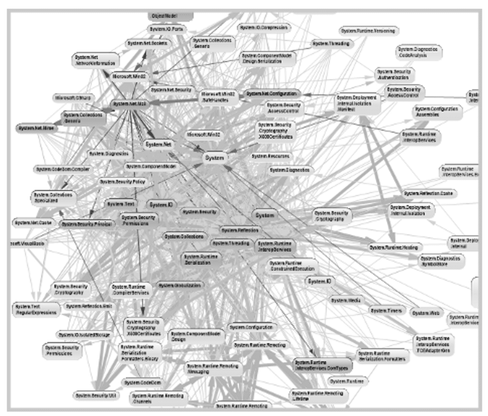

# Desenvolvimento Web Backend

## Aviso
Essa matéria tem uma abordagem muito prática. Desse modo, escrever um passo a passo detalhado de maneira escrita é a **pior** maneira de ensinar esse conhecimento por ser algo extremamente enfadonho tanto para mim (que estou escrevendo) quando para vocês que estarão lendo.

Dessa feita, eu vou criar um repositório no github dedicado para esse microfundamento onde cada commit será uma etapa do processo de desenvolvimento da aplicação. Aqui no material restará apenas a parte teórica e um resumo das transformações feitas ao longo do processo de desenvolvimento da aplicação.

## Arquitetura e Linguagens de Programação de Aplicações Web Back-End
No nosso projeto de primeiro semestre, desenvolvemos uma aplicação web front-end. Como aprendemos até então, o front-end de uma aplicação é a parte da aplicação que tem foco na **interface de interação** com o usuário. Por outro lado, uma aplicação back-end tem foco nos serviços e tecnologias necessárias para atendimento das **regras de negócio** que a aplicação deve obedecer.

No back-end, temas como banco de dados, gerenciamento de rotas, sessão de usuário, cookies, segurança, templates e outros são relevantes e aprenderemos um pouco sobre cada um desses assuntos ao longo da nossa formação. Outro objetivo é o contato com as **principais linguagens** usadas para o desenvolvimento back-end assim como os principais frameworks para desenvolvimento de aplicações web.

Como a formação da PUC-MG é baseada no .NET, vamos aprender a usarmos o ASP.NET Core MVC para criação de aplicações web completas.
### Arquitetura Back-End
#### Arquitetura de Software
Durante o desenvolvimento de uma aplicação, é comum[^1] iniciarmos um projeto e irmos criando novas funções e módulos a medida que precisamos. Essa maneira de desenvolvimento recebe o apelido de **bola de lama** por sua representação visual de ligação entre as classes parecer uma "bola".

[^1]:Principalmente para aqueles que aprendem a programar por conta própria.

Na norma ISO/IEC/IEEE 42010, temos a definição de **Arquitetura de Software** como sendo os "conceitos ou propriedades fundamentais de um sistema em seu ambiente incorporados em seus elementos, relacionamentos e nos princípios de seu design e evolução". Dessa frase, podemos depreender que uma arquitetura de software é parte fundamental de um sistema. Esse sistema existe em um ambiente que é considerado pela arquitetura.

Em Clements e Kazman (2012) temos outra definição de arquitetura de software: "A arquitetura de software de um programa ou sistema de computação é a estrutura ou estruturas do sistema, que compreendem elementos de software, as propriedades externamente visíveis desses elementos e as relações entre eles". Ou seja, a arquitetura de software é uma **abstração** de um sistema de software que serve de base para a construção do próprio sistema.

Ao elicitar os requisitos necessários para o atendimento de uma determinada demanda, o próximo passo é justamente definir as características arquitetônicas que comporão a solução de software. Desse modo, podemos ver que além da codificação e do design, uma solução de software também possui uma camada de arquitetura em sua construção.

Tal qual aprendemos nas boas práticas de desenvolvimento e design de aplicações, a arquitetura de software também possui atributos de qualidade para sua avaliação. Normalmente, podemos separar esses atributos em três grandes grupos:

  - **Operacional**
    

      - Disponibilidade
      - Desempenho
      - Recuperabilidade
      - Confiabilidade\Segurança
      - Robustez
      - Escalabilidade
    

  - **Estrutural**
    

      - Configurabilidade
      - Extensibilidade
      - Installabilty
      - Localização\Tradução
      - Capacidade de Manutenção
      - Portabilidade
      - Suportabilidade
      - Capacidade de Atualização
    

  - **Transversal**
    

      - Acessibilidade
      - Arquivabilidade
      - Autenticação
      - Autorização
      - Privacidade
      - Segurança
      - Legal
      - Usabilidade\Capacidade de Realização
    

**Comentário:** Infelizmente, enquanto eu escrevo essa parte do material, estou com pouquíssimo tempo disponível para me aprofundar mais em alguns tópicos. Em tempo oportuno voltaremos a rever essas seções com a devida atenção que elas merecem.
#### Estilos Arquiteturais
Já entendemos que, na construção de uma solução, precisaremos nos perguntar qual será o tipo de arquitetura de software que será usada para preencher todos os requisitos elicitados na etapa inicial de planejamento. Nessa seção, vamos ver os principais modelos\estilos de arquiteturas de back-end usados hoje em dia.

Podemos agrupar alguns modelos segundo suas formas de organizar o sistema em componentes que interagem entre si. Entretanto, precisamos estar sempre cientes que essas divisões são apenas para fins didáticos. Na vida real, o mais comum é vermos várias características de modelos de arquiteturas integradas em uma mesma solução.

**Arquitetura Monolítica**

É o modelo de arquitetura baseado em um alto acoplamento onde o programa é projetado para funcionar como uma unidade única e independente. Esse modelo era mais utilizado nos primórdios do desenvolvimento quando não existia uma clara separação entre hardware e software. Hoje em dia, podemos ver um espelho desse tipo de arquitetura nos sistemas embarcados e em produtos de tecnologia que executam apenas uma aplicação.

**Arquitetura Microkernel (Baseada em Plugins)**

Esse tipo de arquitetura permite a inserção de extensões dinâmicas por meio de plugins. O melhor exemplo hoje em dia é o navegador que permite a instalação de extensões de terceiros para extender as funcionalidades dos navegadores. A vantagem é que esse tipo de arquitetura permite a extensibilidade de funcionalidades de modo mais simples quando comparamos com o modelo monolítico que demandaria a recompilação de toda a aplicação sempre que houver alguma mudança.

**Arquitetura Pipes and Filters (Pipeline)**

Esse modelo de construção é usado quando temos processos de tratamento de informações seriadas. Imaginemos que temos um arquivo a ser processado por um programa para gerar informações úteis para o usuário. Ao usarmos a arquitetura de pipeline, nós criamos uma série de etapas de processamento (chamadas de filters) que são independentes entre si e interconectadas pelos pipes que nada mais são que as ligações lógicas entre os filters onde o resultado de um filter é recebido como input do próximo filter por meio do pipe.

**Arquitetura em Camadas (Layred)**

Uma maneira de se evitar a complexidade gerada por alto acoplamento na arquitetura monolítica é a separação das funções do sistema em camadas que podem, ou não, se comunicar livremente entre si. A arquitetura web é a principal implementação desse tipo de arquitetura (camada de user, camada de api, camada de banco de dados e etc). Quando separamos um sistema em camadas, podemos definir a capacidade de cada em emitir e receber dados de modo a termos um controle da segurança dos dados e desempenho.

**Comentário:** Na literatura, podemos achar o termo multi-tier que se refere a separação **física** entre as camadas e multi-layer que se refere a separação **lógica**.

**Arquitetura Cliente/Servidor**

É um tipo especial de arquitetura em camadas de duas camadas. É amplamente usada para soluções web onde trabalhamos as comunicações entre as camadas usando um protocolo de request/response. A principal dificuldade é a escalabilidade para páginas que possuem um grande volume de acessos que poderiam inviabilizar a resposta pelo servidor.

**Arquitetura Peer-to-Peer**

Esse é o mais novo tipo de arquitetura onde cada nó da rede é tido como simultaneamente um cliente e um servidor. É amplamente usado para escalabilidade de soluções e é um dos motores da chamada web 3.0. Como exemplo, temos os torrents e as blockchains usados para a criação e manutenção das criptomoedas.

**Comentário:** Como dito no início, essas separações são apenas didáticas e não definitivas. Não existe arquitetura errada. Tudo depende do problema a ser resolvido.

#### Tipos de Aplicações Web
Quando definimos que um dado problema será resolvido por meio de uma aplicação web. Temos que decidir a arquitetura dessa aplicação levando-se em conta coisas como: desempenho esperado, custos de servidor, segurança da informação e etc. Nessa seção vamos aprender sobre os principais modelos de construção de soluções web usadas na atualidade.

**Multi-Page Application (MPA)**

Tem como vantagens: a) Um melhor desempenho nos sistemas de pesquisa SEO pois as páginas são servidas com as metatags otimizadas para os mecanismos de busca; b) Um tempo de inicialização mais rápido devido o fato do processamento estar muito focado na camada do servidor que envia a página já renderizada para o client apenas mostrar para o user.

Tem como desvantagens: a) Uma experiência mais desagradável para o user que precisa ver a página inteira ser renderizada sempre que fizer uma solicitação de nova informação; b) Alto acoplamento entre front e back-end visto que o server precisa ter o controle das camadas de front-end para o processamento adequado do html a ser servido no client com alto controle sobre rotas.

**Single Page Applicatoin (SPA)**

Tem como vantagens: a) Uma única "viagem" de ida e volta ao server pois no primeiro acesso, os dados de visualização são baixados e salvos nos cookies do client evitando a dinâmica de ter que baixar todo o front-end em cada página nova o que melhora a experiência do usuário; b) Controle de rotas mais eficiente porque o novo conteúdo é renderizado dentro do mesmo arquivo html sem a necessidade de várias rotas novas; c) Como a quantidade de arquivos servidor é menor, também temos uma melhora no desempenho da aplicação a depender do SDK JS usado.

Tem como desvantagens: a) Uma piora nos mecanismos de pesquisa uma vez que o conteúdo das SPA é dinamicamente gerado de modo que os crawlers não conseguem tagear de maneira eficiente os sites que usam essa tecnologia; b) Tempo de carregamento inicial mais alto devido o fato de, no primeiro acesso, toda a carga de assets usados no front-end ser servida pelo server para o client.

**Server-Side Rendered (SSR)**

Com o advento do Node.js em 2009, o JS se tornou uma linguagem que pode ser usada tanto no front quanto no back-end[^2]. Agora, podemos pensar em aplicações que atuam como um intermediário entre as abordagens SPA e MPA com o uso do JS isomórfico.

[^2]:Chamamos essa característica de isomórfica.

Tem como vantagens: a) Tempo de carregamento mais rápido; b) Melhor suporte de SEO e c) Melhor experiência do user pois a visualização se parece muito com o SPA.

Tem com desvantagens: a) A necessidade de um server em Node.js e b) Possui um desenvolvimento mais complexo com gestão de plugins e pacotes de terceiros que podem gerar muitos problemas em aplicações grandes.

**Static Site Generators (SSG)**

Uma outra abordagem é a de se gerar todas as páginas antecipadamente no server e envia-las todas de uma vez ao client no acesso ao site.

Tem como vantagens: a) Tempo de inicialização mais rápido porque o consumo é de páginas html estáticas; b) Otimizado para SEO; c) Implantação mais simples porque só lidamos com páginas html estáticas sem camada de servidor.

Tem como desvantagens: a) Falta de suporte no server side que impede qualquer processamento mais elaborado de dados e b) Sem renderização em tempo real que prejudica a customização da experiência de uso.

## Projeto

Pois bem, agora vamos colocar a mão na massa. Como o projeto é de backend, vamos fazer um app **web api** com ASP.NET Core usando como material a própria documentação no [site da microsoft](https://learn.microsoft.com/en-us/aspnet/core/tutorials/first-web-api?view=aspnetcore-9.0&tabs=visual-studio).

Também não vamos perder tempo desenvolvendo nada de interface. No final, vamos ter uma aplicação que recebe chamadas http (via [postman](https://www.postman.com/) ou [insomnia](https://insomnia.rest/download)) e retorna um json.

**Aviso:** Eu vou seguir um modelo de arquitetura chamado **Controller-Based API** mas o ASP.NET Core também permite a construção via **Minimal API**. Para entender melhor sobre esses estilos basta ler essa [página](https://learn.microsoft.com/en-us/aspnet/core/fundamentals/apis?view=aspnetcore-9.0).[^3]

[^3]: Já que você está começando. Vale a pena fazer os 2 modelos pra aprender.

### Requisitos

1. Receber requisição HTTP GET/POST/PUT/DELETE
2. Retornar um JSON como resposta

## Bibliografia
- Ingeno, Joseph. **Software Architect's Handbook**. Packt Publishing, 2018.
- Lauret, Arnaud. **Web Application Architecture: Principles, Protocols and Practices**, 2nd Edition. Wiley. 2009.
- Lock, Andrew. **ASP.NET Core in Action**, Second Edition. Manning Publications. 2021
- Mead, Andrew. **Learning Node.js Development**. Packt Publishing. 2018.
- Tatroe, Kevin; MacIntyre, Peter. **Programming PHP**, 4th Edition. O'Reilly Media, Inc. 2020.
- FinTech. **Web Application Architecture: Principles, Protocols and Practices**, 2nd Edition. Wiley. 2009.
- Bass, Len; Clements, Paul; Kazman, Rick. **Software Architecture in Practice**, Third Edition. Addison-Wesley Professional, 2012.
- Kok, Lau Tiam. **Hands-on Nuxt.js Web Development**. Packt Publishing. 2020.
- Richards, Mark. **Software Architecture Patterns**. O'Reilly Media, Inc., 2015.
- Richards, Mark; Ford, Neal. **Fundamentals of Software Architecture**. O'Reilly Media, Inc., 2020.
- Sanctis, Valerio De. **ASP.NET Core 2 and Angular 5**. Packt Publishing. 2017.
- ASP.NET. **Essential ASP.NET with Examples in C\#**. Addison-Wesley Professional. 2003
- Busuioc, Alexandru; Carr, David; Gray, Markus; Joshi, Vijay; McCollum, Mark; McLeod, Bart; Tonu, M A Hossain. **The PHP Workshop**. Packt Publishing. 2019.

