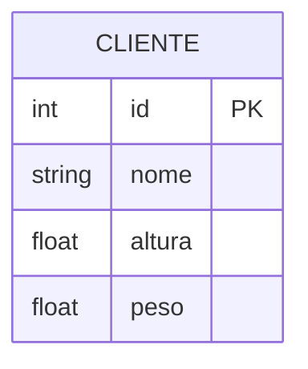
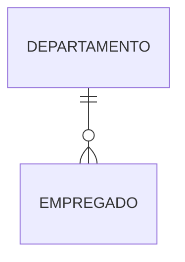
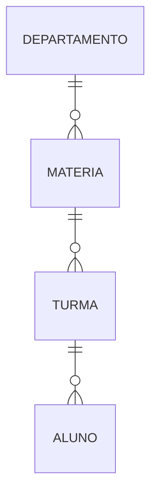
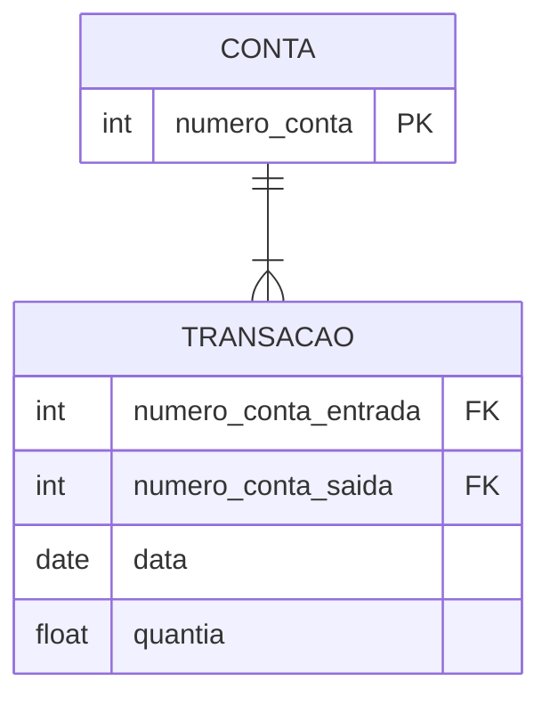
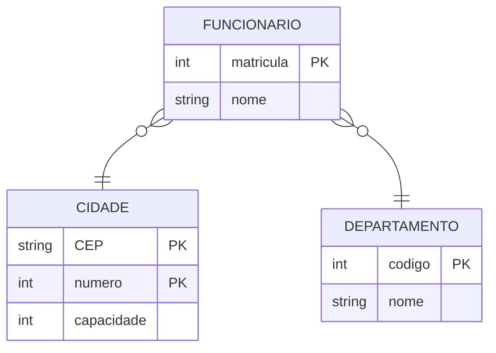
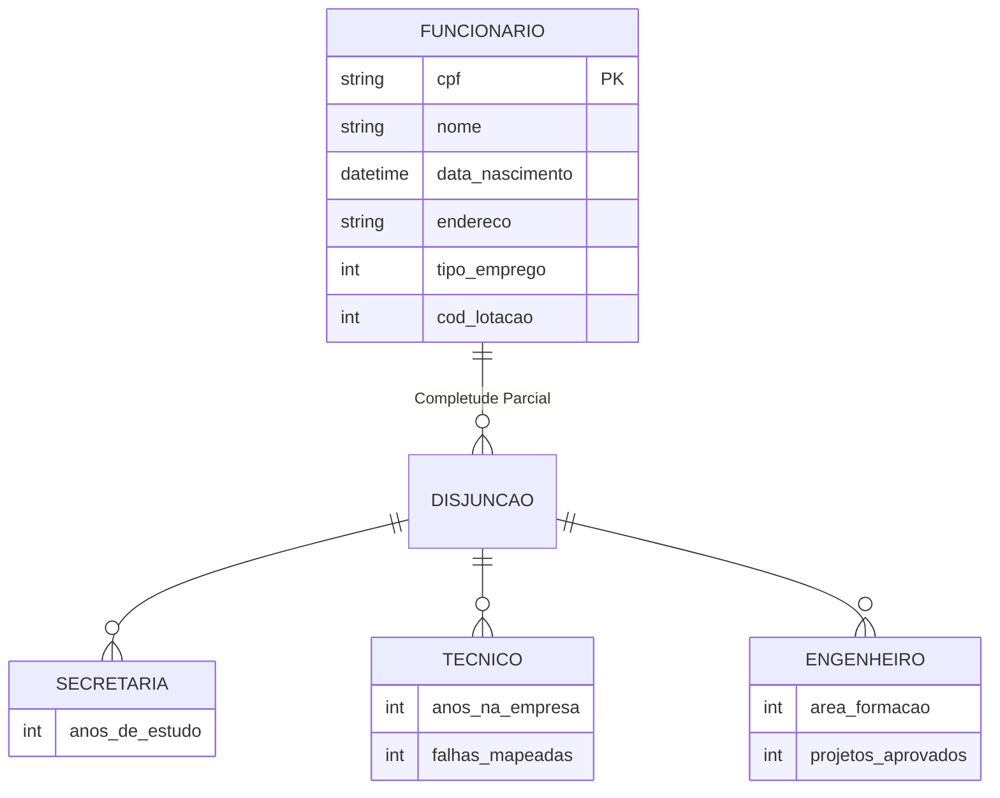
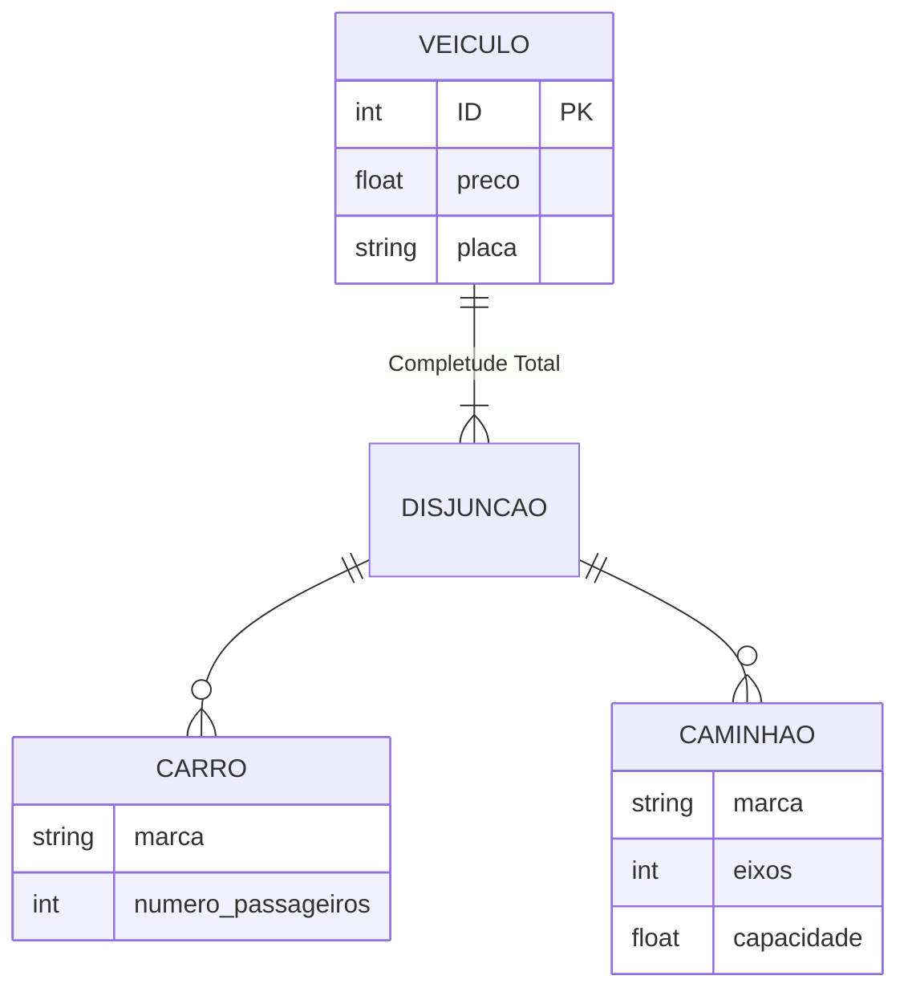
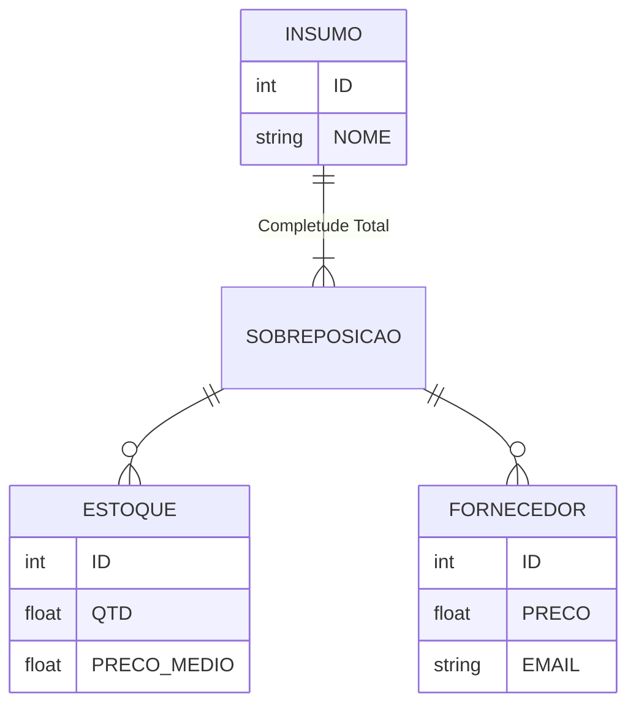

# Modelagem de Dados

:::info[Aula em Elaboração]
Infelizmente eu ainda não terminei esse material. Você pode aproveitar para ir vendo os outros conteúdos enquanto isso! 😜
:::

## Projeto de Banco de Dados

### Fundamentos de Banco de Dados

#### Abordagem de Arquivos x Banco de Dados

Podemos definir um **banco de dados** como:
> Uma coleção de dados relacionados, persistentes[^1] \[...\] que tem por objetivo atender uma comunidade de usuários.

[^1]: Ou seja, que continuam salvos mesmo depois do computador desligar.

Dessa feita, podemos ver que *antes* de modelar e projetar nosso banco, temos que ter em mentos o propósito de uso e sua real necessidade.

Outro conceito muito próximo é o de **Sistema Gerenciador de Banco de Dados (SGBD):**
> Um software que incorpora as funções de definições, recuperação e alteração de dados em um BD

Ou seja, **Banco de dados** é um conceito com foco no **conteúdo**. Enquanto, **SGBD** é um conceito com foco na **tecnologia** que vai manipular o conteúdo armazenado (ex: MySQL, MSSQL, Firebird e etc).

##### O Passado
Mas nem sempre existiu a abordagem de banco de dados. Antigamente, cada programa precisava ser responsável pelos próprios arquivos que persistiam as informações. 

O modo de persistir dados era com **enfoque de arquivos**. Onde meio que tudo era salvo em plain text ou algum formato de texto estruturado como um `csv` da vida e os sistemas tinham que trabalhar com isso.

Desse modo, era praticamente impossível intercambiar informações entre aplicações porque não se tinha um template geral para consulta e persistência dos dados.

Isso gerava a necessidade de cada aplicação ter sua própria base (mesmo que a informação fosse comum à vários setores). Agora, imagine que existam 3 tabelas `produto` e que o valor de venda dele foi alterado. Existe uma chance real que algum time simplesmente esqueça de atualizar em uma das réplicas o que poderia causa graves prejuízos à empresa.

#### Tipos de Linguagens e Tipos de Profissionais

##### Linguagens DDL E DML

Já vimos que um banco de dados é relacionado ao conteúdo que será persistido para consulta posterior. Dessa feita, como tudo em tecnologia, precisamos de uma `linguagem` para interagir com o SGBD afim de criarmos as definições dos dados e manipular o que tivermos salvo.

Existem 2 tipos de linguagens que usamos para essa tarefa:
- **DDL (Data Definition Language)**: Usada para criar tabelas, criar visões, definir relações entre elas e as características de cada valor.
- **DML (Data Manipulation Language)**: Muito mais usada na prática diária. É responsável por manipular (select, insert, delete, update) os dados persistidos. Pode ser de 2 tipos.
	- **Procedural**: Onde o user define qual dado será acessado e como chegar nele. Mais usados em triggers e rotinas automáticas.
	- **Não Procedural**: Onde define apenas qual dado acessar.

:::note[Comentário]
Ao longo dos estudos vamos nos deparar com um conceito chamado `stored procedure` e é exatamente isso que acabamos de ver acima.
:::

Para aprofundar um pouco mais, abaixo temos dois exemplos de DML.

```sql
/* DML Procedural */
BEGIN
  DECLARE @EmployeeName VARCHAR(50);
  DECLARE @EmployeeId INT = 101;
  
  SELECT @EmployeeName = Name
  FROM Employees
  WHERE EmployeeID = @EmployeeId;
  
  PRINT @EmployeeName;
END;
```

```sql
/* DML Não Procedural */
SELECT Name
FROM Employees
WHERE EmployeeID = 101;
```

Podemos ver que na DML não procedural, deixamos a cargo do motor da linguagem julgar qual melhor rota para acessar as informações que solicitamos[^2].

[^2]: Na esperança que ele sempre tome uma decisão otimizada de como acessar o dado. Mas fique tranquilo, quase sempre ele escolhe o melhor caminho.

##### Principais atuantes em um projeto de BD

Como papéis principais em um projeto de banco de dados, podemos destacar:
- Administrador de Dados (AD)
	- Arquiteta a estrutura de informação da empresa
	- Administra a descrição da base de dados[^3]
	- Define padrões de codificação (template de nome de tabela, campos e etc)
	- Profundo conhecedor das regras de negócio
- Administrador de Banco de Dados (DBA)
	- Foco na otimização e performance
	- Gerencia o SGBD
	- É responsável pela estrutura de armazenamento (migrations, carga de dados e etc)
- Analista de Sistemas/Engenheiro de Software/Desenvolvedor
	- Constrói soluções que consomem o SGBD
	- Deve procurar otimizar suas `queries` de modo a sempre custar pouco para o processamento do SGBD
- Usuário Final
	- Podem ser tanto no nível operacional quanto gerencial

[^3]: Também conhecido como dicionário de dados.

#### Níveis do SGBD e Etapas do Projeto de BD

#### Níveis do SGBD

Um SGBD pode ser divido em 3 níveis de abstração:

1. **Nível Interno/Físico**
	- Atuação do DBA com foco no **como** os dados são armazenados em disco e como melhorar a **performance** de acesso aos mesmos.
2. **Nível Conceitual/Lógico**
	- Atuação do DA com foco em **quais** dados são salvos no BD e seus relacionamentos.
3. **Nível Externo/Visão**
	- Atuação de Devs e Users com objetivo de **acessar** os dados disponíveis. Sempre sendo necessário apenas uma parte do todo.

:::info[Info]
Abaixo temos dois conceitos derivados desses que acabamos de ver. Hoje em dia, podem parecer simples mas, no passado, a separação entre camadas físicas e lógicas eram bem menor do que hoje em dia.
:::

> **Independência Física**: Quando alterações na camada física não impactam a camada lógica.[^4]

> **Independência Lógica**: Quando alterações na camada lógica não impactam a camada física.

[^4]: Por exemplo, trocar o SGBD do MSSQL para MySQL. Em tese, é possível realizar essa migração sem alterar a estrutura das tabelas visto que ambos são do tipo SQL.

##### Etapas de um Projeto de BD

Tal qual as etapas, durante a elaboração de um projeto de BD temos um estudo para cada camada, ou seja:

1. **Projeto Conceitual**
	- Foco na informação, independente da implementação do SGBD.
	- Definição dos tipos e das relações.
	- Criação dos Modelos de Entidade-Relacionamento (MER).
1. **Projeto Lógico**
	- Adaptação do projeto conceitual ao SGBD.
	- Conversão dos modelos de dados ao tipo específico de SGBD (SQL, NoSQL, Redes e etc).
	- É nessa etapa que temos a definição das tabelas, relações de campos e chaves.
1. **Projeto Físico**
	- Implementação real no hardware.
	- Quanto de recursos precisarão ser alocados bem como as políticas de backup.
	- Criação dos Perfis de acesso.

### Modelagem de Entidades e Relacionamentos (MER)

#### Modelagem de Entidades e Atributos

Agora que sabemos os profissionais e os tipos de projetos de banco de dados, vamos entrar na teoria sobre a modelagem de dados propriamente dita.

> Podemos conceituar a **Modelagem de Dados** como a conversão de fatos relevantes em *estruturas bem definidas* com *regras de dependência* expressas em um *modelo gráfico e descritivo*.

O foco aqui é em **quais** dados existirão no banco de dados, independente de **como** eles serão armazenados no SGBD.

Um dos modelos conceituais[^5] mais usados é o **Modelo Entidade-Relacionamento (MER)**. Essa técnica permite demonstrar facilmente a relação descrita acima por meio de representações gráficas simples entre as entidades.

[^5]: Ou seja, estamos ainda na etapa de um projeto conceitual.

##### Diferentes tipos de notação

No material didático dessa disciplina usamos a notação de Peter Chen como base. Entretanto, eu tenho um motor de geração de diagramas nativo na biblioteca que uso para construir esse site que segue a notação de [James Martin](https://www.conceptdraw.com/examples/the-crow%E2%80%99s-foot-erd).

:::warning[Atenção]
A notação de James Martin tem alguns apelidos como "IE Notation" ou ainda "Crow's Foot Notation".
:::

O importante é sempre entender a lógica geral. Nesse [artigo da wikipédia](https://en.wikipedia.org/wiki/Entity%E2%80%93relationship_model) temos um exemplo de como podemos mostrar uma mesma relação de diferentes modos.


:::tip[Dica]
Existem várias ferramentas para escrever esses tipos de diagramas. Aqui, eu vou usar a `Mermaid` [Link da documentação](https://mermaid.js.org/syntax/entityRelationshipDiagram.html).
:::

##### Entidades e Atributos no MER

> **Entidades** são objetos do mundo real ou abstrações de informação.

> **Atributos** são elementos que identificam as entidades e descrevem suas características.

Atributos podem ser de vários tipo, para nomear alguns:
 - Simples: CPF, Altura, Preço.
 - Compostos: Compostos por partes, como Telefone = País + DDD + Numero.
 - Monovalorados: Recebem 1 valor por entidade.
 - Multivalorados: Vários valores por entidade.
 - Derivados: IMC que é uma função da altura e peso.
 - Chave: Valores distintos que podem ser usados para identificar as entidades.

Abaixo eu coloco um exemplo de entidade no modelo Crow's foot onde podemos ver que os atributos são definidos por tipo, nome e se é primary key no próprio retângulo da entidade. Na notação de Chen eles são elipses ligadas à entidade.



Para simplificar nosso material, eu vou omitir nas entidades os atributos sempre que possível assim cada entidade vai ser representada apenas por um retângulo com o nome. Mas lembre-se que na hora de fazer um MER de verdade as entidades devem estar sempre com seus atributos.

#### Modelagem de Relacionamentos

Alguns conceitos importantes para a modelagem de relacionamentos:

> **Relacionamento** é qualquer associação com significado entre uma ou várias entidades

> **Cardinalidade** é a propriedade do relacionamento que expressa a quantidade de ocorrências. Por exemplo, 1-1, 1-n, n-n e etc.

> **Totalidade** é a especificação da condição de existência entre classes de modo que uma só pode existir se o relacionamento com outra existe. Pode ser **parcial/opcional** ou **total/obrigatória**[^6].

[^6]: Pense no exemplo de um colégio infantil. O cadastro `responsavel_aluno` só pode existir se o cadastro anterior `aluno` já existir. Agora se for uma instituição superior de ensino, que possui alunos maiores de 18 anos, esse campo pode ser opcional apenas para alunos menores de idade.

:::note[Comentário]
Não sei você, mas, pra mim "totalidade total" é um nome bem ruim pra um conceito. Dessa feita, vou usar o termo "totalidade obrigatória" sempre que for me referir a essa propriedade.
:::



Nós lemos esse diagrama acima da seguinte forma: Um departamento pode possuir entre 0 a N empregados. Similarmente, qualquer empregado só pode pertencer a um único departamento.

Mais um exemplo dado no curso:



Nesse segundo exemplo nós temos um esquema básico de uma faculdade. Podemos ver que um `departamento` pode ofertar N `materias` e essas matérias podem ser ofertada em N `turmas`. Um aluno, por sua vez, só pode pertencer a 1 único curso.

#### Modelo de Entidades e Relacionamentos Estendido

#### Entidades Fracas e Relacionamentos Múltiplos

Até agora já sabemos mostrar entidades, suas propriedades e suas relações com outras entidades. Agora vamos aprimorar mais um pouco nosso modelo representativo adicionando hierarquia entre entidades.

> **Entidade Fraca**: É toda entidade que não tem chave própria, ou seja, precisa ser identificada por meio de um relacionamento com outra entidade (que é forte pois possui chave) e por um identificador fraco (chave parcial).

> **Relacionamentos Estendidos**: São os relacionamentos entre mais de duas entidades (chamados de relacionamentos binários).

Abaixo temos um exemplo de entidade fraca chamada `transacao`. Chamamos ela de entidade fraca porque ela precisa das chaves estrangeiras das contas para fazer sentido.



Agora vamos ver um exemplo mais complexo onde temos relacionamentos não binários.



Aqui podemos ver que um registro de funcionário precisa indicar tanto a cidade quanto o departamento para que seja possível saber sua lotação.

##### Atributos de Relacionamentos

Na notação de Peter Chen também é possível derivar atributos dos relacionamentos igual fazemos com as entidades. A ideia é evidenciar quais dados surgem a partir da relação entre entidades.

> **Atributos de Relacionamentos**: São atributos derivados da associação entre entidades e não são oriundos das entidades per se.

:::danger[Aviso]
Essa derivação de atributos para relacionamentos só é encontrada no modelo de Chen. Dessa feita, vemos que a tendência  do mercado é alocar esses atributos diretamente a uma classe.
:::

Um exemplo de atributo de relacionamento pode ser encontrado na imagem abaixo.


Veja que o relacionamento `OPOS` tem um atributo diretamente nele. Mas isso causa uma certa dificuldade quando vamos pensar nas tabelas do SGBD pois temos que definir **onde** esse atributo do relacionamento será salvo.

#### Modelagem de Supertipos e Subtipos

Algo comum de se deparar na construção de um modelo de banco de dados é relações de **hierarquia** entre as entidades. Desse modo, precisamos evoluir nosso modelo representativo para indicar classes gerais e classes específicas.

:::note[Comentário]
Essa é justamente a discussão que vimos na matéria de [Programação Modular](./04-programacao-modular.md).
:::

> **Generalização**: Atributos de uma classe genérica/superclasse/supertipo que indica atributos comuns a uma gama de outras entidades.

> **Especialização**: Processo de definir em detalhes uma classe genérica adaptando-a em casos mais concretos.

Na declaração de subtipos, devemos investigar como os tipos derivados podem ser classificados entre si.

> Para os casos onde uma entidade só pode ser de um subtipo[^7] usamos o termo **disjunção**. 

> Para os casos onde podem haver mais de uma relação[^8] usamos o termo **sobreposição**.

[^7]: Por exemplo, se um atleta de futebol é goleiro, ele não pode ser atacante.
[^8]: Por exemplo, um funcionário de um banco pode ser, também, um cliente do mesmo banco.

Outra relação importante de se definir é se a superclasse **precisa** ser definida em termos de subclasse. 

> Se a classe geral tiver uso sem uma especialização, usamos o conceito de **subtipo total**. 

> Caso ela tenha uso mesmo sendo classe geral mas permita uma especialização, dizemos que ela é **subtipo parcial**.

:::danger[Aviso]
Essa parte de subtipo e supertipo com classes total ou parcialmente separadas também só existe no modelo de Chen. Com o tempo, o mercado foi percebendo que "menos é mais" e tendeu para modelos que são mais fáceis de ler e entregam um resultado parecido em termos de compreensão.
:::

Abaixo temos um diagrama que reflete a mesma ideia do pertencimento parcial usando o diagrama de Crow's foot mas lembre-se que isso é apenas para efeito didático.



O diagrama acima é uma aproximação de como o modelo de Chen trata a especificação das classes. A ideia é evidenciar que, dado um funcionário, ele só pode ser de um único subtipo ou do tipo genérico.

Em outras palavras, podemos ter um registro de funcionário genérico mas, também, especificado entre as outras 3 categorias.

Agora vamos ver um exemplo de completude total onde a especificação se torna obrigatória.



Nesse exemplo de uma concessionária de veículos, vemos que, dado um veículo, ele tem que pertencer obrigatoriamente há uma subcategoria.

Para encerrar essa parte, vamos ver um exemplo usando sobreposição ao invés de disjunção. No caso, modelamos o cenário de uma indústria que precisa controlar um insumo produtivo que pode vir tanto do seu estoque quanto do fornecedor.




## Projeto de Banco de Dados Relacionais e Não Relacionais

### Modelo Relacional de Banco de Dados

Surgiu em meados da década de 70 por E.F. Codd como uma definição puramente derivada da teoria de conjuntos da matemática.

Em 1974, a IBM tentou implementar através do [Sistema R](https://people.eecs.berkeley.edu/~brewer/cs262/SystemR.pdf) o primeiro SGBD capaz de usar a, então novidade, **Linguagem de Consulta Estruturada** ou **Structured Query Language (SQL)** para recuperação de dados.

#### Conceitos do Modelo Relacional e Chave Primária

Agora vamos levantar alguns conceitos chaves do modelo relacional.

> **Relação** é qualquer tabela de valores onde cada linha representa uma relação de valores relacionados a uma mesma entidade. Por isso o nome do modelo é Modelo Relacional.

> **Tupla** são as linhas de uma relação (linhas na tabela) que são obrigatoriamente distintas entre si.

> **Atributo** são o cabeçalho de cada coluna, também chamado de **campo da tabela**. A quantidade de atributos[^9] define o grau da relação.

[^9]: Por exemplo, uma tabela `pessoa` com 2 colunas: `nome` e `idade`. É dita como sendo uma relação de grau 2.

> Chamamos de **Domínio** qualquer conjunto de valores válidos[^10] para um atributo.

[^10]: Para explicar melhor esse conceito, podemos pensar em uma tabela que tenha a coluna `grau_de_instrucao`. Ela só pode aceitar um valor string dentro da lista \[`fundamental`, `medio`, `superior`\]. Essa lista de opções é o **domínio** do atributo `grau_de_instrucao`.

:::warning[Atenção]
Não podemos confundir **Domínio** com **Tipo Físico** do atributo. Tipo físico é relacionado ao modo como a variável é salva no hardware (ex: `string`, `int`, `float` e etc). Domínio é a lista de valores aceitos no atributo.
:::

Aqui temos um exemplo de implementação de domínio na prática

```sql
CREATE TABLE Funcionarios (
	Nome VARCHAR(100) NOT NULL, 
	Idade INT NOT NULL CHECK (Idade BETWEEN 18 AND 65), 
	Departamento VARCHAR(50) NOT NULL CHECK (Departamento IN ('RH', 'TI', 'Financeiro')) 
);
```


Além dos conceitos acima, existem algumas regras que o modelo relacional adota implicitamente que são importante de se ter em mente:
- Os valores dos atributos são **atômicos** ou seja, só existe 1 endereço para cada intersecção linha-coluna.
-  No modelo relacional se admite o valor **nulo** que não é igual à string vazia ou zero.

Para encerrar, podemos definir uma dada relação $R(A_1, A_2, ..., A_n)$ onde $R$ é o nome da relação, $A_i$ é o nome do atributo, $n$ é o grau da relação.

Os dados dentro da relação são as tuplas definidas por $r(R)$ de modo que $r = \{t_1, t_2, ..., t_n\}$.

##### Chave Primária

> A **Chave Primária** é a coluna (ou combinação delas) que define de maneira cabal a distinção entre entidades em uma dada tabela.


#### Integridade Referencial e Chave Estrangeira

### Mapeamento do Modelo de Entidades e Relacionamentos para Modelo Relacional

#### Mapeamento de Entidades e Atributos

#### Mapeamento de Relacionamentos

### Normalização de Banco de Dados

#### Primeira e Segunda Formas Normais

#### Terceira Forma Normal

### Banco de Dados Não-Relacionais

#### Database NoSQL

### Segurança

#### Segurança de Banco de Dados

## Bibliografia

- ELMASRI, Ramez; NAVATHE, Shamkant B. **Sistemas de banco de dados.** 7 ed. São Paulo: Person, 2018. 
- MARTIN, James. **Principles of Data Base Management**.
- CHEN, Peter. **Modelagem de dados: A abordagem para Projeto Lógico**.
- E.F. Codd. **A Relational Model of Data For Large Shared Data Banks**. Comm. ACM 13, 6 (June 1970), 377-387.