# Modelagem de Dados

:::info[Aula em Elaboração]
Infelizmente eu ainda não terminei esse material. Você pode aproveitar para ir vendo os outros conteúdos enquanto isso! 😜
:::

## Projeto de Banco de Dados

### Fundamentos de Banco de Dados

#### Abordagem de Arquivos x Banco de Dados

Podemos definir um **banco de dados** como:
> Uma coleção de dados relacionados, persistentes[^1] \[...\] que tem por objetivo atender uma comunidade de usuários.

[^1]: Ou seja, que continuam salvos mesmo depois do computador desligar.

Dessa feita, podemos ver que *antes* de modelar e projetar nosso banco, temos que ter em mentos o propósito de uso e sua real necessidade.

Outro conceito muito próximo é o de **Sistema Gerenciador de Banco de Dados (SGBD):**
> Um software que incorpora as funções de definições, recuperação e alteração de dados em um BD

Ou seja, **Banco de dados** é um conceito com foco no **conteúdo**. Enquanto, **SGBD** é um conceito com foco na **tecnologia** que vai manipular o conteúdo armazenado (ex: MySQL, MSSQL, Firebird e etc).

##### O Passado
Mas nem sempre existiu a abordagem de banco de dados. Antigamente, cada programa precisava ser responsável pelos próprios arquivos que persistiam as informações. 

O modo de persistir dados era com **enfoque de arquivos**. Onde meio que tudo era salvo em plain text ou algum formato de texto estruturado como um `csv` da vida e os sistemas tinham que trabalhar com isso.

Desse modo, era praticamente impossível intercambiar informações entre aplicações porque não se tinha um template geral para consulta e persistência dos dados.

Isso gerava a necessidade de cada aplicação ter sua própria base (mesmo que a informação fosse comum à vários setores). Agora, imagine que existam 3 tabelas `produto` e que o valor de venda dele foi alterado. Existe uma chance real que algum time simplesmente esqueça de atualizar em uma das réplicas o que poderia causa graves prejuízos à empresa.

#### Tipos de Linguagens e Tipos de Profissionais

##### Linguagens DDL E DML

Já vimos que um banco de dados é relacionado ao conteúdo que será persistido para consulta posterior. Dessa feita, como tudo em tecnologia, precisamos de uma `linguagem` para interagir com o SGBD afim de criarmos as definições dos dados e manipular o que tivermos salvo.

Existem 2 tipos de linguagens que usamos para essa tarefa:
- **DDL (Data Definition Language)**: Usada para criar tabelas, criar visões, definir relações entre elas e as características de cada valor.
- **DML (Data Manipulation Language)**: Muito mais usada na prática diária. É responsável por manipular (select, insert, delete, update) os dados persistidos. Pode ser de 2 tipos.
	- **Procedural**: Onde o user define qual dado será acessado e como chegar nele. Mais usados em triggers e rotinas automáticas.
	- **Não Procedural**: Onde define apenas qual dado acessar.

:::note[Comentário]
Ao longo dos estudos vamos nos deparar com um conceito chamado `stored procedure` e é exatamente isso que acabamos de ver acima.
:::

Para aprofundar um pouco mais, abaixo temos dois exemplos de DML.

```sql
/* DML Procedural */
BEGIN
  DECLARE @EmployeeName VARCHAR(50);
  DECLARE @EmployeeId INT = 101;
  
  SELECT @EmployeeName = Name
  FROM Employees
  WHERE EmployeeID = @EmployeeId;
  
  PRINT @EmployeeName;
END;
```

```sql
/* DML Não Procedural */
SELECT Name
FROM Employees
WHERE EmployeeID = 101;
```

Podemos ver que na DML não procedural, deixamos a cargo do motor da linguagem julgar qual melhor rota para acessar as informações que solicitamos[^2].

[^2]: Na esperança que ele sempre tome uma decisão otimizada de como acessar o dado. Mas fique tranquilo, quase sempre ele escolhe o melhor caminho.

##### Principais atuantes em um projeto de BD

Como papéis principais em um projeto de banco de dados, podemos destacar:
- Administrador de Dados (AD)
	- Arquiteta a estrutura de informação da empresa
	- Administra a descrição da base de dados[^3]
	- Define padrões de codificação (template de nome de tabela, campos e etc)
	- Profundo conhecedor das regras de negócio
- Administrador de Banco de Dados (DBA)
	- Foco na otimização e performance
	- Gerencia o SGBD
	- É responsável pela estrutura de armazenamento (migrations, carga de dados e etc)
- Analista de Sistemas/Engenheiro de Software/Desenvolvedor
	- Constrói soluções que consomem o SGBD
	- Deve procurar otimizar suas `queries` de modo a sempre custar pouco para o processamento do SGBD
- Usuário Final
	- Podem ser tanto no nível operacional quanto gerencial

[^3]: Também conhecido como dicionário de dados.

#### Níveis do SGBD e Etapas do Projeto de BD

#### Níveis do SGBD

Um SGBD pode ser divido em 3 níveis de abstração:

1. **Nível Interno/Físico**
	- Atuação do DBA com foco no **como** os dados são armazenados em disco e como melhorar a **performance** de acesso aos mesmos.
2. **Nível Conceitual/Lógico**
	- Atuação do DA com foco em **quais** dados são salvos no BD e seus relacionamentos.
3. **Nível Externo/Visão**
	- Atuação de Devs e Users com objetivo de **acessar** os dados disponíveis. Sempre sendo necessário apenas uma parte do todo.

:::info[Info]
Abaixo temos dois conceitos derivados desses que acabamos de ver. Hoje em dia, podem parecer simples mas, no passado, a separação entre camadas físicas e lógicas eram bem menor do que hoje em dia.
:::

> **Independência Física**: Quando alterações na camada física não impactam a camada lógica.[^4]

> **Independência Lógica**: Quando alterações na camada lógica não impactam a camada física.

[^4]: Por exemplo, trocar o SGBD do MSSQL para MySQL. Em tese, é possível realizar essa migração sem alterar a estrutura das tabelas visto que ambos são do tipo SQL.

##### Etapas de um Projeto de BD

Tal qual as etapas, durante a elaboração de um projeto de BD temos um estudo para cada camada, ou seja:

1. **Projeto Conceitual**
	- Foco na informação, independente da implementação do SGBD.
	- Definição dos tipos e das relações.
	- Criação dos Modelos de Entidade-Relacionamento (MER).
1. **Projeto Lógico**
	- É nessa etapa que temos a definição das tabelas, relações de campos e chaves.
	- Etapa onde é escolhido a classe do SGBD (Relacional, NoSQL, Redes e etc).
1. **Projeto Físico**
	- Implementação real no hardware.
	- Definição do SGBD propriamente dito (Oracle, MySQL, MSSQL, MariaDB e etc)
	- Quanto de recursos precisarão ser alocados bem como as políticas de backup.
	- Criação dos Perfis de acesso.

### Modelagem de Entidades e Relacionamentos (MER)

#### Modelagem de Entidades e Atributos

Agora que sabemos os profissionais e os tipos de projetos de banco de dados, vamos entrar na teoria sobre a modelagem de dados propriamente dita.

> Podemos conceituar a **Modelagem de Dados** como a conversão de fatos relevantes em *estruturas bem definidas* com *regras de dependência* expressas em um *modelo gráfico e descritivo*.

O foco aqui é em **quais** dados existirão no banco de dados, independente de **como** eles serão armazenados no SGBD.

Um dos modelos conceituais[^5] mais usados é o **Modelo Entidade-Relacionamento (MER)**. Essa técnica permite demonstrar facilmente a relação descrita acima por meio de representações gráficas simples entre as entidades.

[^5]: Ou seja, estamos ainda na etapa de um projeto conceitual.

##### Diferentes tipos de notação

No material didático dessa disciplina usamos a notação de Peter Chen como base. Entretanto, eu tenho um motor de geração de diagramas nativo na biblioteca que uso para construir esse site que segue a notação de [James Martin](https://www.conceptdraw.com/examples/the-crow%E2%80%99s-foot-erd).

:::warning[Atenção]
A notação de James Martin tem alguns apelidos como "IE Notation" ou ainda "Crow's Foot Notation".
:::

O importante é sempre entender a lógica geral. Nesse [artigo da wikipédia](https://en.wikipedia.org/wiki/Entity%E2%80%93relationship_model) temos um exemplo de como podemos mostrar uma mesma relação de diferentes modos.

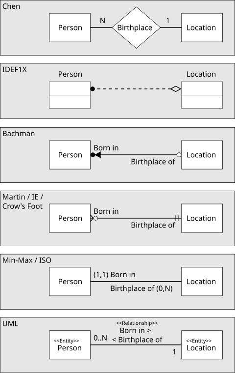

:::tip[Dica]
Existem várias ferramentas para escrever esses tipos de diagramas. Aqui, eu vou usar a `Mermaid` [Link da documentação](https://mermaid.js.org/syntax/entityRelationshipDiagram.html).
:::

##### Entidades e Atributos no MER

> **Entidades** são objetos do mundo real ou abstrações de informação.

> **Atributos** são elementos que identificam as entidades e descrevem suas características.

Atributos podem ser de vários tipo, para nomear alguns:
 - Simples: CPF, Altura, Preço.
 - Compostos: Compostos por partes, como Telefone = País + DDD + Numero.
 - Monovalorados: Recebem 1 valor por entidade.
 - Multivalorados: Vários valores por entidade.
 - Derivados: IMC que é uma função da altura e peso.
 - Chave: Valores distintos que podem ser usados para identificar as entidades.

Abaixo eu coloco um exemplo de entidade no modelo Crow's foot onde podemos ver que os atributos são definidos por tipo, nome e se é primary key no próprio retângulo da entidade. Na notação de Chen eles são elipses ligadas à entidade.

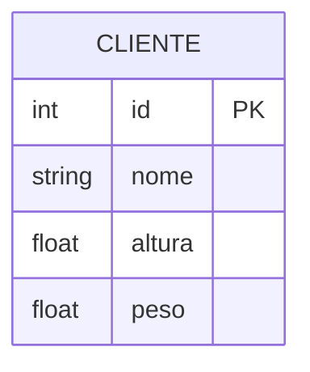

Para simplificar nosso material, eu vou omitir nas entidades os atributos sempre que possível assim cada entidade vai ser representada apenas por um retângulo com o nome. Mas lembre-se que na hora de fazer um MER de verdade as entidades devem estar sempre com seus atributos.

:::warning[Atenção]
O conceito de atributo composto só se aplica ao modelo de Chen. No modelo de James nós somos obrigados a simplificar a notação para atributos simples (o que facilita a etapa de mapeamento em tabelas).

O conceito de atributo multivalorado também se aplica somente ao modelo de Chen. No modelo de James nós somos obrigados a converter atributos multivalorados em uma nova entidade e criar uma ligação entre elas.
:::

#### Modelagem de Relacionamentos

Alguns conceitos importantes para a modelagem de relacionamentos:

> **Relacionamento** é qualquer associação com significado entre uma ou várias entidades

> **Cardinalidade** é a propriedade do relacionamento que expressa a quantidade de ocorrências. Por exemplo, 1-1, 1-n, n-n e etc.

> **Totalidade** é a especificação da condição de existência entre classes de modo que uma só pode existir se o relacionamento com outra existe. Pode ser **parcial/opcional** ou **total/obrigatória**[^6].

[^6]: Pense no exemplo de um colégio infantil. O cadastro `responsavel_aluno` só pode existir se o cadastro anterior `aluno` já existir. Agora se for uma instituição superior de ensino, que possui alunos maiores de 18 anos, esse campo pode ser opcional apenas para alunos menores de idade.

:::note[Comentário]
Não sei você, mas, pra mim "totalidade total" é um nome bem ruim pra um conceito. Dessa feita, vou usar o termo "totalidade obrigatória" sempre que for me referir a essa propriedade.
:::

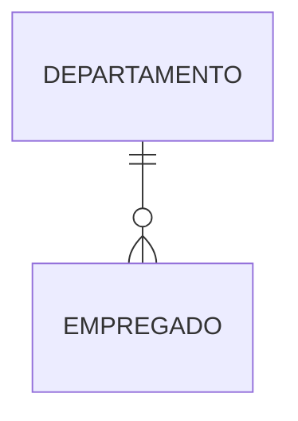

Nós lemos esse diagrama acima da seguinte forma: Um departamento pode possuir entre 0 a N empregados. Similarmente, qualquer empregado só pode pertencer a um único departamento.

Mais um exemplo dado no curso:

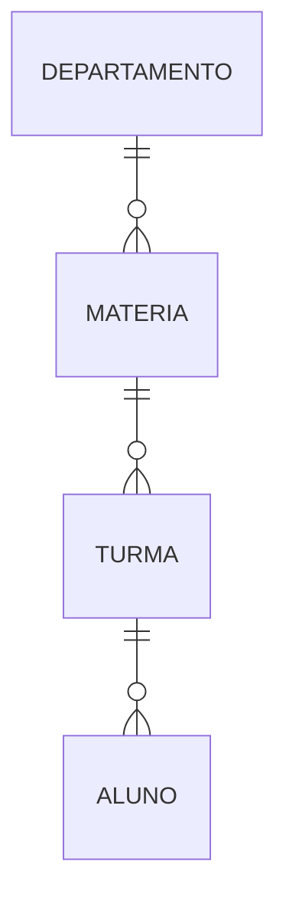

Nesse segundo exemplo nós temos um esquema básico de uma faculdade. Podemos ver que um `departamento` pode ofertar N `materias` e essas matérias podem ser ofertada em N `turmas`. Um aluno, por sua vez, só pode pertencer a 1 único curso.

#### Modelo de Entidades e Relacionamentos Estendido

#### Entidades Fracas e Relacionamentos Múltiplos

Até agora já sabemos mostrar entidades, suas propriedades e suas relações com outras entidades. Agora vamos aprimorar mais um pouco nosso modelo representativo adicionando hierarquia entre entidades.

> **Entidade Forte**: É qualquer entidade que existe por ela mesma e possui uma PK.

> **Entidade Fraca**: É toda entidade que não tem chave própria, ou seja, precisa ser identificada por meio de um relacionamento com outra entidade e por um identificador fraco (chave parcial).

> **Relacionamentos Estendidos**: São os relacionamentos entre mais de duas entidades (chamados de relacionamentos não binários).

Abaixo temos um exemplo de entidade fraca chamada `transacao`. Chamamos ela de entidade fraca porque ela precisa das chaves estrangeiras das contas para fazer sentido.

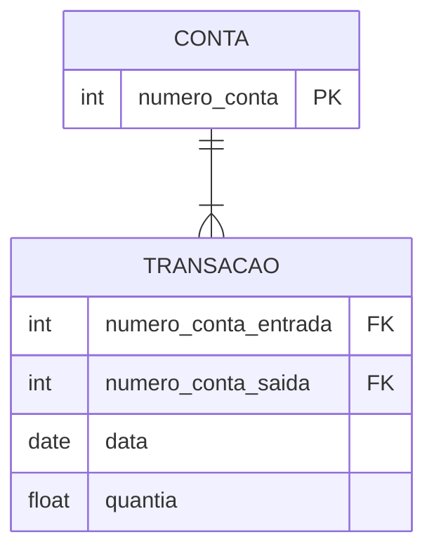

Agora vamos ver um exemplo mais complexo onde temos relacionamentos não binários.

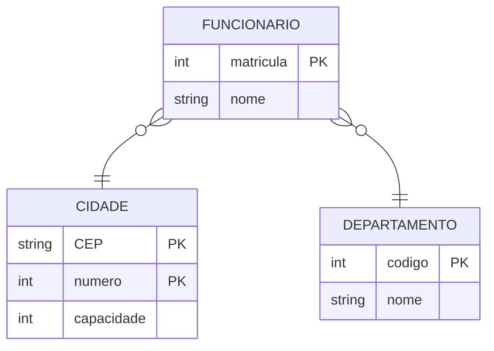

Aqui podemos ver que um registro de funcionário precisa indicar tanto a cidade quanto o departamento para que seja possível saber sua lotação.

##### Atributos de Relacionamentos

Na notação de Peter Chen também é possível derivar atributos dos relacionamentos igual fazemos com as entidades. A ideia é evidenciar quais dados surgem a partir da relação entre entidades.

> **Atributos de Relacionamentos**: São atributos derivados da associação entre entidades e não são oriundos das entidades per se.

:::danger[Aviso]
Essa derivação de atributos para relacionamentos só é encontrada no modelo de Chen. Dessa feita, vemos que a tendência  do mercado é alocar esses atributos diretamente a uma classe.
:::

Um exemplo de atributo de relacionamento pode ser encontrado na imagem abaixo.

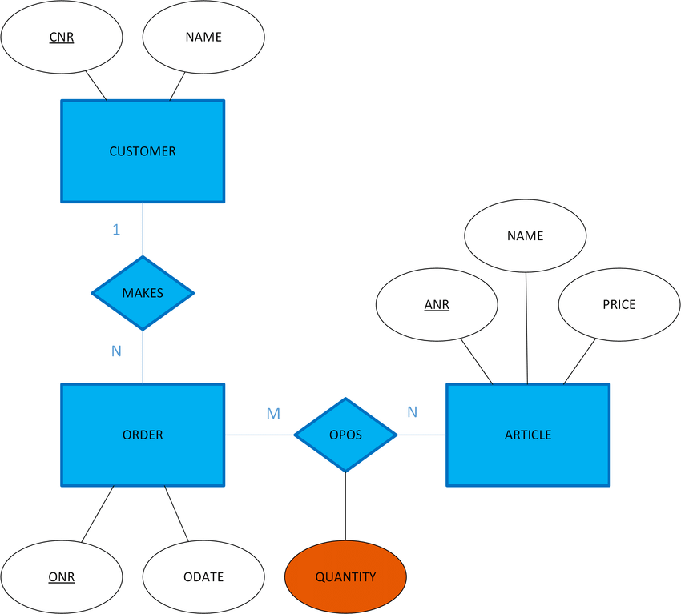

Veja que o relacionamento `OPOS` tem um atributo diretamente nele. Mas isso causa uma certa dificuldade quando vamos pensar nas tabelas do SGBD pois temos que definir **onde** esse atributo do relacionamento será salvo.

#### Modelagem de Supertipos e Subtipos

Algo comum de se deparar na construção de um modelo de banco de dados é relações de **hierarquia** entre as entidades. Desse modo, precisamos evoluir nosso modelo representativo para indicar classes gerais e classes específicas.

:::note[Comentário]
Essa é justamente a discussão que vimos na matéria de [Programação Modular](./04-programacao-modular.md).
:::

> **Generalização**: Atributos de uma classe genérica/superclasse/supertipo que indica atributos comuns a uma gama de outras entidades.

> **Especialização**: Processo de definir em detalhes uma classe genérica adaptando-a em casos mais concretos.

Na declaração de subtipos, devemos investigar como os tipos derivados podem ser classificados entre si.

> Para os casos onde uma entidade só pode ser de um subtipo[^7] usamos o termo **disjunção**. 

> Para os casos onde podem haver mais de uma relação[^8] usamos o termo **sobreposição**.

[^7]: Por exemplo, se um atleta de futebol é goleiro, ele não pode ser atacante.
[^8]: Por exemplo, um funcionário de um banco pode ser, também, um cliente do mesmo banco.

Outra relação importante de se definir é se a superclasse **precisa** ser definida em termos de subclasse. 

> Se a classe geral tiver uso sem uma especialização, usamos o conceito de **subtipo total**. 

> Caso ela tenha uso mesmo sendo classe geral mas permita uma especialização, dizemos que ela é **subtipo parcial**.

:::danger[Aviso]
Essa parte de subtipo e supertipo com classes total ou parcialmente separadas também só existe no modelo de Chen. Com o tempo, o mercado foi percebendo que "menos é mais" e tendeu para modelos que são mais fáceis de ler e entregam um resultado parecido em termos de compreensão.
:::

Abaixo temos um diagrama que reflete a mesma ideia do pertencimento parcial usando o diagrama de Crow's foot mas lembre-se que isso é apenas para efeito didático.

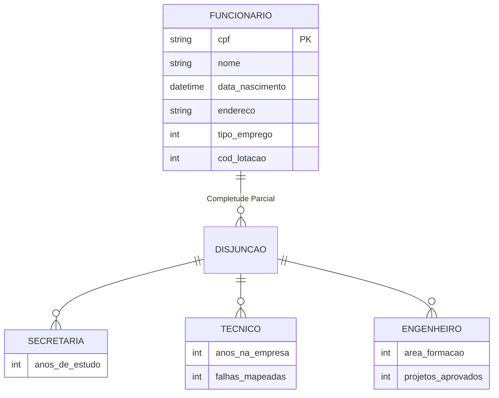

O diagrama acima é uma aproximação de como o modelo de Chen trata a especificação das classes. A ideia é evidenciar que, dado um funcionário, ele só pode ser de um único subtipo ou do tipo genérico.

Em outras palavras, podemos ter um registro de funcionário genérico mas, também, especificado entre as outras 3 categorias.

Agora vamos ver um exemplo de completude total onde a especificação se torna obrigatória.

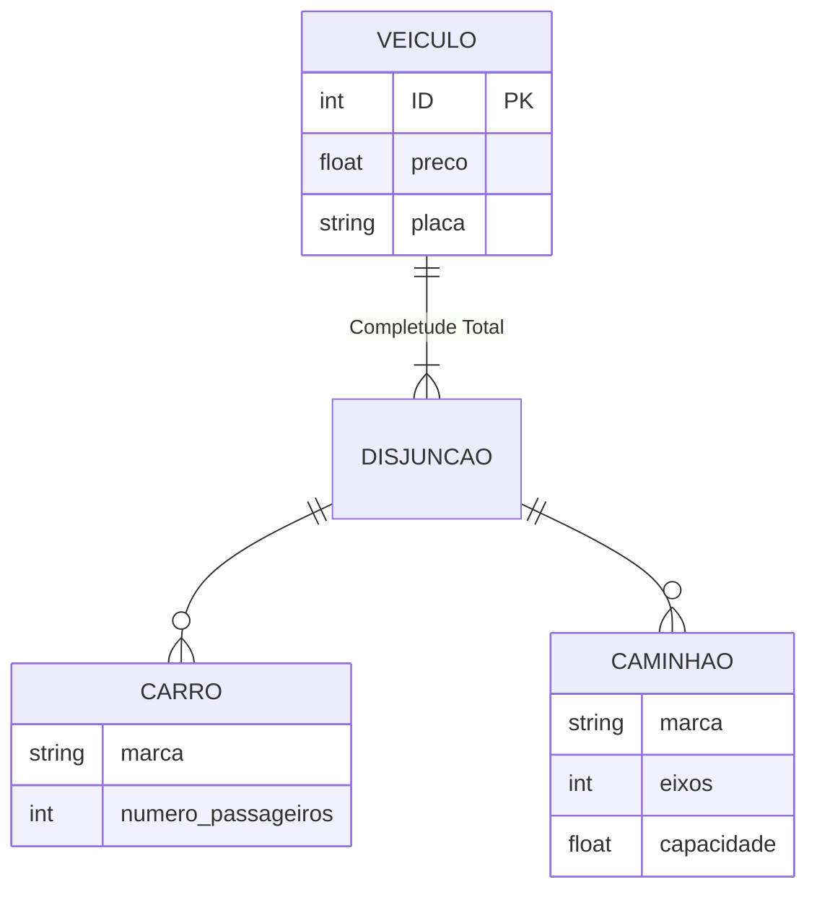

Nesse exemplo de uma concessionária de veículos, vemos que, dado um veículo, ele tem que pertencer obrigatoriamente há uma subcategoria.

Para encerrar essa parte, vamos ver um exemplo usando sobreposição ao invés de disjunção. No caso, modelamos o cenário de uma indústria que precisa controlar um insumo produtivo que pode vir tanto do seu estoque quanto do fornecedor.

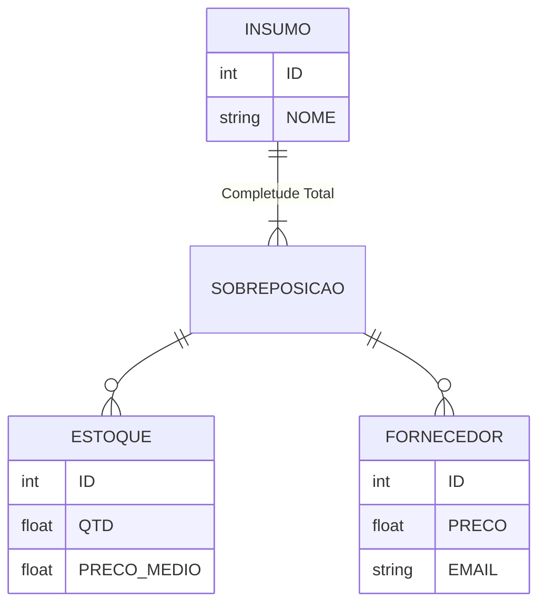


## Projeto de Banco de Dados Relacionais e Não Relacionais

### Modelo Relacional de Banco de Dados

Surgiu em meados da década de 70 por E.F. Codd como uma definição puramente derivada da teoria de conjuntos da matemática.

Em 1974, a IBM tentou implementar através do [Sistema R](https://people.eecs.berkeley.edu/~brewer/cs262/SystemR.pdf) o primeiro SGBD capaz de usar a, então novidade, **Linguagem de Consulta Estruturada** ou **Structured Query Language (SQL)** para recuperação de dados.

#### Conceitos do Modelo Relacional e Chave Primária

Agora vamos levantar alguns conceitos chaves do modelo relacional.

> **Relação** é qualquer tabela de valores onde cada linha representa uma relação de valores relacionados a uma mesma entidade. Por isso o nome do modelo é Modelo Relacional.

> **Tupla** são as linhas de uma relação (linhas na tabela) que são obrigatoriamente distintas entre si.

> **Atributo** são o cabeçalho de cada coluna, também chamado de **campo da tabela**. A quantidade de atributos[^9] define o grau da relação.

[^9]: Por exemplo, uma tabela `pessoa` com 2 colunas: `nome` e `idade`. É dita como sendo uma relação de grau 2.

> Chamamos de **Domínio** qualquer conjunto de valores válidos[^10] para um atributo.

[^10]: Para explicar melhor esse conceito, podemos pensar em uma tabela que tenha a coluna `grau_de_instrucao`. Ela só pode aceitar um valor string dentro da lista \[`fundamental`, `medio`, `superior`\]. Essa lista de opções é o **domínio** do atributo `grau_de_instrucao`.

:::warning[Atenção]
Não podemos confundir **Domínio** com **Tipo Físico** do atributo. Tipo físico é relacionado ao modo como a variável é salva no hardware (ex: `string`, `int`, `float` e etc). Domínio é a lista de valores aceitos no atributo.
:::

Aqui temos um exemplo de implementação de domínio na prática

```sql
CREATE TABLE Funcionarios (
	Nome VARCHAR(100) NOT NULL, 
	Idade INT NOT NULL CHECK (Idade BETWEEN 18 AND 65), 
	Departamento VARCHAR(50) NOT NULL CHECK (Departamento IN ('RH', 'TI', 'Financeiro')) 
);
```


Além dos conceitos acima, existem algumas regras que o modelo relacional adota implicitamente que são importante de se ter em mente:
- Os valores dos atributos são **atômicos** ou seja, só existe 1 endereço para cada intersecção linha-coluna.
-  No modelo relacional se admite o valor **nulo** que não é igual à string vazia ou zero.

Para encerrar, podemos definir uma dada relação $R(A_1, A_2, ..., A_n)$ onde $R$ é o nome da relação, $A_i$ é o nome do atributo, $n$ é o grau da relação.

Os dados dentro da relação são as tuplas definidas por $r(R)$ de modo que $r = \{t_1, t_2, ..., t_n\}$.

##### Chave Primária

> A **Chave Primária** é a coluna (ou combinação delas) que define de maneira cabal a distinção entre entidades em uma dada tabela.

Para identificarmos uma chave primária basta nos perguntarmos se existe algum atributo que identifique toda a tupla de modo inequívoco.

> **Chave Primária Composta** é a identificação criada a partir de mais de um atributo da relação (aka tabela).

:::warning[Atenção]
Não podemos dizer algo como "chaves primárias" para o caso da chave composta porque o conceito de chave primária só admite singular. Mesmo que nossa chave seja feita através de múltiplas colunas.
:::

> **Chave Alternativa** é outra coluna que também pode ser usada como chave primária mas que foi preterida por outra.

#### Integridade Referencial e Chave Estrangeira

A chave estrangeira nada mais é do que a implementação real de um relacionamento.

> **Chave Estrangeira** ou **Foreign Key (FK) ** é a referência de uma chave primária em outra tabela de modo que contém o mesmo domínio de dados.

Com esse conceito, já podemos evoluir nosso entendimento de entidades em mais uma maneira de classificação das mesmas.

Para se garantir a integridade da relação, temos algumas regras que devem ser seguidas:
- **Integridade de Domínio**: O domínio da FK deve ser o mesmo que o da PK a qual faz referência.
- **Integridade de Entidade**: Se existe uma FK, deve existir uma entidade na tabela de referência.
- **Integridade de Chave**: Não se admite duplicidade de PK.
- **Integridade Referencial**: A FK ou é um valor nulo ou um valor que obedece a relação $PK(t_1[FK] = t_2[PK])$.

Essas restrições acima são verificadas sempre que uma nova tupla (ou linha na tabela) é inserida.

No caso de exclusão ou atualização,  podem haver situações que a manipulação da tupla que contenha uma PK referenciada em FK não é permitida forçando a adoção de algum saneamento. Temos três cenários possíveis:
1. `ON DELETE/UPDATE SET NULL` - Todas as FK serão mudadas para nulo.
2. `ON DELETE/UPDATE SET DEFAULT` - Todas as FK adotam um valor default definido na DDL.
3. `ON DELETE/UPDATE CASCADE` - Autoriza a propagação do delete em todas as referências.

:::danger[Aviso]
Só use `CASCADE` junto com commit das mudanças na query porque você deve sempre ser capaz de reverter esse impacto gerado em caso de algo sair errado.
:::

### Mapeamento do Modelo de Entidades e Relacionamentos para Modelo Relacional

#### Mapeamento de Entidades e Atributos

Até agora, nós estávamos focados em aprender  os diagramas do modelo MER que mostram as entidades, seus atributos e seus relacionamentos. Mas no final desse trabalho, é necessário converter (ou mapear) essas entidades em tabelas.

:::warning[Atenção]
A etapa de desenho das entidades, atributos e relacionamentos é chamada de **Modelo Entidade Relacionamento (MER)**. Por sua vez, quando implementamos esse desenho em um SGBD nós temos um **Modelo Relacional**.
:::

Na hora de mapear nossas entidades, existem algumas técnicas que podemos fazer uso para cumprirmos essa tarefa.

Técnicas de Mapeamento de Entidades:
- **Mapeamento de Entidade Regular**: Toda entidade forte se torna uma tabela e cada atributo se torna uma coluna[^11].
- **Mapeamento de Atributos Multivariados**: Todo atributo multivalorado[^12] será convertido em uma tabela com a FK apontando para a entidade forte.
- **Mapeamento de Entidade Fraca**:  Criamos uma tabela para a entidade fraca com a FK de alguma entidade forte.

[^11]: Atributos compostos no modelo de Chen simplesmente se tornam colunas ignorando o nome do atributo. Por exemplo, se a classe `pessoa` tem um atributo composto `endereco` que contém outros atributos como `rua` e `numero`. Nós vamos colocar as colunas `rua` e `numero` como colunas da tabela `pessoa`. No modelo de James, a gente nem precisa bater cabeça com isso porque a notação dele não permite atributos compostos.

[^12]: Já vimos lá em cima no conteúdo que atributos multivalorados só existem no modelo de Chen. No de James nós somos obrigados a converter esse conceito em uma entidade fraca.

#### Mapeamento de Relacionamentos

Na hora de mapear os relacionamentos, nosso foco tem que ficar na definição das FK nas tabelas de referências aos objetos de completude parcial ou total.

##### Casos de Relacionamentos 1:1 ou 1:N

Para definir onde nossa FK será implementada, basta se perguntar qual a entidade dependente da outra. Um exemplo clássico é o de conta em um banco.

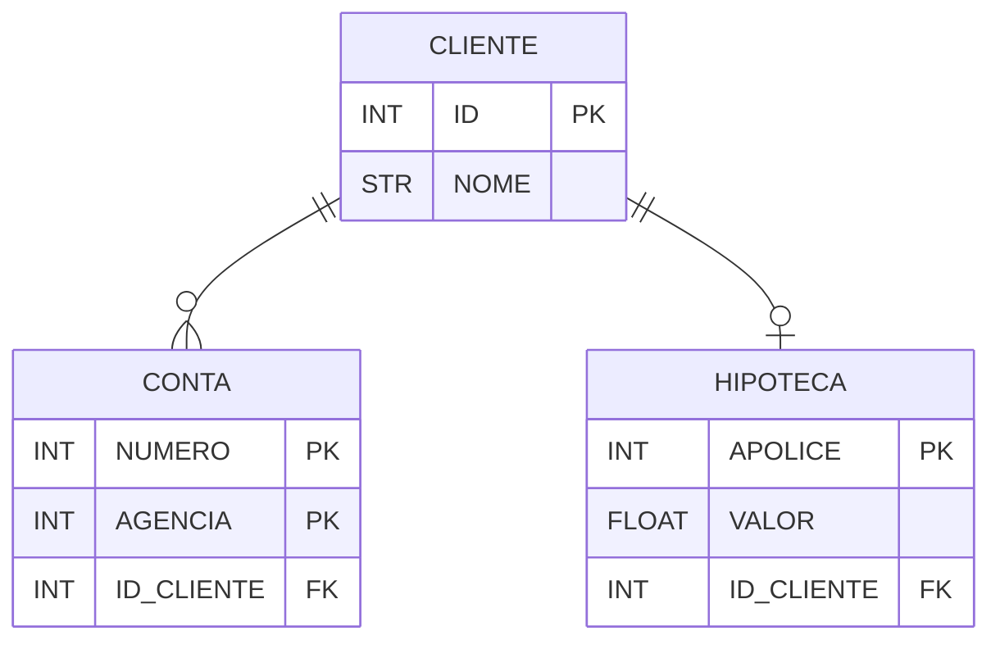

Só pode haver uma conta se anteriormente existir um cliente. Um cliente pode ter mais de uma conta mas todas elas precisam se remeter ao id do cliente para fazer algum sentido. Similarmente, uma hipoteca só pode existir se o cadastro do cliente existir antes, a diferença é que cada cliente só pode ter uma única hipoteca por vez.

##### Caso de Relacionamento N:N

Esse caso é mais complexo porque cada entidade por se referenciar mais de uma vez a outra. A melhor saída desse caso é a criação de uma tabela nova que usa FK de cada entidade para criar uma linha na tabela de relacionamento.

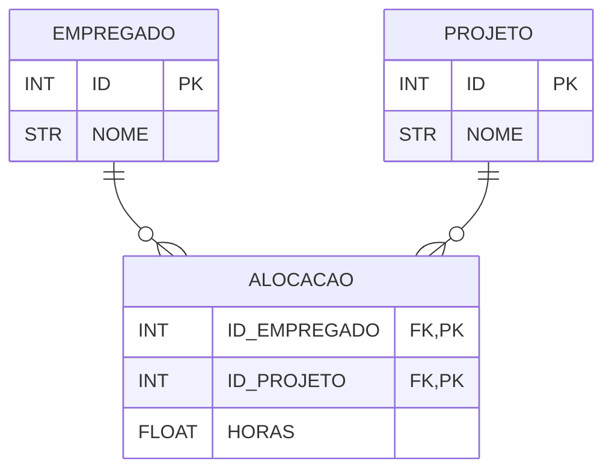

##### Caso de Relacionamento N-ário

Esse caso é mais raro e indica uma relação múltipla entre mais de duas entidades. No geral, podemos quebrar em relacionamentos binários mas por agora vamos aprender também esse meio de mapeamento.

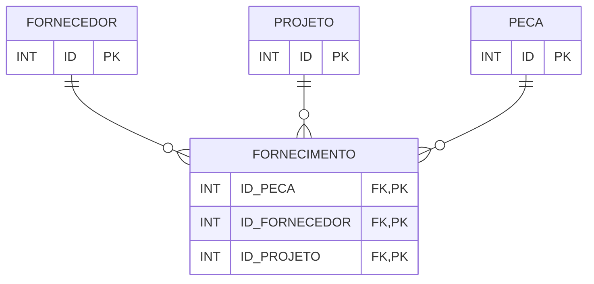

Similar ao caso 1-N, tivemos que nos valer de uma tabela de relacionamento. A diferença é que a chave primária composta aumentou de 2 (caso 1-N) para N valores.

##### Casos de Generalização-Especificação

Bancos de dados não implementação herança. Dessa feita, nós temos que converter os relacionamentos de completude parcial e total em tabelas.

Voltando no exemplo dos veículos. Nós temos 3 opções do que fazer.


Maneiras de mapear:
1. Criar uma tabela `veiculo` com colunas adicionais que só serão preenchidas no casos específicos de `carro` e `caminhao` sinalizando na coluna `tipo` colocando null quando não relevante.
2. Criar tabelas `carro` e `caminhao` com as colunas pertencentes à tabela `veiculo`. Desse modo, teremos duas classes independentes entre si mas com algumas colunas de sentido compartilhado.
3. Criar uma tabela para cada entidade, passando a FK do relacionamento `veiculo` como indicativo.

:::note[Comentário]
Cada uma das abordagens tem prós e contras mas, na minha experiência, o terceiro caso é o mais comum.
:::

### Problemas de Desenho em Bancos Relacionais

Se aplicarmos tudo que aprendemos até o momento, ainda seremos passíveis de cometer erros que podem comprometer o desempenho e, por fim, a utilidade do nosso modelo.

Nessa seção, vamos elencar alguns dos casos mais comuns que levaram ao desenvolvimento de uma metodologia de avaliação de desenho de modelos relacionais que veremos na seção de **Normalização**.

#### Sentido Semântico dos Atributos Obtuso

> Sempre desenhe um esquema relacional de modo que seja fácil explicar o seu sentido, para isso, **não** misture atributos de entidades diferentes e de relacionamentos em uma mesma tabela (relação).

No geral, essa regra se baseia no fato que devemos pensar em cada relação como representante de uma entidade ou de um relacionamento. Desse modo, se misturarmos atributos de mais de uma entidade ou relacionamento, estaremos aumentando desnecessariamente a complexidade do sentido semântico do nosso modelo.

<details>
<summary>Exemplo</summary>

Abaixo temos um exemplo do que não fazer pois acabamos misturando informações relativas ao departamento que são relacionadas exclusivamente à outra entidade separada da entidade `EMPREGADO_DEPARTAMENTO` (que por sua vez, é basicamente a entidade `empregado` com informações adicionais de departamento). 

Para corrigir isso, devemos indicar separar completamente o relacionamento entre essas entidades de modo atômico.

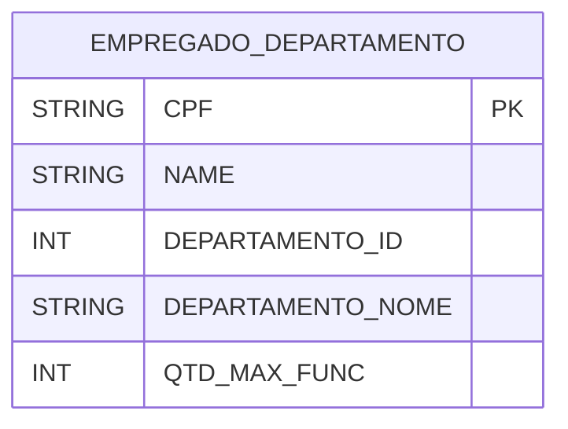

Agora, vamos ver como deveria ser:

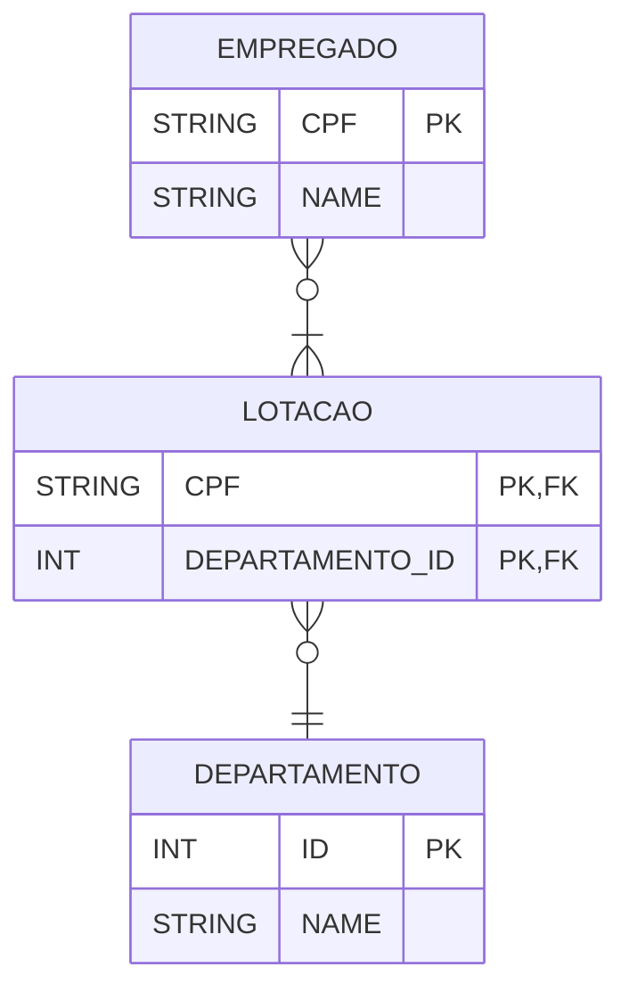

Para entender intuitivamente onde estava o problema, basta se colocar no papel de alguém que ia explicar a tabela `EMPREGADO_DEPARTAMENTO`. Veja que você ia precisar explicar quais colunas se referiam ao funcionário e quais se referiam ao departamento.

No exemplo corrigido, tudo fica super simples porque só correlacionamos as entidades sem misturar nenhum dos seus atributos.
</details>

#### Informação Redundante em Tuplas e Anomalias de Atualização

> Devemos desenhar um esquema relacional de modo a não produzir anomalias de insert, deletion ou update. Caso seja impossível evitar, devemos nos assegurar que os programas sempre levarão as anomalias em consideração na hora de interagir com o banco.

Seguindo o exemplo do caso anterior, podemos ver que a tabela `empregado_departamento` sempre irá repetir as informações do departamento para cada empregado. Isso tem impacto no custo de storage do servidor de banco de dados e, como se não fosse suficiente, pode levar a anomalias vários tipos de anomalias.

Essa junção entre informações de diferentes entidades em uma nova relação chamamos de **Natural Join**.

Somente por termos um mal design nas tabelas, nos expomos a várias anomalias que podemos elencar abaixo.

1. Anomalias de Inserção
	1. Para criar uma nova entrada de empregado, sempre será necessário consultas as informações do departamento e duplicar essas mesmas informações em cada linha de empregados que estão lotados no mesmo departamento. Caso o empregado não tenha departamento ainda, teremos que inserir `NULL` em todas as colunas referentes ao departamento.
	2. Nós simplesmente não seremos capazes de inserir um novo departamento que ainda não tem nenhum funcionário porque o `cpf` é PK.
2. Anomalias de Deleção
	1. Caso um departamento perca todos os seus empregados, nós perderemos a informação do departamento definitivamente porque ela só existe na tabela `empregado_departamento`.
3. Anomalias de Modificação
	1. Se mudarmos o nome de um departamento, termos que fazer update em **todas** as linhas de empregados lotados no mesmo. Qualquer erro nesse update e teremos dados conflitantes na base de dados.

:::info[informação]
Em alguns casos, teremos que pensar nos relatórios ou consultas frequentes que serão demandas. Caso haja necessidade de se consultar entidades com relacionamentos de maneira misturada, devemos usar `views` ao invés de jogar essa responsabilidade para o banco de dados.

Em casos que demandam muita performance, podemos usar `stored procedures` junto com `triggers` para garantir que sempre teremos dados livres de anomalias na tabela que precisa conter atributos misturados. O conceito dado para uma tabela desse tipo é **view materializada**.
:::

#### Valores `NULL` em Tuplas Desnecessários

> Evite a todo custo adicionar atributos em relações de base (ou seja, entidades básicas) que terão valores `NULL` frequentemente. A regra geral é `NULL` ser sempre uma exceção.

Ao invés de termos relações (ou tabelas) grandes com vários campos opcionais, devemos dar preferência à quebra desses campos em relacionamentos com outras tabelas usando FK. A explicação disso é que `NULL` é um dado, e por ser um dado, ele ocupa espaço no storage e pode causar problemas de operação de queries dado que trabalhar com dados nulos não é sempre trivial.

Outro problema sério é que o sentido semântico de um campo nulo é notadamente ambíguo. Por exemplo, podemos pensar que uma coluna (ou atributo) nulo signifique:
1. Que o valor na tupla é "não aplicável".
2. Que o valor na tuple é "desconhecido".
3. Que o sabemos que o valor existe mas, naquele momento, é incerto ou resta pendente.

Como saber com certeza o que cada campo anulável (ou nullable) realmente quer dizer? Claramente, estamos aumentando o risco de falha no entendimento do nosso modelo de dados.

#### Tuplas Espúrias

> Devemos evitar relações que contenham atributos comparáveis com atributos PK e FK de outras relações.

A ideia desse problema surge quando temos que fazer JOIN por atributos que não são PK (e se não mapeados, também não serão FK) de nenhuma relação. O impacto disso é que a tabelar resultante do JOIN poderá ter tuplas (ou linhas) que não fazem sentido (por isso chamadas de espúrias).

<details>
<summary>Exemplo</summary>

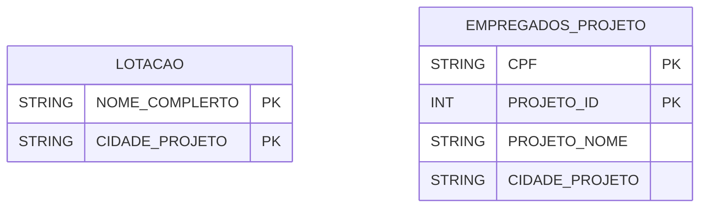
Se quisermos uma consulta que nos diga todos os empregados por projeto com o nome completo do empregado, teremos problemas pois só temos a coluna `CIDADE_PROJETO` como possibilidade de JOIN.

Isso causaria linhas que não fazem sentido onde um nome completo de um funcionário estaria ligado a um cpf de outro.

</details>

### Normalização

Vamos recapitular o que já aprendemos até agora:
1. Sabemos criar modelos relacionais representativos de uma implementação real de entidades e relações.
2. Já sabemos os erros mais comuns que um desenho ruim pode causa.

Agora, precisamos de ferramentas para medir a **qualidade** do nosso design. Esse esforço de avaliar o modelo é chamado **normalização** mas vamos dar uma definição mais precisa logo à frente.

:::info[Contexto Histórico]
<details>
<summary>Um pouco de história</summary>

A primeira pessoa a propor o processo de normalização foi Codd no artigo “Further Normalization of the Data Base Relational Model,” in Rustin [1972]. Onde ele propôs uma série de testes que certificariam se determinada relação satisfaz uma certa forma normal.

Originalmente, foram propostas 3 formas normais sendo que a definição mais formal da terceira forma foi dada posteriormente por Boyce e Codd.

Com o passar dos anos, foram definidas mais 2 formas normais que são baseadas nos conceitos de dependências multivaloradas e dependências conjuntas.
</details>
:::

Para conseguirmos entender bem o que é **normalização** precisaremos de um conceito que é a base na qual construiremos nossa análise.

:::info[Informação]
Como sempre, vale destacar que só vamos ter uma introdução geral ao assunto. Quem tiver interesse em aprofundar mais, pode conferir a aula que eu anexei aqui em baixo. Outra fonte recomendada (em inglês) é o capítulo 14 do NAVATHE.

<details>
<summary>Aula no Youtube</summary>

<iframe width="560" height="315" src="https://www.youtube.com/embed/GFQaEYEc8_8?si=_lX7T10bG9wq4sx9" title="YouTube video player" frameborder="0" allow="accelerometer; autoplay; clipboard-write; encrypted-media; gyroscope; picture-in-picture; web-share" referrerpolicy="strict-origin-when-cross-origin" allowfullscreen></iframe>

</details>
:::

#### Dependência Funcional

Até agora, sempre representamos nosso banco de dados em termos de tabelas e entidades, entretanto, nada nos impede de abstrair um desenho[^14] de banco de dados relacional como um conjunto de $n$ atributos $A_i$ de modo que $i \in \{1,2,...,n\}$. Ou seja, nosso banco de dados pode ser definido como $R = \{A_1, A_2, ..., A_n\}$.

[^14]: Isso não quer dizer que é uma boa ideia representar um banco de dados como uma tabela única. Significa apenas que podemos **pensar** num banco de dados como um conjunto de atributos (independente de qual tabela cada atributo está).

> Uma **Dependência Funcional (DF)**, escrita por $X \rightarrow Y$[^13], sendo $X$ e $Y \subset R$, define uma **limitação** para as tuplas possíveis que podem expressar uma relação $r$ de $R$.
>  
> Essa relação entre tuplas quaisquer $t_1$ e $t_2$ deve satisfazer a seguinte regra: Para qualquer $t_1$ e $t_2$ em $r$, deve ser verdade que se $t_1[X] = t_2[X]$, então, $t_1[Y] = t_2[Y]$.

Se for definido em $R$ que não é possível existir duas tuplas de modo que $t_1[X] = t_2[X]$ temos, então, uma **chave candidata** visto que é um valor (ou conjunto de valores) que exprime uma relação atômica.

[^13]: Lê-se algo como "Y é dependente funcional de X".

:::danger[Aviso]
Preste muita atenção nesse conceito porque o Navathe se refere a ele como "O conceito mais importante na teoria do design de esquemas relacionais".

Quem sentir dificuldade com a linguagem usada, vale a pena conferir a parte de [matemática](../02-primeiro-periodo/04-matematica-basica.md)
:::


:::info[informação]
<details>
<summary>Exemplo</summary>

Calma, nem é tão complexo quanto parece. A primeira coisa é lembrar que **tupla** pode ser entendido nesse contexto como linhas das tabelas. Nesse caso em especial, estamos dizendo algo como "Se duas linhas dos atributos X são iguais, com certeza absoluta, essas linhas também serão iguais nos atributos Y".

Temos essa certeza porque sabemos que Y depende de X. Então, se X diz que algo é igual, Y também dirá a mesma coisa.

Para simplificar, podemos pensar X e Y como um atributo só. Por exemplo, X = `cpf` e Y = `nome`. Nós sabemos que, se 2 cpfs são iguais, eles **precisam** estar se referenciando à uma mesma pessoa. Como os `cpf` iguais implicam em estarmos falando de uma mesma pessoa, os campos `nome` referentes a cada entrada do `cpf` também serão iguais.

Por isso, podemos dizer que `nome` depente de `cpf`. Ou, na linguagem formal, `cpf` $\rightarrow$ `nome`.
</details>
:::

Agora que sabemos o que é uma dependência funcional, estamos prontos para usar esse conceito na definição de uma metodologia formal para melhoria e teste do nosso desenho de banco dados relacional.

#### Formas Normais baseadas em Chaves Primárias

Para construir nossa metodologia de avaliação de esquemas relacionais, nós vamos supor que:
- Para cada relação, existe um conjunto de dependências funcionais.
- Para cada relação, existe uma definição de chave primária.

> Chamamos de **Processo de Normalização** o conjunto de testes (baseados nas duas condições acima) feitos nos modelos relacionais para mensurar a **forma normal** que o esquema (ou modelo) pode ser avaliado.

Se bem executado, o processo de normalização acarreta a redução de 2 problemas:
3. Reduzir redundância
4. Redução de anomalias nos processos de DML que alteram dados.

> Chamamos de **Forma Normal** a referência ao mais alto grau de condições que uma relação[^15] contém. A definição de cada forma normal é derivada exclusivamente do conceito de dependência funcional sobre os atributos de uma relação.

[^15]: Que também podemos chamar de tabela.

Se uma determinada relação não passar no teste para uma forma normal, será necessário fazer uma decomposição em relações menores até se obter a adequação à forma.

# cap 14.3.1 pg 506

#### Terceira Forma Normal

### Banco de Dados Não-Relacionais

#### Database NoSQL

### Segurança

#### Segurança de Banco de Dados

## Bibliografia

- ELMASRI, Ramez; NAVATHE, Shamkant B. **Sistemas de banco de dados.** 7 ed. São Paulo: Person, 2018. 
- MARTIN, James. **Principles of Data Base Management**.
- CHEN, Peter. **Modelagem de dados: A abordagem para Projeto Lógico**.
- E.F. Codd. **A Relational Model of Data For Large Shared Data Banks**. Comm. ACM 13, 6 (June 1970), 377-387.
- ROB e Coronel. **Database Systems: Design**. Implementation and Management Wadworth Series (1993).

[^14]: 
