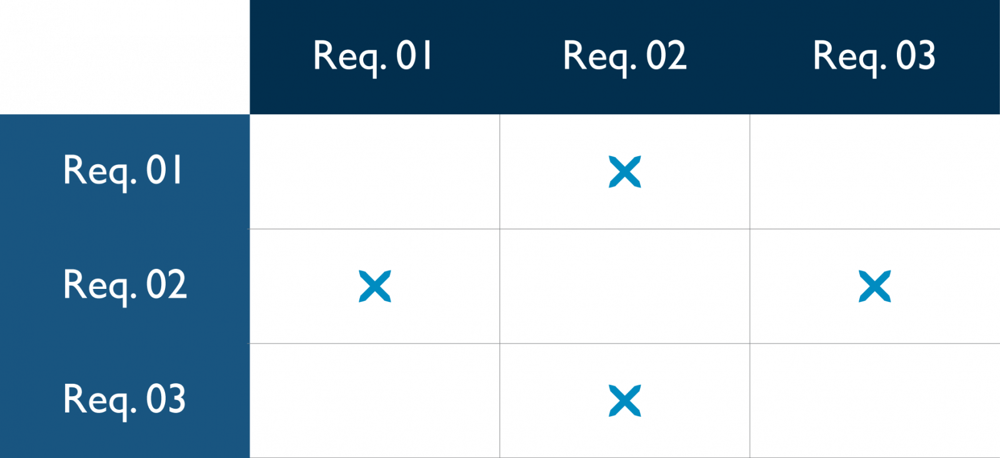

# Gerência de Requisitos

Para tirarmos o máximo proveito dessa matéria, é **muito** indicado que os conteúdos vistos na parte de requisitos da disciplina de [introdução à engenharia de software](../02-primeiro-periodo/06-fundamentos-engenharia-software.md) lá no primeiro período e, também, todo o microfundamento de [engenharia de requisitos](../03-segundo-periodo/02-engenharia-requisitos.md).

## Administração e Rastreabilidade de Requisitos
### Introdução à Gerencia de Requisitos
#### Requisitos de Software

Como disse [Frederick Brooks](https://en.wikipedia.org/wiki/Fred_Brooks): "A parte mais difícil de construir um sistema de software é decidir exatamente o que construir".

É exatamente nesse contexto que as técnicas de elicitação de requisitos e definição de escopo que a engenharia de software desenvolveu atuam. Uma vez definido o que se deseja, nascem os **Requisitos de Software**.

Podemos entender os requisitos como características e limitações que nossa solução terá. Além disso, esse conceito está relacionado à documentação a respeito dessas duas naturezas.

Existem diferentes tipos de requisitos de software. Podemos agrupa-los em:

- **Requisitos Funcionais** - "O que o software deve fazer?"
- **Requisitos Não Funcionais** - "Como o software deve operar?"

Além dessa classificação quanto a tipo de requisito, podemos agrupa-los segundo o seu nível de abstração:

- **Requisitos de Produto** - Características sobre o produto em si
- **Requisitos de Projeto** - Características do processo de desenvolvimento
- **Requisitos de Sistema** - Características sobre a arquitetura da solução

Quando estamos redigindo o artefato que contém os requisitos temos que nos atentar para captar os **atributos** dos requisitos para que todos os envolvidos possam usar essa fonte de informação de maneira efetiva.

Dentre os atributos, podemos destacar alguns muitos importantes:

- Identificador
- Nome
- Descrição
- Versão
- Autor
- Fonte
- Risco
- Prioridade
- Responsável
- Tipo
- Status do Conteúdo
- Status da Validação
- Status do Acordo
- Esforço\Dificuldade
- Versão\Release
- Obrigações Legais
- Referência Cruzada com outros requisitos
- Observações

:::note[Comentário] 
Pois é, quem achava que gerir requisito era só anotar em post-it tá muito enganado. Tudo isso deve ser, idealmente, coletado para que o processo de desenvolvimento seja feito de maneira produtiva e que o produto final atenda as expectativas do clientes.
:::

#### Stakeholders
Até aqui, temos um bom entendimento de que precisamos entender profundamente o que nossa solução fara e como será feito. Entretanto, ainda temos uma pergunta muito importante a ser respondida: **Para quem?**.

É justamente para responder essa pergunta que temos mais uma palavra em inglês para aprendermos (e parecer inteligentes naquele churrasco de domingo). A palavra é **Stakeholder**.

Esse termo é usado para definir as partes interessadas (podem ser indivíduos específicos ou grupos de pessoas) no programa que vamos construir. Essas partes podem ser de dentro ou fora da organização. A única regra para a definição é ser impactado com o nosso produto de software.

Basicamente, podemos dividir os stakeholders em três grandes grupos:

- Externos
- Internos
- Time de desenvolvimento

Desse modo, os requisitos sempre são relacionados a, pelo menos, um stakeholder. Normalmente, um projeto possui um número bem grande deles.

Um grupo de stakeholders particularmente muito importante são os **Clientes** e, dentro desse grupo, os **Usuários**. São eles (principalmente o segundo) quem realmente trazem as demandas concretas que terão grande relevância no desenvolvimento do nosso sistema.

Aqui tem um vídeo com um resumo animado desse assunto que vimos.

<iframe width="560" height="315" src="https://www.youtube.com/embed/8uZiGB8DeJg" title="YouTube video player" frameborder="0" allow="accelerometer; autoplay; clipboard-write; encrypted-media; gyroscope; picture-in-picture; web-share" allowfullscreen></iframe>

#### Atividades de Gerenciamento de Requisitos
A essa altura, já percebemos que qualquer software, que não seja um aplicativo pessoal que criamos para resolver problemas apenas nossos, possui uma grande lista de requisitos. Diante disso, precisamos de técnicas para agrupar, priorizar, validar e acompanhar esses vários requisitos.

É justamente nesse contexto que a **Engenharia de Requisitos** surge. Inicialmente, podemos dividi-la em dois grupos de atividades:

- Desenvolvimento
- Gerenciamento

Na primeira fase, estamos conhecendo melhor as necessidades e levantando a real necessidade[^1]. Essa fase é dividida em quatro subareas:

[^1]: Acredite, não é nada raro o próprio cliente não ter uma noção estrutura da real necessidade dele. Cabe ao gerente de requisitos fazer essa extração das necessidades e amadurecer a ideia na cabeça do cliente.

- Elicitação - levantamento dos requisitos
- Análise - verificação da harmonia dos requisitos
- Especificação - produção da documentação
- Validação - aprovação do baseline pelo cliente

Cabe a gerência de requisitos o acompanhamento da fase de desenvolvimento para que as mudanças (que sempre irão ocorrer) sejam adequadamente inseridas e documentadas para o atingimento da meta. Similar a fase de desenvolvimento, temos quatro subareas dessa atividade:

- Controle de Versão
- Controle de Mudanças
- Acompanhamento do Status
- Rastreabilidade

### Administração de Requisitos
#### Controle de Versão
Não podemos nos enganar. Nossa cabeça ao ler algo como "controle de versão" pensa logo em versionamento de código com git e github mas não é nada disso que vamos lidar agora.

O controle de versão como subárea da engenharia de requisitos é a atividade relacionada ao controle da documentação de baseline que é a guia para as fases de desenvolvimento de artefatos do projeto.

Sempre que o cliente muda de ideia, é responsabilidade dessa área em atualizar a documentação e comunicar a todos os setores impactados com essa mudança afim de evitar que algum esforço seja desperdiçado em atividades que não estão mais contempladas na baseline vigente do projeto.

Para manter o controle da documentação, usamos comumente o **versionamento semântico** para indicar as mudanças. Normalmente, podemos dividir as versões em 3 componentes:

**Major Version + Minor Version + Patch**

Como exemplo, nesse momento eu estou escrevendo esse trecho do material no Visual Studio Code versão 1.77.0. Ou seja, Major Version = 1, Minor Version = 77 e patch = 0.

#### Acompanhamento do Status
Não adianta nada levantar todas as necessidades sem que haja um trabalho de atualização do status em cada um deles.

O trabalho de acompanhamento é crucial para responder preguntas como "Quantos porcento do projeto já foi implementado?" ou "Ainda faltam quantas funcionalidades para ser implementadas?".

Cada requisito deve receber um status que foi previamente acordado de acordo com a prática de desenvolvimento de cada local. Normalmente, temos os seguintes status nos projetos:

1. Proposto
2. Em progresso
3. Rascunhado
4. Aprovado
5. Implementado
6. Verificado
7. Deferido
8. Deletado
9.  Rejeitado

Isso mesmo, vale muito a pena manter memória inclusive das ideias que foram descartadas porque, em várias situações, elas podem ser fontes de insights úteis.

### Rastreabilidade de Requisitos
#### Tipos de Rastreabilidade
Se temos uma certeza é a de que o projeto sofrerá mudanças ao longo do tempo. A medida que as necessidades do nosso cliente mudam, os requisitos também serão modificados. Para isso, temos que ser capazes de rastrear o impacto que essas mudanças trarão ao nosso pojeto.

Para isso, **temos** que ser capazes de realizar as ligações entre os requisitos e os elementos do sistema (outros requisitos, artefatos, código e etc).

A ligação entre requisitos é chamada de **rastreabilidade horizontal**. Já a relação entre os requisitos e os artefatos gerados por causa dele(s) é chamada de **rastreabilidade vertical**.

O nome dessa habilidade é o que chamamos de **rastreabilidade de requisitos**. É ela que nos permite interligar para saber quais impactos as mudanças terão no nosso projeto.

#### Matriz de Rastreabilidade
Agora que sabemos a importância da rastreabilidade. Temos que saber como fazer esse trabalho. De longe, a principal ferramenta usada para essa tarefa complexa é a **matriz de rastreabilidade**.

Para a construção, colocamos todos os requisitos, stakeholders e artefatos nas linhas e nas colunas colocamos requisitos e artefatos. Usamos uma marcação (como um x) para indicar que linha e coluna são relacionados.

## Priorização e Gerência de Mudanças de Requisitos
### Priorização de Requisitos
#### Identificando Prioridades
Todo projeto possui **sempre** duas restrições: tempo e dinheiro. Diante disso, ser capaz de indicar as prioridades é fundamental.

É claro que, uma vez que tenhamos nossa matriz de rastreabilidade preenchida. Não será muito complexo saber quais são os requisitos mais centrais ao nosso projeto, uma vez que, é comum que requisitos mais importantes sejam mais relacionados que os menos relevantes.

Além disso, temos algumas técnicas para elicitar os requisitos junto ao cliente. Podemos destacar 4 técnicas principais usadas nesse processo.

#### In or Out
Essa técnica envolve classificar os requisitos em duas categorias: "dentro" ou "fora" do escopo do projeto. Os stakeholders são solicitados a revisar e categorizar cada requisito como relevante e necessário ("dentro") ou irrelevante ou fora do escopo ("fora"). Isso ajuda a identificar os requisitos que são essenciais para o sucesso do projeto.

#### Pairwise Comparison and Rank Ordering
Essa técnica envolve comparar e classificar os requisitos em pares. Os requisitos são apresentados aos stakeholders em pares, e eles devem indicar qual requisito é mais importante ou prioritário em cada par. Com base nas respostas, é possível construir uma lista classificada dos requisitos por ordem de importância.

#### Three-Level Scale
Nessa técnica, os requisitos são classificados em três níveis: alta prioridade, média prioridade e baixa prioridade. Os stakeholders avaliam cada requisito e atribuem um dos três níveis de prioridade, com base na importância percebida do requisito para o sucesso do projeto. Essa técnica é simples e eficiente para classificar os requisitos em categorias de prioridade.

Uma vez que tenhamos essa avaliação, vamos classificar os requisitos com base em 2 critérios:

 - Urgente x Não tão urgente
 - Importante x Não tão importante

Com base nessa classificação saberemos em que etapas focar primeiro no processo de desenvolvimento.

#### MoSCoW (Must-have, Should-have, Could-have e Won't-have)
Nessa técnica, os requisitos são agrupados em quatro categorias:

 - Must-have: São requisitos essenciais, sem os quais o projeto não pode ser considerado bem-sucedido.
 - Should-have: São requisitos importantes, mas não essenciais. Sua inclusão é altamente desejável, mas o projeto pode progredir sem eles.
 - Could-have: São requisitos considerados como opcionais ou desejáveis. Sua inclusão pode trazer benefícios adicionais ao projeto, mas não são críticos.
 - Won't-have: São requisitos que não serão incluídos no projeto atual, mas podem ser considerados para projetos futuros.

#### $100 (hundred dollar)
Os stakeholders recebem uma quantia fictícia de "100 dólares" e devem distribuir esse dinheiro entre os diferentes requisitos, de acordo com a importância percebida de cada um. Eles podem gastar mais dinheiro nos requisitos mais importantes e menos dinheiro nos requisitos menos prioritários.

### Gerência de Mudanças de Requisitos
#### Processo de Controle de Mudanças
Agora que sabemos levantar, relacionar e priorizar os requisitos. Precisamos de uma última habilidade relacionada a gestão que é a **gestão de mudanças**.

O foco dessa atividade é reduzir o risco e padronizar o processo de mutação das necessidades do cliente para que a coerência do projeto não seja comprometida bem como esclarecer como essas mudanças trarão impactos ao projeto.

Para isso temos um artefato de solicitação de mudança. Com status parecidos ao dos requisitos:

 - Submetida
 - Avaliado
 - Aprovado
 - Realizada
 - Verificada
 - Encerrada
 - Rejeitada
 - Cancelada

#### Comitê de Controle de Mudanças
Como uma mudança dos requisitos é algo que pode ter impacto profundo no projeto em andamento, é muito comum a construção de um grupo de trabalho chamado de **Comitê de Controle de Mudanças\Change Control Board** para que uma avaliação interdisciplinar seja realizada nessas mudanças potenciais afim de termos uma avaliação melhor do impacto da mesma no todo do projeto.

Quem vai compor esse comitê é uma lista ampla de profissionais que vão desde o time de desenvolvimento até o staff gerencial.

#### Análise de Impacto de Mudanças
Podemos dizer que a maior responsabilidade do Comitê de Controle de Mudanças seja a avaliação do impacto de uma mudança proposta. Isso é feito com base nos instrumentos que já vimos anteriormente nesse microfundamento e a experiência do board para sabermos se vale a pena.

A análise sempre deve se basear no trade-off entre custo e benefícios da proposta.

## Bibliografia

- REINEHR, Sheila. **Engenharia de requisitos**. Porto Alegre SAGAH 2020 1 recurso online - (Engenharia de software). ISBN 9786556900674. Capítulos 2, 3 e 14.
- CARLOS EDUARDO VAZQUEZ; GUILHERME SIQUEIRA SIMÕES. **Engenharia de Requisitos: - software orientado ao negócio**. Editora Brasport 0 ISBN 9788574527963.
- WIEGERS, Karl; JOY, Beatty. **Software Requirements (Developer Best Practices)**. - Microsoft Press. ISBN 0735679665. Capítulos 1, 2, 3 e 27.
- VALENTE, Marco Tulio. **Engenharia de Software Moderna: Princípios e Práticas para Desenvolvimento de Software com Produtividade**, 2020.
- PRESSMAN, Roger S.; MAXIM, Bruce R. **Engenharia de software: uma abordagem profissional**. 8. ed. Porto Alegre: AMGH, 2016. E-book ISBN 9788580555349.
- SOMMERVILLE, Ian. **Engenharia de software**, 10ª ed. Pearson 768 ISBN 9788543024974.
- PAULA FILHO, Wilson de Pádua. **Engenharia de software**, v. 2 projetos e processos. 4. - Rio de Janeiro LTC 2019 1 recurso online ISBN 9788521636748.
- VETORAZZO, Adriana de Souza. **Engenharia de software**. Porto Alegre SAGAH 2018 1 - recurso online ISBN 9788595026780.
- WAZLAWICK, Raul Sidnei. **Engenharia de software conceitos e práticas**. Rio de Janeiro GEN LTC 2013 1 recurso online ISBN 9788595156173.

[def]: !matr