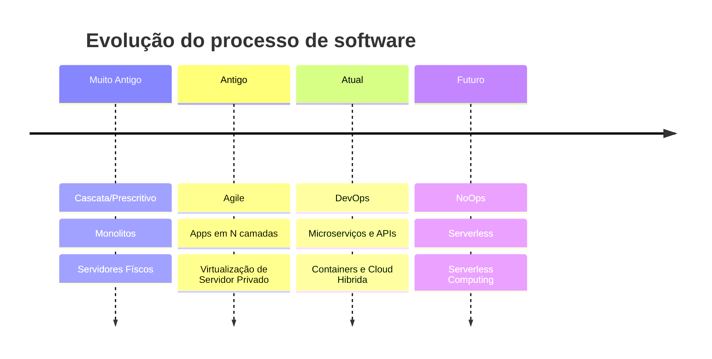

## O que é Arquitetura de Software?

Podemos usar essa resposta do [stack overflow](https://pt.stackoverflow.com/questions/25403/qual-a-diferen%c3%a7a-de-arquitetura-e-engenharia-de-software) Como um ponto de partida para nossa discussão.

Como regra de bolso, podemos pensar que a **Engenharia de Software** é o grande conjunto das habilidades de construção de programas e sistemas desde sua concepção até a entrega e manutenção. Por sua vez, a **Arquitetura de Software** é uma sub-área da engenharia que lida com o desenho e definição dos componentes que farão parte da solução entregue.

## Qual o momento ideal para aprender sobre Arquitetura?

Na minha opinião, o momento ideal para aprender a arte de planejar soluções de software é após a fase em que você é capaz de construir software minimamente útil e funcional.

Para ser mais claro, depois que você tiver terminado de estudar pelo menos o ciclo básico[^1] e **também** tenha alguma vivência do mundo real[^2].

## Contexto Histórico

Antigamente, a maneira de se hospedar aplicações (principalmente no ambiente corporativo) era bem diferente de como é feito hoje com a chegada do **cloud** como principal meio de hospedagem.

Aliado à evolução de "onde" colocar seus programas, vieram também as mudanças em "como" o processo de construção de sistemas é feito (por exemplo, o surgimento das metodologias ágeis).

[^1]: Como o material de [Tecnólogo em ADS](category/arquitetura-de-software) aqui do site.

[^2]: Seja trabalhando ou fazendo freelance.
