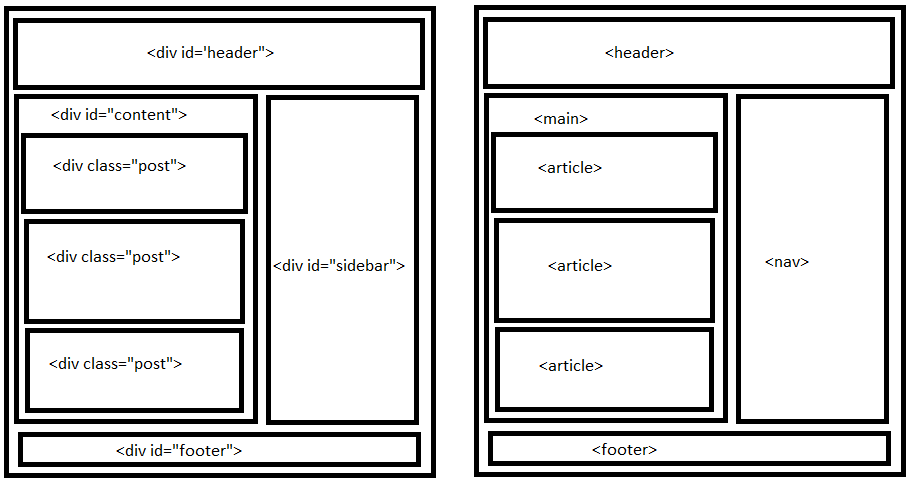
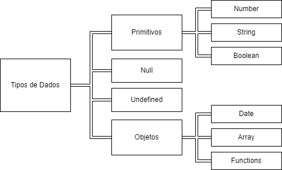
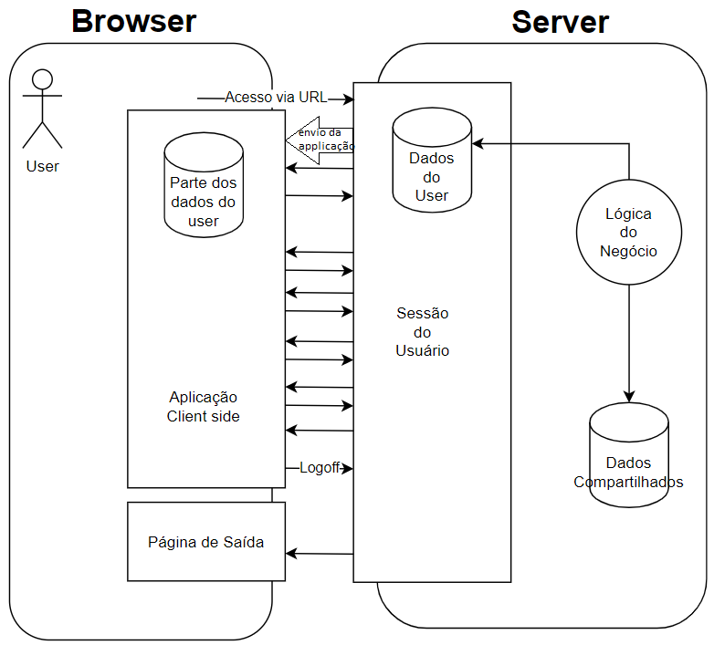

## Assuntos
- [**A web: Evolução, Padrões e Arquitetura**](#a-web-evolucao-padroes-e-arquitetura)
    - [Histórico e Evolução da Web](#historico-e-evolucao-da-web)
    - [W3C e os Padrões da Web](#w3c-e-os-padroes-da-web)
    - [Componentes da Arquitetura da Web](#componentes-da-arquitetura-da-web)
    - [URI, URL e URN](#uri-url-e-urn)
    - [Protocolo HTTP](#protocolo-http)
    - [Servidores Web](#servidores-web)
    - [Dinâmica de Aplicações Web](#dinamica-de-aplicacoes-web)
- [**Desenvolvimento de Interfaces Web**](#desenvolvimento-de-interfaces-web)
    - [A Linguagem HTML](#a-linguagem-html)
    - [A Linguagem CSS](#a-linguagem-css)
    - [A Linguagem JavaScript](#a-linguagem-javascript)
- [**Bibliografia**](#bibliografia)


## A web: Evolução, Padrões e Arquitetura


### Histórico e Evolução da Web

A Web é um sistema da informação de hipertextos onde o acesso é feito por meio de 	**navegadores (browsers)**.

Existem alguns protocolos comuns para transferência de alguns tipos de arquivos. Para mensagens (e-mail) usamos o 	**SMTP**, para transferência de arquivos usamos o 	**FTP**, aplicações de telefonia usam o 	**VOIP** e para páginas de conteúdo usamos o 	**HTML**.

A história da web eu ainda vou colocar aqui quando tiver mais tempo.

### W3C e os Padrões da Web
O WORLD WIDE WEB CONSORTIUM (W3C) é uma organização sem fins lucrativos cujo líder é o Tim Berners-Lee, justamente o inventor da Web. Existem várias organizações ao longo do planeta que fazem parte desse consórcio internacional.
O W3C mantém a gestão de vários padrões usados todos os dias:

- Design e Aplicações Web (HTML, CSS, SVG, Ajax, Acessibilidade);
- Arquitetura da Web (Protocolo HTTP, URI);
- Web Semântica (Linked Data - RDF, OWL, SPARQL);
- Web Services (SOAP, WSDL);
- Tecnologia XML (XML, XML Schema, XSLT);
- Navegadores e ferramentas de autoria.

A W3C possui um processo de publicação das normativas. Normalmente, o fluxo é:

- Working Draft (WD)
- Candidate Release (CR)
- Proposed Recomendation (PR)
- Recomendation (REC)

### Componentes da Arquitetura da Web

A web pode ser entendida como uma coleção de componentes que permitem a comunicação entre o cliente e os servidores de aplicações. Os principais componentes dessa arquitetura são:

- **Ambiente Cliente (Client Web**)
    - Geralmente um Browser que envia as requisições usando o protocolo HTTP(S) para o servidor web através de uma rede de computadores.
- **Ambiente Servidor** 
    - O ambiente servidor possui vários componentes (banco de dados, aplicações, API e etc) mas o principal componente é o servidor web. Ele recebe a requisição HTTP(S) do client, interpreta a URL e envia os recursos solicitados (HTML, CSS, JS, JPEG, MP4 e etc) por meio da rede. 
- **Internet** 
    - É a rede mundial baseada no protocolo TCP/IP onde todo computador conectado é denominado host (hospedeiro) e possui um identificador de endereço IP (internet protocol) que possui determinados padrões.
- **URI (uniform resource locator)** 
    - Como o nome indica, um URI é um localizado que pode ser classificado em duas maneiras. O URL é o tipo de URI que usa o endereço do conteúdo como método de localização, ele nos diz onde encontrar o recurso (por exemplo, o caminho `c://home/desktop/test.txt`). O URN é o tipo que usa o nome do recurso, ele nos diz a identidade do item procurado (por exemplo, o sistema ISBN). 
- **Requisição** 
    - É o pacote de dados enviado pelo client através da internet para o web server onde está a instrução do que deve ser enviado como resposta.
- **Resposta** 
    - Como o nome já diz, é o retorno do web server ao client com os dados requisitados.
- **Protocolo HTTP** 
    - É o padrão como client e web server se comunicam pela rede.

### URI, URL e URN
Já vimos que o URI abarca dos conceitos de URL e URN. Agora vamos aprender um pouco mais sobre os padrões de endereços em ambos os protocolos.

#### URL
O padrão URL serve para identificar o recurso pela sua localização e é composto da seguinte maneira:

	ftp://example.com:8080/pasta/arquivo?name=book#nose

Cujas partes são

	scheme://authority/path?query#fragment


Como podemos ver, a URL é composta por várias partes:

- scheme - é a forma de interação (ftp, http, https, ...).
- user:pass - são as informações do user.
- host - endereço de ip do server.
- porta - qual a porta TCP/IP do server (o padrão http é 80 e pode ser omitida).
- path - local onde o recurso se encontra.
- query - detalhe da consulta na forma de pares nome-valor.
- fragmento - qual seção do recurso.

#### URN

	urn:example:animal:ferret:nose

Cujas partes são 

	scheme:path:authority

A URN apenas nos dá um recurso específico (NSS) contido em algum namespace (NID) sem qualquer informação sobre onde o arquivo está localizado.

### Protocolo HTTP

O hypertext transfer protocol é mantido pela W3C e rege a camada de aplicação dos sistemas distribuídos de informação em hipertexto. Existem muitas versões mas a mais utilizada é a 2.0 de 2015.

Para entender melhor o http, consideremos o processo usual de navegação na web:

- user informa a URL
- client monta a requisição http e envia ao web server
- server recebe a requisição e envia a resposta ao client
- a resposta é recebida e interpretada pelo browser com os dados exibidos ao user
- dependendo da página, pode ser que novas requisições sejam feitas para que todos os componentes sejam carregados propriamente.

Podemos ver que o http é o conjunto de regras que rege a comunicação client-server da web.

#### Partes da requisição HTTP
Uma requisição é formada por 3 partes:

- Linha de Requisição
    - Método
    	- `GET` - Requisita dados.
    	- `POST` - Envia dados para o server.
    	- `HEAD` - Requisita dados mas o retorno deve ser um conjunto de cabeçalhos.
    	- `PUT` - Criação ou Atualização de dados.
    	- `DELETE` - Excluir algum dado.
    	- `TRACE` - Solicita uma cópia da requisição (serve pra testar integridade).
    	- `PATCH` - Alterações parciais em um recurso.
    	- `OPTIONS` - Lista de métodos e opções disponíveis para o server.
    	- `CONNECT` - Usado quando o client se conecta com o server via proxy.
  - Recurso - É o caminho do dado requerido.
  - Versão do Protocolo - Qual versão do http será usada.
- Linhas de Cabeçalho - Inclui informações complementares à requisição sendo formado por pares nome-valor.
- Corpo da Entidade - Dados adicionais como forms, arquivos para upload e etc.

#### Partes da resposta HTTP

- Linha de Resposta
	- Versão HTTP.
	- Código de Retorno.
	- Mensagem explicativa do código de retorno.
- Linhas de Cabeçalho - Uma informação importante que consta no cabeçalho é o `content-type`. Ele diz o formato do conteúdo enviado como resposta[^1]. Essa informação é apresentada conforme os [MIME Types](https://developer.mozilla.org/pt-BR/docs/Web/HTTP/Basics_of_HTTP/MIME_types).
- Corpo da Entidade - É o recurso solicitado pelo client (html, css, js, jpeg, mp4, ...)

[^1]:Isso pode ser a causa de alguns bugs na sua aplicação.

#### Um pouco mais sobre Cabeçalhos

Os cabeçalhos possuem características parecidas tanto nas requests quanto nas responses. Podemos classifica-los como sendo dos tipos:

- Request header - Informações sobre o client ou a requisição feita.
- Response header - Informações sobre a resposta ou sobre o web server.
- Entity header - Informações sobre o conteúdo da entidade trocada (tamanho e tipo).
- General header - Informações gerais usadas tanto em requests quanto em responses.

### Servidores Web

Você só consegue visualizar as informações de um site porque o servidor web foi capaz de interpretar a requisição feita pelo seu browser e responder com o conteúdo adequado. Agora vamos entender um pouco mais sobre o ambiente servidor.

O principal elemento do ambiente servidor é o web server. Ele é quem recebe, interpreta e responde as requisições dos clients ao longo da internet. Podemos também incluir outros elementos importantes no ambiente servidor como o 	**servidor de banco de dados** e os 	**servidores de serviços (APIs)**.


#### Funções de um web service

Um web server nada mais é que um software rodando em uma máquina. Ele desempenha várias funções que podemos elencar como:

- Atender as requests http e responder a elas.
- Gerencias sites.
- Gerencias arquivos dos sites.
- Integrar mecanismos de scripts: php, perl, aspx, Ruby, Python e etc.
- Autenticar users (básica ou com servidores de autenticação).
- Implementar criptografia nas comunicações (https - tls/ssl).
- Cache de recursos.
- Auditoria das alterações e logs.

#### Software e Provedores
Basicamente, existem 3 formas de tornar uma aplicação web acessível aos clients: Rodar um web server na máquina local; instalar e configurar um wer server em uma máquina dedicada para esse trabalho e, por fim, contratar um provedor que ofereça esse serviço.

A lista de softwares que se propõe a fazer o trabalho de um web server é enorme. O material do curso elenca dois:

- Apache HTTP Server | [Apache Web Server](https://httpd.apache.org/)
    - É um open source multi plataforma. Permite execução de multilinguagens como php, perl entre outras. Uma maneira simples de instalar é pelo [XAMPP](https://www.apachefriends.org/index.html) (que já integra o apache web server, banco de dados MariaDB e um ambiente PHP e Perl).
- Microsoft Internet Information Server (IIS)
    - É a solução proprietária da Microsoft. Baseado na plataforma .NET, permite hospedar sites estáticos. O IIS já vem disponível junto dos SO Windows.

A lista de provedores também é extensa  e possuem diferentes capacidades distintas mas podemos destacar algumas ferramentas úteis:

- Servidores em Nuvem
	- [Azure](https://azure.microsoft.com/pt-br/)
	- [AWS](https://aws.amazon.com/pt/)
- Editores e IDEs online
	- [Replit](https://replit.com/)
	- [CodeSandbox](https://codesandbox.io/)
	- [Glitch](https://glitch.com/)
	- [GitHub Pages](https://pages.github.com/)[^2]

[^2]: Esse eu to usando para hospedar esse site.

### Dinâmica de Aplicações Web

Quando você acessa um site, o arquivo que coordena o modo de exposição da informação e os conteúdos da mesma é um arquivo `.html`. Observe o exemplo abaixo de uma página simples.

``` html
<!DOCTYPE html>
	<html lang="en">
	<head>
		<meta charset="UTF-8">
		<title>Document</title>
		<link rel="stylesheet" href="style.css">
		<script> src='app.js'</script>
	</head>
		<body>
		
	</body>
</html>
```
As tags que contém as partes `style.css`, `app.js` e `logo.jpg` fazem menção à outros arquivos que farão parte da composição da página. Alguns são referentes à funcionalidades ou layout da aplicação enquanto outros podem ser referentes à conteúdos mostrados na página.

Uma vez que o servidor compreende a request feita pelo client, ele envia uma série de arquivos que serão lidos pelo browser do usuário e serão interpretados por ele. O html é justamente o primeiro arquivo lido porque ele diz ao navegador quais conteúdos mostrar e, a partir das referências contidas no html, como mostrar e quais funcionalidades a página terá.

#### O processamento de um site


- O client envia uma requisição via http (com o método GET) para o web server
- O server envia o arquivo html da página requisitada para o browser
- Ao processar o html, o browser percebe que ele faz menção de outros arquivos (como css, js, mp3, etc)
- O browser faz novas requisições ao server até ter todos os arquivos necessários para o carregamento da página

Como você pode ver, é muita coisa acontecendo. Só não nos damos conta disso porque o processo é muito rápido hoje em dia devida a velocidade das nossas conexões banda larga. Lembrando sempre que todas as requisições e respostas entre client e server são feitas usando-se o protocolo HTTP que a gente viu logo antes.

## Desenvolvimento de Interfaces Web

### A Linguagem HTML
A linguagem HTML foi criada por Tim Berners-Lee no ano de 1991 e foi baseada no padrão Standard Generalized Markup Language (SGML). Seu escopo original era para permitir a divulgação de pesquisas científicas.

Com o passar dos anos, novas tecnologias foram somadas ao ecossistema para facilitar o processo de construção das soluções web. O Cascading Style Sheet (CSS) foi criado para facilitar o desenvolvimento do conteúdo separando a parte de estilo e aparência do conteúdo em HTML. O JavaScript permitiu a manipulação de elementos além de dar mais dinâmica para as páginas web.

O W3C foi criado em 1993 e, a partir dessa data, o HTML foi mantido e padronizado por essa organização. Desde então a linguagem vem sendo alterada para permitir sua evolução.

Em 2004 foi criado o Web Hypertext Application Technology Working Group (WHATWG) por pessoas da Apple, Mozilla e Opera. Na época, o W3C estava trabalhando no padrão XHTML 2.0 (que iria substituir o HTML 4.01) mas o WHATWG conseguiu propor um monde que acabou sendo o HTML 5. O HTML 5 foi recebido e amplamente adotado no desenvolvimento de aplicações hoje em dia.

##### Panorama de uma Aplicação

Nós já sabemos que um client faz uma requisição ao web server por HTTP e esse, por sua vez, responde a requisição com, normalmente, um arquivo HTML. De posse de arquivo, o browser consegue saber se precisará solicitar mais arquivos ao web server até que todas as referências do HTML sejam satisfeitas e a página carregada.

A grosso modo, podemos dizer que o HTML pode fazer menções a arquivos dos seguintes tipos:

- CSS
- Arquivos de Multimídia
- JavaScript
- RIA - Rich Internet Applications
    - Applet Java
    - Adobe Flash
    - Adobe Air
    - Adobe Flex
    - SilverLight

Se o site utiliza soluções dinâmicas como PHP, Java, Python, Ruby ou ASP.NET, quando a requisição é feita, o web server primeiro faz o processamento desses arquivos (normalmente por um outro servidor de APIs) e o resultado serão outros arquivos HTML, CSS, JS ou Multimídia. Após o processamento, o resultado é enviado para o client que será atualizado pelo browser.

Nas aplicações modernas, o seu browser está em processo praticamente contínuo de interação com o servidor e vice-versa.

##### A Sintaxe da Linguagem HTML

Uma página HTML é uma coleção de **elementos**. Você consegue identificá-los facilmente porque estão entre os pares de símbolos `<>`. Cada elemento também tem uma tag de abertura e uma de fechamento. Por exemplo:

``` html
<body>
	Aqui vai o conteúdo do body
</body>
```

Também existem elementos que não precisam do par de tags de abertura e fechamento. Por exemplo:

```html
<input disable name='Nome' value='rommelcarneiro'>
```

Atente para o fato que alguns elementos aceitam outros elementos internamente. Por exemplo, dentro do elemento `<body></body>` nós colocamos todos os outros elementos que comporão a nossa página web, como por exemplo, formulários, parágrafos, vídeos e etc. Então se acostume de termos elementos dentro de outros elementos.

Dentro de alguns elementos podem ser inseridas informações e configurações por meio de parâmetros que chamamos de **atributos** do elemento. Por exemplo, no elemento logo acima, temos os atributos `name` e `value`.

Agora que sabemos o que são elementos e como eles são construídos, podemos seguir para a 	**organização de um documento HTML**. Existe um padrão em todo arquivo HTML onde existem alguns elementos obrigatórios para o processamento da página pelo browser do client.
``` html
<!DOCTYPE html> -------------------------------> Elemento da versão do HTML
<html lang="en"> ------------------------------> Abertura do documento HTML
	<head> ------------------------------------> Abertura do cabeçalho
		<meta charset="UTF-8"> ----------------> Atributo nome = "valor"
		<title>Document</title> ---------------> Elemento de Título
	</head> -----------------------------------> Fechamento do cabeçalho
	<body> ------------------------------------> Abertura do corpo
		 ------------------> Elemento de imagem
	</body> -----------------------------------> Abertura do corpo
</html> ---------------------------------------> Fechamento do HTML

```

##### Preâmbulo

Como podemos ver, primeiro temos o preâmbulo `DOCTYPE`, seguido do `<html> </html>` onde temos outros dois elementos maiores, o cabeçalho (`<head> </head>`) e o corpo (`<body> </body>`).

O preâmbulo diz ao navegador qual versão da HTML será usada. Se ele não for indicado, o navegador vai tentar ``adivinhar'' qual a melhor maneira de interpretar a sua página (chamamos isso de 	**quirks mode**). Caso você informe qual a versão, o browser usará o processamento adequado (chamamos de 	**strict mode**). Os formatos do preâmbulo mudam de acordo com a versão do HTML:

- HTML 5 
    - `<!DOCTYPE html>`
- HTML 4.01 
    - `<!DOCTYPE HTML PUBLIC "-//W3C//DTD HTML 4.01 Transitional//EN"`
    - `"http://www.w3.org/TR/html4/loose.dtd">`
- HTML 1.0 
    - `<!DOCTYPE html PUBLIC "-//W3C//DTD XHTML 1.0 Transitional//EN"` 
    - `"http://www.w3.org/TR/xhtml1/DTD/xhtml1-transitional.dtd">`

##### Cabeçalho

É a primeira parte dentro da tag de html. Nele estão as informações sobre o documento de modo a organizar as referências de funcionalidade que serão usadas para o processamento da página web. Podemos resumir os elementos no cabeçalho como:

- title - `<title> </title>`
	- Define o título do documento. Que também afeta a aba do navegador.
- link - `<link rel="relacao" href="link_do_arquivo.extensao">`
	- Define as ligações externas como arquivos, scripts, CSS e etc. 
- style - `<link rel="stylesheet" href="style.css">`
	- É um tipo de link. Nele é que vamos indicar qual o arquivo que regerá o layout da nossa aplicação.
- meta - `meta name="nome" content="conteudo">`
	- Aqui teremos as informações adicionais sobre a página: codificação de caracteres, descrição, palavras-chaves, autor e etc.

##### Corpo

A segunda parte do html é o corpo. Nele é onde colocamos o conteúdo que fará parte da página. Como é muito comum de se encontrar nos sites, esse conteúdo pode vir mesclado em várias mídias como texto, imagens, vídeos, mapas e etc. Veremos com calma um pouco mais a frente.

#### Elementos de Texto e Multimídia

Como esse material tem o objetivo de ser para futuras consultas. Eu vou colocar as tags com um pequeno resumo mas não vou comentar muito sobre elas.

##### Parágrafos e Títulos

|    **Elemento**     |          **Tags**           |
| :-----------------: | :-------------------------: |
|       Títulos       |  `<h1></h1>,...,<h6></h6>`  |
|      Parágrafo      |          `<p></p>`          |
|   Quebra de Linha   |           `<br>`            |
|       Itálico       |          `<i></i>`          |
|       Negrito       |          `<b></b>`          |
|     Importância     |     `<strong></strong>`     |
|    Código-fonte     |       `<code></code>`       |
| Texto pre-formatado |        `<pre></pre>`        |
|      Citações       | `<blockquote></blockquote>` |

Enquanto estamos montando a nossa página html, devemos evitar usar os elementos dela para a formatação de layout da nossa solução. É altamente recomendado deixar toda essa responsabilidade para a nossa Cascading Style Sheets (CSS) e focar apenas no conteúdo textual da página web.

##### Listas

Existem 3 tipos de listas em HTML.

Listas ordenadas:
``` html
<ol>
	<li> Primeiro item </li> --------> 1. Primeiro item
	<li> Segundo item </li> ---------> 2. Segundo item
	<li> Terceiro item </li> --------> 3. Terceiro item
</ol>
```
Lista não ordenada:
``` html
<ul>
	<li> Primeiro item </li> --------> o Primeiro item
	<li> Segundo item </li> ---------> o Segundo item
	<li> Terceiro item </li> --------> o Terceiro item
</ul>
```
Lista de definições:
``` html
<dl>
	<dt> Termo 01 </li> -------------> Termo 01
		<dd> Definição 01 </li> ---------> 		Definição 01
	<dt> Termo 02 </li> -------------> Termo 02
		<dd> Definição 02 </li> ---------> 		Definição 02
</dl>
```

##### Imagens

``` html

```
##### Links

``` html
<a href="link.com" target="_blank"> Texto </a> ------> Nova tab
<a href="link.com" target="_self"> Texto </a> -------> Mesma tab
<a href="link.com" target="_parent"> Texto </a> -----> Frame pai
<a href="link.com" target="_top"> Texto </a> --------> Janela atual
<a href="link.com" target="nome_frame"> Texto </a> --> Frame nominado
```

#### Elementos Estruturais

A partir da versão 4.0 o principal elemento usado para segmentar as partes de uma página html passou a ser o `<div>` que é um um elemento de divisão genérico para agrupar qualquer conjunto de elementos necessários. Por exemplo:

``` html
<div>
	<h1> Titulo </h1>
	<p> Parágrafo pequeno </p>
	<ol>
		<li>Item</li>
		<li>Item</li>
	</ol>
</div>

```

Na versão 5 do HTML passamos a ter vários tipos de elementos com a mesma função dos `<div>` mas agora com nomes mais fáceis de usar. As vezes nos referimos a eles como **elementos semânticos**. O novos elementos semânticos apresentados na versão 5 do html são:

| **Elementos**  |       **Descrição**        |
| :------------: | :------------------------: |
|  `<article>`   |      Define um artigo      |
|   `<aside>`    | Conteúdo ao lado da página |
|  `<details>`   |    Detalhes adicionais     |
| `<figcaption>` |   Título para `<figure>`   |
|   `<figure>`   |    Elemento autocontido    |
|   `<footer>`   |     Rodapé para seção      |
|   `<header>`   |    Cabeçalho para seção    |
|    `<main>`    |     Conteúdo principal     |
|    `<mark>`    |      Texto destacado       |
|    `<nav>`     |   Conteúdo de navegação    |
|  `<section>`   |     Seção do documento     |
|  `<summary>`   |           Resumo           |
|    `<time>`    |      Define data/hora      |

Quando construímos a estrutura do nosso site apenas com elementos `<div>` genéricos, nós não estamos indicando nenhuma relação entre essas seções. Quando usamos a divisão via elementos semânticos, permitimos um processamento por algoritmos de modo a abrir todo um leque de possibilidades de interações a partir disso. Esse é um dos motivos que justificam o nome da web 3.0 como sendo **web semântica**. 

Abaixo temos duas maneiras de representar uma estrutura de um site. A primeira em estrutura genérica de `div` e a outra em elementos semânticos. Veja como a segunda abordagem é mais simples de ler.



Não é difícil perceber que o uso de elementos semânticos é fortemente indicado para o desenvolvimento de aplicações web modernas.

#### Elementos de Tabelas

Não é nada incomum ter que demonstrar dados usando uma tabela. Pensando nisso, a linguagem HTML também possui um elemento especificamente criado para criação de tabelas. Uma tabela pode ser criada com o uso das seguintes tags:
``` html
<table border="1"> --------------> Cria a Tabela
	<caption> Título </caption> -> Coloca um Título
	<tr> ------------------------> Table Row (tr)
		<td>L1C1</td> -----------> Table Data Column 1
		<td>L1C2</td> -----------> Table Data Column 2
	</tr>
	<tr>
		<td>L2C1</td> -----------> Table Data Column 1
		<td>L2C2</td> -----------> Table Data Column 2
	</tr>
</table>

```
Existem vários elementos que podem ser usados dentro de uma tabela. São os principais:

| **Elementos** |         **Descrição**         |
| :-----------: | :---------------------------: |
|   `<table>`   |  Elemento que cria a tabela   |
|  `<caption>`  |       Título da tabela        |
|   `<thead>`   |      Linhas do cabeçalho      |
|   `<tbody>`   |        Linhas do body         |
|   `<tfoot>`   |       Linhas do rodapé        |
|    `<tr>`     |        Linha da tabela        |
|    `<th>`     | Cabeçalho dentro de uma linha |
|    `<td>`     |          Table data           |

**Comentário:** Não podemos cair na tentação de usar tabelas como ferramenta de layout da página. Pode até parecer mais simples no começo mas tabelas não são boas para criação de aplicações fluidas e dinâmicas.

#### Elementos de Formulários

Uma das interações mais básicas que precisamos de um usuário é a inserção de dados na aplicação. Dentre as várias maneiras de conseguirmos um dado inserido pelo usuário, o formulário é a mais simples.

O HTML fornece vários atributos dentro do elemento `<form></form>` que nos permite a criar campos de texto, botões clicáveis, campos de senha e etc. A sintaxe mais básica de um formulário é dada por:

``` html
<form name="form_name" action="login.html" method="POST">
	Usuário: <br>
	<input type="text" name="user" value=""> <br>
	Senha: <br>
	<input type="password" name="psw" value=""> <br> <br>
	<input type="submit" value="OK">
</form>

```
Podemos usar o atributo 	**name** ou 	**id** para identificar o nosso formulário[^3]. O atributo 	**action** indica qual URL vai ser disparada uma vez processado o form (no nosso exemplo seria algo como `http://server.com/login.html`). O atributo 	**method** indica o método HTTP de submissão dos dados do formulário no nosso bando de dados (pode ser `POST` ou `GET`).

[^3]: Isso é muito importante porque vamos usar essa informação para fazer alguma coisa.

Quando o método usado for o `GET`, o browser faz uma requisição da `URL` indicada para o servidor passando os parâmetros de input como 	**querystring** na URL. No nosso exemplo, ficaria como `http://server.com/login.html/` `login.html?user=texto&psw=123`.

Quando o método escolhido é o `POST`, os dados são enviados ao servidor no corpo da requisição HTTP e não aparecem na URL. A essa altura você já deve ser capaz de entender as diferenças entre esses dois métodos.

##### Elemento `<input>`

Esse elemento é bastante utilizado na composição dos formulários (na verdade, eu nem consigo pensar em um formulário sem pelo menos um input). Ele define os campos ou entradas de informação e possui os seguintes atributos:

- `type` - Cada tipo de input possui uma visualização diferente quando a página é carregada. Isso é feito para permitir uma melhor interação do usuário de acordo com a natureza da informação requerida. As opções são:
	- text - Campo de texto aberto. A quantidade de caracteres pode ser controlada pelo atributo `maxlength`.
	- number - Só aceita número como input e permite a seleção por umas setinhas que aparecem ao lado do campo.
	- password - Igual ao campo texto mas com os caracteres anonimizados.
	- email - Confere se o texto inserido possui um @ antes de salvar o formulário.
	- date - Coloca uma máscara no formato de data e cria uma opção de input por calendário.
	- radio button - Uma opção clicável com um valor associado e um nome. O navegador só permite que um único radio button esteja selecionado se existir mais de uma opção com o mesmo nome no atributo `name`.
	- checkbox - Mesma lógica do radio button mas com permissão de vários selecionados simultaneamente.
	- submit - É um botão clicável que normalmente dispara a informação do formulário ao servidor web ou a um script JS local.
	- reset - É igual um submit mas a única função dele é apagar tudo que foi preenchido no formulário.
- `name` - Nome de identificação do campo.
- `value` - Valor contudo no campo.
- `placeholder` - Valor que aparece quando o campo estiver vazio.
- `required` - Validação automática para evitar o não preenchimento do campo antes da submissão do form.
- `disabled` - Inativa o campo e não permite interação mas o user ainda poderá ver.

Na imagem abaixo podemos ver como cada tipo do elemento `<input>` aparece para um usuário:


##### Elemento `<textarea>`

Esse é tranquilo de entender. Sempre que precisarmos de um input de texto maior do que uma linha, podemos usar o elemento `<textarea name="" rows="10"` `cols="50"></textarea>` para isso. É possível alterar a quantidade de linhas e a número de colunas para apresentação da nossa caixa de texto apenas mudando os parâmetros dos atributos.

##### Elemento `<select>`

Podemos permitir que o usuário selecione uma lista pré-selecionada de opções através de uma 	**lista em caixa** (também chamada de 	**dropdown menu**). Um exemplo de código contendo esse elemento por ser visto abaixo.

``` html
<label for="lista"> Dropdown Menu </label>
<select name="lista">
	<option value="">Selecione uma opção</option>
	<option value="01">Opção 01</option>
	<option value="02">Opção 02</option>
	<option value="03">Opção 03</option>
	<option value="04">Opção 04</option>
	<option value="05">Opção 05</option>
</select>

```
É possível transformar a lista suspensa em uma lista fixa que permite mais de uma seleção. Para fazer isso é só adicionar o atributo `multiple` e também o atributo `size=` no elemento `select`.

Perceba que além do elemento de lista nós trouxemos um novo elemento chamado `label` que adiciona um texto associado a algum elemento. No nosso exemplo, veja como foi indicado no atributo `for` o mesmo nome que o atributo `name` recebe dentro do elemento `select`.

O resultado pode ser visto abaixo:


### A Linguagem CSS

Nós falamos na parte inicial do nosso estudo sobre HTML, mas especificamente na parte do cabeçalho, que uma das referências que normalmente fazemos é a de uma 	**Cascading Style Sheet (CSS)**. A ideia por trás disso é que a manutenção e o desenvolvimento da aplicação web fica mais simples quando trabalhamos todo o aspecto de estilo visual em um arquivo separado (.css) do arquivo que trata da estrutura da aplicação (.html).

Contudo, na realidade, existem outras formas de trabalhar o visual da aplicação além do arquivo .css em separado. No geral, podemos dizer que existem 3 formas de gerenciamento de estilo de um aplicação web:

- CSS externo - Melhor forma. Nosso material estará focado nesse tipo de arquitetura.
- Bloco interno - As regras ficam no próprio arquivo html. Pode ter aplicações para questões muito específicas. Mas as atualizações vão precisar ser feitas em cada página, sempre que necessário.
- Atributo inline - Pior forma. Aqui, as regras de estilo são definidas diretamente no elemento html. Qualquer mínima alteração terá de ser feita diretamente no elemento e em todas as páginas.

Aqui podemos ver um exemplo de cada aplicação do estilo visual que elencamos acima:

``` html
<!DOCTYPE html>
<html lang="en">
	<head>
		<title>Exemplo CSS</title>
		###Esse é um exemplo de arquivo externo###
		<link rel="stylesheet" href="style.css" type="text/css">
		###Exemplo de bloco interno####
		<style type="text/css">
			p {
				font-size: 10pt;
				font-family: "Verdana";
				color: blue;
			}
			h1 { 
				font-size: 16pt;
				font-family: "Impact";
				color: red;
			}
		</style>
	</head>
	<body>
		####Exemplo de inline#####
		<p style="margin-left: 0.5in; font-size: 8pt;">
			Texto do parágrafo
		</p>
	</body>
</html>

```

A prioridade de leitura das regras de estilo que o browser vai usar é 1) inline, 2) Bloco interno, 3) CSS externo e 4) Default do navegador.

##### Sintaxe da linguagem CSS

A leitura de um arquivo CSS é bem simples. A primeira coisa que precisamos saber é quais elementos estão presentes no html que será trabalhado e quais desses elementos possuem atribuição de id específico. 

Por exemplo, se tivermos no nosso html dois elementos `<p>`, só que um deles possui o atributo id `<p id="teste">`. Para criarmos uma regra de estilo no nosso CSS basta escrevermos a tag do elemento (sem os símbolos `<>`) do seguinte modo.

``` css
p {
	color: red;
}

```

Essa regra diz que todos os textos contidos nos elementos `<p>` terão a cor vermelha. Contudo, se quisermos adotar uma regra específica para apenas um elemento em questão, podemos definir a regra no css diretamente para o elemento com o seu id.

``` css
#teste {
	color: black;
}

```
Isso nos dará uma página onde todos os textos dos parágrafos serão vermelhos à exceção do parágrafo identificado pelo `id="teste"`.

Podemos resumir a sintaxe do CSS como sendo:

``` css
seletor {
	propriedade_1 : valor_da_propriedade_1;
	propriedade_2 : valor_da_propriedade_2;
	...
	propriedade_n : valor_da_propriedade_n;
}

```
Ou seja, para aprender bem CSS, vamos precisar aprender as várias maneiras de selecionar os elementos da página html e as propriedades de estilo que o CSS nos permite manipular na construção das nossas aplicações web.

#### Seletores de Elementos

Eu já adianto, existem muitos tipos de seletores. Nós precisamos decorar todos os tipos? Evidente que não. O importante é saber que o estilo de uma aplicação pode ser desenvolvido de várias maneiras e que, quanto melhor for o método de organização do CSS, mais fácil será o desenvolvimento e a manutenção da aplicação no futuro. A tabela a seguir é uma referência para os vários tipos de seletores em CSS.

|    **Tipo**     |    **Link com HTML**    |                                    **Exemplo de Sintaxe**                                     |
| :-------------: | :---------------------: | :-------------------------------------------------------------------------------------------: |
|    Elemento     |    Nome da tag html     |                                       `p {color:blue;}`                                       |
|  Identificador  |    id dos elementos     |                                    `#ident {color:blue;}`                                     |
|     Classe      |  Classe dos elementos   |                                    `.classe {color:blue;}`                                    |
|    Atributo     | Atributos dos elementos |   `[atrib] {color:blue;}`<br>`[id="p01"] {color:blue;}`<br>`[class~="marked" {color:blue;}`   |
|  Pseudo-Classe  | Situações dos elementos |  `p:first-of-type {color:blue;}`<br>`p:nth-child(3) {color:blue;}`<br>`:hover {color:blue;}`  |
| Pseudo-Elemento |   Partes de elementos   | `p::first-letter {color:blue;}`<br> `p::first-time {color:blue;}`<br>`p::after {color:blue;}` |
|    Universal    |   Todos os elementos    |                                       `* {color:blue;}`                                       |

Podemos ver que existem vários modelos de seletores para os elementos html de um página. Alguns deles são dependente de contexto de interação do elemento. Especialmente, as situações de pseudo-classe são muito úteis para criação de aplicações fluidas e avançadas.

Link para lista de todos os pseudo-elementos e pseudo-classes suportados pelo CSS atualmente: [link](https://developer.mozilla.org/en-US/docs/Learn/CSS/Building_blocks/Selectors/Pseudo-classes_and_pseudo-elements).

##### Combinação de Seletores

Podemos usar combinações de seletores para definir as regras de estilo das nossas aplicações web. Essas combinações obedecem a determinadas regras que devem ser seguidas para se obter o resultado esperado. Abaixo segue uma tabela de referência.

|   **Regra**   | **Interpretação**                                |
| :-----------: | :----------------------------------------------- |
|  `A,B {...}`  | Aplica a mesma regra em A e B                    |
|  `A.B {...}`  | classes e ids associados à A e B ao mesmo tempo  |
|  `A B {...}`  | Elementos em B que também pertençam a A          |
| `A > B {...}` | Elementos em B filhos de elementos de A          |
| `A + B {...}` | Elemento em B próximo irmão de elementos de A    |
| `A ~ B {...}` | Elementos em B próximos irmãos de elementos de A |

##### Prioridade de Seletores

O processamento das declarações CSS obedecem a ordem em 3 regras:

- O processamento é de cima para baixo. A última declaração é a que prevalecerá.
- Regras específicas são prioridade em relação à regras gerais.
- As declarações marcadas como importantes `p {color: red !important;}` são prioritárias.

#### Valores e Unidades
Atenção aqui. Entender bem quais unidades podem ser usadas e os tipos de unidades ajuda muito o desenvolvimento de interfaces bem planejadas e responsivas.

Aqui tem um [link](https://www.w3.org/Style/Examples/007/units.pt_BR.html) com um material de referência sobre esse assunto.

##### Cores em CSS

Existem infinitas combinações de cores para a paleta que será usada em qualquer aplicação web. Existem diferentes maneiras de definir quais cores serão usadas em CSS:

- RGB hexadecimal - \#RRGGBB
- RGB abreviado - \#RGB
- RGB decimal - rgb(rrr,ggg,bbb)
- Palavras-Chaves

Podemos usar qualquer uma dessas codificações para definir as cores que vamos usar no estilo das nossas aplicações web.

#### Display e Box Model

Um dos aspectos mais importantes na construção de uma aplicação web é a disposição dos elementos. Agora que aprendemos como a linguagem CSS nos fornece uma maneira mais simples de controlar as informações de estilo da nossa página HTML, vamos aprender como controlamos os locais onde os elementos são dispostos.

A propriedade display é que determina como um elemento e seus filhos são dispostos na página. Alguns valores dessa propriedade se referem a maneira como o elemento é organizado em relação aos elementos irmãos e alguns valores se referem a maneira como seus elementos filhos são dispostos dentro do elemento pai.

Caso não coloquemos nenhuma informação de display nos elementos, eles possuem uma categoria default própria que pode ser do tipo `inline` ou `block`.

Os elementos `inline` são colocados automaticamente um ao lado do outro na mesma linha enquanto existir espaço na tela.

- `<a>`
- `<span>`
- ``
- `<button>`
- `<input>` 
- etc

Os elementos `block` sempre ocupam uma linha inteira da página. 

- `<div>`
- `<h1>` ... `<h6>`
- `<p>`
- `<form>`
- `<canvas>`
- `<table>`
- etc

Mais ou menos como nessa imagem abaixo


Podemos modificar o comportamento padrão de um elemento através do parâmetro `display:` no CSS. Por exemplo, para transformar os `<input>` em um elemento sozinho na página, podemos colocar no CSS a seguinte linha

``` css
input {
	display: block;
	margin: 0 auto;
}

```
No caso de elementos inside[^4], o atributo display pode receber os valores `display="table"`,`display="grid"` e `display="flex"`. Quando colocamos esses atributos nos elementos inside, o elemento que o contém, que chamamos de elemento pai (outside), automaticamente vira um elemento do tipo `display="block"`.

[^4]:também chamados de elementos filhos.

A propriedade `display="table"` em um elemento outside permite que os elementos inside recebam variações desse atributo para a construção de layout em formato de tabela. Desse modo, se nosso elemento outside é do tipo `display="table"`, então, os elementos inside podem ser `"table-row"`, `"table-cell"`, `"table-column"`, `"table-caption"`, `"table-row-group"`, `"table-header-group"` e `"table-footer-group"`.

A propriedade `display="flex"` permite que os elementos inside sejam controlados de maneira fluida para se ajustar à largura da janela do navegador.

A propriedade `display="grid"` permite um controle das regiões onde os elementos inside serão dispostos. Isso dá mais controle ao desenvolver.

Veremos com mais calma os atributos `display:flex` e `display:grid` porque eles são usados na construção de aplicações mais fluidas e dinâmicas.

##### Box Model

Existe um conjunto de atributos CSS que compõe o que podemos chamar de 	**box model**. A ideia aqui é que podemos trabalhar os elementos como pertencentes a uma ``caixa'' imaginária. Isso torna o design da aplicação mais simples de compreender e também facilita o posicionamento dos elementos ao longo da nossa página.

Os atributos CSS que compõe o modelo de caixa são:

- `margin` 
- `border`
- `padding`
- `width`
- `height`
- `background-color`

As propriedades de `margin`, `border` e `padding` aceitam atributos de orientação como `top-right-bottom-left`. Caso queira aplicar o mesmo valor para todos é só informar um único valor no atributo. Se quiser discriminar, é só apontar os valores na ordem descrita no sentido horário ou usar a propriedade inteira para cada lado. A imagem abaixo deixa mais fácil a compreensão do atributos do modelo de caixa.


Durante a elaboração da interface não é nada incomum usar as bordas como método de visualização. O comando que cria a borda é

	border: solid 20px black

##### Fundo de Elementos (Background)

Todo elementos html possui um atributo de background que pode ser acessado pelos seguintes comandos:

- `background-color` - Cor de fundo
- `background-image` - Imagem ou gradiente[^5]
- `background-repeat` - Comando caso a img não seja do tamanho do elemento. Pode ser do tipo `repeat`, `repeat-x`, `repeat-y`, `space`, `round`
- `background-position` - Define a posição inicial da imagem. Pode ser do tipo `top`, `left`, `right`, `center`, `bottom`

[^5]:Você pode pesquisar para saber a lista dos gradientes disponíveis.

#### Propriedades de Texto

Existem várias propriedades quando o assunto é texto em CSS. Abaixo podemos ver uma tabela para referência.

Aqui tem um material bem completo fornecido pelo [Mozilla](https://developer.mozilla.org/pt-BR/docs/Web/CSS/text-decoration)

##### Fontes de Texto na Web

O CSS nos dá as seguintes opções de letras: serif, sans-serif,monospace, cursive e fantasy. Contudo, nós nunca teremos certeza se o navegados do user terá a capacidade de carregar a fonte que desejamos. Para evitar esse problema, podemos definir opções de fontes do seguinte modo:

``` css
p {
	font-family: "Trebuchet MS", Verdana, sans-serif;
}
```

O navegador do user vai tenter renderizar a página usando a primeira opção, caso ele não consiga, ele vai para as outras opções.

Além das opções padrão CSS, podemos usar fontes proprietárias de outras fontes (Google Fonts, DaFont, Adobe e etc). A maneira de fazer isso é definir uma propriedade de importação como no exemplo abaixo

``` css
@import url('https://fonts.googleapis.com/css?family=Baloo');
div {
	font-family: 'Baloo', cursive;
}

```

#### Layouts Responsivos

Não é nada incomum acharmos sites que respondem dinamicamente ao tamanho da tela. Agora vamos aprender um pouco sobre esse método de desenvolvimento de aplicações web.

O Responsive Web Design (RWD) é a ferramenta que define o layout de um site de modo dinâmico ao tamanho da tela ou janela do dispositivo. Para poder usar esse método, nós precisamos planejar nosso código HTML e CSS de maneira compatível com essa metodologia.

Os principais padrões de layout responsivos são. Por enquanto eu vou deixar esse seção mais enxuta:

- Mostly Fluid
- Column Drop
- Layout Shifter
- Off Canvas
- Tiny Tweaks


##### Media Queries

As media queries são os parâmetros usados na aplicação que usam alguma característica do dispositivo onde a página está sendo exibida. Abaixo nós podemos ver um exemplo de elemento HTML com media query.

``` html
<head>
	<link rel="stylesheet" media='screen and (min-width: 900px)' href="tela_g.css">
	<link rel="stylesheet" media='screen and (max-width: 600px)' href="tela_p.css">
</head>

```

Nesse exemplo HTML, podemos ver como, de acordo com o tamanho da tela, o arquivo de estilo CSS carregado vai ser o "tela\_g.css" ou o "tela\_p.css".

Do lado do CSS, a sintaxe das media queries são usadas da seguinte maneira:

``` css
body { background-color: red; }
@media screen and (min-width: 600px) {
	body {background-color: orange;}
}
@media screen and (min-width: 800px) {
	body {background-color: yellow;}
}
```

Podemos ver que, de acordo com a largura da tela, o CSS envia para o navegador uma cor de fundo do body diferente. Agora estamos começando a ver a lógica por trás dos designs responsivos.

As opções de 	**media types** são:

-  all - Qualquer tipo de mídia
-  handheld - Para telas responsivas ao toque
-  print - Impressoras
-  screen - Telas de computadores, smartphones e tablets
-  outras

As opções de 	**media features** são as características dos dispositivos tais como:

-  color - Profundidade de cores em bits
-  color-index - Número de cores indexadas 
-  width e height - Largura e altura do viewport
-  device-width e device-height - Largura e altura do dispositivo
-  orientation - Proporção do viewport (portrait ou landscape)
-  resolution - Resolução de saída em dpi

##### Resolução e Viewport

Quando as tela mudam de tamanho, o valor do 	**pixel** também é alterado. Para resolver esse problema, o CSS utiliza um método de cálculo que padroniza as medidas independentemente do tamanho da tela.

Se nossa aplicação for desenvolvida para uma tela com 1920 pixels (full HD), podemos converter cada pixel em uma nova unidade que permita a aplicação recalcular os tamanhos dos componentes em pixels de modo a se adequar melhor ao display. No exemplo a abaixo, nós estamos "mudando" o valor padrão do pixel para caber em uma tela com 1/3 de 1920 (640 pixels):

$$ Viewport = \dfrac{	\textrm{Resolução}}{	\textrm{Pixel-Ratio}} = \dfrac{1920}{3} = 640 \ pixels $$

Para habilitar esse método de ajuste, o HTML precisa ter a seguinte linha no `head`:

``` html
<meta name="viewport" content="width=device-width, initial-scale=1">

```

A Vantagem dessa abordagem é que ela permite a manutenção da leitura quando nossa página é carregada por telas menores. Também podemos controlar a capacidade de rolagem e zoom do usuário por meio dessa meta tag.

##### Layout Flex

Já aprendemos como reduzir a escala da nossa aplicação com o viewport. Mas, em telas de smartphones ou monitores pequenos, simplesmente reduzir a aplicação para caber no dispositivo pode não ser suficiente para uma boa experiência.

No Layout Flex (flexbox) nós podemos definir o comportamento dos elementos html filhos dentro de um bloco maior. Nesse modelo, nós conseguimos mudar o posicionamento relativo dos elementos filhos sempre que a tela se comportar de determinada maneira prevista (como o caso do nosso site ser aberto em uma tela de smartphone ao invés de um monitor).

Para usar esse recurso, usaremos no elemento pai[^6] o parâmetro `display:` `flex; flex-wrap: wrap;`. Além de definirmos o tipo de display no elemento pai, usaremos a media query para ajustar o tamanho ideal dos elementos na tela. Podemos ver melhor no exemplo de código abaixo:

[^6]:Que no exemplo abaixo será um elemento da classe "container".


``` html
<!DOCTYPE html>
	<body>
		<main class='container'>
			<div id="orange"></div>
			<div id="green"></div>
			<div id="yellow"></div>
		</main>
	</body>
</html>
```

``` css
.container {
	display: flex;
	flex-wrap: wrap;
}

div {
	height: 80px;
	width: 100%;
}

/* tela pequena */
#orange {
	background-color: orange;
	order: 1;
}
#green {
	background-color: green;
	order: 2;
}

#yellow {
	background-color: yellow;
	order: 3;
}

/* tela media */
@media screen and (min-width: 600px) {
	#orange { width : 100% }
	#green { width : 70% }
	#yellow { width : 30% }
}

/* tela grande */
@media screen and (min-width: 1000px) {
	#orange { width : 40% }
	#green { width : 40% }
	#yellow { width : 20% }
}
```

O resultado desses códigos acima produzem o seguinte resultado:


##### Layout Grid

Para além das medias queries e layout flex, podemos construir o front end de uma aplicação usando o Sistema Grid que o CSS possui. A ideia é pensar no front end da aplicação em termos de dois elementos visuais: O Container e os Itens.

**Comentário:** Depois eu vou revisitar essa seção com base no material disponível nesse [link](https://css-tricks.com/snippets/css/complete-guide-grid/).

O sistema Grid possui alguns conceitos que nos ajudam a criar e manter a interface de uma aplicação que use essa metodologia:

- Line - Separa as cells
- Cell - É uma unidade encapsulada em uma linha e uma coluna
- Area - Conjunto de cells
- Track - Um conjunto linear de cells (uma linha ou uma coluna do grid)

Abaixo temos o código de uma aplicação simples usando esse sistema de construção de front end:

``` html
<body>
	<div class="container">
		<header>Header </header>
		<main>Main</main>
		<nav>Sidebar</nav>
		<footer>Footer</footer>
	</div>
</body>
```

``` css
body {
	background-color: rgb(255, 255, 255);
}

.container {
	height: 700px;
	display: grid;
	grid-template-columns: 20% 30% 30% 19%;
	grid-template-rows: auto;
	grid-template-areas:
	"header header header header"
	"main main main sidebar"
	"footer footer footer footer";
	column-gap: 5px;
	row-gap: 5px;
}

header {
	grid-area: header;
	background-color: orange;
	height: 100px;
}

main {
	grid-area: main;
	background-color: blue;
	height: 500px;
}

nav {
	grid-area: sidebar;
	background-color: red;
	height: 500px;
}

footer {
	grid-area: footer;
	background-color: green;
	margin: solid black 5px;
	height: 100px;
}
```


Com base nessa lógica, podemos posicionar elementos usando o sistemas de coordenadas do CSS Grid. Vamos refazer a interface que acabamos de ver usando apenas esse conceito de "items" dentro de um "container".

Ao invés de definir a separação da tela como parâmetro da classe container no CSS, nós vamos criar o container e orientar, dentro de cada item, como ele se comportará no grid.


``` html
<body>
	<div class="container">
		<div class="item-a">Header</div>
		<div class="item-b">Main</div>
		<div class="item-c">Nav</div>
		<div class="item-d">Footer</div>
	</div>
</body>
```

``` css
body {
	background-color: rgb(255, 255, 255);
}

.container {
	height: 700px;
	display: grid;
	grid-template-columns: 24% 25% 25% 25%;
	grid-template-rows: 10% 80% 10%;
	grid-column-gap: 5px;
	grid-row-gap: 5px;
}

.item-a {
	background-color: orange;
	grid-column-start: 1;
	grid-column-end: span 4;
	grid-row-start: 1;
	grid-row-end: 1;
}

.item-b {
	background-color: blue;
	grid-column-start: 1;
	grid-column-end: span 3;
	grid-row-start: 2;
	grid-row-end: 2;
}

.item-c {
	background-color: red;
	grid-column-start: 4;
	grid-column-end: 4;
	grid-row-start: 2;
	grid-row-end: 2;
}

.item-d {
	background-color: green;
	grid-column-start: 1;
	grid-column-end: span 4;
	grid-row-start: 3;
	grid-row-end: 3;
}
```

Nem vale a pena mostrar uma imagem do resultado porque ele é exatamente igual à imagem anterior.

Com isso, podemos ver que é o desenvolvimento de uma interface de aplicação web pode ser feito de diferentes maneiras, mas o que realmente importa é uma boa documentação e um planejamento bem feito para que o cliente termine com o que ele realmente precisa e o time de desenvolvimento não precise perder preciosas horas no bem conhecido ciclo de ``vai-e-volta'' até que o cliente aceite algum layout.

##### Exemplo de Aplicação Web Responsiva

Para finalizar nosso estudo de desenvolvimento web com CSS vamos fazer uma aplicação simples. O protótipo no MarvelApp pode ser visto nesse [link](https://marvelapp.com/prototype/i4hhafb/screen/86385696).


**Comentário:** Acredite, com os conceitos aprendidos até agora nós já conseguimos fazer aplicações simples com páginas estáticas com relativa facilidade. A prova disso é que enquanto escrevo esse parágrafo acabamos de criar a primeira página da aplicação web front end que meu grupo precisa entregar como projeto do primeiro semestre da graduação. Eu usei, basicamente, apenas o que aprendemos aqui e alguma pesquisa no google para coisas mais simples.


#### Frameworks front-end - Bootstrap

Como era de se esperar, os programadores perceberam que era possível combinar várias práticas do mercado em "pacotes","bibliotecas" ou "frameworks" que, no fundo, são códigos escritos em HTML, CSS e JavaScript. Essas ferramentas facilitam demais o processo de desenvolvimento mas, como tudo na vida, precisam ser usadas com moderação e habilidade. Não podemos correr o risco de virarmos "escravos" de nenhum framework.

Com o devido aviso dado, podemos iniciar nosso estudo de Frameworks famosos com o Boostrap. A culpa de várias sites que acessamos terem um "jeitão" parecido é, em boa parte, desse framework que até hoje é o mais famoso. Foi desenvolvido em 2011 por Mark Otto e Jacob Thornton no Twitter e disponibilizado no GitHub.

O Bootstrap se ajusta automaticamente a diferentes modelos de tela porque tem, dentro dele, tamanhos pré-determinados de telas que se ajustam ao dispositivo. A "fronteira" entre os tamanhos de tela são os chamados 	**Breakpoints**. A tabela abaixo resume as relações entre tamanho da tela e ajuste do container da aplicação. O site oficial pode ser acessado nesse 
[link](http://getbootstrap.com/).


|                    | **Extra Small** |  **Small**   |  **Medium**  |  **Large**   | **Extra Large** |
| :----------------: | :-------------: | :----------: | :----------: | :----------: | :-------------: |
|                    |      <57px      | $\geq$ 576px | $\geq$ 768px | $\geq$ 992px |  $\geq$ 1200px  |
| Max container size |     (auto)      |    540px     |    720px     |    960px     |     1140px      |
|   Nome da Classe   |     `.col-`     |  `.col-sm-`  |  `.col-md-`  |  `.col-lg-`  |   `.col-xl-`    |

##### Download do Bootstrap

Existem duas opções de download desse Framework:

- CSS e JS compilados - Já vem pronto pra uso mas é um pouco limitado.
- Código Fonte - Permite customização e vem com as fontes do Bootstrap mas precisa de compilação.

Para saber como fazer basta uma pesquisa rápida no youtube.

##### Conteúdo do Boostrap

A melhor fonte sobre qualquer tecnologia geralmente é a própria [documentação oficial](https://getbootstrap.com/docs/5.1/getting-started/introduction/). Mas podemos dividir as partes do Bootstrap em:

- Reboot - Para uniformização da aparência em diferentes navegadores
- Tipografia - Textos e fontes
- Code - Linhas de código
- Images - Relacionado aos recursos de imagens
- Tables - Relacionado aos recursos de tabelas
- Figures - Imagens com textos associados


##### Componentes do Boostrap

Nós já sabemos que o HTML possui uma lógica de estruturação da página. Contudo, quando estamos usando o Bootstrap temos que ``reaprender'' como pensar nossa estrutura da página a partir dos conceitos e modelos do framework.

Para o Bootstrap, a página é criada usando-se 	**componentes**. A lista é bem grande mas podemos destacar alguns:

- Breadcrumb - Trilha com o caminho do site até uma página
- Navbar - Barra de menu e pesquisa
- Carousel - Conjunto rotativo de imagens em destaque no site
- Cards - Cartões para uso diverso. Podem ser imagens ou texto
- Modal - Caixas de diálogo (tipo um popup só que dentro da página)

##### Sistema Grid no Bootstrap

Como nós já sabemos, o sistema grid é uma maneira conveniente de controlarmos a estrutura visual da nossa aplicação. Diante disso, não é surpreendente que esse framework também use uma versão dessa lógica.

Para o Bootstrap, 	**todas as páginas** serão sempre divididas em 12 colunas. Quando um elemento está dentro de outro, o padrão de 12 colunas se mantém. A lógica de divisão é como na imagem abaixo:


O código HTML usando o Bootstrap é fortemente baseado em `<div>`. A novidade está no uso de classes específicas que dão a lógica contida nos arquivos usados pelo framework.

A hierarquia é similar ao grid system porque a aplicação existira dentro de um container. O Container terá pelo menos uma linha (row). Cada linha terá pelo menos uma coluna. Internalize essa hierarquia de Container, Linhas e Colunas.

``` html
<div class="row">
	<div class="col-md-6" id="cel1">.col-md-6</div>
	<div class="col-md-6" id="cel2">.col-md-6</div>
</div>
	<div class="row">
	<div class="col-md-2" id="cel1">.col-md-2</div>
	<div class="col-md-10" id="cel2">.col-md-10</div>
</div>
	<div class="row">
	<div class="col-md-9" id="cel1">.col-md-9</div>
	<div class="col-md-3" id="cel2">.col-md-3</div>
</div>
```
``` css
#cel1 {
	color: white;
	background-color: red;
	height: 100px;
	border: solid black 3px;
}

#cel2 {
	color: white;
	background-color: blue;
	height: 100px;
	border: solid black 3px;
}

```

Na próxima imagem podemos ver o resultado desse código. O sistema de 12 colunas md-1 torna bem simples a disposição dos conteúdos na tela.


### A Linguagem JavaScript

Já aprendemos que a Web utiliza a linguagem HTML para estrutura do conteúdo, a linguagem CSS para formato e apresentação. Contudo, nós sabemos que hoje em dia as aplicações possuem funções bem complexas com sistemas inteiros baseados todo no navegador do client. A linguagem JavaScript é justamente o mecanismo que trás essa capacidade de interatividade e processamento para à web.

Hoje em dia, a linguagem JavaScript (também chamada de JS) é mantida pela [ECMA International](https://www.ecma-international.org/mission/). Uma organização suíça criada em 1961 cujas atividades são separadas em vários campos de atuação. Um desses campos é a padronização de linguagens de programação. Atualmente, ela elabora os padrões para as linguagens ECMAScript (TC39), C\# (TC49) e outras.

Sim, é isso mesmo. Nada de JavaScript. O JS foi criado em 1995 por Brendan Eich mas em 1996 foi transferido para a ECMA para padronização. O primeiro padrão JS dentro do ECMAScript foi feito em 1997.

Como consta na edição 2020 do padrão "O ECMAScript é baseado em várias tecnologias cujas mais conhecidas são o JavaScript (Netscape) e JScript (Microsoft)". O ECMAScript foi adotado na maioria dos navegadores desde o final dos anos 90. Hoje em dia, praticamente todos os navegadores adotam o padrão ECMAScript e, consequentemente, o JavaScript dentro deles.

A ECMA International cria os padrões e especificações que permitam a execução de uma determinada linguagem. O JS é a implementação dessas padronizações dentro dos navegadores do mercado. Tanto é assim, que diferentemente do que acontece com as outras linguagens como Python, R e etc, você não precisa instalar um interpretador ou um compilador para rodar códigos em JS. Os navegadores possuem, dentro deles, um motor próprio que executa o padrão ECMAScript.

Para citar alguns desses motores:

| **Navegador** | **Motor Web** | **Motor ECMAScript** |
| :-----------: | :-----------: | :------------------: |
|    Firefox    |     Gecko     |    Spider Monkey     |
|    Chrome     |     Blink     |      Google V8       |
|    Safari     |    WebKit     |    JavaScriptCore    |
|      IE       |    Trident    |     Chakra Core      |
|     Edge      |     EDGE      |     Chakra Core      |
|     Opera     |     Blink     |                      |

**Comentário:** Não confunda a linguagem de programação [Java](https://www.java.com/pt-BR/) com JavaScript. São linguagens totalmente diferentes.

##### Aplicação da Linguagem JavaScript

Da mesma maneira que vimos com o CSS, podemos trazer o JS para nossa aplicação web de diferentes maneiras:


Por arquivo externo - Código é mantido em um arquivo separado
``` js
<script type="text/javascript" src="script.js"></script>

```
Em Bloco interno - Código fica em um bloco dentro do HTML
``` js
<script type="text/javascript">
	/* Código JS */
	alert("Olá mundo!");
</script>

```
Inline - Código fica dentro de um atributo do elemento HTML
``` js
<p onClick="alert('Click feito!');"></p>

```

Agora que sabemos que podemos "turbinar" nossas páginas web com o uso de JS, podemos nos perguntar o que pode ser feito com essa ferramenta. A resposta é praticamente qualquer coisa! Podemos elencar como principais aplicações:

- Manipulação de objetos e tratamento de eventos relacionados aos elementos HTML a partir do uso de uma API chamada DOM (Documento Object Model).
- Comunicação com servidores e utilização de APIs via AJAX usando o XMLHttpRequest ou na API Fetch
- Armazenamento de dados no client com o uso das APIs Indexed DB e LocalStorage/SessionStorage
- Usar as APIs do HTML5: Canvas, Media, File, Drag and Drop, Geolocation, Web Workers, History

##### JavaScript além do Browser

As pessoas gostaram tanto de JS que foram capazes de construir uma aplicação que implementa o v8 do chrome fora do browser. Isso mesmo, podemos rodar aplicações em JS direto no terminal do seu computador. Basta usar a aplicação [Node.js](https://nodejs.org/en/). Hoje em dia, dá pra fazer uma aplicação inteira, backend e frontend com JS.

Com JS podemos também construir aplicações desktop usando uma biblioteca chamada [Electron](https://www.electronjs.org/).

Esse aqui é apenas o começo da nossa caminhada!

#### Variáveis e Tipos de Dados

A linguagem JS é de tipagem dinâmica. Então o tipo de variável é definido pela própria linguagem na hora da atribuição do valor. Temos dois tokens de atribuição em JS 	**var** ou 	**let**.

``` js
var variavel01;     // Aqui eu declarei sem atribuir nada
var x = 10;         // x agora é um numérico de valor 10
let y = "Olá mundo" // y é uma string

```

Agora temos que entender o motivo de termos dois tokens de atribuição. Mas, para poder explicar isso, precisamos entender que existem diferentes 	**escopos de variáveis** quando um programa em JS é executado. Os escopos das variáveis em JS são:

- Escopo Global - Variáveis sempre disponíveis para consulta e edição
- Escopo Local - Variáveis existem apenas dentro de um bloco de código (um loop ou uma condicional, por exemplo)

As variáveis declaradas com `var` são de 	**escopo global** se forem declaradas fora de funções (Nesse caso são de escopo local). Já a atribuição feita com `let` é de 	**escopo local**.

Abaixo temos um exemplo bem bacana mostrando essas diferenças.

``` js
var a = 5;
var b = 10;
if (a === 5) {
	let a = 4;
	var b = 1;
	console.log(a);
	console.log(b);
}

> Mostra 4 e 1 no console

console.log(a);
console.log(b);

> Mostra 5 e 1 no console
```
**Comentário:** Uma boa prática em JS (e em praticamente todas as linguagens) é sempre declarar as variáveis na parte de cima de cada bloco ou no começo do código.

Também é possível usar o token `const` para atribuição. Esse token funciona igual ao `let` e é definido para constantes. Uma boa prática da comunidade é usar letra maiúsculas para definir suas constantes.

##### Tipos e Estruturas de Dados

Todas as variáveis que são números, textos (strings) ou valores booleanos (true ou false) são o que chamamos de 	**tipo Primitivo**. As variáveis especiais do tipo nulo (null) ou indefinido (undefined) são possuem características de tipo primitivo mas podem ser entendidas como sendo de um tipo único especial. No ECMAScript 6 foi inserida uma nova categoria de variáveis chamadas de 	**tipo Simbólico ou Symbol** (Não vamos nos aprofundar nisso agora. Depois eu atualizo esse material com o ECMAScript 6.). O que não for de tipo primitivo, null, undefined ou symbol, será do 	**tipo Objeto** que possui uma lista de propriedades, que por sua vez, possuem um nome e valores associados.

Podemos resumir o que acabamos de ver como:



##### Tipo Numérico

JS não faz diferença entre números inteiros ou fracionados. Para essa linguagem, tudo é considerado o que chamamos de 	**ponto flutuante** de 64 bits. O valor máximo possível é acessado pela propriedade do objeto `Number` por meio das propriedades `Number.POSITIVE_INFINITY` e `Number.NEGATIVE_INFINITY`".

Quando tentamos fazer uma operação matemática não possível (como raiz de -1) recebemos o resultado `NaN` que significa Not-a-Number.

Não é incomum termos que converter caracteres do tipo texto mas que representam números. Para isso, podemos usar a função nativa `parseInt` ou `parseFloat`.

##### Tipo Boolean

Os operadores booleanos são operadores que apenas admitem duas entradas: `true` ou `false`. Podemos chamar essas entradas diretamente ou através de operações lógicas usando operadores lógicos ou matemáticos. Abaixo temos uma tabela que podemos usar de referência.

|    **Operador**    | **Exemplo** |       **Observação**       |
| :----------------: | :---------: | :------------------------: |
|    Mesmo valor     |   x == y    |    true se mesmo valor     |
| Mesmo valor e tipo |   x === y   | true se mesmo valor e tipo |
|  Diferente valor   |   x !== y   |  true se diferente valor   |
|     Maior que      |    x > y    |   true se x maior que y    |
|     Menor que      |    x < y    |   true se x menor que y    |
|    Maior igual     |   x >= y    |    true se maior igual     |
|    Menor igual     |   x <= y    |    true se menor igual     |
|      Negação       |     !x      |    true se x for false     |
|        And         |   x && y    |  true se x e y forem true  |
|         Or         |  x \|\| y   | true se x ou y forem true  |


##### Tipo String

Qualquer aplicação precisa ser capaz de lidar com textos. Uma string é exatamente uma cadeia de caracteres não numéricos (mas caracteres numéricos também podem compor uma string) que pode ser declarada por meio de aspas simples "abc" ou compostas 'abc'.

Também é comum precisarmos juntar diferentes strings. No javascript, podemos fazer isso simplesmente usando o operador de soma:
``` js
str = 'abc' + 'def'
console.log(str)

> abcdef
```

Alguns caracteres das nossas strings podem ser os mesmos usados na própria linguagem. Isso nos obriga a termos que aprender como fazer um "bypass" desses caracteres. Abaixo temos uma tabela para referência.

|       **Código**        |  **Significado**   |
| :---------------------: | :----------------: |
|      $\backslash$0      |        Null        |
|      $\backslash$'      |   Aspas simples    |
|      $\backslash$"      |  Aspas compostas   |
| $\backslash \backslash$ |  Barra invertida   |
|      $\backslash$n      |     Nova linha     |
|      $\backslash$r      |      Retorno       |
|      $\backslash$v      | Tabulação Vertical |
|      $\backslash$t      |     Tabulação      |
|      $\backslash$b      |     Backspace      |
|      $\backslash$f      |     form feed      |
|    $\backslash$uXXXX    |      Unicode       |
|     $\backslash$xXX     |      Latin-1       |


A partir do ECMAScript6 existe outra maneira de compor strings: por meio do uso da crase ``isso é uma string``. A vantagem desse método, chamado de 	**TemplateString** é que esse tipo de string é especial que pode receber expressões interpretáveis como no exemplo abaixo:


``` js
nome = "bruno"
console.log(nome)

> bruno

linha = `meu nome é ${nome}`
console.log(linha)

> meu nome é bruno
```

Podemos ver que na última linha o resultado faz uso do valor da variável `nome`. Provavelmente, sempre que a gente entra em um site que possui aquela mensagem amigável de "Seja bem vindo, Fulano", o programador usou essa função para produzir aquele texto.

##### Tipo Objeto

Objetos são uma boa parte do que faz o JS ser tão poderoso. Cada objeto é simplesmente uma coleção de pares nome-valor. Os nomes são as 	**propriedades** do objeto e os valores podem ser qualquer tipo de variável que vimos logo antes (incluindo outros objetos e funções). Quando a propriedade for uma função, dizemos que essa função é um 	**método** do objeto.

``` js
var objeto1 = new Object(); // Criando o objeto "objeto1"
objeto1.name = "bruno"; // modo 1 de criar uma propriedade
objeto1["age"] = 28;    // modo 2 de criar uma propriedade

console.log(objeto1)

> { age:28 , name:bruno }

var objeto2 = {         // modo de criar o objeto
	nome: "bruno",		// junto das propriedades
	idade: 28
}
console.log(objeto2)

> { nome:bruno, idade: 28 }
```

Para acessar o valor de uma propriedade em um objeto basta escrever algo como: `objeto.propriedade` (Python é assim também).

##### Datas e Horas

Na elaboração de uma aplicação é comum ter que lidar com varáveis do relacionadas ao tempo. Para isso o JS possui um tipo de objeto especialmente projetado para facilitar essa tratativa. O objeto `Date()`. Podemos usa-lo como:

``` js
var a = new Date() // Atribui a data atual ao objeto
var c = new Date(string) // Atribui a data por uma string
var d = new Date(Ano,Mes,Dia,Hora,Segundo,Milisegundos)
```

Geralmente estamos preocupados apenas com o dia, mês e ano. Para criar um objeto com esses valores basta ir colocando na mesma ordem do último elemento do exemplo acima.

**Aviso:** Quando você for indicar o mês, saiba que para o JS, janeiro é 0 e dezembro é 11. Então quando quisermos salvar a data 01/01/2022 usaremos `Date(2022,0,1)`.

Como todo objeto, a variável criada com o Date() possui várias propriedades e métodos. Uma boa referência é o material do MDN que pode ser visto [aqui](https://developer.mozilla.org/en-US/docs/Web/JavaScript/Reference/Global_Objects/Date). Mas podemos elencar alguns métodos importantes como:


``` js
var z = new Date()

z.getFullYear()
z.getMonth()
z.getDate()
z.getDay()
z.getHours()
z.getMinutes()
z.getSeconds()
z.getMillisecondes()
z.getTimes()
```

Acho que não é necessário explicar cada método desse porque o nome é bem alto explicativo.


##### Arrays, Vetores ou Matrizes

Um array é uma estrutura de dados semelhante a uma lista. Em JS temos algumas maneiras de criar arrays:

``` js
/* Modo 01 */
var a = new Array()
a[0] = 'valor01'
a[1] = 'valor02'

/* Modo 02 */
var b = new Array('valor01','valor02')

/* Modo 03 */
var c = ['valor01','valor02']

```

Todos os 3 modos produzem o mesmo resultado e podem ser usados alternadamente.

Como qualquer objeto, existem vários métodos muito úteis dentro de um Array().

``` js
concat() // Junta dois ou mais vetores
fill() // Preencher os elementos em um vetor com um valor estático
find() // Retorna o valor do primeiro elemento em um vetor que atender ao filtro
findIndex() // Retorna o índice do primeiro elemento em um vetor
forEach() // Chama uma função para cada elemento do vetor
indexOf() // Busca um elemento no vetor e retorna a sua posição
isArray() // Verifica se um objeto é um vetor
join() // Junta todos os elementos de um vetor em uma string
lastIndexOf() // Pesquisar o vetor por um elemento, começando no final
pop() // Remove o último elemento de um vetor e retorna o elemento
push() // Adiciona novos elementos para o final de um vetor
reverse() // Inverte a ordem dos elementos em um vetor
slice() // Seleciona uma parte de um vetor e retorna o novo vetor
sort() // Classifica os elementos de um vetor
splice() // Adiciona/remove elementos de um vetor
toString() // Converte um vetor em uma string e retorna o resultado
valueOf() // Retorna o valor primitivo de um vetor

```

**Comentário:** Eu achei estranho que o material não falou nada sobre vetor e matriz. Então uma hora eu volto para expandir essa parte com esses outros dois tipos de dados.

#### Controle de Fluxo

Em qualquer linguagem de programação[^7] existem maneiras de organizar blocos de código para o compilador/interpretador saber o que priorizar na hora do processamento do código. Em JS isso é feito com o uso das chaves \{ \}.

[^7]: Sempre vai existir alguma exceção, eu sei.

##### Declarações de Seleção

Quando estamos fazendo um script de código, é muito comum termos que nos adaptar as situações onde determinados eventos podem ou não acontecer. Para isso, usamos algumas estruturas lógicas que permitem o processamento de blocos de texto apenas se alguma condição predeterminada seja satisfeita. Ou seja, usamos um condicionante do tipo "Se-Então".

``` js
if (expressao) {
	bloco de codigo caso true
}
else {
	outro bloco de codigo caso false
}

```

Existem situações onde existem múltiplas possibilidades. Pensando nisso, o JS possui um operador de `switch` que permite vários condicionantes de maneiras mais simples do que vários `if`s sucessivos.

``` c#
// c#
switch (expressao) {
	case valor01:
		bloco_se_01
	break

	case valor02:
		bloco_se_02
	break

	default:
		bloco_se_nao_01_ou_02
	break
}

```

Veja que usamos o token `break` para indicar que vamos para outra condicional. Não podemos esquecer disso.

Abaixo temos um exemplo de uma aplicação simples usando esse método de gestão de fluxo. Não se preocupe em entender o código inteiro, foque apenas no que estamos estudando.

``` js
// Função que recebe um input no terminal
const readLine = require('readline').createInterface({
	input: process.stdin,
	output: process.stdout
})

readLine.question('Qual seu nome? ', name => {
	switch (name) {
		case 'bruno':
			console.log(`OI, BRUNO!`)
		break
		
		case 'mario':
			console.log('Salve, Mario!')
		break
		
		default:
			console.log(`Olá, ${name}. Seja bem-vindo(a)!`)
	}
	readLine.close()
})

> Qual seu nome? bruno
> OI, BRUNO!
> Qual seu nome? mario
> Salve, Mario!
> Qual seu nome? pedro
> Olá, pedro. Seja bem-vindo(a)!
```

##### Declarações de Repetição

Além de termos tokens que nos permitem executar apenas alguns blocos de código. Existem outros que nos permitem usarmos um mesmo bloco de código repetidamente. Chamamos essas estruturas lógicas de laços de repetição.

A primeira maneira de criarmos um laço de repetição em JS é por meio do token `while` do seguinte modo:


``` js
// Exemplo de loop com while
var i = 0
while (i <= 5) {
	console.log(`Contagem: ${i}`)
	i++ // soma + 1 ao valor de i
}

> Contagem: 0
> Contagem: 1
> Contagem: 2
> Contagem: 3
> Contagem: 4
> Contagem: 5

```

Primeiro criamos a variável `i` e usamos a estrutura de loop `while` para a seguinte regra "Se i for menor igual a 5 então mostre a mensagem 'Contagem: Número i'". Quando o valor da variável `i` é 6, a expressão do loop retorna um false e saímos do loop.

O operador que aprendemos anteriormente faz um loop enquanto a condição expressa entre os parênteses não for false. Mas existem situações onde queremos executar o bloco de código um número definido de vezes. Para isso o JS possui o token `for`.

``` js
// Exemplo de loop com for
let frutas = ['pera','uva','maca','banana']
for (let index = 0; index < frutas.length; index++) {
	console.log(frutas[index])
}
> pera
> uva
> maca
> banana

```

Nesse exemplo acima vemos que o parênteses da expressão do `for` possui 3 linhas de códigos separadas por ponto e vírgula. Na primeira, criamos uma variável index. Na segunda, temos a nossa expressão que avalia se o index é menor que o tamanho do array frutas. E na terceira, temos a regra de incremento + 1 para cada iteração do loop.

Dentro do loop, nós mandamos ele lançar no terminal o valor do elemento do array correspondente ao index.

#### Funções

Nós aprendemos anteriormente que funções são umas das varáveis do tipo objeto no JS. Sempre que pudermos generalizar um tratamento de dados por meio da criação de uma função, devemos optar por esse caminho porque assim tornamos a manutenção dos nossos programas melhor e evitamos ter que repetir linhas de código muito parecidas.

Mesmo sendo um objeto, o JS possui um token específico para a criação de funções. Abaixo temos dois exemplos adaptados do material do curso.


``` js
// Criacao de uma funcao de soma
function soma(x,y) {
	var total = x + y
	return total
}

soma(2,3)
> 5

```

Para o segundo exemplo, nós queremos construir uma função que retorna a média dos valores apresentados entre os parênteses. Para isso, precisaremos de um dos tokens que vimos na seção passada. Sabemos muito bem que a média é calculada pela soma dos $n$ valores dividida pela quantidade $n$. Para isso, teremos que usar o token de laço de repetição.

``` js
function media() {
	var soma = 0
	n = arguments.length
	for (var i = 0; i < n; i++ ) {
		soma = arguments[i] + soma
	}
	return soma / n
}
media(2,3,4,5)
> 3.5
```

Calma, eu sei que em uma primeira vista é estranho esse objeto `arguments` ter sido chamado do nada. Acontece que no JS (e em muitas linguagens) alguns objetos, a exemplo das funções, possuem métodos que podem ser usados mesmo no momento da sua criação. Nesse caso, é o exemplo desse objeto que nos diz a quantidade de argumentos que foram inseridos na nossa função media().

Também podemos usar as funções para criação de 	**estruturas padronizadas de objetos** que são conhecidas como 	**classes**. Abaixo vamos criar uma estrutura para objetos do tipo `Pessoa`.

``` js
function Pessoa (primeiro,ultimo) {
	this.primeiro = primeiro
	this.ultimo = ultimo
	this.nomeCompleto = function() {
			return this.primeiro + ' ' + this.ultimo
	}

	this.nomeCompletoInvertido = function() {
		return this.ultimo + ' ' + this.primeiro
	}
}

var chefe = new Pessoa ('Bruno','Ruas')

console.log(chefe.nomeCompleto)
console.log(chefe.nomeCompletoInvertido)

> Bruno Ruas
> Ruas Bruno
```

Novamente, temos um termo sendo usado sem que antes ele tenha sido criado. Nesse caso é o termo `this`. Ele é usado para fazer referência ao objeto criado (ou classe) como podemos ver no chamamento dos valores do `console.log`.

Outra novidade é que criamos uma ``cópia'' do objeto `Pessoa` só que com um outro nome: `chefe`.

##### Arrow Functions

Agora vamos entrar num ponto que, para mim, foi bem difícil de entender no começo. O JS permite que a construção de 	**funções anônimas**, ou seja, funções que não precisam de nomes definidos. Mas antes de aprendermos mais sobre isso, precisamos saber que existem diferentes modos de se criar uma função em JS. Abaixo temos 3 maneiras de se criar a função `soma`.

``` js
// forma tradicional
soma = function(a,b) { return a + b }
//forma com arrow function
soma = (a,b) => {return a + b}
//arrow function com chaves omitidas
soma = (a,b) => a + b

```

Agora que entendemos um pouco melhor a construção de funções em JS, podemos ir mais fundo nas 	**arrow functions**. Esse método de definição de funções foi criado para facilitar a criação de funções dentro de contextos, ou seja, se você está criando uma função em uma linha de código normal (sem estrar em um bloco de código) é melhor usar a forma tradicional. Agora, se você estiver em um contexto diferente (como em um parâmetro de um objeto ou mesmo uma função) é melhor usar a arrow function.

Assim como os outros objetos, existem propriedades e métodos das arrow functions que podemos usar. Um exemplo disso é o operador `this` que faz referência ao bloco em que nossa arrow functions está contida. Em uma função normal, nós aprendemos que esse operador faz referência à própria função. Abaixo temos um exemplo adaptado do material.

``` js
// usando 'this' em uma arrow function
var Pessoa2 = {
	nome:'Bruno',
	amigos: ['Ana','Clarck','Bruce'],

	exibeAmigos() {
		this.amigos.forEach(f => console.log(this.nome + ' é amigo de ' + f))
	}
}

Pessoa2.exibeAmigos()
> Bruno é amigo de Ana
> Bruno é amigo de Clarck
> Bruno é amigo de Bruce

```

Vamos ver o que esse código acima nos ensina. Primeiro nós criamos uma variável de objeto chamado `Pessoa2` e atribuímos duas propriedades a ela: nome e amigos. Sendo que a propriedade `amigos' é um array com 3 elementos. Como Pessoa2 é um objeto, nós podemos criar métodos dentro dele (que nada mais são do que funções em um objeto), e é exatamente o que fizemos com a função exibeAmigos().

Quando criamos o método exibeAmigos, nós usamos o operador `this` em um contexto onde ele faz referência ao bloco que contém a função, nesse caso, é a variável Pessoa2. Na primeira linha da nossa função exibeAmigos nós usamos um método

Dentro de função exibeAmigos nós chamamos a propriedade `amigos` do nosso objeto `Pessoa2` por meio do 'this'. Como já vimos, um array é um objeto em JS, portanto, ele possui várias propriedades e métodos dentro dele. O `forEach` que está ali é precisamente uma desses métodos desse objeto que faz um loop para cada elemento do array.

Dentro do loop criado pelo método `forEach` do nosso array `amigos` nós criamos uma arrow function que usa a variável f (que nada mais é do que o elemento do array no loop). Então nós fizemos o seguinte, para cada elemento do array que agora chamamos de f, vamos fazer um console.log que nos dá o nome da Pessoa2, a string "conhece" e o nome do amigo que é a variável f.

Com isso temos o resultado apresentado no final desse bloco de código. Com o tempo as coisas vão ficar menos confusas, mas já podemos ver que o JS possui bastante metodologias de processamento de informação que teremos que dominar para tirar o máximo das nossas aplicações web.

#### Documento Object Model (DOM)

Como o contexto de aplicação do JS sempre foi o web, essa linguagem possui algumas integrações ao ambiente do navegador que são muito úteis para a construção de aplicações verdadeiramente inteligentes. Uma das capacidades mais relevantes é a de alterar estruturas HTML e CSS por meio de códigos escritos em JS. Isso é feito por intermédio da API [Document Object Model (DOM)](https://developer.mozilla.org/pt-BR/docs/Web/API/Document_Object_Model/Introduction) que é um padrão da W3C para os navegadores. Abaixo temos os principais elementos que a compõe.

Todos esses objetos estão vinculados ao objeto maior `window` que é a janela do navegador.

-  `history`
-  `navigator`
-  `location`
-  `screen`
-  `document`
	-  `link`
	-  `anchor`
	-  `form`
         -  `button`
         -  `check box`
         -  `radio`
         -  `password`
         -  `reset`
         -  `submit`


Cada um desses elementos possui informações e podem ser manipulados para conseguirmos construir as aplicações da maneira como quisermos.

**Comentário:** No material do curso nós só aprofundamos em dois desses vários elementos. Depois eu volto aqui a medida que for aprendendo mais sobre os outros.

##### Objeto Window

O objeto window é o representante da da janela do browser. Ele contém toda a hierarquia que mostramos nessa lista de elementos acima. Além de conter todos esses elementos dentro dele, esse objeto (Como o próprio nome diz, tudo no DOM são, em algum grau, objetos. Mantenha isso em mente!) possui métodos e propriedades que são úteis para o gerenciamento das nossas aplicações.

Na parte de 	**armazenamento de dados** o window nos dá duas maneiras: 	**localStorage** e 	**sessionStorage**. No primeiro os dados são mantidos mesmo se o navegador seja fechado. Já o sessionStorage mantém os arquivos apenas enquanto o navegador é mantido aberto. Abaixo temos um exemplo de como usar esses repositórios.

``` js
// guardando dados no repositório de sessão
sessionStorage.setItem('login','Bruno Ruas')
alert('O usuário logado é: ' + sessionStorage.getItem('login'))
> Aparece um popup com a mensagem "O Usuário logado é: Bruno Ruas"
```

Veja que para salvar o dado, temos o uso do par 'nome'-'valor' e do método `setItem`. Para obter o dado, basta usar o método `getItem` e passar o nome do valor salvo anteriormente.

Também podemos atrelar algumas funcionalidades ao tempo. É bem comum vermos depois de x minutos a seção de um site ser encerrada, por exemplo. O objeto window possui algumas maneiras de lidarmos com o tempo:

- `setInterval(funcao, intervalo)` - Browser executa uma função continuamente a cada x milisegundos
- `clearInterval()` - Cancela a repetição da função
- `setTimeout(funcao,intervalo)` - Agenda a execução de uma função com um delay de x milissegundos
- `clearTimeout()` - Cancela o agendamento


##### Object Document

Logo após o navegador processar os arquivos da página web, o objeto 	**document** passa a existir e pode ser manipulado pelo nosso código JS. No material temos uma lista das principais propriedades que esse objeto possui (A descrição eu só vou colocar se for algo não óbvio).


|     **Propriedade**      |             **Descrição**              |
| :----------------------: | :------------------------------------: |
|    `addEventListener`    | Uma função dispara se um evento ocorre |
|        `baseURI`         |             Retorna a URI              |
|          `body`          |       Retorna ou modifica o body       |
|         `cookie`         |        Retorna todos os cookies        |
|      `characterSet`      |           Charset da página            |
|    `documentElement`     |              Todo o html               |
|      `documentoURI`      |            URI do document             |
|         `forms`          |     Um array com os forms do html      |
|    `getElementsById`     |                                        |
| `getElementsByClassName` |                                        |
|   `getElementsByName`    |                                        |
|  `getElementsByTagName`  |                                        |
|         `images`         |                                        |
|      `lastModified`      |    Data de modificação do documento    |
|         `links`          |        Array com todos os links        |
|     `querySelector`      |  Primeiro elemento por um seletor CSS  |
|    `querySelectorAll`    |  Array com todos os de um seletor CSS  |
|  `removeEventListener`   |                                        |
|        `scripts`         |   Array com os scripts do documento    |
|         `title`          |                                        |
|          `URL`           |                                        |

Não tem muito pra onde correr. Só vamos aprender bem usando, mas por agora, basta termos em mente que essas funcinalidades existem e poderão ser úteis em algum momento.

Abaixo tempos um exemplo usando uma função JS para alterar um elemento do body através do DOM.

``` js
<!DOCTYPE html>
<html lang="en">
	<head>
		<title>PUC-MG</title>
		<!-- JavaScript-->
		<script type='text/javascript'>
			function Executar() {
			document.getElementById('saida').innerHTML = Date()
		}
		</script>
	</head>
	<body>
		<button type="button" onclick="Executar()">
			Aperte!
		</button>
		<h1>Saída</h1>
		<div id="saida">Condição Inicial</div>
	</body>
</html>

```

No código acima temos o script em JS dentro do próprio arquivo HTML usando a tag `<script>`. Nesse script nós criamos a função `Executar()` que nada mais faz do que procurar o elemento HTML cujo id é igual a 'saída' e substitui o HTML desse elemento pela data atual vinda da função nativa `Date()`. Abaixo podemos ver a diferença entre a situação inicial e a final após apertar o botão.


##### Objeto Navigator

Como o próprio deixa claro, o objeto navigator representa o software do navegador usado pelo user. Esse objeto nos dá algumas informações úteis sobre o navegador usado. Abaixo temos uma tabela com alguns dos métodos contidos nesse objeto.

|   Propriedade   |                    Descrição                     |
| :-------------: | :----------------------------------------------: |
|  `appCodeName`  |               Codigo do navegador                |
|    `appName`    |                Nome do navegador                 |
|  `appVersion`   |               Versão do navegador                |
| `cookieEnabled` |               Cookies habilitados                |
|  `geolocation`  |                   Geolocation                    |
|   `language`    |                                                  |
|    `onLine`     |             Se o browser está online             |
|   `platform`    |             Qual sistema operacional             |
|    `product`    |               Engine do navegador                |
|   `userAgent`   | User-agent que o browser <br> envia ao navegador |


Abaixo temos um exemplo de página web adaptado do material do curso que faz uso o objeto navegador e retorna a geolocalização do navegador.

``` js
<!DOCTYPE html>
<html lang="en">
	<head>
		<title>PUC-MG</title>
		<script type="text/javascript">
			// função que recebe as coord e retorna um string
			function showPosition(position) {
				lat = position.coords.latitude
				long = position.coords.longitude
				texto = `Lat: ${lat} e Long ${long}`
				document.getElementById('saida').innerHTML = texto
			}
			// função que muda o HTML do elemento saida
			function getPosition() {
				if (window.navigator.geolocation) {
					window.navigator.geolocation.getCurrentPosition(showPosition)
				} else {
					x.innerHTML = 'Não tivemos acesso a' +
					'sua localização!'
				}
			}
		</script>
	</head>
	<body>
		<button type="button" onclick="getPosition()">
			Geolocation
		</button>
		<h1>Mensagem</h1>
		<div id="saida">Sua localização vai aparecer aqui!</div>
	</body>
</html>
```

Nesse código acima temos uma página simples com um botão que, ao ser ativado, dispara a função `getPosition()`. Essa função dispara uma outra função chamada `showPosition`. O resultado pode ser visto na imagem abaixo.


##### Eventos

Outra funcionalidade interessante do DOM é a capacidade de usarmos não apenas os elementos da página mas também o contexto (ou eventos) em que esses elementos se encontram. Por exemplo, é comum vermos uma imagem aumentar de tamanho quando colocamos o mouse sobre ela. Com essa funcionalidade, conseguimos explorar vários cenários de interação do usuário com a página.

No exemplo abaixo,  temos o uso de dois contextos do mouse sobre um elemento de texto. Quando o mouse está sobre o elemento, nós mudamos a cor dele para vermelho. Quando o mouse não está sobre o elemento, a cor dele se torna preto.

``` js
<!DOCTYPE html>
<html lang="en">
	<head>
		<title>PUC-MG</title>
	</head>
	<body>
		<p onmouseover="this.style.color='red'"
		   onmouseout="this.style.color='black'">
			Texto
		</p>
	</body>
</html>

```

Podemos ver mais um exemplo do uso do token `this` mas dessa vez fora de um bloco de código de uma função. Nesse contexto, esse operador faz referência ao elemento HTML e altera o seu valor do parâmetro de estilo que indicamos (a cor do texto).

Mesmo sendo possível fazer uso do atributo de evento direto no HTML, como fizemos no exemplo anterior, a boa prática é manter essas features em um arquivo JS à parte (igual nós fizemos com o CSS) pois isso torna o arquivo de estrutura mais fácil de ler. Abaixo temos exatamente a mesma funcionalidade mas usando o campo de script do meta mas que poderia ser hospedado em um arquivo .js em separado.

``` js
<!DOCTYPE html>
<html lang="en">
	<head>
		<title>PUC-MG</title>
	</head>
	<body>
		<p id="texto">
			Texto
		</p>
	</body>
	<script type="text/javascript">
		var elem = window.document.getElementById('texto')
		elem.addEventListener('mouseout',
		function () {
			window.document.getElementById('texto').style.color = ''
			window.document.getElementById('texto').style.fontSize = ''
		}, false)
		elem.addEventListener('mouseover',
		function () {
			window.document.getElementById('texto').style.color = 'red'
			window.document.getElementById('texto').style.fontSize = '20px'
		}, false)
	</script>
</html>

```

Veja que primeiro nós criamos uma variável `elem` utilizando o `getElementById`. Como essa variável é um objeto, podemos usar um de seus métodos chamado `addEventListener` que recebe 3 parâmetros: o primeiro é o gatilho de disparo, o segundo é a função que será executada e o terceiro é, para todos os efeitos, sempre falso.

No exemplo acima temos dois gatilhos de eventos cadastrados. O primeiro é o `mouseout` que nada mais é que o padrão. O segundo é `mouseover` que dispara sempre que o mouse estiver sobre o elemento selecionado.

Mesmo que a primeira vista pareça mais simples usar os atributos de contexto direto no HTML, nós precisamos pensar em situações onde a aplicação se torna demasiada grande. Nesses casos, é muito melhor, para controlar a evolução da nossa aplicação web e garantir uma boa manutenção, mantermos em arquivos separados tanto o estilo quanto a funcionalidade.

Outra coisa importante a ser notada é que o script deve estar abaixo da variável que será manipulada. Primeiro o elemento precisa existir para usarmos o nosso código. Esse é o motivo da tag `script` estar na parte de baixo da página e não no `head` como nos outros exemplos.

Na tabela a baixo temos os principais tipos de gatilhos que podem ser usados pelo DOM. Para usar algum desses no direto no HTML é necessário colocar a palavra `on' na frente. Por exemplo, `click' vira `onclick'.

| **Propriedade** |          **Descrição**          |
| :-------------: | :-----------------------------: |
|     `click`     |    Click em link ou elemento    |
|    `change`     | Default alterado em input texto |
|     `focus`     |       Foco em um elemento       |
|     `blur`      |         Ao tirar o foco         |
|   `mouseover`   |          Mouse em cima          |
|   `mouseout`    |      Mouse em outro lugar       |
|    `select`     |        Select em um form        |
|    `submit`     |        Submit em um form        |
|    `resize`     |   Mudança na janela do broser   |
|     `load`      |   Algum elemento é carregado    |
|    `unload`     |        Ao sair da página        |

**Comentário:** Aqui o professor da disciplina faz o desafio de criarmos uma calculadora simples com o uso dos elementos estudados nessa seção. Um dia eu volto aqui e faço esse desafio.

#### A Notação de Objetos (JSON)

O JavaScript Object Notation (JSON) é um formato de descrição de dados que se baseia em texto e pode ser lido diretamente sem muita dificuldade. Existem vários outros tipos de escrita de dados onde, geralmente, temos um trade-off entre eficiência versus simplicidade. Quanto mais próximo da linguagem de máquina, melhor é pro computador processar mas mais difícil é para os humanos entender.

Como o JSON se popularizou muito, diversas outras linguagens já possuem a capacidade de processar dados nesse formato. O que aumenta ainda mais a aceitabilidade dele como veículo de envio e codificação de informação tanto no frontend quanto no backend.

Falando em backend, com a popularização de programas como nodejs, é cada vez mais comuns a construção de comunicação entre a camada de aplicação web e servidor através de APIs cuja atividade é, simplificadamente, receber JSON e enviar JSON.

Como dito anteriormente, o JSON não é o único formato existente no mercado. Para destacar alguns outros, temos o XML, RDF, Planilhas, CSV, Documentos TXT, JPEG-2000, TIFF e vários outros formatos proprietários. Mas, sem dúvida, a competição mais árdua é entre JSON e XML.

#### Sintaxe do JSON

Um arquivo JSON é muito parecido com um bloco de código JS. Começa e termina com chaves `{}` e cada elemento é formado por um par de nome-valor e são separados por vírgula. O JSON permite diferentes tipos de valores que podem ser dos mesmo tipos de dados que estudamos anteriormente para o JS. Abaixo temos um exemplo de um arquivo JS.

``` jsonon
{
	"idade": 28,
	"nome": "Bruno Ruas",
	"materias": [
		{
			"materia": "Econometria",
			"professor": "Bill Gates"
		},
		{
			"materia": "Microeconomia",
			"professor": "Steve Jobs"
		}
	],
	"nerd":true
}

```

Nesse exemplo, podemos ver que o valor para Idade é do tipo number. Nome é uma string. Matérias é um array, veja que ele está entre colchetes `[]`, exatamente como aprendemos antes. Cada elemento do nosso array de matérias é um objeto, que começam e terminam com chaves, com duas propriedades: matéria e professor. Por fim, temos um booliano para a pegunta "É nerd?".

Os outros tipos de dados como datas, geolocalização e outros, são passados em JSON como uma string. Temos que lembrar disso se um dia precisamos lidar com esse tipo de informação.

**Comentário:** Quando estamos criando um JSON dentro de um código JS nós não precisamos colocar as aspas no nome dos elementos. Mas é padrão que essas aspas sejam usadas em objetos JSON. Então temos que ficar atentos a isso também.

##### Objeto JSON no JavaScript

Agora que sabemos um pouco sobre esse tipo de estrutura de dados, vamos aprender como manipular esse objeto dentro de um script JS. A maneira que o JS tem que trabalhar com JSON é por meio de um objeto nativo da linguagem chamado, nem um pouco sem querer, de JSON. Esse objeto possui dois métodos úteis: Um `parse()` que recebe uma string e retorna um objeto na notação JSON e um `stringfy()` que pega um objeto análogo JSON e transforma em string.

``` jsonON para string
var TextoJSON = '{
	"Revistas": [
		{
			"titulo":"V de Vingança",
			"autor":"Frank Miller"
		},
		{
			"titulo":"Batman - The Dark Knight",
			"autor":"Frank Miller"
		},
		{
			"titulo":"One Piece Nº 29",
			"autor":"Eichiro Oda"
		}
	]
}'
```
``` js
// Usando o método de parse do JSON

var banca = JSON.parse(TextoJSON)

function listaTitulos() {
	lista = ''

	for (let i = 0; i < banca.Revistas.length; i++) {
		lista += banca.Revistas[i].titulo + ' - ' +
		banca.Revistas[i].autor + '
		'
	}
	console.log(lista)
}

listaTitulos()

> V de Vingança - Frank Miller
> Batman - The Dark Knight - Frank Miller
> One Piece Nº 29 - Eichiro Oda
```

Primeiro nós criamos uma string no formato de um JSON. Depois passamos essa string pelo objeto JSON com o método `parse`. Após isso, nós temos um objeto chamado banca com a mesma estrutura do nosso JSON desejado. Depois nós criamos uma função de loop que retorna uma string com o título, o autor e o carácter especial de quebra de linha.

Para converter nosso objeto novamente para string basta usarmos o seguinte comando:

``` js
JSON.stringify(banca,null,2)
```

O primeiro parâmetro é o objeto a ser convertido. O segundo nós podemos colocar como null (Existe uma explicação para isso mas não precisamos dela agora). Por fim, o terceiro diz o tamanho do espaço para melhorar a identação.

Saber como lidar com objetos JSON dentro de um script JS nos permite construir aplicações inteiras apenas com JS. Um framework muito famoso hoje em dia chamado MEAN (MongoDb, Express, Angular e NodeJS) utiliza o JS como principal linguagem para construção de toda a aplicação web.

#### Programação Ajax

Diferente do que vimos até agora, o 	**Asynchronous Javascript and XML** ou AJAX, não é uma tecnologia propriamente dito mas sim uma técnica de programação que utiliza diferentes tecnologias. A ideia geral é construir ferramentas que possuam as seguintes características:

- Paginas com padrão XHTML e CSS
- Dinâmica através do DOM
- Troca de informações por JSON, XML ou outro
- Recuperação assíncrona de dados com o objeto XMLHTTPRequest ou APT fetch
- JavaScript como linguagem

Algumas aplicações muito famosas foram construída usando, em algum grau, essa abordagem. Podemos citar o Youtube, Gmail, Google Earth e mais um monte de outras aplicações do Google.

Para entendermos como o AJAX é diferente da abordagem tradicional, vamos comparar as duas maneiras. No modelo tradicional, o browser faz requisições ao web server que, por sua vez, devolve a página solicitada com as devidas alterações previamente programadas. Contudo, nessa abordagem, toda a inteligência de negócio é mantida no ambiente do servidor. O esquema abaixo nos permite relembrar como é feita a comunicação entre essas duas entidades.


O problema dessa abordagem tradicional é que os dados enviados entre servidor e browser são páginas inteiras. O método AJAX trouxe a possibilidade de quebramos esses dados em "pacotes" menores de informações. Nesse caso, ao invés de requisições de páginas inteiras, podemos pedir ao servidor apenas "pedaços" menores de informação.

A metodologia AJAX trás para o lado do cliente (client side) parte da tarefa de processar os dados. Parte do processamento fica no server side e a outra parte é feita no client. Durante a sessão, várias requisições são feitas do browser (que contém o código JS) para o server por meio do uso do XMLHTTPRequest ou API Fetch. A atualização da página acontece via DOM e não pelo recebimento de um HTML novo.

Essa comunicação acontece geralmente por meio de arquivos XML ou JSON (mas pode ser qualquer outro formato de dados).



Ao abrirmos a aplicação pela primeira vez, o servidor nos envia a maior parte dos dados que serão usados na visualização (a base de toda a aplicação). Depois disso, todas as mudanças na tela serão baseadas em DOM e arquivos de dados JSON ou XML.

Podemos elencar algumas vantagens desse modelo de construção de solução web:

- Redução do tráfego na rede
- Redução de carga no web server
- Flexibilidade no desenolvimento do lado do server (foco em APIs)

Mas como tudo na vida, o AJAX possui algumas desvantagens:

- Maior complexidade de desenvolvimento
- Aplicação mais pesada no client
- Só funciona em navegadores mais modernos
- Pode precisar de ajustes dependendo do navegador do client
- O usuário perde a opção de avançar e voltar no seu histórico

#### Objeto XMLHTTPRequest

Agora que entendemos melhor o que é o AJAX e como podemos construir aplicações com ele, precisamos entender bem uma das suas principais ferramentas: o objeto XMLHTTPRequest. Inicialmente criado pelo Microsoft e adaptado pelo Mozilla, o XMLHTTPRequest é um objeto (mas também pode ser interpretado como uma API) que é fornecido pelo próprio navegador e que permite que nosso código JS troque dados com um servidor web.

O objeto XMLHTTPRequest é a base do AJAX. Mas cuidado. Apesar do nome, ele aceita a troca de informações em diferentes formatos além do XML: JSON, HTML, TXT, XML. Além disso por ele podemos nos conectar à serviços por outros métodos além do HTTP.

Para aprender como usar essa ferramenta, vamos por partes. Podemos começar o nosso script com a criação de um objeto que será do tipo XMLHTTPRequest.

``` js
// função caso a conexão funcione
function success() {
	window.document.getElementById('texto').innerHTML = this.responseText
}

// função caso a conexão de erro
function error(err) {console.log('Erro:',err)}

// criação do objeto XmlHttpRequest
var xhr = new XMLHttpRequest()

// executa a função success se a requisição funcionar
xhr.onload = success

// executa um função erro se a conexão nao funcionar
xhr.onerror = error

// defindo a requisicao
xhr.open('GET','https://api.github.com/users/brunoruas2')
xhr.send()
```

Esse script acima executa uma consulta a uma url do github que retorna um JSON com informações a respeito da conta de algum usuário. Essa requisição é feita no método `send()`. Em caso de sucesso, o xhr dispara a função `success` que, por sua vez, altera usa o DOM para printar na tela o JSON coletado. Em caso de erro, ele mostra, no console (Para acessar basta apertar f12 em qualquer navegador moderno) com uma mensagem de texto que contém o erro.

Como podemos perceber (e como quase tudo em JS) existem vários métodos úteis no objeto XMLHttpRequest que devemos aprender. Abaixo temos uma tabela de referência com esses métodos.

|   **Propriedade**    |                               **Descrição**                                |
| :------------------: | :------------------------------------------------------------------------: |
|       `status`       |                          Codigo HTTP da resposta                           |
|     `statusText`     |                             Texto da resposta                              |
|     `readyState`     |                              Status do pedido                              |
|   `responseTexte`    |                           Txt bruto da resposta                            |
|    `responseXML`     | Resposta em um objeto <br> no DOM. Mas só funciona <br> Se o tipo for text | xml |
| `onreadystatechange` |              Dispara uma função quando <br> o readState muda               |
|      `onerror`       |                           Executa função se erro                           |
|     `onprogress`     |           Dispara uma função em <br> caso de demora na resposta            |
|       `onload`       |                         Função se o send funcionar                         |

Para cada requisição, o método readyState retorna um estágio diferente. Podemos pensar que cada requisição possui uma série de passos a serem feitos até a sua conclusão. Esses passos são lidos pelo método onreadystatechange e possuem características que podemos ver na lista abaixo.

Os estágios de uma requisição são:

- `Uninitialized (0)` - Objeto criado mas não iniciado
- `Loading (1)` - Objeto criado mas não usou o método send()
- `Loaded (2)` - Send() executado mas os cabeçalhos não estão disponíveis
- `Interactive (3)` - Alguns dados recebidos mas não completamente
- `Completed (4)` - Todos os dados foram recebidos e podem ser lidos

Abaixo temos um exemplo de uso do `readyState` para verificação do status da chamada.

``` js
function requisicaoAJAX() {
	var xmlhttp = new HMLHttpResquest()
}
xmlhttp.onreadystatechange = function() {
	if (xmlhttp.readyState == 4 && xmlhttp.status == 200) {
		divElement = document.getElementById('texto')
		divElement.innerHTML = xmlhttp.responseText
	}
}

xmlhttp.open("GET","www.google.com/api.php")
xmlhttp.send()

```

Podemos ver que nós criamos uma função disparada apenas quando o status muda e, como colocamos uma condição dentro, só teremos a realm modificação caso o status da comunicação seja 200 (que é o padrão para sucesso) e o status da comunicação seja o de completo.

##### API Fetch

Os navegadores atuais nos permitem uma alternativa ao XMLHttpRequest chamada API Fetch. A vantagem é que essa nova tecnologia nos permite fazer uso das *promises* que simplifica a escrita da programação assíncrona. Podemos ver um exemplo abaixo.

``` js
<script>
fetch('https:api.github.com/users/brunoruas2')
.then(res => res.json())
.then(data => console.log(data))
.catch(err => console.log('Erro: ', err))
</script>

```

**Comentário:** O material não se aprofunda no tema, então eu volto aqui para aprofundar no futuro. Aqui tem um [link](https://developer.mozilla.org/pt-BR/docs/Web/Guide/AJAX) com um material de referência da MDN.

## Bibliografia

- SIKOS, L. Web Standards. **Mastering HTML5, CSS3, and XML**.
- DACONTA, M. C.; SMITH, K. T.; OBRST, L. J. **The semantic Web: a guide to the future of XML, Web services, and knowledge management**. [s. l.]: Wiley, [s. d.]. ISBN 0471432571
- SILVA, Maurício Samy. **HTML 5: a linguagem de marcação quer revolucionar a web**. 2. ed. rev. e ampl. [s. l.]: Novatec, 2014. ISBN 9788575224038
- SANDERS, William B. **Smashing HTML5: técnicas para a nova geração da web**. Porto Alegre: Bookman, 2012. xiv, 354 p. ISBN 9788577809608
- DEITEL, Paul J., Deitel, Harvey M. Ajax, Rich. **Internet Applications e Desenvolvimento Web para Programadores**. Pearson 776. ISBN 9788576051619
- SILVA, Maurício Samy. **CSS3: desenvolva aplicações web profissionais com uso dos poderosos recursos de estilização das CSS3**. São Paulo: Novatec, 2011. 494 p. ISBN 9788575222898
- BERTAGNOLLI, S. de C.; MILETTO, E. M. **Desenvolvimento de software II: introdução ao desenvolvimento web com HTML, CSS, JavaScript e PHP**. [s. l.]: Bookman, 2014. ISBN 9788582601952