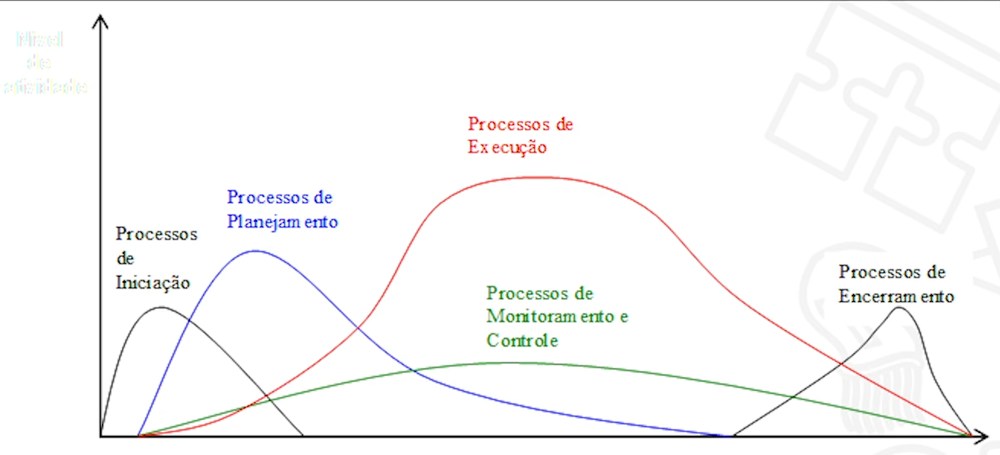

<link rel="stylesheet" href="//cdnjs.cloudflare.com/ajax/libs/highlight.js/11.2.0/styles/atom-one-dark-reasonable.min.css">

## Assuntos
- [**Fundamentos da Gerência de Projetos e Visão PMI/PMBok**](#fundamentos-da-gerencia-de-projetos-e-visao-pmipmbok)
    - [Fundamentos da Gerência de Projetos](#fundamentos-da-gerencia-de-projetos)
    - [Visão do Project Management Institute - PMI](#visao-do-project-management-institute-pmi)
- [**Gerenciamento Prescritivo e Ágil de Projetos e Uso de Ferramentas**](#gerenciamento-prescritivo-e-agil-de-projetos-e-uso-de-ferramentas)
    - [Gerenciamento Tradicional](#gerenciamento-tradicional)
    - [Gerenciamento Ágil](#gerenciamento-agil)
    - [Ferramentas e Técnicas](#ferramentas-e-tecnicas)
- [**Bibliografia**](#bibliografia)

## Aviso
Eu, particularmente, não sou muito fã dessas matérias mais de "humanas"[^1]. Então aqui eu vou deixar apenas um **resumo/sumário** dos conceitos trabalhados.

[^1]:E olha que eu sou formado em Economia.

O conteúdo de verdade vai estar nas leituras indicadas na bibliografia. O foco aqui é mais ser um material de consulta para lembrarmos os conceitos aprendidos.

Uma dica de ouro pra ler esses materiais é se colocar no papel do gerente. Nesse caso, leia 

## Fundamentos da Gerência de Projetos e Visão PMI/PMBok
### Fundamentos da Gerência de Projetos
#### Conceitos Básicos
A primeira coisa que temos que deixar claro é a diferença entre atividades de **Operação** e de **Projeto**. A operação tem como principal caraterística a repetição das suas rotinas. Um projeto, por outro lado, tem caráter linear que se encaminha para a sua conclusão.

Um **Programa** é definido como um conjunto de projetos semelhantes agrupados para um melhor gerenciamento.

Uma **Carteira** ou **Portfólio** de projetos é o conjunto de projetos agrupados por organização que irá desempenhá-los. Independentes da semelhança entre eles.

Um **Project Management Office - PMO** é o grupo de pessoas que gerencia a carteira de projetos da empresa ou organização.

Um **Subprojeto** é um pedaço de um projeto maior que é desmembrado para melhorar a organização das atividades.

#### Conceito de Projeto
Agora vamos definir o conceito de **Projeto** que vamos trabalhar nesse microfundamento.

"Um esforço temporário empreendido para criar um produto, serviço ou resultado exclusivo". PMBoK, 2017.

#### Gerência de Projetos
Segundo o PMBoK, a **Gerência de Projetos** é aplicação de conhecimentos, habilidades e técnicas para se atingir os requisitos de um projeto.

Esse conjunto de ferramentas vão desde as hard skills quanto as soft skills na gestão e montagem da equipe que fará as atividades.

Para uma boa gerência, é necessário que as atividade sejam acompanhadas de modo a utilização otimizada dos recursos dentro do planejamento inicial. Para isso, o monitoramento contínuo é necessário, bem como, que sejam disponibilizados os insumos e recursos necessários.

#### Ciclo de Vida de Projeto
Basicamente, temos os modelos **Prescritivos** que são mais burocráticos e rígidos e os modelos **Ágeis** que são mais velozes e mais aptos à mudanças ao longo do desenvolvimento.

Não existe certo e errado, existe o contexto em que o projeto será executado. Cada caso é único e deve ser estudado com toda a atenção.

#### Como Nasce um Projeto
As demandas que geram os projetos podem surgir de todos os lugares. Uma terminologia comum a ser usada é a de **Clientes Internos** e **Clientes Externos** para separar os casos onde as necessidades a serem satisfeitas estão dentro ou fora da empresa que será responsável pela execução do projeto.

### Visão do Project Management Institute - PMI
#### Project Management Institute - PMI
Fundado em 1969, é um instituto referência mundial em gerenciamento de projetos. Cada associação atrelada ao PMI USA é chamado de "capítulo" e, no Brasil, está presente em vários estados.

É ele quem produz o guia mais famoso da área, o Guia PMBoK. Além dele, temos outras publicações como:

- PM Network
- PM Today
- Project Management Journal
- Information Source Guide

E faz vários congressos e encontros ao longo do mundo.

Além dessa parte de produção de conteúdos e encontros, existem várias certificações disponíveis pelo PMI:

- CAPM
- PMP
- PgMP
- PfMP
- PMI-ACP
- PMI-RMP
- PMI-BPA
- PMI-SP

#### Guia PMBoK
É a principal referência no que tange à gerência de projetos. Ele define que um projeto nada mais é que um grupo de processos relacionados para o atingimento de uma meta.

Na versão 6, temos 49 tipos de processos organizados em 5 grupos:

- Iniciação
- Planejamento
- Execução
- Monitoramento e Controle
- Encerramento

#### Projetos no Contexto Organizacional

Dependendo do contexto da organização em que o projeto for implementado, a probabilidade de sucesso por ser maior ou menor a depender das características culturais da organização. Damos o nome desses fatores de **Fatores Ambientais da Empresa (FAR)**

Podemos elencar alguns fatores importantes nessa relação:

- Fatores Internos:
  - Cultura, Estrutura e Governança
  - Geografia das instalações e recursos
  - Infraestrutura
  - Software e tecnologias disponíveis
  - Disponibilidade dos recursos
  - Capacidade do capital humano
- Fatores Externos:
  - Condições de mercado
  - Stakeholders
  - Legislação
  - Governo

Outra coisa que pode ser muito importante para a realização de um projeto é a base de conhecimentos disponíveis internamente na empresa. Segundo o PMBoK, damos o nome de **Ativos de Processos Organizacionais (APO)** a esse repositório de processos e planos disponíveis ao uso interno.

Podemos separar os APO em duas categorias:

- Processos, políticas e procedimentos
- Bases de conhecimento organizacionais

O conhecimento do contexto da organização é importante para que o gerente de projeto seja capaz de cumprir os planejamentos dos projetos de sua responsabilidade.

##### Estrutura Organizacional

Dentre os tópicos relacionados, a **estrutura organizacional** é muito relevante porque, a depender dela, algumas etapas do projeto podem ser grandemente afetadas.

Podemos destacar as principais estruturas atualmente como sendo:

- Estrutura Funcional   Foco na especialização e na rotina. Muito usado em grandes empresas e no setor público.
- Estrutura por Projeto   Foco na autonomia no cumprimento das metas. Atores temporários atrelados à projetos. Maior celeridade na comunicação.
- Estrutura Matricial   É um misto das duas. Possui alguma flexibilidade na comunicação entre projetos mas pode causar problemas de falta de clareza na cadeia de comando.

**Comentário:** Na vida real, nenhuma organização é 100% classificável de acordo com essas estruturas. Mas conhecê-las ajudará muito caso, quem sabe algum dia, nos encontremos no papel de gerente de projeto.

#### Áreas da Gerência de Projetos

Segundo o PMBoK podemos dividir a gerência de projetos em 10 áreas:

- Integração - Foco na relação entre as demais áreas
- Escopo - Foco no atendimento dos requisitos
- Cronograma - Cumprimento dos prazos estipulados
- Custos - Foco no montante de recursos necessários para o atingimento das metas
- Qualidade - Seguimento de padrões e normas estabelecidas
- Recursos - Foco na utilização otimizada dos recursos demandados
- Comunicações - Informações sobre o projeto de qualidade e tempestivamente
- Riscos - Mapeamento das dificuldades externas que podem refletir no projeto
- Aquisições - Responsável pela compra dos insumos necessários
- Stakeholders - Relacionamentos com os atores relevantes e interessados no projeto

#### Tempo em Projetos

Uma das áreas que acabamos de ver é a de **Cronograma**. Podemos destacar essa área porque ela é muito relevante para o alcance das metas.

O tempo é o ativo que é mais estudado e, para muitos pesquisadores, é a área mais importante da gerência de projetos. 

O PMBoK elenca **6 processos** pertencentes à essa área:

1. Planejar o gerenciamento do cronograma
2. Definir as atividades
3. Sequenciar as atividades
4. Estimar as durações
5. Desenvolver o cronograma
6. Controlar o cronograma

Na construção do cronograma podemos usar várias representações gráficas. Como por exemplo:

- Diagrama de Setas
- Diagrama de Rede PERT
- Gráfico de Gantt

**Comentário:** Existem várias ferramentas para gerenciamento. O [MS-Project](https://www.microsoft.com/pt-br/microsoft-365/project/project-management-software), [ClickUp](https://clickup.com/), [Trello](https://trello.com), [Primavera](https://www.oracle.com/br/industries/construction-engineering/primavera-p6/), [OpenProj](https://www.openproject.org/) e outros

#### Recursos em Projetos

Os recursos do projeto incluem todas as condições materiais necessárias para o projeto. Isso vai além de apenas insumos materiais. Contempla também capital humano, treinamento, infraestrutura de TI e etc.

Para se usar os recursos da melhor maneira possível, é necessário que o time de recursos esteja bem alinhado com o planejamento afim de otimizarem as aquisições e contratações no tempo certo para evitar ociosidade de uso ou custo de armazenagem desnecessário.

De longe, a parte mais difícil e necessário do setor de gerenciamento de recursos é a seção de **Recursos Humanos**. Existem milhares de técnicas, ferramentas e pesquisas sobre como otimizar os recursos humanos em uma organização e, por esse material ter escopo de overview, não vamos nos aprofundar nesse tema.

#### Gestão Financeira de Projetos

Normalmente, um cliente faz 2 perguntas em qualquer proposta de projeto: "Quanto vai custar?" e "Quanto tempo vai levar?".

Essas perguntas são clássicas e, é óbvio, são umas das mais difíceis de se responder inicialmente porque só se sabe o custo real de um projeto no final do mesmo. Isso nos obriga a ter que estimar custos e necessidades que surgirão ao longo das etapas de projeto.

As etapas de trabalho da área de orçamento é parecida com as etapas das outras áreas. Começamos com a estimativa dos esforços. Passamos para a estima dos custos relacionados. Por fim, devemos controlar para sabermos se as estimativas estão de acordo com a realidade.

Para finalizarmos essa parte. Vale destacar os dois artefatos mais importantes produzidos por essa área:

- Cronograma Financeiro
- Orçamento do Projeto

#### Riscos em Projetos

Se tivéssemos certeza que um risco aconteceria, ele deixaria de ser um risco.

Essa natureza especulativa dos riscos é o cerne da área de gestão de risco do projeto. Para tanto, esse setor sempre deve levar em consideração 2 aspectos na análise dos riscos: **probabilidade** e **complexidade**.

Os processos de trabalho dessa área pelo PMBoK são:

1. Planejar os riscos
2. Identificar os riscos
3. Análise qualitativa
4. Análise quantitativa
5. Planejamento das respostas
   1. Escalar
   2. Prevenir
   3. Transferir
   4. Mitigar
   5. Aceitar
6. Implementação das respostas
7. Monitoramento dos riscos

## Gerenciamento Prescritivo e Ágil de Projetos e Uso de Ferramentas
### Gerenciamento Tradicional
#### Cronograma de Projeto - PERT/CPM
#### Construção dos Diagramas - PERT/CPM
#### Monitoramento e Controle
#### Perfil do Gerente de Projetos
### Gerenciamento Ágil
#### Gerência Ágil de Projetos
#### O Método Ágil Scrum
#### Atividades e Papéis no Scrum
#### Introdução ao XP
#### Frameworks e Práticas Ágeis
### Ferramentas e Técnicas
#### Ferramentas e Técnicas para Planejamento
#### Ferramentas e Técnicas para Gestão

## Bibliografia
- GUIA do conhecimento em gerenciamento de projetos: (Guia PMBOK®). 6. ed. São Paulo: Project Management Institute, 2017. xxix, 755 p. ISBN 9781628251920., Nº de Exemplares: 7.
- VALERIANO, Dalton L. **Gerenciamento Estratégico e Administração por Projetos**. Pearson 324 ISBN 9788534612081.
- VITOR L. MASSARI. **Gerenciamento Ágil de Projetos** - 2ª Edição. Editora Brasport 0 ISBN 9788574528939.
- BROD, Cesar. **Scrum: guia prático para projetos ágeis**. 2. ed. São Paulo, SP: Novatec, 2015. 198 p. ISBN 9788575224410.
