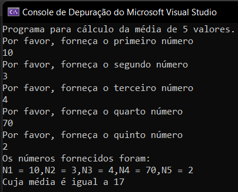
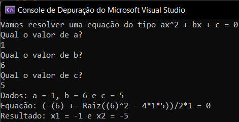

## Assuntos
- [**Lógica de Programação e Estrutura de Controle, Funções e Procedimentos**](#logica-de-programacao-e-estrutura-de-controle-funcoes-e-procedimentos)
    - [Conceito de Algoritmo](#conceito-de-algoritmo)
    - [Variáveis](#variaveis)
    - [Etapas de um Algoritmo e Operador de Atribuição](#etapas-de-um-algoritmo-e-operador-de-atribuicao)
    - [Estrutura Sequencial](#estrutura-sequencial)
    - [Estrutura Condicional](#estrutura-condicional)
    - [Estrutura de Repetição](#estrutura-de-repeticao)
- [**Manipulação de Dados em Memória Primária e Secundária**](#manipulacao-de-dados-em-memoria-primaria-e-secundaria)
    - [Criando e Usando Funções e Procedimentos](#criando-e-usando-funcoes-e-procedimentos)
    - [Passagem de Parâmetros](#passagem-de-parametros)
    - [Manipulação de Arquivos em C#](#manipulacao-de-arquivos-em-c)
- [**Bibliografia**](#bibliografia)


## Lógica de Programação e Estrutura de Controle, Funções e Procedimentos

### Conceito de Algoritmo

Em resumo, um algoritmo é uma sequência de ordens que, se seguidas, deve gerar um resultado previsto e desejado. Não vale muito a pena aprofundar além disso agora.

### Variáveis

Uma variável é uma posição na memória do computador. Isso mesmo, é algo com endereço definido, nada solto no universo ou obscuro dentro da máquina. Esse dado é gravado para posterior leitura por parte do programa que está sendo executado.

Podemos ter como origem do dado o próprio programa que está sendo executado ou o usuário por meio da entrada de dados ou, ainda, a leitura de dados previamente armazenados na memória do computador.

Cada variável possui vários tipos de atributos que podemos elencar na lista abaixo:

- Tem um endereço na memória
- Possui um nome de identificação
- Armazena um valor
- Possui um tipo de dados:
      - **Numérico** - Inteiros e Reais (Double ou Ponto Flutuante)[^1]
      - **Não numérico** - Lógico e Caractere
      - **Arranjos** - Vetores e Matrizes
      - **Arquivos**
      - **etc**

[^1]: Float possui precisão simples e Double possui dupla precisão.

O endereço da memória é feita pelos endereços que possuem apenas 2 estágios de registro: 0 ou 1. Um bit é exatamente essa medida de registo. 1 byte é composto de 8bits. 1 kilobyte contém 1024bytes ($2^{10}$). 1 megabyte contém 1024KB ($2^{20}$). 1 gigabyte contém 1024MB ($2^{30}$). 1 terabyte possui 1024GB ($2^{40}$).

Ou seja, se um computador possui 3 gigas de memória RAM, ele tem 3 bilhões de bytes como endereços disponíveis para um registro na memória[^2]. Cada byte possui um endereço único. Na memória RAM costuma-se usar a base Hexadecimal para definir os endereços. Vamos ver isso melhor na matéria de Arquitetura de Computadores.

[^2]: Isso é muito impressionante!

Também vimos que as variáveis possuem identificadores. Em c\# existem regras para a criação dos identificadores:

- Devem começar com uma letra
- Não podem ter espaços
- Não podem usar uma das palavras reservadas pela linguagem
- É case sensitive, ou seja, o nome "Var" é diferente do nome "var"


O identificador deve sempre ter algum sentido que permita a rápida interpretação por parte de algum leitor do código fonte da aplicação. Isso é fundamental para manutenção de códigos produzidos por várias pessoas diferentes. Entretanto, devemos evitar nomes de variáveis muito grandes. Na verdade, quanto menor o nome, mantido o sentido na leitura, melhor.

Outra boa prática é usar o camelCase para variáveis com mais de uma palavra. Esse padrão é bem simples: primeira palavra em minúsculo e a segunda com a primeira letra em maiúscula.

#### Declaração de Variáveis em c\#

Vamos aprender agora como declarar os 4 tipos mais simples de variáveis:

- `int` para definir inteiros
- `double` ou `float` para definir números reais
- `string` para cadeia de caracteres
- `bool` para as variáveis booleanas (`true` ou `false`)

**Comentário:** c\# é uma linguagem fortemente tipada, entretanto, existe um tipo de tipagem implícita que é muito usado na prática onde o próprio compilador "interpreta" o tipo de variável. Ao longo desse microfundamento nós vamos usar apenas os tokens de tipagem explícita. Mas vale muito a pena a leitura da documentação oficial nesse [link](https://learn.microsoft.com/pt-br/dotnet/csharp/language-reference/statements/declarations#implicitly-typed-local-variables).

``` c#
static void Main(string[] args) 
{
	int idade, numero;
	double peso, salario;
	string nomePai, rua, dtNasc;
	bool temCasa;
} 
```
Nesse código acima temos a declaração de várias variáveis de cada tipo. Basta colocar o tipo da variável seguido do nome de cada uma delas separadas por vírgula.

**Comentário:** Em c\# todas as linhas precisam conter um carácter de encerramento que é o ponto e vírgula `;`. Sem esse token, o computador vai interpretar a próxima linha como sendo a continuação da anterior.

### Etapas de um Algoritmo e Operador de Atribuição

Podemos resumir um algoritmo simples como contendo apenas 3 etapas: 1) A entrada de dados; 2) O processamento e 3) A saída de dados.

Na etapa de processamento, podemos precisar de grande criatividade e esforço para produzir a saída de dados desejada. Como ferramenta para alcance desse objetivo, temos as **estruturas básicas** que são:

- Estrutura Sequencial - Usada para garantir a ordem correta dos passos
- Estrutura Condicional - Usada para permitir contexto ou cenários 
- Estrutura de Repetição - Usada para evitar repetir código sequencial

#### Operador de Atribuição

Uma vez que já sabemos como atribuir uma variável ao seu tipo, precisamos aprender a como atribuir um valor a essas variáveis. Em c\# a atribuição de valor é feita do seguinte modo:

``` c#
idade = 28;
numero = 9992233;
```

É possível fazer 3 tipos de atribuição de valor para uma variável: Valor fixo; Conteúdo de outra variável e Expressão aritmética ou booliana. Abaixo temos 3 exemplo disso.

``` c#
idade = 28; // Valor fixo
numero = idade; // Valor de outra variável
idadeNum = idade + numero; // Valor por expressão
idadeEqNum = idade == numero; // Valor por expressão booliana
```

Nesse ponto vale uma reflexão. Será que sempre precisamos separar as etapas de atribuição do tipo de dados e do valor? Ou podemos, no mesmo momento, definir o tipo de dados e o valor da variável? A resposta, para nossa sorte, é que é possível em c\# atribuição de tipo e valor ao mesmo tempo. A sintaxe fica desse modo:

``` c#
int idade = 28;
int numero = idade;
double = 2.3;
string nome = "bruno";
int idadeNum = idade + numero;
bool idadeEqNum = idade == numero;
```

##### Saídas de Dados

Agora que fizemos esse pequeno desvio no assunto, vamos retornar para as estruturas. Por incrível que pareça, é melhor a gente começar pelo final. A etapa de saída de dados.

Em c\# temos duas maneiras de saída de dados:

``` c#
// Imprime a informação e cursor fica na mesma linha
Console.Write('string');

// Imprime a info mas o curso vai pra proxima linha
Console.WriteLine('string ' + var1 + ' string');
```

Nesses exemplos a gente pode perceber que podemos concatenar textos e variáveis textuais por meio do operador de soma. Além dessa forma, podemos fazer uso de PlaceHolders ou Interpolação de string como nos exemplos abaixo.

``` c#
string nome = "Bruno";

// Concatenação
Console.WriteLine("Meu nome é " + nome + ", obrigado!");

// PlaceHolder
Console.WriteLine("Meu nome é {0}, obrigado!", nome);

// Interpolação
Console.WriteLine($"Meu nome é {nome}, obrigado!");
```

Os três exemplos geram o mesmo resultado mas são consideravelmente diferentes no método. Podemos usar o que for mais agradável para uma leitura do código e posterior manutenção do mesmo.

##### Entrada de Dados

Agora que sabemos como fazer nosso programa imprimir resultados, vamos aprender como inputar dados nele. Em c\# podemos inserir dados com o seguinte comando:

``` c#
variavel = Console.ReadLine();

```

O input captado por esse comando **sempre retorna uma string**. Mas as vezes precisamos nos certificar que o input foi feito da maneira correta. Para isso podemos manipular os dados inseridos do seguinte modo:


``` c#
// Valores Inteiros
variavel = int.Parse(Console.ReaLine());
variavel = Convert.ToInt32(Console.ReadLine());

// Valores Reais
variavel = double.Parse(Console.ReadLine());
variavel = float.Parse(Console.ReadLine());
variavel = Convert.ToDouble(Console.ReadLine());

// Valores Booleanos
variavel = bool.Parse(Console.ReadLine());

// Valores String
variavel = Console.ReadLine();
```

Depois que executamos um dessas maneiras de coletar os dados, é de boa prática fornecermos um output logo após a entrada do dado. Isso evita aquela sensação de dúvida se o programa está sendo executado ou não. Ou seja, é bom sempre manter a dupla `ReadLine()` com o `WriteLine()`. O nome que damos para essa dupla é "Prompt".

Outra dica boa é usar o comando `Console.ReadKey()` no final do programa. Isso faz com que o console aguarde alguma tecla para finalizar. Evita que a aplicação abra e feche sem que o user consiga enxergar o resultado do processo.

### Estrutura Sequencial

Agora que sabemos como receber valores do usuário e como devolver nova informação a partir do processamento, vamos começar a estudar a etapa de processamento através do estudo das estruturas sequenciais.

#### Operadores e Funções Aritméticas

Em c\# nós temos os seguintes tokens para realizar as operações aritméticas:

- `+` Soma
- `-` Subtração
- `*` Multiplicação
- `/` Divisão
- `%` Resto da Divisão inteira

Além disso, temos a presença do que podemos chamar de **operadores de atribuição combinada**. Que faz a atribuição de valor com alguma operação aritmética:

- `soma += 100` é igual a `soma = soma + 100`
- `subtracao -= 10` é igual a `subtracao = subtracao - 10` 
- `multiplica *= 2` é igual a `multiplica = multiplica * 2`
- `divide /= 3` é igual a divide = divide / 3
- `resto \%= 2` é igual a resto = resto / 2

Não bastando essa grande variedade, temos os operadores de **incremento e decremento**:

- Pré-incremento (`++x`) - Usa x + 1 antes do processamento
- Pós-incremento (`x++`) - Usa x + 1 após o processamento
- Pré-decréscimo (`--x`) - Usa x - 1 antes do processamento
- Pós-decréscimo (`x--`) - Usa x -1 após o processamento

Essa diferença de pre e pós é importante para as estruturas de repetição, porque podemos lidar com índices de tabelas que começam com valores diferentes. Mas, no geral, devemos olhar cada caso para escolher o que usar.

Existem outras operações que estão contidas em um objeto nativo chamado `Math`. Para fazermos potenciação usamos o método `Math.Pow()`. Para fazermos raiz quadrada podemos usar `Math.Sqrt()`[^3].

[^3]: Embora a gente saiba que a radiciação é uma potência de fração.

#### Expressões Aritméticas

Agora podemos juntar tudo que vimos em um programa simples de cálculo da média de 5 valores. O código e o seu resultado podem ser vistos abaixo.

``` c#
// Declaração dos tipos das variáveis
int n1, n2, n3, n4, n5, soma;
float media;

// Input dos dados
Console.WriteLine("Programa para cálculo da média de 5 valores.");

Console.WriteLine("Por favor, forneça o primeiro número");
n1 = Convert.ToInt32(Console.ReadLine());
Console.WriteLine("Por favor, forneça o segundo número");
n2 = Convert.ToInt32(Console.ReadLine());
Console.WriteLine("Por favor, forneça o terceiro número");
n3 = Convert.ToInt32(Console.ReadLine());
Console.WriteLine("Por favor, forneça o quarto número");
n4 = Convert.ToInt32(Console.ReadLine());
Console.WriteLine("Por favor, forneça o quinto número");
n5 = Convert.ToInt32(Console.ReadLine());

// Processamento
soma = n1 + n2 + n3 + n4 + n5;
media = soma / 5;

// Output dos dados
Console.WriteLine("Os números fornecidos foram:");
Console.WriteLine("N1={0},N2={1},N3={2},N4={3},N5={4}", n1, n2, n3, n4, n5);
Console.WriteLine("Cuja média é igual a {0}", media);
```



Outro exemplo que podemos usar é o do cálculo das raízes de uma função de segundo grau[^4]. O programa abaixo recebe 3 valores e calcula as raízes, a imagem logo após nos mostra o resultado no prompt de comando.

[^4]: Se você não se lembra como resolver um problema desse, seu professor da sexta série está rindo de você nesse exato minuto.


``` c#
// Programa para calcular o valor de x em uma equação de segundo grau

// Declaração das variáveis
double a, b, c, x1, x2;

Console.WriteLine("Vamos resolver uma equação do tipo ax^2 + bx + c = 0");

// Input das variaveis
Console.WriteLine("Qual o valor de a? ");
a = Convert.ToDouble(Console.ReadLine());

Console.WriteLine("Qual o valor de b? ");
b = Convert.ToDouble(Console.ReadLine());

Console.WriteLine("Qual o valor de c? ");
c = Convert.ToDouble(Console.ReadLine());


x1 = (-b + Math.Sqrt(Math.Pow(b,2) - 4 * a * c)) / 2 * a;
x2 = (-b - Math.Sqrt(Math.Pow(b, 2) - 4 * a * c)) / 2 * a;

// Output dos resultados
Console.WriteLine("Dados: a = {0}, b = {1} e c = {2}", a, b, c);
Console.WriteLine($"Equação: (-({b}) +- Raiz(({b})^2 - 4*{a}*{c}))/2*{a} = 0");
Console.WriteLine("Resultado: x1 = {0} e x2 = {1}", x1, x2);
```




A essa altura já aprendemos como criar programas inteiros com as etapas de software que vimos anteriormente: input, processamento e output. Tudo isso em c\#. Entretanto, no estado atual do código, nossos programas não estão muito competentes em se adaptar a diferentes tipos de inputs ou resultados.

Um exemplo prático é que, nesse segundo programa, podemos ter inputs que retornem um resultado indesejado como podemos ver na imagem abaixo.


### Estrutura Condicional

A necessidade de lidarmos com diferentes situações ou contextos é o que nos leva a estudarmos as **estruturas condicionais**. Por meio dessas estruturas, podemos construir diferentes outputs de acordo com qualquer lógica que implementarmos e, com isso, evitar vários bugs nos nossos programas.

#### Operadores Relacionais

Ao lidarmos com estrutura condicionais nós temos alguns operadores que nada mais são do que expressões lógicas que retornam apenas 2 resultados possíveis: true ou false. Esses operadores são como "gatilhos"\ que são usados para controle do fluxo de processamento do código.


| **Operador** | **Operação** | **Exemplo** |
| :----------: | :----------: | :---------: |
|     `==`     |  Igualdade   |  n1 == n2   |
|     `<`      |    Menor     |   a < 10    |
|     `>`      |     Maio     |    b > 1    |
|     `<=`     | Menor igual  |   c <= 2    |
|     `>=`     | Maior igual  |   d >= 22   |
|     `!=`     | Desigualdade |  e != 100   |


Na tabela acima, temos os operadores relacionais que são usados ao longo das estruturas condicionais simples e compostas.

Tome cuidado com o operador de igualdade `==` e o de atribuição `=`, afinal, eles usam o sinal de igualdade mas significam coisas diferentes.

#### Condição Simples e Composta

Em c\# o comando usado para criar uma condição simples é o `if`. Se a condição que colocarmos atrelada ao comando `if` retornar um true, o bloco de código atribuído a ele será executar, caso contrário, o código do bloco será ignorado.

``` c#
// Parte condicional no calculo da equação de segundo grau

delta = (Math.Pow(b, 2) - 4 * a * c);

// Output dos resultados com condição
if (delta >= 0)
{
    Console.WriteLine("Dados: a = {0}, b = {1} e c = {2}", a, b, c);
    Console.WriteLine($"Equação: (-({b}) +- Raiz(({b})^2 - 4*{a}*{c}))/2*{a} = 0");
    Console.WriteLine($"Delta: {delta}");
    Console.WriteLine("Resultado: x1 = {0} e x2 = {1}", x1, x2);
};

if (delta < 0)
{
    Console.WriteLine("Dados: a = {0}, b = {1} e c = {2}", a, b, c);
    Console.WriteLine($"Equação: (-({b}) +- Raiz(({b})^2 - 4*{a}*{c}))/2*{a} = 0");
    Console.WriteLine($"Delta: {delta}");
    Console.WriteLine("Resultado: X não possui raiz real! ");
};
```

Com essa adaptação, nosso código estará preparado para o caso onde o interior da raiz (que chamamos de delta) seja negativo. Mas podemos ver que o nosso código ficou um pouco esquisito. Criamos dois blocos de código que são, claramente, relacionados entre si: Se um bloco for executado, o outro não será. Para facilitar o trabalho com essas situações, as linguagens de programação possuem as estruturas de condição compostas.

Esses são os casos onde, se o teste lógico retorna true, executamos um bloco, ou o outro bloco será executado caso o resultado lógico seja false. Com isso evitamos ter que criar dois testes com `if`. O token usado em c\# para uma condição com dois blocos de códigos (ou seja, uma condicional composta) é o `if-else`. Abaixo nós reescrevemos a solução anterior mas agora fazendo uso do condional composto.


``` c#
// Parte condicional no calculo da equação de segundo grau

delta = (Math.Pow(b, 2) - 4 * a * c);

// Output dos resultados com condição
if (delta >= 0)
{
    Console.WriteLine("Dados: a = {0}, b = {1} e c = {2}", a, b, c);
    Console.WriteLine($"Equação: (-({b}) +- Raiz(({b})^2 - 4*{a}*{c}))/2*{a} = 0");
    Console.WriteLine($"Delta: {delta}");
    Console.WriteLine("Resultado: x1 = {0} e x2 = {1}", x1, x2);
} else
{
    Console.WriteLine("Dados: a = {0}, b = {1} e c = {2}", a, b, c);
    Console.WriteLine($"Equação: (-({b}) +- Raiz(({b})^2 - 4*{a}*{c}))/2*{a} = 0");
    Console.WriteLine($"Delta: {delta}");
    Console.WriteLine("Resultado: X não possui raiz real! ");
};
```

Agora sim nosso código está elegante e adaptado para as duas saídas possíveis de resultado para os inputs do usuário.

#### Operadores Booleanos e Comandos IF Aninhados

Nós aprendemos que o bloco de código será executado sempre que a expressão lógica retornar um resultado true. Também vimos que existem os operadores relacionais que nos ajudam a construir essas expressões. Agora, vamos aprender os operadores booleanos que nada mais são do que os operadores lógicos clássicos ($\land, \lor, \neg$).

| **Operador** |     **Operação**      |      **Exemplo**       |
| :----------: | :-------------------: | :--------------------: |
|  `&& (AND)`  | true se tudo for true | `if (a > 2 && b == 1)` |
|    `(OR)`    |  true se um for true  |   `if (a < 2b != 0)`   |
|  `! (NOT)`   |     false se true     |     `if (!(x==y))`     |

Existem problemas que requerem mais de dois resultados no output. Nesse caso, não é suficiente usarmos apenas os tokens de condicional composto `if-else` da maneira como aprendemos até agora.

Para resolver esse problema temos a técnica de `IF` aninhados (nested) e a de `IF` escada (ladder). As duas formas produzem o mesmo resultado mas mudam significativamente legibilidade do nosso código. Abaixo temos um exemplo de cada.

``` c#
// Leadder IF
if (condicao1)
	comando1;
else if (condicao2)
	comando2;
else if (condicao3)
	comando3;
...
else if (condicao_n-1)
	comando_n-1;
else
	comando_n;
```


``` c#
// Nested IF
if (condicao1)
	comando1;
else
	if (condicao2)
		comando2;
	else
		if (condicao3)
			comando3;
		else
			if (condicao4)
				comando4;
		...
			else
				if (condicao_n-1)
					comando_n-1;
				else
					comando_n;
```

#### O Comando Switch e o Operador Ternário

Agora que aprendemos a lidar com vários casos condicionais encadeados, podemos construir soluções relativamente complexas com várias saídas diferentes. Entretanto, quando tempos muitas situações possíveis, o nosso código pode ficar um pouco ruim de ser lido por outras pessoas.

Pensando nessa necessidade, os criadores do c\# criaram um operador que simplifica ainda mais nosso trabalho. Sim, é isso mesmo, nós acabamos de aprender IFs aninhados e em escada e já vamos aprender uma maneira melhor de fazer exatamente o que eles fazem. Se acostume com isso. Em tecnologia existem quase sempre várias maneiras de se chegar no mesmo resultado.

O operador que é mais indicado para lidar com várias situações de saída é o `switch-case`. Cuja construção é bem mais legível que os IFs anteriores. Abaixo temos um exemplo.

``` c#
// Lidando com varias condições com switch/case
switch(opcao)
{
	case op1:
		comandos1;
		break;
	case op2:
		comandos2;
		break;
	case op3:
		comandos3;
		break;
	...
	case op_n:
		comandos_n;
		break;
	default:
		// bloco que sera executado se nenhuma 
		// das anteriores for escolhida;
}
```

**Comentário:** Existem várias maneiras de se usar o switch. Eu não vou me aprofundar agora em todas elas. Mas vale muito a pena fazer uso dessa ferramenta para cenários de várias interações possíveis ou múltiplas saídas contextuais.

Para finalizar o nosso estudo das estruturas condicionais, vamos aprender como trabalhar com o **Operador ternário**. Esse nome é relativo ao número de operandos que esse comando usa (no caso, 3).


``` c#
condicao ? expressao_true : expressao_false
```

A condição é uma expressão lógica (que usa operadores relacionais e booleanos) que só pode retornar true ou false. A expressão logo após o ponto de interrogação será o retorno do operador em caso de true. A expressão após os dois pontos é o retorno em caso de false.

Sim, é exatamente um caso de `if-else` só que em apenas uma linha. Como as soluções podem ficar muito grandes, é sempre bom termos em mente que quanto menos linhas, mais fácil será fazer manutenção nos nossos programas. O operador ternário é muito usado por programadores mais experientes. Abaixo temos um exemplo comparando as duas maneiras.


``` c#
// Comparação entre if-else e operador ternário
bool passou;
double nota;

// if-else
if (nota >= 60)
	passou = true;
else
	passou = false;

// operador ternario
passou = nota >= 60 ? true : false // maneira 1
passou = (nota >= 60) ? true : false // maneira 2
```

Agora podemos ver claramente a vantagem do uso do operador ternário.

### Estrutura de Repetição

Como sabemos, ainda temos mais um tipo de estrutura para estudarmos. Até agora, aprendemos como estruturar um código sequencialmente e como criar blocos de código que só serão executados se determinadas condições previamente definidas forem satisfeitas. Agora, vamos aprender como evitar ter que repetir blocos de códigos.

O c\# possui 3 operadores de repetição:

``` c#
// tipo 01
while (condicao)
	comando;

// tipo 02
do
	comando;
while (condicao);

// tipo 03
for (inicial; expressao logica; atualizacao)
	comando;
```

Vamos ver um exemplo de como nosso código pode ser reduzir com o uso da estrutura de repetição. Primeiro, vamos ver um exemplo onde o programa recebe uma lista de 3 palavras (nome, nome do meio e sobrenome) e depois faz o print.

``` c#
// Programa que recebe nome completo e
// depois devolve uma mensagem de boas vindas

string nome, mid, last;

Console.WriteLine(" Seja bem vindo(a)!");

Console.WriteLine(" Qual seu primeiro nome?");
nome = Console.ReadLine();

Console.WriteLine(" Qual seu nome do meio?");
mid = Console.ReadLine();

Console.WriteLine(" Qual seu sobrenome?");
last = Console.ReadLine();

Console.WriteLine(" Bem Vindo(a)!");

Console.WriteLine(nome);
Console.WriteLine(mid);
Console.WriteLine(last);

Console.WriteLine(" E Volte sempre!");
```


Agora vamos refazer esse programa usando os 3 tokens de estrutura de repetição que o c\# nos dá. Vamos usar a mesma ordem em que elas foram apresentadas.


#### Os Comandos WHILE, DO WHILE e FOR


##### Repetição usando WHILE

A repetição usando o token `while` é condicionada ao resultado de uma expressão lógica. Caso a expressão lógica retorne true, o bloco de código será executado até o seu final. Após a execução, é feita uma nova verificação da expressão lógica. O processo de loop só será finalizado caso a expressão lógica retorne o valor false. Abaixo temos a refatoração[^5] evitando a repetição de partes de partes do código anterior.

[^5]: Refatorar é o processo de mudar o código e obter o mesmo resultado no final. É uma ótima prática a ser feita.


``` c#
// Programa de nomes refatorado com while
string nome, mid, last;
int contador;

// nome default
nome = "";
mid = "";
last = "";

Console.WriteLine(" Seja bem vindo(a)!");

Console.WriteLine(" Por favor, insira o seu nome completo.");
Console.WriteLine(" Obs. No máximo 3 palavras");
contador = 1;

while (contador <= 3)
{   
    Console.WriteLine($" Palavra nº {contador} do seu nome?");
    if (contador == 1)
        nome = Console.ReadLine();
    else if (contador == 2)
        mid = Console.ReadLine();
    else if (contador == 3)
        last = Console.ReadLine();

    contador += 1;
};

Console.WriteLine(" Bem Vindo(a)!");
Console.WriteLine(nome);
Console.WriteLine(mid);
Console.WriteLine(last);
Console.WriteLine(" E Volte sempre!");
```

Agora nós temos um loop usando a expressão "a variável contador é menor igual a 3?" sempre que a resposta for sim, o programa perguntará qual a n-ésima palavra do nome da pessoa. Pode parecer que nesse exemplo o uso do loop mais complicou do que facilitou. Mas o objetivo aqui é exercitar o uso desse operador, então devemos focar em compreender como usar o while.

##### Repetição usando DO-WHILE

Para a nossa sorte, o operador DO WHILE é muito similar ao WHILE. A única diferença é que primeiro declaramos o bloco de código e, no final, colocamos a condição para sua execução. No exemplo abaixo temos o mesmo resultado que o de cima mas usando essa outra estrutura de operador.

``` c#
// Programa de nomes refatorado com do-while
string nome, mid, last;
int contador;

// nome default
nome = "";
mid = "";
last = "";

Console.WriteLine(" Seja bem vindo(a)!");

Console.WriteLine(" Por favor, insira o seu nome completo.");
Console.WriteLine(" Obs. No máximo 3 palavras");
contador = 1;

do
{   
  Console.WriteLine($" Palavra nº {contador} do seu nome?");
   if (contador == 1)
       nome = Console.ReadLine();
   else if (contador == 2)
       mid = Console.ReadLine();
   else if (contador == 3)
       last = Console.ReadLine();

   contador += 1;
} while (contador <= 3);

Console.WriteLine(" Bem Vindo(a)!");
Console.WriteLine(nome);
Console.WriteLine(mid);
Console.WriteLine(last);
Console.WriteLine(" E Volte sempre!");
```

##### Repetição usando FOR

Quando usamos nosso operador while, foi criada uma variável `contador` que era incrementada a cada iteração até que o teste lógico "menor igual a 3"\ retorne false. A vantagem do operador de loop `for` é que podemos fazer isso diretamente no parâmetro da função.

O operador de loop `for` recebe 3 parâmetros, na ordem: condição inicial da variável de controle; expressão lógica (que retorna true ou false) e, por fim, um incremento ou decremento.

``` c#
// Programa de nomes refatorado com for
string nome, mid, last;
int contador;

// nome default
nome = "";
mid = "";
last = "";

Console.WriteLine(" Seja bem vindo(a)!");

Console.WriteLine(" Por favor, insira o seu nome completo.");
Console.WriteLine(" Obs. No máximo 3 palavras");
contador = 1;

for (contador = 1; contador <= 3; contador++)
{   
    Console.WriteLine($" Qual a palavra nº {contador} do seu nome?");
    if (contador == 1)
        nome = Console.ReadLine();
    else if (contador == 2)
        mid = Console.ReadLine();
    else if (contador == 3)
        last = Console.ReadLine();
};

Console.WriteLine(" Bem Vindo(a)!");
Console.WriteLine(nome);
Console.WriteLine(mid);
Console.WriteLine(last);
Console.WriteLine(" E Volte sempre!");
```

#### Contadores e Acumuladores

Agora sabemos reduzir nossos códigos usando 3 tipos de tokens fornecidos pelo c\#. Vamos ver um pouquinho mais a respeito do atributo de contador do loop `for`.

Um **contador** nada mais é do que uma variável do tipo constante que receberá a atualização do seu valor a cada loop. Se a situação inicial do nosso contador for igual a 1, a cada iteração ele receberá a expressão `contador = contador + 1`.

Podemos criar um contador diretamente no código através da atribuição do valor pela soma. Ou, podemos usar os operadores de incremento e decremento que aprendemos anteriormente. A cada iteração em uma estrutura de loop, a variável receberá +1 como incremento ou -1 no caso do decremento.

Podemos usar o operador de incremento tanto no bloco de código de um loop quanto como parâmetro. Em um `for`, quando colocamos o terceiro parâmetro igual a `contador++`, a cada iteração teremos `+1` atribuído ao contador.

Um **acumulador** é muito parecido com um contador, a diferença é que a cada iteração nós podemos adicionar qualquer valor ao acumulador. Por exemplo, se queremos calcular a média de uma turma, teremos que somar todas as notas e dividir pelo quantitativo dos alunos da turma. Para isso, podemos criar um acumulador chamado `soma_notas` que recebe, para cada aluno, a nota através de um comando parecido com o exemplo a baixo.

``` c#
double soma_notas = 0;

for (n_aluno=0; n_alunos <= qtd; n_aluno++)
{
	soma_notas = soma_notas + nota
};
```

A cada iteração, somamos o valor da variável `nota` à variável `soma_notas`.

## Manipulação de Dados em Memória Primária e Secundária

Ao longo do material nós usamos várias vezes frases como "a medida que nosso código cresce" ou "para manter a simplicidade no processo de atualização" e outras frases de mesmo teor. Isso não é em vão. Quando olhamos os códigos dos sistemas operacionais, por exemplo, podemos ver que a quantidade de linhas de código passam da casa do milhão. Manter tudo isso funcionando de modo coeso e atualizável é uma tarefa que demanda muita habilidade e planejamento.

Para nos ajudar nesse trabalho, vamos aprender sobre métodos de organização de código através do uso de funções e procedimentos.

### Criando e Usando Funções e Procedimentos

Normalmente, quando estamos desenvolvendo uma solução de software, primeiro nós criamos um algoritmo que descreve os pormenores o que será feito e como será feito. Essa primeira etapa é focada na solução do problema.

A partir dela, devemos pensar em encontrar procedimentos que se repetem ao longo do código ou que podem ser usados para outros trabalhos similares. Sempre que identificarmos padrões que podem ser reutilizados, estamos diante de uma melhoria por modularização.

A modularização (também chamada de sub-rotinas ou sub-programas) é a prática de reduzir o nosso código em partes menores que recebem nomes diferentes dependendo da linguagem. Em linguagens orientadas à objeto como o c\# nós chamamos de modularização.

A ideia é simples: menos linhas, mais fácil será a manutenção. Esse é um valor muito caro no meio do desenvolvimento profissional de software e devemos ter sempre essa postura em mente.

Existem dois tipos de métodos para modularização: **funções**, que sempre retornam algum valor, e **procedimentos** que não retornam nenhum valor. Abaixo vemos como criar esses dois tipos.   

``` c#
// criando uma função que retorna um inteiro
int nome_metodo(string par1, float par2,..., int parn)
{
    int valor_resultado;
    comando1;
    ...
    return valor_retorno;
};
// criando um procedimento
static void nome_procedimento (string par1, double par2,..., int parn)
{
    comando1;
    ...
};

```

Podemos ver que um procedimento em c\# recebe esse token
`void` antes de ser criado (ainda não aprenderemos o que significa esse termo
`static`).

Para usarmos um parâmetro não precisamos fazer nenhuma atribuição, basta chamar-lo com os seus parâmetros preenchidos e atribuídos ao tipo de variável correto. No caso de uma função, como ela retorna um resultado, precisamos atribuir o resultado a alguma variável. Abaixo temos um exemplo de como usar cada um desses métodos.

``` c#
// chamando um procedimento
nome_procedimento(par1,par2);
// chamando um método
resultado = nome_metodo(par1,par2);

```

**Comentário:** Se não queremos usar nenhum parâmetro, basta definir o procedimento ou o método com os parênteses vazios, por exemplo,
`nome_procedimento()`.

A essa altura você já deve ter percebido que um procedimento nada mais é que um tipo de método. Só que ele possui uma regra diferente na hora da criação e não pode ter seu resultado atribuído a nenhuma variável. Desse modo, a modularização faz uso de dois métodos possíveis.

### Passagem de Parâmetros

Os parâmetros são variáveis que podem ser transferidos (também dizemos que eles são "passados") para que o nosso método seja executado. Esses serão os valores que o nosso método vai receber e processar.   

Podemos classificar os parâmetros em dois tipos: **Formais**, que são definidos na declaração (ou criação) do método e são trabalhados dentro do bloco de código interno a ele como se fossem variáveis novas; e os **Reais**, que são passados para o método no momento da invocação e serão atribuídos aos parâmetros formal como representantes das variáveis reais.

Quanto a passagem desses parâmetros, também temos duas nomenclaturas:   **Passagem por valor** que é quando o parâmetro real é compilado para o parâmetro formal sem alteração do seu valor original e a     **Passagem por referência** em que a manipulação feita dentro do bloco de código é espelhada nas variáveis de referência fora do nosso método.

Quando usamos a passagem por valor, estamos usando os parâmetros do tipo formais. Quando usamos a passagem por referência estamos usando os parâmetros reais.

``` c#
int a = 5, b = 7;
// exemplo de passagem por valor
static void passagemValor(int x, int y)
{
    int temp = x;
    x = y;
    x = temp
}
passagemValor(a,b);
Console.Write($"a = {a} e b = {b}");
> a = 5 e b = 7
// exemplo de passagem por referência
static void passagemRef(ref int x, ref int y)
{
    int temp = x;
    x = y;
    y = temp;
}
passagemRef(ref a, ref b);
Console.Write($"a = {a} e b = {b}");
> a = 7 e b = 5
```

##### Dicas e Boas Práticas


o método `Main()` é uma função especial de um programa escrito em c\#. Ele é automaticamente executado quando o programa é iniciado e todos os outros métodos estão contidos dentro dele.


Um método deve ser **o menor possível**. Se o objetivo é simplificar, devemos evitar ao máximo ter grandes blocos de código dentro de um método. Se está grande demais, não seria melhor quebrar em métodos menores?

Sempre devemos colocar nomes relevantes e esclarecedores.

Devemos evitar ter métodos com um número muito elevado de parâmetros. Cabe a mesma lógica sobre o tamanho: não seria melhor quebrar em mais métodos?

Agora que aprendemos mais sobre o métodos e boas práticas, podemos entender bem melhor a estrutura padrão de uma aplicação em c\#.
``` c#
using System;
public class Program
{
    public static void Main()
    {
        Console.WriteLine("Hello World");
    }
}

```
Ainda não sabemos tudo que está nesse template padrão de programa em c\# mas, definitivamente, já podemos dizer que entendemos algumas coisas desse código.

### Manipulação de Arquivos em C\#


Aprendemos que um programa pode ser separado em 3 etapas e, até agora, todo o input da informação bem como o output está sendo feito via janela do terminal ou prompt de comando. Mas na vida real, é super raro (se é que acontece) de um usuário leigo ter que ficar usando o terminal para interagir com aplicações.

Uma outra maneira de coletarmos informação como input para o nosso processamento é por meio da leitura de arquivos e, consequentemente, também podemos ter como output do nosso código a escrita de um arquivo na memória do computador.

Para facilitar nossa vida, o c\# já possui algumas classes (que podemos pensar como se fossem sinônimos de objetos) que foram criadas especialmente para lidar com esse trabalho. Essas classes de manipulação de arquivos estão guardadas em um namespace chamado `System.IO`[^6]

[^6]:IO significa Input/Output.

As classes que aprenderemos aqui são:

- `StreamReader` - Para criação de um fluxo de leitura do arquivo para o programa
- `StreamWriter` - Para criação de um fluxo de saída ou gravação do programa para o arquivo

A manipulação feita por um programa em um arquivo é, basicamente uma dessas operações abaixo:

- Abrir para escrita
- Abrir para leitura
- Escrever dados no arquivo
- Ler dados
- Fechar o arquivo

Agora o termo "fluxo" começa a ficar mais claro. Para um programa trabalhar um arquivo, ele precisa sinalizar para o sistema operacional que aquele arquivo está sendo trabalhado por ele. Por isso existe esse fluxo de abrir o fluxo, ler ou gravar dados e, por fim, fechar o fluxo. Isso libera o arquivo para ser usado por outros programas.

##### Abrir um arquivo para leitura

Um arquivo não pode ser lido usando um instanciamento (que é a criação de uma variável do tipo de um objeto definido previamente) através do objeto `StreamReader`. Esse objeto é nativo e pode ser invocado sem precisar ser criado anteriormente. E, como todo objeto, possui métodos dentro dele (10 pra ser mais preciso) mas nós só vamos usar o mais básico.

``` c#
// abrindo um arquivo para a leitura
StreamReader NOME = new StreamReader("path.txt");
StreamReader NOME = new StreamReader("c:\temp\path.txt");
StreamReader NOME = new StreamReader(@"c:	emp\path.txt");

```
Agora que temos nosso objeto criado, para lermos o conteúdo só precisamos usar um dos métodos contidos nesse objeto criado.

``` c#
// obtendo o texto
string linha = NOME.ReadLine();
// ler todas as linhas de um arquivo
linha = NOME.ReadLine();
while (linha != null)
{
    ...
    linha = NOME.ReadLine();
};
```

##### Abrir um arquivo para escrita

``` c#
// criando o objeto de leitura em diferentes modos
StreamWriter NOME = new StreamWriter("path.txt");
StreamWriter NOME = new StreamWriter("c:\temp\path.txt");
StreamWriter NOME = new StreamWriter(@"c:	emp\path.txt");

```
Qualquer arquivo que possa ser lida em um editor de texto (como o notepad) pode ser lida por esse método. Independente da extensão.
``` c#
// usando o parâmetro append (true ou false)
// conteúdo existente sera apagado
StreamWriter NOME = new StreamWriter("path.txt",false);
// conteúdo existente sera mantido
StreamWriter NOME = new StreamWriter("path.txt",true);

```
Agora só precisamos saber como gravar os nossos dados no arquivo de texto. Isso é feito de maneira parecida com o comando que mostrava mensagens na tela do terminal de comando.

``` c#
// gravando uma string no arquivo texto aberto
arquivo.Write(string);
// ou
arquivo.WriteLine(string);

```
##### Fechando um Arquivo

Para fechar o stream, seja na leitura ou na gravação, usamos o método `Close()` para garantir que o arquivo não vai ficar bloqueado por um esquecimento. Sempre devemos fechar os fluxos! 

## Bibliografia

- Ana Fernanda Gomes ASCENCIO; Edilene Aparecida Veneruchi de CAMPOS. **Fundamentos da Programação de Computadores: algoritmos, Pascal, C/C++ e Java - 2ª edição**. São Paulo, SP : Pearson Education do Brasil, 2012
- H. DEITEL et. Al.  **C\#: Como Programar**. São Paulo: Makron Books, 2003
- John SHARP. **Microsoft Visual C\# 2013**. Grupo A, 2014
- André Luiz Villar FORBELLONE, Henri Frederico EBERSPÄCHER. **Lógica de programação: a construção de algoritmos e estruturas de dados**. São Paulo: Prentice Hall, 2005.
- MANZANO, José Augusto N. G; OLIVEIRA, Jayr Figueiredo de. Al**goritmos: lógica para desenvolvimento de programação de computadores** 28. ed. rev. e atual. São Paulo, SP: Érica, 2016
- Sandra PUGA, Gerson RISSETTI. **Lógica de Programação e Estrutura de Dados: com aplicações em Java - 2ª edição**. São Paulo : Pearson, 2017
