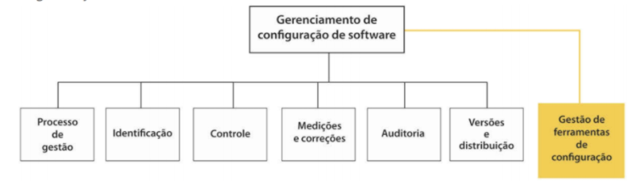

## Assuntos
- [**Planejamento da Configuração e Controle de Mudanças**](#planejamento-da-configuracao-e-controle-de-mudancas)
	- [Introdução à GCS](#introducao-a-gcs)
	- [Processo de Gerenciamento de Mudanças](#processo-de-gerenciamento-de-mudancas)
	- [Gerenciamento de Versões e Releases](#gerenciamento-de-versoes-e-releases)
- [**Gerenciamento de Entregas e Ferramentas de Gerenciamento de Configuração**](#gerenciamento-de-entregas-e-ferramentas-de-gerenciamento-de-configuracao)
	- [Integração, Entrega e Implantação Contínuas](#integracao-entrega-e-implantacao-continuas)
	- [Ferramentas de GCS](#ferramentas-de-gcs)
- [**Bibliografia**](#bibliografia)

## Planejamento da Configuração e Controle de Mudanças
### Introdução à GCS
Eu não sei para vocês, mas para mim, o nome Gerência de Configuração de Software (GCS) me parece muito curioso.

Normalmente, configuração é algo que pensamos ser apenas uma coisa relacionada a alguns aspectos de como uma aplicação deve funcionar[^1].

#### Importância da Gestão de Configuração
O Gerenciamento de Configuração de Software (GCS) está relacionado com as políticas, processos e ferramentas para gerenciamento de **mudanças** dos sistemas de software, contemplando algumas atividades que fazem parte da gestão de qualidade do software.

É papel do GCS alinhar e permitir que existam várias versões em desenvolvimento simultaneamente sem que isso acarrete em perdas e retrabalho demasiados. Para permitir essa gestão complexa, existem vários padrões de gerenciamento de configuração, tais como o ISO 9000, CMM e CMMI.

#### Atividades da GC
A primeira coisa que precisamos entender é que a GCS é uma subarea da Engenharia de Software.

As principais atividades da GCS são as seguintes:

 1. **Controle de Versão**: Processo de manter o controle de versões de componentes e dos sistemas de software usados.
 2. **Construção de Sistema**: Processo de build de um sistema executável, compilado que interliga todos os componentes, bibliotecas e informações de modo coeso e útil.
 3. **Gerenciamento de Mudanças**: Controle das mudanças causadas em um software para garantir o foco nas urgências e custo-benefício das mesmas.
 4. **Gerenciamento de Lançamentos\Releases**: Gestão dos releases de modo a controlar os lançamentos segundo seu grau de importância.

Com esse panorama, somos capazes de olhar o diagrama abaixo (que mostra o modelo RUP) e observarmos como e porquê a GCS é variável em esforço de acordo com a fase do projeto.

[^1]: Como por exemplo, a configuração do app do whatsapp para mostrar ou não as notificações na tela bloqueada do seu smartphone.

### Processo de Gerenciamento de Mudanças
#### Planejamento do Processo de GCS e Etapas da Identificação e do Planejamento
Podemos afirmar que um processo de software pode ser dividido em 3 categorias principais:

 1. Programas de computador (código fonte ou executáveis)
 2. Artefatos que descrevem os programas
 3. Dados\Conteúdo

Basicamente, todo o nosso trabalho como desenvolvedores sempre envolverá essas 3 realidades de modo inexorável. Para efeitos didáticos, podemos separar as atividades de GCS em 2 grupos, um no lado da **execução** e outro no **planejamento**.

Durante o processo de planejamento da configuração, temos uma série de etapas que ditam e ordenam os processos e produtos gerados para uma correta implementação da GCS dentro de uma empresa:

 1. Baseline (guia geral do projeto)
 2. Repositório
 3. Controle de Mudança e Configuração
 4. Estimativa de Status de Configuração
 5. Identificação dos Marcos
 6. Treinamentos e Recursos

Durante todas essas atividades temos a criação de documentos relacionados ao processo de controle de alterações. Podemos destacar:

 - Documento de arquitetura
 - Documento de implantação
 - Plano de gerenciamento de configuração
 - Documento de permissões de pastas e acessos por perfil
 - Documento de controle de baselines
 - Documento de negócio
 - Plano do projeto
 - Planilha de contagem de ponto de função
 - Documento de processo de negócio
 - Checklist de revisão técnica
 - Relatório de revisão técnica
 - Plano de teste
 - Plano de resultado de teste
 - Roteiro de teste
 - Especificação de casos de uso

#### Controle de Mudança
No controle de mudanças temos vários conceitos que vale a pena termos um local para consulta posterior.

Termo	| Explicação
: -- | --- :
Item de configuração ou item de configuração de software (SCI, do inglês software configuration item) | Qualquer coisa associada a uma projeto de software (projeto, código, dados de teste, documentos, etc.) que tenha sido colocado sob controle de configuração. Muitas vezes, existem diferentes versões de um item de configuração. Itens de configuração tem um nome único. 
Controle de configuração | O processo de garantia de que versões de sistemas e componentes sejam registradas e mantidas para que as mudanças sejam gerenciadas e todas as versões de componentes sejam identificadas e armazenadas por todo o tempo de vida do sistema.
Versão | Uma instância de um item de configuração que difere, de alguma forma, de outras instâncias desse item. As versões sempre têm um identificador único, o qual é geralmente composto pelo nome do item de configuração mais um número de versão. 
Baseline | Uma baseline é uma coleção de versões de componentes que compõem um sistema. As baselines são controladas, o que significa que as versões dos componentes que constituem os sistema não podem ser alteradas. Isso significa que deveria sempre ser possível recriar uma baseline a partir de seus componentes. 
Codeline | Uma codeline é um conjunto de versões de um componente de software e outros itens de configuração dos quais esse componente depende. 
Commit    |  Envio de uma mudança ao Repositório
Mainline | Trata-se de uma sequência de baselines que representam diferentes versões de um sistema. 
Release | Uma versão de um sistema que foi liberada para os clientes (ou outros usuários em uma organização) para uso. 
Espaço de trabalho | É uma área de trabalho privada em que o software pode ser modificado sem afetar outros desenvolvedores que possam estar usando ou modificando o software. 
Branching | Trata-se da criação de uma nova codeline de uma versão em uma codeline existente. A nova codeline e uma codeline existente podem, então ser desenvolvidas independentemente. 
Merging | Trata-se da criação de uma nova versão de um componente de software, fundindo versões separadas em diferentes codelines. Essas codelines podem ter sido criadas por um branch anterior de uma das codelines envolvidas. 
Construção de sistema | É a criação de uma versão de sistema executável pela compilação e ligação de versões adequadas dos componentes e bibliotecas que compõem o sistema. 

### Gerenciamento de Versões e Releases 
#### Elementos de Gerenciamento de Versões e Gerenciamento de Releases

## Gerenciamento de Entregas e Ferramentas de Gerenciamento de Configuração
### Integração, Entrega e Implantação Contínuas
#### Integração contínua
Integração contínua (CI - Continuous Integration) é o processo de engenharia de software que está sendo amplamente utilizado no movimento DevOps para isolar as mudanças para que elas possam ser imediatamente testadas e relatadas quando são adicionadas à base de código maior. 

O processo de integração contínua é fundamental para a implementação do DevOps. A palavra DevOps é originada a partir da composição dos prefixos Dev (desenvolvimento) e Ops (operações). Ele inclui a automação do desenvolvimento e teste sempre que as alterações no código são feitas.

A metodologia de integração contínua permite que você compartilhe o código e teste fazendo as mudanças no repositório de controle de versão compartilhada. Desta forma, qualquer um pode obter a versão mais recente do código. Isso ajuda a construir, testar e validar o processo completo. DevOps é a união de pessoas, processos e tecnologias para fornecer continuamente valor aos clientes.

#### Entrega e implantação contínua
A entrega contínua (CD – Continuous Delivery) permite que as equipes de desenvolvimento automatizem o processo que move o software pelo ciclo de vida de desenvolvimento de software e pode fornecer muitos benefícios ao provisionar uma caixa de ferramentas integrada, incluindo o seguinte:  

 - Reduza o tempo de implantação por meio de testes e desenvolvimento contínuos;
 - Diminua os custos associados ao desenvolvimento de software tradicional;
 - Dimensione o desenvolvimento de software com base no tamanho do projeto;
 - Implante o código automaticamente em cada fase do ciclo de desenvolvimento.  

A implantação contínua (CD - Continuous Deployment) é uma estratégia de desenvolvimento de software em que as alterações de código em um aplicativo são liberadas automaticamente no ambiente de produção. Essa automação é impulsionada por uma série de testes predefinidos. Depois que as novas atualizações passam nesses testes, o sistema envia as atualizações diretamente para os usuários do software. 

A implantação contínua oferece vários benefícios para empresas que buscam dimensionar seus aplicativos e portfólio de TI. Primeiro, ele acelera o tempo de lançamento no mercado, eliminando o atraso entre a codificação e o valor do cliente – normalmente dias, semanas ou até meses. 

Para conseguir isso, os testes de regressão devem ser automatizados, eliminando assim os caros testes de regressão manual. Os sistemas que as organizações implementam para gerenciar grandes pacotes de mudanças na produção – incluindo planejamento de lançamento e reuniões de aprovação – também podem ser eliminados para a maioria das mudanças. 

### Ferramentas de GCS
#### Funções das Ferramentas de GCS
À medida que a complexidade do desenvolvimento de softwares aumenta, faz-se cada vez mais necessária a implementação tanto de processos de GCS quanto de ferramentas que automatizem os processos. Com essa implementação, cada alteração no software fica vinculada a registros dentro das ferramentas de GCS, garantindo a rastreabilidade de todas as mudanças e maior qualidade nos serviços e produtos entregues. Assim, a GCS é importante para a garantia da qualidade de software, a sua verificação e a sua validação, bem como para as revisões e auditorias.  

##### Controle de Versão com Git ou Subversion (SVN) 

Git e Subversion são duas ferramentas muito populares usadas para controle versão em projetos de software. O Git é um sistema de controle de versão distribuído que apresenta crescente adoção na comunidade de desenvolvimento de software em geral, especialmente após sua popularização através do serviço de hospedagem de códigos GitHub.  

#### Utilização de Ferramentas para Controle de Versões de Software
Nesse contexto, vale a pena dominar as ferramentas de controle de versão e, sem dúvida, GIT e Github.

Aqui tem um link de um curso do MIT sobre isso. [link](https://missing.csail.mit.edu/).

## Bibliografia

 - Sommerville, I., **Engenharia de Software**, Pearson, 10a. edição, 2019. 

 - Pressman, R. S., Maxim, B. R., **Engenharia de Software – Uma abordagem  - profissional**, AMGH, 8a. edição, 2016. 

 - Malhone, M. M., Frigeri, M., **A importância do gerenciamento de  - configuração para o ciclo  de vida do software: um estudo de caso  - baseado nas diretrizes da engenharia de software**, RBTI-Revista  - Brasileira em Tecnologia da Informação, ISSN 2675-1828, v.3, n.1,  - 2021. 

 - Gonçalvez, P. F., Barreto, J. S., Zenker, A. M., Fagundes, R. D. R.,  - Rocha, B. C., Birfeld, K., Weinfurter, M. R., **Testes de Software e Gerência de Configuração**, Grupo A, 2019. 

 - Filho, A. B. , Spínola, R. O., Costa, M. N., Kalinowski, M., **Gerência de Configuração - Definições Iniciais, Ferramentas e Processos**, Engenharia de Software Magazine, 2010. 