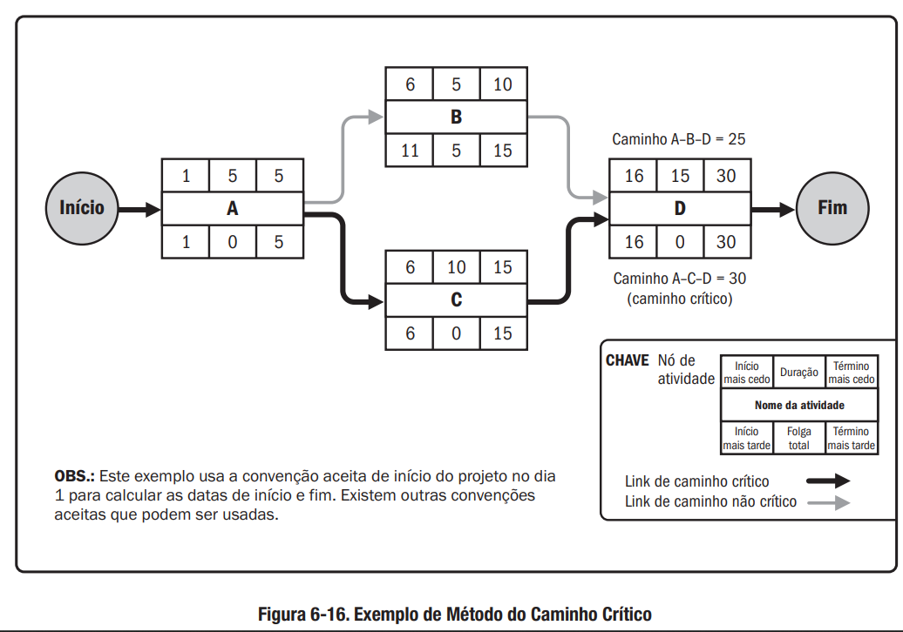

## Assuntos
- [**Fundamentos da Gerência de Projetos e Visão PMI/PMBok**](#fundamentos-da-gerencia-de-projetos-e-visao-pmipmbok)
    - [Fundamentos da Gerência de Projetos](#fundamentos-da-gerencia-de-projetos)
    - [Visão do Project Management Institute - PMI](#visao-do-project-management-institute-pmi)
- [**Gerenciamento Prescritivo e Ágil de Projetos e Uso de Ferramentas**](#gerenciamento-prescritivo-e-agil-de-projetos-e-uso-de-ferramentas)
    - [Gerenciamento Tradicional](#gerenciamento-tradicional)
    - [Gerenciamento Ágil](#gerenciamento-agil)
    - [Ferramentas e Técnicas](#ferramentas-e-tecnicas)
- [**Bibliografia**](#bibliografia)

## Aviso
Eu, particularmente, não sou muito fã dessas matérias mais de "humanas"[^1]. Então aqui eu vou deixar apenas um **resumo/sumário** dos conceitos trabalhados.

[^1]:E olha que eu sou formado em Economia.

O conteúdo de verdade vai estar nas leituras indicadas na bibliografia. O foco aqui é mais ser um material de consulta para lembrarmos os conceitos aprendidos.

Uma dica de ouro pra ler esses materiais é se colocar no papel do gerente. Nesse caso, leia 

## Fundamentos da Gerência de Projetos e Visão PMI/PMBok
### Fundamentos da Gerência de Projetos
#### Conceitos Básicos
A primeira coisa que temos que deixar claro é a diferença entre atividades de **Operação** e de **Projeto**. A operação tem como principal caraterística a repetição das suas rotinas. Um projeto, por outro lado, tem caráter linear que se encaminha para a sua conclusão.

Um **Programa** é definido como um conjunto de projetos semelhantes agrupados para um melhor gerenciamento.

Uma **Carteira** ou **Portfólio** de projetos é o conjunto de projetos agrupados por organização que irá desempenhá-los. Independentes da semelhança entre eles.

Um **Project Management Office - PMO** é o grupo de pessoas que gerencia a carteira de projetos da empresa ou organização.

Um **Subprojeto** é um pedaço de um projeto maior que é desmembrado para melhorar a organização das atividades.

#### Conceito de Projeto
Agora vamos definir o conceito de **Projeto** que vamos trabalhar nesse microfundamento.

"Um esforço temporário empreendido para criar um produto, serviço ou resultado exclusivo". PMBoK, 2017.

#### Gerência de Projetos
Segundo o PMBoK, a **Gerência de Projetos** é aplicação de conhecimentos, habilidades e técnicas para se atingir os requisitos de um projeto.

Esse conjunto de ferramentas vão desde as hard skills quanto as soft skills na gestão e montagem da equipe que fará as atividades.

Para uma boa gerência, é necessário que as atividade sejam acompanhadas de modo a utilização otimizada dos recursos dentro do planejamento inicial. Para isso, o monitoramento contínuo é necessário, bem como, que sejam disponibilizados os insumos e recursos necessários.

#### Ciclo de Vida de Projeto
Basicamente, temos os modelos **Prescritivos** que são mais burocráticos e rígidos e os modelos **Ágeis** que são mais velozes e mais aptos à mudanças ao longo do desenvolvimento.

Não existe certo e errado, existe o contexto em que o projeto será executado. Cada caso é único e deve ser estudado com toda a atenção.

#### Como Nasce um Projeto
As demandas que geram os projetos podem surgir de todos os lugares. Uma terminologia comum a ser usada é a de **Clientes Internos** e **Clientes Externos** para separar os casos onde as necessidades a serem satisfeitas estão dentro ou fora da empresa que será responsável pela execução do projeto.

### Visão do Project Management Institute - PMI
#### Project Management Institute - PMI
Fundado em 1969, é um instituto referência mundial em gerenciamento de projetos. Cada associação atrelada ao PMI USA é chamado de "capítulo" e, no Brasil, está presente em vários estados.

É ele quem produz o guia mais famoso da área, o Guia PMBoK. Além dele, temos outras publicações como:

- PM Network
- PM Today
- Project Management Journal
- Information Source Guide

E faz vários congressos e encontros ao longo do mundo.

Além dessa parte de produção de conteúdos e encontros, existem várias certificações disponíveis pelo PMI:

- CAPM
- PMP
- PgMP
- PfMP
- PMI-ACP
- PMI-RMP
- PMI-BPA
- PMI-SP

#### Guia PMBoK
É a principal referência no que tange à gerência de projetos. Ele define que um projeto nada mais é que um grupo de processos relacionados para o atingimento de uma meta.

Na versão 6, temos 49 tipos de processos organizados em 5 grupos:

- Iniciação
- Planejamento
- Execução
- Monitoramento e Controle
- Encerramento

#### Projetos no Contexto Organizacional

Dependendo do contexto da organização em que o projeto for implementado, a probabilidade de sucesso por ser maior ou menor a depender das características culturais da organização. Damos o nome desses fatores de **Fatores Ambientais da Empresa (FAR)**

Podemos elencar alguns fatores importantes nessa relação:

- Fatores Internos:
  - Cultura, Estrutura e Governança
  - Geografia das instalações e recursos
  - Infraestrutura
  - Software e tecnologias disponíveis
  - Disponibilidade dos recursos
  - Capacidade do capital humano
- Fatores Externos:
  - Condições de mercado
  - Stakeholders
  - Legislação
  - Governo

Outra coisa que pode ser muito importante para a realização de um projeto é a base de conhecimentos disponíveis internamente na empresa. Segundo o PMBoK, damos o nome de **Ativos de Processos Organizacionais (APO)** a esse repositório de processos e planos disponíveis ao uso interno.

Podemos separar os APO em duas categorias:

- Processos, políticas e procedimentos
- Bases de conhecimento organizacionais

O conhecimento do contexto da organização é importante para que o gerente de projeto seja capaz de cumprir os planejamentos dos projetos de sua responsabilidade.

##### Estrutura Organizacional

Dentre os tópicos relacionados, a **estrutura organizacional** é muito relevante porque, a depender dela, algumas etapas do projeto podem ser grandemente afetadas.

Podemos destacar as principais estruturas atualmente como sendo:

- Estrutura Funcional   Foco na especialização e na rotina. Muito usado em grandes empresas e no setor público.
- Estrutura por Projeto   Foco na autonomia no cumprimento das metas. Atores temporários atrelados à projetos. Maior celeridade na comunicação.
- Estrutura Matricial   É um misto das duas. Possui alguma flexibilidade na comunicação entre projetos mas pode causar problemas de falta de clareza na cadeia de comando.

**Comentário:** Na vida real, nenhuma organização é 100% classificável de acordo com essas estruturas. Mas conhecê-las ajudará muito caso, quem sabe algum dia, nos encontremos no papel de gerente de projeto.

#### Áreas da Gerência de Projetos

Segundo o PMBoK podemos dividir a gerência de projetos em 10 áreas:

- Integração - Foco na relação entre as demais áreas
- Escopo - Foco no atendimento dos requisitos
- Cronograma - Cumprimento dos prazos estipulados
- Custos - Foco no montante de recursos necessários para o atingimento das metas
- Qualidade - Seguimento de padrões e normas estabelecidas
- Recursos - Foco na utilização otimizada dos recursos demandados
- Comunicações - Informações sobre o projeto de qualidade e tempestivamente
- Riscos - Mapeamento das dificuldades externas que podem refletir no projeto
- Aquisições - Responsável pela compra dos insumos necessários
- Stakeholders - Relacionamentos com os atores relevantes e interessados no projeto

#### Tempo em Projetos

Uma das áreas que acabamos de ver é a de **Cronograma**. Podemos destacar essa área porque ela é muito relevante para o alcance das metas.

O tempo é o ativo que é mais estudado e, para muitos pesquisadores, é a área mais importante da gerência de projetos. 

O PMBoK elenca **6 processos** pertencentes à essa área:

1. Planejar o gerenciamento do cronograma
2. Definir as atividades
3. Sequenciar as atividades
4. Estimar as durações
5. Desenvolver o cronograma
6. Controlar o cronograma

Na construção do cronograma podemos usar várias representações gráficas. Como por exemplo:

- Diagrama de Setas
- Diagrama de Rede PERT
- Gráfico de Gantt

**Comentário:** Existem várias ferramentas para gerenciamento. O [MS-Project](https://www.microsoft.com/pt-br/microsoft-365/project/project-management-software), [ClickUp](https://clickup.com/), [Trello](https://trello.com), [Primavera](https://www.oracle.com/br/industries/construction-engineering/primavera-p6/), [OpenProj](https://www.openproject.org/) e outros

#### Recursos em Projetos

Os recursos do projeto incluem todas as condições materiais necessárias para o projeto. Isso vai além de apenas insumos materiais. Contempla também capital humano, treinamento, infraestrutura de TI e etc.

Para se usar os recursos da melhor maneira possível, é necessário que o time de recursos esteja bem alinhado com o planejamento afim de otimizarem as aquisições e contratações no tempo certo para evitar ociosidade de uso ou custo de armazenagem desnecessário.

De longe, a parte mais difícil e necessário do setor de gerenciamento de recursos é a seção de **Recursos Humanos**. Existem milhares de técnicas, ferramentas e pesquisas sobre como otimizar os recursos humanos em uma organização e, por esse material ter escopo de overview, não vamos nos aprofundar nesse tema.

#### Gestão Financeira de Projetos

Normalmente, um cliente faz 2 perguntas em qualquer proposta de projeto: "Quanto vai custar?" e "Quanto tempo vai levar?".

Essas perguntas são clássicas e, é óbvio, são umas das mais difíceis de se responder inicialmente porque só se sabe o custo real de um projeto no final do mesmo. Isso nos obriga a ter que estimar custos e necessidades que surgirão ao longo das etapas de projeto.

As etapas de trabalho da área de orçamento é parecida com as etapas das outras áreas. Começamos com a estimativa dos esforços. Passamos para a estima dos custos relacionados. Por fim, devemos controlar para sabermos se as estimativas estão de acordo com a realidade.

Para finalizarmos essa parte. Vale destacar os dois artefatos mais importantes produzidos por essa área:

- Cronograma Financeiro
- Orçamento do Projeto

#### Riscos em Projetos

Se tivéssemos certeza que um risco aconteceria, ele deixaria de ser um risco.

Essa natureza especulativa dos riscos é o cerne da área de gestão de risco do projeto. Para tanto, esse setor sempre deve levar em consideração 2 aspectos na análise dos riscos: **probabilidade** e **complexidade**.

Os processos de trabalho dessa área pelo PMBoK são:

1. Planejar os riscos
2. Identificar os riscos
3. Análise qualitativa
4. Análise quantitativa
5. Planejamento das respostas
   1. Escalar
   2. Prevenir
   3. Transferir
   4. Mitigar
   5. Aceitar
6. Implementação das respostas
7. Monitoramento dos riscos

## Gerenciamento Prescritivo e Ágil de Projetos e Uso de Ferramentas
### Gerenciamento Tradicional
#### Cronograma de Projeto - PERT/CPM

Aprendemos anteriormente sobre a importância da gestão do tempo em um projeto. Para tanto, a necessidade de se construir um bom cronograma é fundamental.

Várias são as técnicas que podem ser usadas para essa construção. Dentre elas, vamos aprender aqui a chamada **Program Evaluation Review Technique (PERT)**.

A maneira de construir um cronograma PERT é analisando cada tarefa envolvida na conclusão dos projetos para, no final, termos um gráfico de redes (grafos).

Normalmente, o PERT é aplicado em grandes projetos porque permite:

- A definição de prazos
- Visão detalhada da sequência de tarefas a serem executadas
- Facilita a gestão do tempo alocado em cada tarefa

Também é muito comum vermos o PERT associado a outra sigla chamada **Critical Path Method (CPM)** que possui uma abordagem muito parecida e foi desenvolvido praticamente ao mesmo tempo[^2].

 

[^2]: PERT é de 1957 e o CPM é de 1958.

A principal característica do CPM é que ele mostra as tarefas que possuem um prazo projetado maior de cumprimento. Essas tarefas serão o foco da gestão porque, caso seja possível reduzir os tempos previstos para a conclusão das mesmas, o projeto terá grandes avanços nas entregas.

A criação do método PERT/CPM teve sua motivação no projeto Polaris de construção de um submarino nuclear em 1957.

#### Construção dos Diagramas - PERT/CPM

Agora vamos aprender como construir um diagrama PERT/CPM.

Para tal, precisamos nos certificar que temos os seguintes dados a respeito do nosso projeto:

- Lista das tarefas a serem executadas até a conclusão do projeto
- Definição das relações de precedência e subsequência entre essas tarefas
- As estimativas dos tempos para cada tarefa
    - O PERT usa 3 estimativas de tempo:
        - Mais Provável
        - Otimista
        - Pessimista
    - Em cima dessas estimativas, calcula-se a média ponderada para ter o valor usado

Podemos usar o diagrama de grafos do PERT para descrever as tarefas do seguinte modo:

Existem também alguns conceitos que podemos nos deparar na construção de um cronograma que vão ajudar muito na nossa comunicação com outros profissionais da área:

- Primeira Data de Início (PDI)
- Primeira Data de Término (PDT)
- Folga Livre (FL)
- Última Data de Início (UDI)
- Última Data de Término (UDT)
- Folga Total (FT)

As primeiras datas são os cenários otimistas onde, caso a atividade seja feita no tempo previsto, o projeto será beneficiado pelo adiantamento de uma atividade. Ao contrário, as últimas datas são os casos em que as atividades iniciarem na última data possível para que o projeto não tenha um atraso.

A FT é a soma de todas as FL.

Todos esses conceitos podem ser vistos naquele gráfico do CPM logo acima.

De posse desses conceitos podemos ver que o **caminho crítico** é precisamente o caminho que **não** apresenta nenhuma FL, ou seja, que levará o maior número de tempo necessário para o somatório das suas tarefas.

##### Project Libre

A partir daqui, o microfundamento é baseado na parte prática do gerenciamento. Portanto, ele pressupõe que nós estamos usando algum software de gestão. Como eu disse lá em cima, existe uma tonelada de programas hoje em dia.

O programa usado no curso foi do Project Libre. Vou colocar a primeira aula de um [curso inteiro](https://www.youtube.com/watch?v=EWc3jD6siyY&list=PLBCBlFwBCYWrFqO29pjgoXLtVvBTOqHt2) que está disponível no youtube aqui sobre como usar esse programa para aqueles interessados nele.

<iframe width="560" height="315" src="https://www.youtube.com/embed/EWc3jD6siyY" title="YouTube video player" frameborder="0" allow="accelerometer; autoplay; clipboard-write; encrypted-media; gyroscope; picture-in-picture; web-share" allowfullscreen></iframe>

#### Monitoramento e Controle

A atividade de monitoramento é filha do planejamento. Pode ser focada em processos ou em resultados. O foco no processo é o processo tradicional que tende a ser mais burocrático e lento enquanto o foco em entregas é o principal objetivo das metodologias ágeis de desenvolvimento.

Não tem certo e errado, cada projeto deve ser avaliado e, a depender de onde se quer chegar, opta-se pela metodologia mais adequada.

A atividade e monitoramento tem como objetivo:

- Minimizar os danos que a complexidade do projeto pode trazer para as entregas
- Reduzir incertezas e riscos
- Administrar conflitos
- Acompanhar o andamento do planejamento

Abaixo temos uma lista de técnicas usadas nessa área:

- Reuniões
- Cronogramas
- Gráfico de Gantt
- Rede PERT\CPM
- Planos 5W2H
- Análise SWOT
- Monitoramento de Partes Interessadas (Poder x Interesse)
- KanBan
- Burndown Chart

#### Encerramento de Projeto

Uma vez monitorado, a última fase que nos resta é o término.

Nessa fase temos que levantar as entregas finais e compilar os aprendizados gerados ao longo de todas as etapas de monitoramento.

#### Perfil do Gerente de Projetos

Um bom gerente de projetos deve ter algumas características desejáveis:

- Conhecimento das normas
- Entendimento do ambiente
- Conhecimento de gerenciamento geral
- Habilidades interpessoais

E deve estar preparado para alguns conflitos clássicos dessa área:

- Conflito autoridade x responsabilidade
- Estimativas erradas
- Disputas de poder nas equipes
- Procura por salvador\culpado
- Pressões de grupos de interesse
- Falta da maturidade da equipe
- Falta de engajamento

### Gerenciamento Ágil

#### Gerência Ágil de Projetos

Já aprendemos um pouco sobre esse tema lá no [primeiro período](/CC_site/nav/PUC/periodo1/fundamentos_eng_soft/#processos-ageis). Então vou ser bem sucinto aqui.

##### Breve histórico

Para a gente que está começando a vida de desenvolvedor agora, isso tudo parece muito simples, mas o passado era completamente diferente no mercado de tecnologia.

Entre as décadas de 60 e 90, não existiam métodos amplamente divulgados e padronizados de desenvolvimento. Era tudo mato mesmo.

A primeira vitória significativa na tentativa de padronização ocorreu em 1990 com a criação do **Rational Unified Process (RUP)** que também vimos na matéria de [introdução a engenharia de software](/CC_site/nav/PUC/periodo1/fundamentos_eng_soft/#processos-prescritivos).

##### O Manifesto Ágil

Com o passar do tempo, o foco na entrega se tornou cada vez mais evidente até que  o [**Manifesto Ágil**](https://agilemanifesto.org/) criou o marco para a mudança do método de gestão de projetos no começo do século XXI. Dele podemos derivar os seguintes princípios:

- Foco na entrega de software o mais rápido e com máxima frequência possível
- Aceitação às mudanças de requisitos a qualquer tempo
- Maior aproximação com o cliente
- Fomentar um clima de sinergia e colaboração

Só pra gente ter uma ideia, eu pedi pro ChatGPT dar um resumo de quem foram os caras que assinaram esse manifesto.

1. **Kent Beck:** um desenvolvedor de software americano, conhecido por ter criado o Extreme Programming (XP) e por ter trabalhado em projetos como o Smalltalk e o C++.

1. **Mike Beedle**: um consultor de gerenciamento de projetos e desenvolvedor de software americano, que também ajudou a desenvolver o Enterprise Scrum.

1. **Arie van Bennekum**: um consultor holandês de gerenciamento de projetos, que trabalhou em vários projetos de desenvolvimento de software usando metodologias ágeis.

1. **Alistair Cockburn**: um consultor de gerenciamento de projetos e desenvolvedor de software britânico, conhecido por ter criado o método Crystal para desenvolvimento de software.

1. **Ward Cunningham**: um desenvolvedor de software americano, conhecido por ter criado a primeira wiki e por ter trabalhado em projetos como o Framework para Desenvolvimento de Aplicações (FDP) em Smalltalk.

1. **Martin Fowler**: um consultor de desenvolvimento de software britânico, que escreveu vários livros sobre design de software e desenvolvimento ágil, e que ajudou a popularizar o Refactoring.

1. **James Grenning**: um desenvolvedor de software americano, que trabalha com XP e ajuda a promover práticas ágeis em todo o mundo.

1. **Jim Highsmith**: um consultor americano de gerenciamento de projetos, que ajudou a popularizar o Agile Project Management e o Adaptive Software Development.

1. **Andrew Hunt**: um desenvolvedor de software americano, conhecido por ter escrito o livro "The Pragmatic Programmer" e por ter trabalhado em vários projetos de software usando metodologias ágeis.

1. **Ron Jeffries**: um desenvolvedor de software americano, conhecido por ter criado o XP com Kent Beck e por ter trabalhado em vários projetos de desenvolvimento de software usando metodologias ágeis.

1. **Jon Kern**: um consultor americano de gerenciamento de projetos, que trabalhou em vários projetos de desenvolvimento de software usando metodologias ágeis.

1. **Brian Marick**: um consultor americano de gerenciamento de projetos, que trabalha com XP e ajuda a promover práticas ágeis em todo o mundo.

1. **Robert C. Martin**: um consultor americano de desenvolvimento de software, que escreveu vários livros sobre design de software e metodologias ágeis, e que ajudou a popularizar o TDD (Desenvolvimento Guiado por Testes).

1. **Steve Mellor**: um engenheiro de software britânico, conhecido por ter criado a linguagem de modelagem de sistemas OO (OOM) e por ter trabalhado em projetos de software usando metodologias ágeis.

1. **Ken Schwaber**: um consultor americano de gerenciamento de projetos, que ajudou a desenvolver o Scrum e a promover práticas ágeis em todo o mundo.

1. **Jeff Sutherland**: um consultor americano de gerenciamento de projetos, que ajudou a desenvolver o Scrum e a promover práticas ágeis em todo o mundo. Tem uma ampla experiência em liderança, gerenciamento e desenvolvimento de software.

1. **Dave Thomas**: um desenvolvedor de software canadense, conhecido por ter criado a linguagem de programação Elixir, por ter trabalhado em projetos como o desenvolvimento da linguagem Ruby e por ter escrito vários livros sobre programação e desenvolvimento de software, incluindo "Programming Elixir" e "The Pragmatic Programmer". Dave é um forte defensor de metodologias ágeis e da programação funcional.

Junto com o manifesto surgiram os **14 princípios ágeis**. Quando as coisas vão ficando muito grandes pra decorar eu acho que não vale a pena. Pra quem achar importante, pode pesquisar pra ler a respeito.

Para encerrar esse apanhado podemos destacar os principais métodos ágeis hoje no mercado:

- XP
- Scrum
- Lean
- TDD

#### O Método Ágil Scrum

Já vimos um pouco desse assunto na parte de [introdução à engenharia de software](/CC_site/nav/PUC/periodo1/fundamentos_eng_soft/#scrum) mas aqui vamos dar mais contexto sobre ele.

O método é baseado no guia do scrum que eu fiz questão de inserir aqui no material.

<iframe src="https://scrumguides.org/docs/scrumguide/v1/Scrum-Guide-Portuguese-BR.pdf" width="100%" height="500px">
</iframe>

O método do Scrum é mais indicado para projetos com as seguintes características:

- Projetos de curta duração
- Equipe reduzida
- Proximidade entre membros da equipe
- Uma equipe com algum nível de preparo
- Presença do cliente
- Ambiente informal

Ele pode ser integrado à ferramentas como o kanban e pode ser associado a outros métodos ágeis de gestão de projetos.

**Comentário:** Como já aprendemos sobre os papéis, os artefatos e os eventos do scrum antes, não vou repetir esse conteúdo aqui. Caso não se lembre do que estou falando, volte no primeiro período e revise.

No planejamento de um sprint, devemos sempre responder essas duas questões norteadoras:

- O que deve ser entregue?
- Qual o trabalho necessário para essa entrega?

#### Introdução ao XP

O eXtreme Programming (XP) é um outro método ágil muito comum no Brasil e no mundo. Alguns dos nomes do manifesto ágil foram os criados desse método.

O foco do XP é no desenvolvimento orientado para a entrega do código no **menor tempo** possível.

As premissas do XP são:

- Equipes pequenas
- Projetos curtos
- De 1.000 a 250.000 linhas de código

O papéis dos atores atuante no XP são:

- Programadores (foco principal)
- Treinador\Técnico
- Acompanhador\Tracker
- Cliente

Valores do XP:

- Comunicação
- Feedback
- Coragem
- Simplicidade
- Respeito

Para finalizar essa seção de listas, temos as **12 práticas** preconizadas pelo XP:

1. Planejamento
2. Fases Pequenas
3. Metáfora para Explicação
4. Design Simples
5. Testes
6. Refatoramento
7. Programação Pareada
8. Propriedade Coletiva
9. Integração Contínua
10. Semana de 40 horas
11. Cliente Junto do Desenvolvimento
12. Padronização do Código

Dessas práticas, podemos destacar que o foco na parte de testes é muito relevante na aplicação desse método.

#### Frameworks e Práticas Ágeis

Agora que aprendemos sobre os 2 métodos mais usados. Vamos fazer uma passagem rápida sobre os outros que, mesmo não sendo tão famosos, são usados por inúmeros times de desenvolvimento ao redor do mundo.

##### Dynamic Systems Development Method (DSDM)

Nascido na década de 1990 no Reino Unido, ele é um dos mais antigos. Tem como características:

- Desenvolvimento incremental
- Colaboração cliente-desenvolvimento
- Funções integradas
- Flexibilidade dos requisitos

##### Test Driven Development (TDD)

O TDD é fruto do XP tendo como ponto central o teste de software. O foco é tanto que tudo se inicia no desenho dos testes antes do código.

O método de desenvolvimento no TDD é:

1. Escrever o teste que apontará um status vermelho
2. Faz-se a atualização do sistema para atendimento dessa nova funcionalidade
3. Refaz-se o teste para que o status seja verde
4. Refatoração do código da funcionalidade
5. Próximo teste

##### Lean Development

Também nascido em 1990, surgiu no contexto da indústria automotiva. Seu principal foco é o **gasto mínimo** de recursos.

Tem como guia os seus 7 princípios:

1. Eliminar desperdícios
2. Ampliar o conhecimento
3. Fortalecer o time
4. Entregas rápidas
5. Otimizar o todo
6. Construir qualidade
7. Adiar decisões

##### Crystal Family

É um leque de métodos criado por Alistair Cockburn. Tem como principais práticas:

- Entregas regulares
- Monitoramento do progresso
- Envolvimento direto com cliente
- Inspeções constantes nos incrementos
- feedback para ajuste do produto

##### Método Squad

Surgido em 2014 no Spotify, é um método que tem como base:

- Squad - Grupo interdisciplinar de pessoas com uma missão
- O líder que serve ao grupo
- Equipes sempre pequenas

Tem como princípios:

- Comunicação
- Chapters - Pessoa com especialidade que compõe um Squad
- Tribes - Conjunto de Squads com objetivos parecidos
- Guilds - Lideranças de alianças de Squads

#### Conclusão ou Como escolher?

A bem da verdade, na vida real, a chance de eu ou algum de vocês ter que decidir qual metodologia a empresa que a gente for trabalhar vai usar é bem baixa.

Entretanto, saber sobre esses métodos pode ajudar muito no processo de adaptação quando iniciarmos nossa caminhada no mundo do desenvolvimento e, quem sabe, realmente essa responsabilidade caia no colo de algum de nós.

O importante é entender os principais pontos de cada metodologia afim de sermos capaz até mesmo de mesclar as principais vantagens para o cumprimento de um projeto.

### Ferramentas e Técnicas
#### Ferramentas e Técnicas para Planejamento

Existem uma infinidade de ferramentas disponíveis hoje em dia para a realização das atividades de gestão de projetos. Independente disso, as ferramentas que escolhermos devem ter algumas features desejáveis como:

- Métricas e estimativas
- Cronogramas
- Gestão de equipes
- Orçamento

Além disso, precisamos garantir que algumas características do projeto estejam bem definidas:

- Escopo e Ideias
- Formação das equipes

Essas características se aplicam tanto à metodologias ágeis quanto às tradicionais com maior e menor grau de significância para cada um desses itens.

#### Ferramentas e Técnicas para Gestão

Uma vez feito o planejamento, o próximo passo é a gestão para que os objetivos sejam alcançados ao final do prazo e dos recursos disponíveis no projeto.

Da mesma maneira que temos várias ferramentas disponíveis no planejamento, também temos várias opções para a gestão. Entretanto, vale destacar que existe pouca probabilidade que nós encontremos um software que atenda perfeitamente todas as várias áreas da gestão de um projeto.

Normalmente, o mesmo sistema que permite o planejamento também permite a gestão. O motivo disso é que a gestão é a próxima etapa lógica ao processo de planejamento então muitas informações são parecidas.

## Bibliografia
- GUIA do conhecimento em gerenciamento de projetos: (Guia PMBOK®). 6. ed. São Paulo: Project Management Institute, 2017. xxix, 755 p. ISBN 9781628251920., Nº de Exemplares: 7.
- VALERIANO, Dalton L. **Gerenciamento Estratégico e Administração por Projetos**. Pearson 324 ISBN 9788534612081.
- VITOR L. MASSARI. **Gerenciamento Ágil de Projetos** - 2ª Edição. Editora Brasport 0 ISBN 9788574528939.
- BROD, Cesar. **Scrum: guia prático para projetos ágeis**. 2. ed. São Paulo, SP: Novatec, 2015. 198 p. ISBN 9788575224410.
