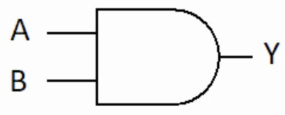
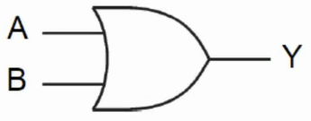
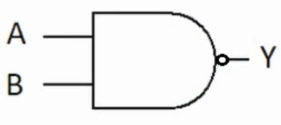
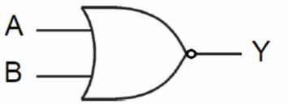
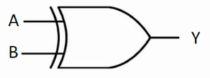
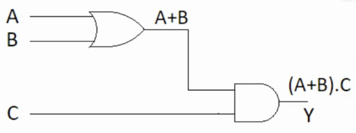
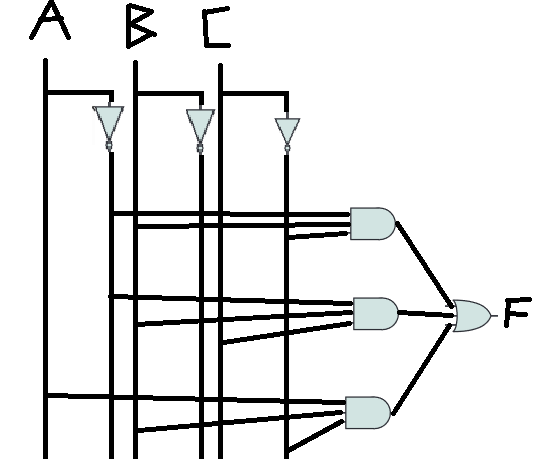
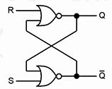

# Organização de Computadores

## Fundamentos de Organização de Computadores
### Representação de Dados e Sistemas Binário
#### Compreendendo o Sistema Decimal
Os componentes eletrônicos digitais só permitem dois estados de tensão: 0  e 1. Isso implica que toda informação manipulada pelos computadores é representado em um sistema de 	**numeração binária** que é correlacionada com o nível de tensão nos componentes da máquina.

O nosso modelo de sistema numérico usual é o decimal (também chamado base 10). Ele é um sistema posicional porque o peso do dígito é dependente da posição dele no número. Por exemplo:

$38_{10} = 3 \times 10^1 + 8 	\times 10^0 = 30 + 8$

$17,25_{10} = 10 	\times 10^1 + 7 	\times 10^0 + 2 	\times 10^{-1} + 5 	\times 10^{-2}$

O subscrito indica o tipo de base usado. Uma característica dos sistemas posicionais é que o dígito mais a esquerda será o mais significativa (MSB - Most Significant Bit) e os à sua direita serão os LSB (Less Significant Bit).

### Conceitos de Lógica Digital
Computadores são formados por componentes eletrônicos. Os transistores e os diodos são usados para a construção das portas lógicas que nos permitem, através de circuitos elétricos, replicar os operadores lógicos da lógica usados na algebra booleana. Assumindo valores em dois estágios: 0 (de 0 a 0,6 volts) e 1 (entre 3,6 e 5 volts).

Uma porta lógica nada mais é que um circuito que recebe sinais de entrada e, conforme a sua configuração, produz um sinal de saída cujo valor é dependente da entrada.

Podemos categorizar as portas lógicas em 3 grupos:


- Portas Lógicas Básicas


- Operação Lógica - AND
- Operação Lógica - OR
- Operação Inversora - NOT


- Funções e Portas Lógicas Compostas


- Operação Lógica - NAND (NOT-AND)
- Operação Lógica - NOR (NOT-OR)
- Operação Lógica - XOR (OR-EXCLUSIVA)


- Expressões Lógicas e Circuitos Digitais


Eu já trabalhei bem a fundo a lógica matemática no meu curso do Projeto Matemática. Você pode conferir no capítulo 02 nesse [link](https://github.com/brunoruas2/Meus_Estudos/blob/main/Matem%C3%A1tica/Book%20of%20Proof%20-%20Richard%20Hammack/book_of_proof.pdf). A única diferença é que quando lá for TRUE ou VERDADE, aqui será 1 e, claramente, quando lá for FALSE ou FALSO, aqui será 0. 

Como nosso estudo nesse manual é mais focado em Análise e Desenvolvimento de Sistemas, vamos manter as anotações referentes à transposição da algebra booleana para os circuitos eletrônicos. Mas caso haja alguma dúvida, a leitura do material acima é recomendada.
#### Operadores Básicos






#### Operadores Compostos






#### Expressões Lógicas e Circuitos
Podemos usar os operadores lógicos para criar expressões do tipo $ Y = (A+B).C $ que pode ser lida como "Y é igual a (A ou B) e C"[^1]. Podemos também usar os diagramas de circuitos para representar exatamente essa mesma opração lógica.

[^1]:Usando os símbolos lógicos mais clássicos, podemos escrever como $Y: (A \lor B) \land C$.



Para entender como cada input produz um resultado é necessário usarmos uma 	**tabela verdade** que nos mostra todos os casos entre os inputs e os outputs.

##### Desafio: Vamos olhar a tabela verdade abaixo:


|   A   |   B   |   C   |   Y   |
| :---: | :---: | :---: | :---: |
|   0   |   0   |   0   |   1   |
|   0   |   0   |   1   |   1   |
|   0   |   1   |   0   |   1   |
|   0   |   1   |   1   |   1   |
|   1   |   0   |   0   |   1   |
|   1   |   0   |   1   |   1   |
|   1   |   1   |   0   |   1   |
|   1   |   1   |   1   |   0   |


Qual função lógica produz o resultado compatível para a coluna Y? A resposta está na observação cuidadosa dos valores. Podemos ver que sempre que tivermos algum valor 0 como input, o resultado será 1. Como existe essa alternância, podemos ver que o operador de negação está sendo usado. Além disso, se tivéssemos o operador "ou" aliado a um operador de negação, na linha $(0,0,1)$ teríamos o resultado 1 que, ao ser negado, retornaria um resultado 0.

Portanto, só nos resta acreditar que temos uma situação de operações do tipo "e" e de negação. A essa estrutura damos o nome de "NOT-AND" ou "NAND". Em temos lógicos formais, temos a expressão $\neg (A \land B \land C)$ e na notação que usamos no curso, temos um $\overline{(A . B . C)}$.


### Circuitos Lógicos Digitais Básicos

Com o uso das portas lógicas, nós podemos construir circuitos mais complexos e que desempenham funções importantes para o funcionamento de um computador. Podemos agrupar esses circuitos (também chamados de módulos) em dois grupos:


- Circuitos Lógicos Combinacionais
    

    - Multiplexadores
    - Demultiplexadores
    - Codificadores
    - Decodificadores
    

- Circuitos Sequenciais
    

    - Registradores
    - Contadores
    


#### Circuitos Combinacionais
Os 	**circuitos combinacionais** são construídos de maneira que o resultado obtido por ele é condiconado ao input atual nas portas lógicas que o compões. Para analizarmos um circuito composto de $n$ portas lógicas e $m$ saídas, podemos usar a tabela verdade, símbolos gráficos no padrão das portas que aprendemos antes e equações booleanas que convertem a lógica eletrônica para a matemática.

Observemos a tabela verdade abaixo:


| **A** | **B** | **C** | **F** |
| :---: | :---: | :---: | :---: |
|   0   |   0   |   0   |   0   |
|   0   |   0   |   1   |   0   |
|   0   |   1   |   0   |   1   |
|   0   |   1   |   1   |   1   |
|   1   |   0   |   0   |   0   |
|   1   |   0   |   1   |   0   |
|   1   |   1   |   0   |   1   |
|   1   |   1   |   1   |   0   |


Para criar a representação do circuito lógico que corresponde a coluna F, basta observarmos as condições necessárias para o valor 1 na referida coluna. Temos 3 eventos em que isso acontece. Podemos demonstrar essa relação pode meio da seguinte equação boolena:
$F = \overline{A} B \overline{C} + \overline{A} B C + A B \overline{C}$

A essa primeira maneira de escrita, damos o nome de 	**Soma de Produtos** ou 	**Sum Of Products (SOP)**.

Uma outra forma de representarmos o circuito F é se focarmos na negativa das condições que retornam o valor 0. Desse modo, também podemos representar o circuito da seguite maneira:
$F = \overline{\overline{A B C}} . \overline{\overline{A B} C} . \overline{A \overline{B C}} . \overline{A \overline{B} C} . \overline{A B C}$

Podemos visualizar essa condição no diagrama abaixo.



Ao aplicarmos o teorema de DeMorgan $(\overline{X1 . X2}) = \overline{X1} + \overline{X2}$ nessa segunda versão podemos desenvolve-la até chegarmos em uma terceira configuração:
$F = (A + B + C) . (A + B + \overline{C}) . (\overline{A} + B + C) . (\overline{A} + B + \overline{C}) . (\overline{A} + \overline{B} + \overline{C})$
Que chamamos de 	**Produto das Somas** ou 	**Product of Sums (POS)**.

**Comentário:** O material do microfundamento é consideravelmente reduzido nessa parte. Mas como estou perto da prova enquanto escrevo essa parte, terei que, por agora, reduzir a profundidade e seguir como é dado pelo material da aula. Em tempo oportuno eu volto aqui e expando essa seção.

Agora que entendemos um pouco melhor sobre cisrcuitos lógicos combinacionais, vamos aprender mais sobre alguns circuitos desse tipo.

Os 	**multiplexadores** são circuitos combinacioinais que selecionam $n$ entradas a uma única saída por meio de suas linhas de seleção. Para cada duas entradas, serão necessárias 1 linha de seleção. Os 	**demultiplexadores** são o oposto, ligando uma única entrada para $n$ saídas.

Um 	**codificador** normalmente só permite que uma das entradas esteja ativa a cada instante e sua função é converter os valores de entrada em um número binário. Similarmente, um 	**decodificador** recebe um binário como entrada e a saída será alguma linha previamente definida.

#### Circuitos Sequenciais
Por outro lado, os 	**circuitos sequenciais** usam elementos armazenadores chamados 	**latches** e 	**flip-flops** e possuem a capacidade de armazenamento de informações.

Um 	**latch** é um circuito capaz de armazenar o valor de 1 bit e pode ser construído com 2 portas NOR ou NAND como na imagem abaixo.



A entrada S é chamada de Set e atribui um valor ao sistema. A porta R é chamada de Reset e retorna o valor 0 para o nosso circuito. Se ambos são 0, o nosso sistema retorna um status inalterado memorizando o estado anterior.

Com o latch podemos usar o controle de tempo (chamado de 	**clock**) para controlarmos o comportamento oscilante de alguns circuitos sequenciais mais complexos.

Os circuitos sequenciais são criados com o uso dos latchs e sinais de controle por clock. São muito relevantes para os computadores pois permitem a capacidade de memorização de informação na memória de trabalho. Aqui, não estamos falando dos discos rígidos ou memória flash.

Existem dois tipos de circuitos sequenciais muito importantes para a estrutura dos computadores modernos. O primeiro deles é o 	**registradores** que são usados para memorizar temporariamente informações em memória maiores que 1 bit (as de 1 bit podem ser armazenadas diretamente pelo latch). Os 	**contadores** usam o clock para a contagem da passagem do tempo.

### Introdução à Organização de Computadores

A medida que os computadores foram evoluindo, a representação das suas partes por meio das portas digitais se tornou inviável devido ao número exponencial de portas que faziam parte de cada nova geração de computadores.

Desse modo, a representação por meio da 	**hierarquia de subsistemas** se tornou mais adequada. O objetivo é conseguirmos compreender como cada subsistema se interliga com os demais e desempenha funções específicas para o correto funcionamento do equipamento.

Para prosseguirmos, é necessário definirmos o que seria esse "correto funcionamento" dos computadores. Em suma, podemos afirmar que um computador deve realizar 4 funções:


- Processamento de Dados - Produzir nova informação a partir de informação anterior
- Armazenamento de Dados - Capacidade de memorizar tanto no prazo de trabalho quanto no longo prazo
- Transferência de Dados - Envio das informações por meio dos dispositivos de entrada e saída
- Controle - Para a garantia das 3 funções acima


Para realizar esses trabalhos, podemos dividir o computador moderno nos seguintes subsistemas:


- Unidade Central de Processamento (CPU) - Que faz o controle de toda a operação do computador
- Memória Principal - Conectada por meio de um barramento ao CPU, armazena os dados necessários para o CPU realizar as operações desejadas
- Entrada e Saída de Dados - São os elementos que inputam informações ao CPU e retiram dele os resultados para o mundo exterior
- Barramento - Meio físico de comunicação entre os subsistemas do computador


#### Organização x Arquitetura

Embora esses conceitos sejam muito parecidos. Podemos definir a 	**organização de computadores** como a descrição de computadores por meio dos seus subsistemas, suas funções e interconexões. Por sua vez, a 	**arquitetura de computadores** está relacionada à conexão entre o projeto de computador e a execução dos programas, ou seja, é o estudo de como uma mudança no design de um computador impacta na execução dos programas.

Uma mesma arquitetura pode ser implementada em várias organizações possíveis. A arquitetura tem foco na abstração do computador e a organização tem foco na implementação.

Para facilitar a diferenciação dos termos, vamos elencar alguns tópicos de estudo dessas áreas.


- Organização de Computadores
    - Implementação de hardware
    - Implementação de sistemas de controle que transmitem a execução das instruções
    - Comunicação entre o computador e seus periféricos
    - Tecnologia usada pra a memória

- Arquitetura de Computadores
    - Conjunto de instruções que a CPU processa
    - O formato das instruções
    - Maneiras de endereçamento de memória
    - Representação dos tipos de dados usados nas instruções

#### Organização Básica de um Computador Digital - Modelo de Von Neumann

Antigamente, os programas executados pelos computadores eram feitos por meio do arranjo físico dos seus componentes. A programação era feita diretamente no hardware. contudo, uma nova arquitetura foi necessária porque se buscava a construção de um mecanismo que permitisse, ao mesmo tempo, o salvamento tanto dos dados quanto das instruções necessárias para o processamento dos mesmo.

Foi nesse contexto que a arquitetura de Von Neumann foi construída. Ela é constituída de, basicamente, 3 componentes principais interligados por um barramento:


- CPU
- Memória Principal
- Dispositivos de Entrada e saída


### Unidade Central de Processamento - UCP

Na seção passada, nós vimos que a arquitetura de Von Neumann possui o CPU (também chamado de processador) como um dos seus componentes. Durante um 	**ciclo de execução**, o processador deve buscar as instruções na memória, decodificá-la e executá-la. Para entender melhor como ele faz tudo isso, podemos subdividi-lo nas seguintes partes:


-  Unidade de Controle - É quem faz a busca na memória e permite a execução das instruções (programas)
- Unidade Lógica e Aritmética (ULA) - Executa as instruções enviadas pela unidade de controle referentes às operações lógicas e aritméticas
- Registradores - São componentes de memória de extrema velocidade de leitura mas baixa disponibilidade. Essa memória é usada temporariamente para auxiliar o ciclo de execução


#### Ciclo de Execução de Instruções
As instruções sempre são executadas sequencialmente. Quem controle o fluxo de qual instrução será executada a cada ciclo é um registrador chamado 	**controlador de programas (PC)**. Ele armazena o endereço da próxima instrução a ser executada e, a cada ciclo, é reescrito com o novo endereço de execução.

O ciclo de execução é composto seguintes etapas:

- Busca da próxima execução - O PC indica o endereço na memória da instrução a ser executada. Esse endereço é carregado em outro registrador chamado 	**registrador de instruções (RI)** e então o PC recebe o endereço da próxima instrução
- Decodificação da instrução - o endereço armazenado no RI (também chamado de 	**opcode**) é lido pela unidade de controle e o comando à ULA é feito para execução da instrução
- Busca dos operandos - A unidade de controle busca todos os dados necessários à execução da instrução por meio do envio de sinais através do barramento[^2]
- Execução da Instrução - A ULA, de posse dos dados, faz a execução da instrução lendo os operandos carregados em memória pela unidade de controle
- Repetição do processo

[^2]:Sempre que você está vendo uma tela de loading, é isso que está acontecendo no seu computador.

### Memória

Idealmente, a memória deveria ser super rápida e abundante. O problema é que existe um trade-off entre essas duas qualidades. Quanto mais rápida é a leitura, mais cara é a memória. Esse é o motivo de, na arquitetura dos computadores atuais, existirem diversos tipos de memória.

A ordem de velocidade é dada por:

- Registradores
- Memoria Cache
- Memoria Principal
- Memoria Secundária


As primeiras são as memórias mais rápidas e caras. As demais, estão as mais lentas e baratas.

A memória principal é a memória RAM e ROM dos nossos computadores. Dela, a CPU lê as instruções escritas em alguma linguagem de programação e é nela que o processador salva o resultado das operações.

Para entender como a memória principal e funciona, basta pensarmos em um conjunto de pequenas células (posições) de armazenamento de informação. Todas as células da memória possuem o mesmo tamanho (medido em quantidade de bits). Os 	**endereços** são os identificadores da posição física de cada célula no material de armazenamento (disco magnético ou chip).

Se soubermos a quantidade de bits em cada célula e a quantidade de células, saberemos a capacidade de armazenamento do dispositivo por meio do cálculo

$\textrm{Capacidade} = 2^{	\textrm{Numero de Celulas}} * 	\textrm{Numero de bits por celula}$

A memória principal pode ser divida em 	**memória RAM - Random Access Memory**, que pode ser lida e apagada a qualquer momento mas não é capaz de armazenar os dados após o desligamento do computador, e a 	**memória ROM - Read Only Memory** que não pode ser alterada na execução do programa mas se mantém após o desligamento do computador.

**Comentário:** A memória RAM ainda é subdividida em outras memórias mas veremos isso em uma atualização desse curso.

A memória secundária é o HD e o SSD dos nossos computadores. O processador só faz uso dela por meio de dispositivos de entrada e saída. A vantagem dela é o seu preço que é infinitamente menor que as memórias mais rápidas.

### Entrada e Saída

São os componentes que permitem os usuários acessar e visualizar os resultados dos ciclos de processamento. 


- E/S de entrada - Teclado, Mouse, Scanner ...
- E/S de saída - Impressoras, Monitores, Caixas de Som ...
- Interface de E/S - São os programas que intermediam a comunicação entre o CPU e o dispositivos


Existem alguns tipos de comunicações entre os dispositivos de Entrada e Saída mas nós vamos parar por aqui.


## Arquitetura de Computadores

### Arquiteturas RISC e CISC
Como o processador exerce um papel central na atividade de um computador moderno, não é nada estranho se preocupar muito sobre como ele é capaz de compreender as instruções e executar. Na verdade, existe um campo específico de pesquisa chamado 	**arquitetura de instruções do processador**.

Esse campo estuda o formato das instruções, os códigos de operação, os registradores, a memória de dados e outros tópicos relacionados a atividade desse componente.

Na primeira geração de processadores, o conjunto de operações era reduzido para simplificação da construção desse componente. Na década de 60, a quantidade de operações aumentou junto com a complexidade dos processadores. A essa família dá-se o nome de 	**CISC - Complex Instruction Set Computer**.

Os computadores da família CISC possuem uma maior quantidade de instruções, contudo, o seu ciclo de processamento é mais lento. O exemplo dessa família de processadores é a Intel: 286, 386, 486 e Pentium.

No final da década de 80, os processadores com um conjunto reduzido de instruções voltaram a serem utilizados sob o nome de 	**RISC - Reduced Instruction Set Computer**. A ideia era a de melhorar o desempenho dos processadores via simplificação e ganho de velocidade. Os exemplos são os processadores MIPS e a arquitetura ARM (muito usados nos smartphones).

Hoje em dia os processadores possuem ambas as abordagens implementadas simultaneamente.

### Arquitetura do Conjunto de Instruções: Exemplo do MIPS
No tópico anterior, nosso foco foi na história dos desenhos físicos dos processadores. Agora, nossa atenção será voltada para a arquitetura das instruções, ou seja, as operações nativas que os processadores já vem de fábrica capazes de fazer.

Diferente da arquitetura física, o mercado acabou por convergir para um padrão relativamente comum de arquitetura de instruções básicas. Como exemplo, o material cita o 	**Microprocessor Without Interlocked Pipeline Stages - MIPS**.

Desenvolvido na década de 80, o MIPS foi implementado mesmo antes da RISC ser criada. Hoje em dia, podemo encontrar essa arquitetura de opareções em equipamentos da Cisco, Nintendo, Toshiba, Sony e etc.

A arquitetura do conjunto de instruções define os tipos de instruções executáveis pelo processador, o formato de cada instrução, o tamanho em bits delas, o métodos de endereçamento e outras taregas importantes para o funcionamento desse componente.

Podemos elencar algumas classes de instruções que o MIPS 32 bits é capaz de executar:

- Operações Aritméticas
- Operações Lógicas
- Transferência de Dados
- Desvios Condicionais
- Desvios Incondicionais


### Linguagem de Montagem
Já sabemos que o processador só trabalha com número em binário, entretanto, também sabemos que os programas são escritos em linguagens de programação que não são, definitivamente, escritas em binário. Existe uma linguagem que está mais próxima do binário mas ao mesmo tempo pode ser lida (com a devida prática do leitor) e escrita para construção de programas. Essa linguagem é a 	**linguagem assembly** ou 	**de montagem**.

Em assembly, cada instrução é definida por um mnemônico (ADD, SUB, LW, SW, ...) que indica um operador nativo do processador. Cada instrução dessa possui um correspondente em binário do lado do processador de modo que é possível converter de um para o outro por um programa chamado 	**assembler** ou 	**montador**. No MIPS, cada instrução assembly é convertida em um binário de 32 bits no formato RIJ.

O assembly contém um conjunto de classes de instruções que, a primeira vista, se parecem muito com qualquer linguagem de alto nível:


- Instruções Aritméticas
    - `add $t1, $t2, $t3` é igual a `t1 = t2 + t3`
    - `sub $t1, $t2, $t3` é igual a `t1 = t2 - t3`
    - `addi $t1, $t2, 10` é igual a `t1 = t2 + 10`

- Instruções Lógicas
    

    - `and $s1, $s2, $t0` é igual a `s1 = s2 AND t0`
    - `or $s1, $s2, $t0` é igual a `s1 = t2 OR t0`
    

- Instruções de Uso de Memória
    

    - `lw $t0, 0($s3)` é igual a `t0 receber valor de s3`
    - `sw $t0, 0($s3)` é igual a `t0 é armazenado em s3`
    

- Instruções de Controle de Fluxo
``` assembly
# Codigo em C                      # Codigo em Assembly
if (i ==  j)                       bne $s3, $s4, Else  # vai pra else se s3 != s4
f = g + h;                         add $s0, $s1, $s2     # f=g+h
else                               j Exit              # salto para Exit
f = h - h;                         Else: sub $s0, $s1, $s2
                                   Exit:
```


Já conseguimos ver que em assembly é necessário mais linhas quando comparamos a uma linguagem de alto nível. Para finalizar, vamos comparar a declaração de uma função em C e em assembly.
``` c
// c
# Construção da mesma função em C
int func(int g, int h, int i, int j)
{
int f;
f = (g+h) - (i+j);
return f;
}

# Construção da mesma função em assembly
func:
add t0, a0, a1    # t0 recebe g + h
add t1, a2, a3    # t1 recebe i + j
sub s0, t0, t1    # s0 recebe t0 - t1
add v0, s0, zero  # v0 recebe s0 + 0
jr ra             # retorna o resultado
```
**Dica:** Caso, em algum momento da sua vida, você precise programar em assembly, uma boa dica é usar o simulador/IDE MARS - MIPS Assembler and Runtime Simulator. Disponível nesse [link](http://courses.missouristate.edu/kenvollmar/mars/).

### Conceito de Pipeline de Instruções
A essa altura, já compreendemos relativamente bem como um processador é capaz de trabalhar e como a ordem da execução das instruções é relevante para o trabalho dele. Entretanto, existem etapas de processamento que não são necessariamente encadeadas, ou seja, não dependem uma do resultado da outra. Diante dessa constatação, o conceito de 	**pipeline** surge como uma técnica de otimização que executa instruções simultaneamente parecido com uma linha de montagem industrial.

O pipeline pode ser pensando como uma "trilha" que o processador possui para trabalhar a cada ciclo de clock. Nos processadores modernos, temos várias linhas de trabalho simultâneo que podem ser usadas para paralelismo de tarefas.

Se pensarmos que, para cada instrução, o processador deve passar pelos 6 estágios abaixo:


- FI - Fetch Instruction/Busca da Instrução
- DI - Decodificação da Instrução
- CO - Cálculo dos Endereços dos Operandos
- BO - Busca do Operandos
- EI - Execução da Instrução
- WO - Armazenamento do Operando Destino


A cada ciclo de clock, então, ao invés de termos um único programa sendo executado por uma linha de pipeline do processador, podemos separar esse programa em unidades menores independentes que executam, cada uma em uma linha própria, suas etapas paralelamente a cada ciclo de clock. Abaixo nós temos uma tabela demonstrando o ganho de tempo com o uso dessa técnica para duas instruções.


|      0      |   1   |   2   |   3   |   4   |   5   |   6   |   7   |
| :---------: | :---: | :---: | :---: | :---: | :---: | :---: | :---: |
| Instrução 1 |  FI   |  DI   |  CO   |  FO   |  EI   |  WO   |       |
| Instrução 2 |       |  FI   |  DI   |  CO   |  FO   |  EI   |  WO   |


Podemos ver que as duas instruções estarão finalizadas em apenas 7 ciclos de clock. Sem o paralelismo, teríamos levado 12 ciclos para completar essas mesmas duas instruções.
### Paralelismo em Nível de Instruções e Processadores
Existem dois tipos de paralelismo para obtenção de desempenho sem aumento do clock do processador:

[^1]:Sempre que você está vendo uma tela de loading, é isso que está acontecendo no seu computador.
**Paralelismo a nível de instrução**

- Existem duas abordagens típicas para o paralelismo a nível de instrução:
      - **Superpipeline** - Há uma quebra de estágios de pipeline em estágios menores que 1 clock mas. Um exemplo é o MIPS R4000 que é um RISC com Superpipeline.
      - **Superescalar** - Múltiplas unidades funcionais independentes que executam mais de uma instrução por clock. É como se houvesse mais de um pipeline dentro do processador. Os intel x86 usam essa técnica.

**Paralelismo a nível de processador**

- É feito pelo uso de vários processadores ao mesmo tempo. E existem duas classes de computadores com essa abordagem:
      - **Multiprocessadores** - Sistema com mais de uma CPU que compartilham a memória principal por meio de um processo coordenado. Podem ser implementados por barramento único ou memórias locais. CPUs fortemente acompladas.
      - **Multicomputadores** - Sistema com computadores interligados em rede com alguma topologia. O foco está na comunicação entre eles. Processadores fracamente acoplados.
        
## Bibliografia

Bibliografia Básica

- STALLINGS, William. **Arquitetura e organização de computadores**. 10. ed. São Paulo: Pearson, c2018. E-book. ISBN 9788543020532
- CORRÊA, Ana Grasielle Dionísio (Org.). **Organização e arquitetura de computadores**. São Paulo: Pearson, 2017. E-book. ISBN 9788543020327
- PATTERSON, David A. **Organização e projeto de computadores a interface hardware/software**. Rio de Janeiro, GEN LTC 2017. 1 recurso online. ISBN 9788595152908
- TANENBAUM, Andrew S.; AUSTIN, Todd. **Organização estruturada de computadores**. 6. ed. São Paulo, SP: Pearson Education do Brasil, 2013. E-book. ISBN 9788581435398
- MONTEIRO, Mário A. **Introdução à organização de computadores**. 5. ed. Rio de Janeiro: LTC - Livros Técnicos e Científicos, c2007. E-book. ISBN 978-85-216-1973-4