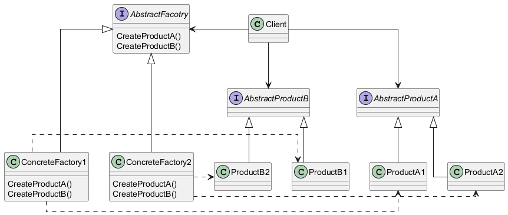

# Patterns - Abstract Factory

[Design Patterns](/zettel/202510230627)

Funciona por uma interface para criação de **famílias de objetos** relacionados ou dependentes sem a necessidade de especificar as classes concretas.

É indicado quando:
- Um sistema de ser independente de como seus produtos são criados, compostos e representados
- O sistema deve ser configurado com segregação de **famílias de produtos** ← Esse é o ponto chave do pattern
- Os produtos de cada família devem ser usados juntos (deve ter uma trava para misturar classes de diferentes famílias)
- Os produtos devem ser expostos aos clientes por meio de uma class library revelando apenas as interfaces dos mesmos sem implementação

Principais características:
- O client só depende de abstrações (tanto de produtos quanto de fábricas)
- AbstractFactory é a interface que o client usa para definir qual fábrica concreta será criada
- Decidindo qual ConcreteFactory será usada, automaticamente decidimos quais produtos tipos de produtos podem ser criados

Estrutura do pattern

Exemplo
[Exemplo de Abstract Factory](/zettel/202510280654)

## Referências
- [Desenvolvedor.io - Curso Arquitetura](https://desenvolvedor.io/formacao/arquiteto-de-software)
- https://www.dofactory.com/net/design-patterns
- https://refactoring.guru/design-patterns
- Design Patterns: Elements of Reusable Object-Oriented
