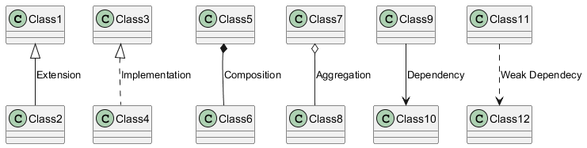

# UML - Padrão de Notação

Notação útil para descrever classes. Estou usando o Plant UML como motor para gerar as imagens.

Sintaxe
```txt
@startuml
Class1 <|-- Class2: Extension
Class3 <|.. Class4: Implementation
Class5 *-- Class6: Composition
Class7 o-- Class8: Aggregation
Class9 --> Class10: Dependency
Class11 ..> Class12: Weak Dependecy
@enduml
```

Modelo


## Referências
- https://plantuml.com/class-diagram
