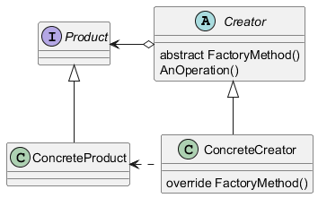

# Patterns - Factory Method

[Design Patterns](/zettel/202510230627)

O objetivo é criar uma interface para criação de objetos mas deixando as subclasses decidir qual objeto será instanciado.

Parece uma versão mais simples do [Patterns - Abstract Factory](/zettel/202510240635) só que em 1 camada só. A ideia aqui é criar uma classe/interface que é responsável por criar os objetos para a classe cliente (assim não precisamos lidar com o construtor).

A ideia aqui é centralizar o trabalho de criar classes deixando todas as [DI - Injeção de Dependência](/zettel/202510181406) padronizadas (como logger, por exemplo) e, ao mesmo tempo, reduzir a complexidade de expansão do sistema porque o controle de criação está centralizado em uma classe.

É indicado quando:
- Não se sabe a priori os tipos de objetos que o client precisa usar.
- Existe a possibilidade de novos tipos de objetos serem necessários.

Partes principais:
- Product - Interface comum aos objetos
- ConcreteProduct - Implementação da interface
- Creator - Classe base
- ConcreteCreator - Classe que cria o objeto específico via override do FactoryMethod()

Vale observar que esse pattern é um caso específico do pattern Template-Method.

**TODO** - fazer o link quando tiver o zettel desse pattern.

Estrutura do pattern

Exemplo

[Exemplo de Factory Method](/zettel/202511030704)

## Referências
- [Desenvolvedor.io - Curso Arquitetura](https://desenvolvedor.io/formacao/arquiteto-de-software)
- https://www.dofactory.com/net/design-patterns
- https://refactoring.guru/design-patterns
- Design Patterns: Elements of Reusable Object-Oriented
