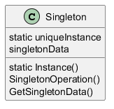

# Patterns - Singleton

[Design Patterns](/zettel/202510230627)

Existem processos que demanda **exatamente** 1 classe responsável para garantir o funcionamento da aplicação. O exemplo mais comum é controle de base de dados ou arquivos.

Existem as **variáveis globais** que até expõe classes em toda a aplicação mas não garante que existe somente 1 objeto instanciado para essa classe. Por isso, a melhor coisa a se fazer é deixar a própria classe responsável pela criação do objeto (assim ela mesmo garante que só existirá 1).

No geral, se faz implementa do seguinte modo:
1. Cria-se a classe com construtor privado para evitar o uso do token `new`
2. Cria-se um método `static` que faz o papel do construtor analisando se já existe uma classe criada
	1. Se já existir, esse "construtor" retorna o objeto já instanciado
	2. Se não existir, ele chama o construtor privado e as novas chamadas caem no caso 2.1 acima

Estrutura do pattern

Exemplo Prático
[Exemplo de Singleton](/zettel/202601260926)

## Referências
- https://refactoring.guru/design-patterns/singleton
- Design Patterns: Elements of Reusable Object-Oriented
