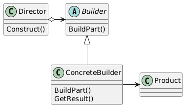

# Patterns - Builder

[Design Patterns](/zettel/202510230627)

Estrutura

Exemplo
[Exemplo de Builder](/zettel/202601262341)

## Referências
- [Desenvolvedor.io - Curso Arquitetura](https://desenvolvedor.io/formacao/arquiteto-de-software)
- https://www.dofactory.com/net/design-patterns
- https://refactoring.guru/design-patterns
- Design Patterns: Elements of Reusable Object-Oriented
